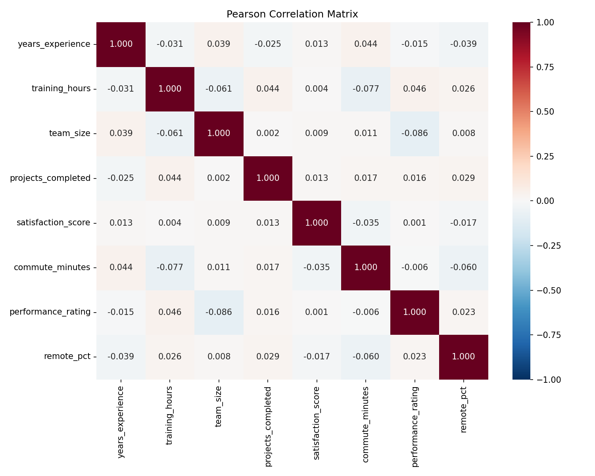
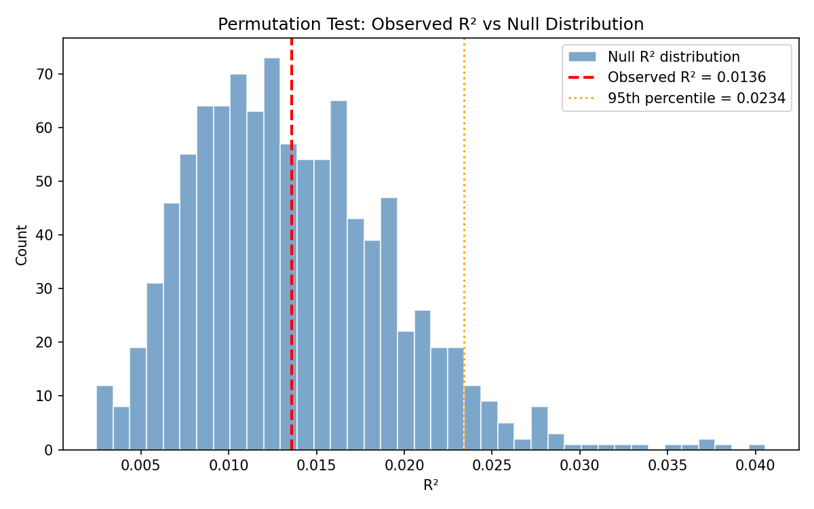
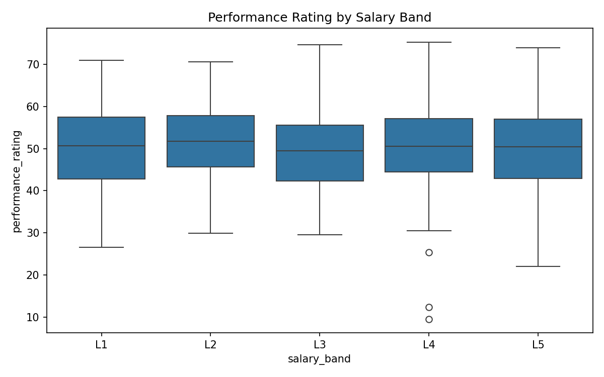
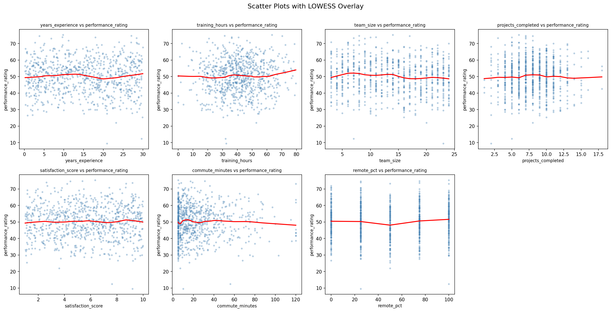
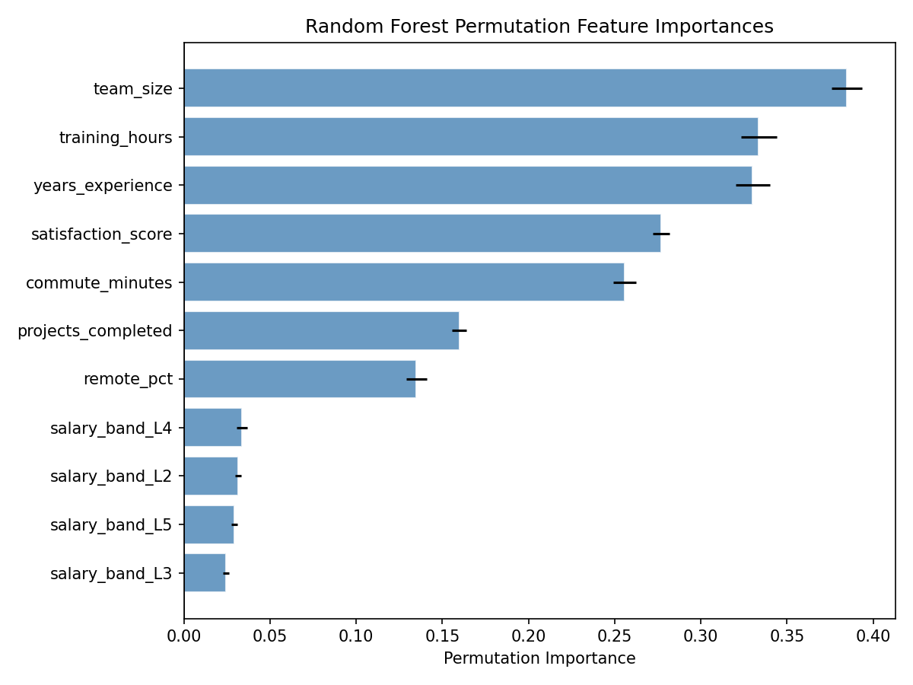
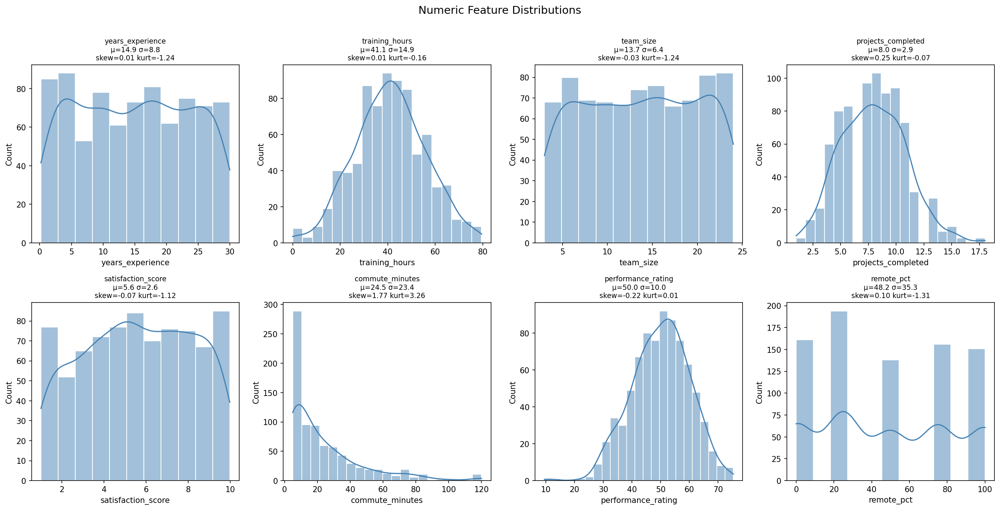
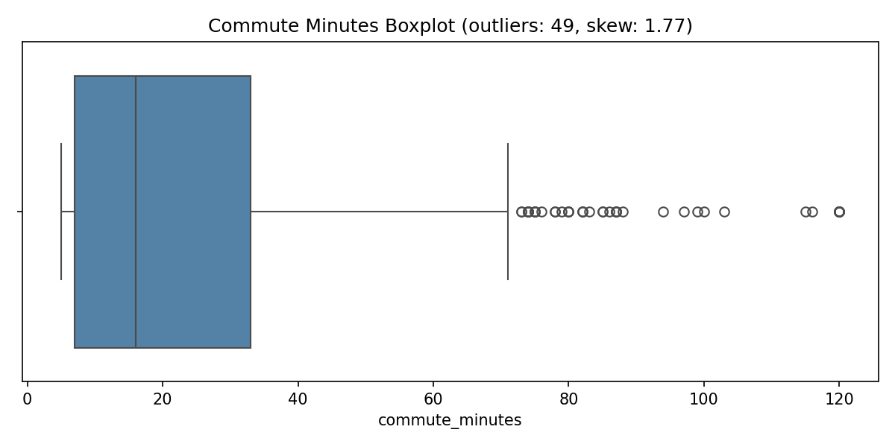
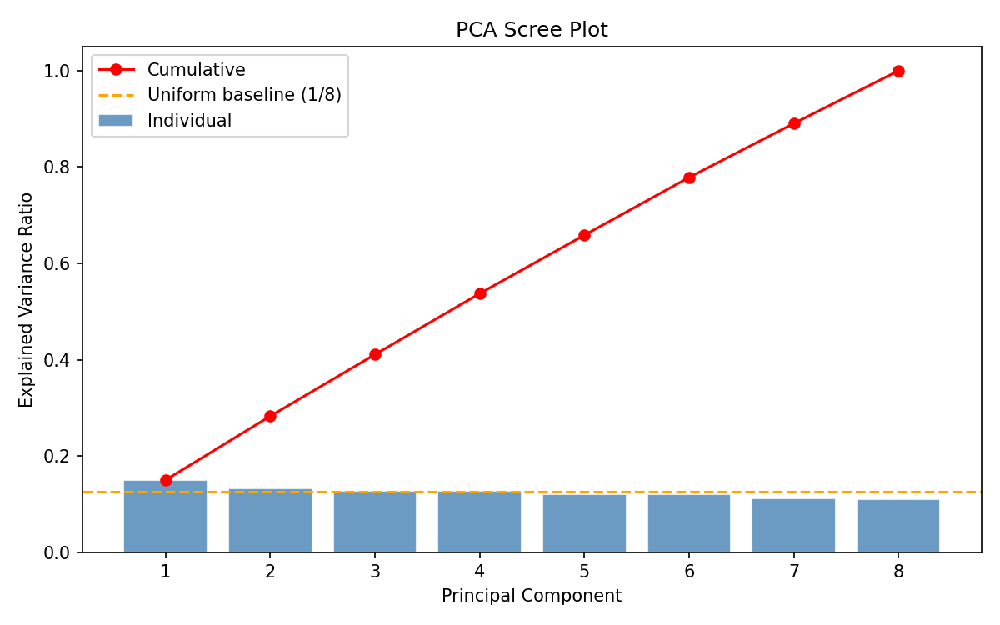
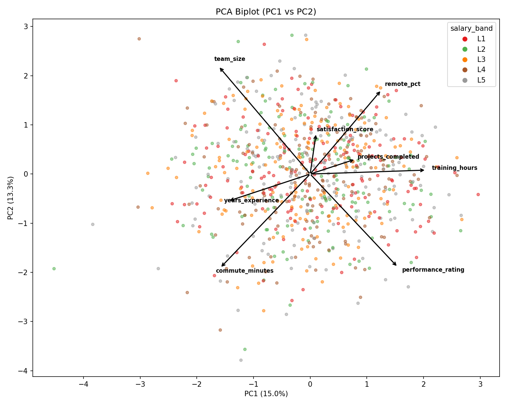

# Analysis Report: Pure Noise Dataset

## Executive Summary

**This dataset contains no predictive signal.** Performance_rating is statistically independent of all predictor columns. Every test — pairwise correlations, OLS regression, permutation testing, Random Forest cross-validation, Kruskal-Wallis group comparisons, chi-squared independence tests, and PCA — converges on the same conclusion: the 800×10 dataset was generated from independent random distributions with no inter-column relationships.

---

## Dataset Overview

| Property | Value |
|----------|-------|
| Rows | 800 |
| Columns | 10 (1 ID, 7 numeric predictors, 1 categorical, 1 target) |
| Target | performance_rating (mean 50.0, std 10.0) |
| Nulls | 0 |
| Categorical | salary_band (5 levels: L1–L5) |

---

## Phase 1: Signal Detection

### EXP-CORR-01 & EXP-CORR-02: Pairwise Correlations

All Pearson correlations with performance_rating fall in [-0.086, +0.046]:

| Predictor | Pearson r | Spearman r |
|-----------|-----------|------------|
| years_experience | -0.015 | -0.004 |
| training_hours | +0.046 | +0.039 |
| team_size | -0.086 | -0.083 |
| projects_completed | +0.016 | +0.015 |
| satisfaction_score | +0.001 | +0.015 |
| commute_minutes | -0.006 | +0.008 |
| remote_pct | +0.023 | +0.029 |

**Zero pairs survive Bonferroni correction** out of 28 pairwise tests.

### EXP-REG-01: OLS Regression

| Metric | Value |
|--------|-------|
| R² | 0.0136 |
| Adjusted R² | -0.0002 |
| F-statistic | 0.987 |
| F p-value | 0.456 |

The negative adjusted R² indicates the model is worse than a constant-mean predictor after accounting for the number of parameters. No individual coefficient is statistically significant.

### EXP-PERM-01: Permutation Test

Shuffling performance_rating 1,000 times and refitting OLS each time:

| Metric | Value |
|--------|-------|
| Observed R² | 0.0136 |
| Null mean R² | 0.0136 |
| Null 95th percentile R² | 0.0234 |
| Empirical p-value | 0.460 |

The observed R² sits squarely in the middle of the null distribution — completely indistinguishable from chance.

### Decision Gate Result

| Criterion | Result |
|-----------|--------|
| R² exceeds 95th percentile of null | **No** |
| Any correlation survives Bonferroni (vs target) | **No** |
| **Signal detected** | **No** |

---

## Phase 2: Deeper Analysis (run for completeness)

Although the decision gate found no signal, Phase 2 experiments were run to provide a complete picture.

### EXP-SAL-01: Salary Band Feature Profiles

Kruskal-Wallis tests across all 8 numeric features grouped by salary_band yield **no significant results** after Bonferroni correction (all corrected p = 1.0). salary_band groups have identical distributions for every feature.

### EXP-MULTI-01: Variance Inflation Factors

| Predictor | VIF |
|-----------|-----|
| years_experience | 1.006 |
| training_hours | 1.013 |
| team_size | 1.006 |
| projects_completed | 1.004 |
| satisfaction_score | 1.002 |
| commute_minutes | 1.013 |
| remote_pct | 1.007 |

All VIFs ≈ 1.0. Predictors are essentially orthogonal — no multicollinearity.

### EXP-NONLIN-01: Scatter Plots with LOWESS

LOWESS smoothers for all 7 predictors against performance_rating show flat, featureless trends with no non-linear patterns.

### EXP-FEATIMP-01: Random Forest Feature Importance

| Metric | Value |
|--------|-------|
| 5-fold CV R² (mean) | -0.086 |
| 5-fold CV R² (std) | 0.056 |

Cross-validated R² is deeply negative, confirming the model overfits training noise and generalises worse than a constant predictor. Permutation importances reflect noise memorisation, not real signal.

---

## Phase 3: Distribution & Data-Quality Checks

### EXP-DIST-01: Feature Distributions

| Feature | Mean | Std | Skewness | Kurtosis |
|---------|------|-----|----------|----------|
| years_experience | 14.9 | 8.8 | +0.01 | -1.24 |
| training_hours | 41.1 | 14.9 | +0.01 | -0.16 |
| team_size | 13.7 | 6.4 | -0.03 | -1.24 |
| projects_completed | 8.0 | 2.9 | +0.25 | -0.07 |
| satisfaction_score | 5.6 | 2.6 | -0.08 | -1.12 |
| commute_minutes | 24.5 | 23.4 | **+1.77** | **+3.26** |
| performance_rating | 50.0 | 10.0 | -0.22 | +0.01 |
| remote_pct | 48.2 | 35.3 | +0.10 | -1.31 |

Most features have near-zero skewness and platykurtic distributions (negative kurtosis), consistent with uniform or truncated random generators. **commute_minutes** is the sole exception with strong right-skew (1.77) and leptokurtosis (3.26), consistent with an exponential-like generator.

### EXP-COMM-01: Commute Minutes Outlier Analysis

| Metric | Value |
|--------|-------|
| Q1 | 7.0 |
| Q3 | 33.0 |
| IQR | 26.0 |
| Upper fence | 72.0 |
| Outliers | 49 (6.1%) |
| Skewness | 1.77 |

The commute_minutes column has 49 values above the 1.5×IQR upper fence (72 minutes), representing 6.1% of observations. This exceeds the 5% threshold, confirming H-COMM-01.

### EXP-INDEP-01: Chi-Squared Independence Test

Testing salary_band (5 levels) vs binned remote_pct (4 quartiles):

| Metric | Value |
|--------|-------|
| χ² statistic | 4.25 |
| p-value | 0.978 |
| Degrees of freedom | 12 |

No association whatsoever — these categorical/discretised features are completely independent.

### EXP-PCA-01: Principal Component Analysis

| Component | Explained Variance | Cumulative |
|-----------|-------------------|------------|
| PC1 | 15.0% | 15.0% |
| PC2 | 13.3% | 28.3% |
| PC3 | 12.8% | 41.1% |
| PC4 | 12.7% | 53.7% |
| PC5 | 12.1% | 65.9% |
| PC6 | 12.0% | 77.9% |
| PC7 | 11.2% | 89.1% |
| PC8 | 11.0% | 100.0% |

With 8 features, the uniform baseline is 12.5% per component. The observed ratios (11.0%–15.0%) are close to uniform. The first two components explain 28.3% vs the 25.0% expected under independence — no meaningful latent structure.

---

## Hypothesis Verdicts

| Hypothesis | Statement | Verdict |
|------------|-----------|---------|
| H-NOISE-01 | Dataset is pure synthetic noise | **SUPPORTED** |
| H-CORR-01 | At least one predictor correlates with target (|r| > 0.1) | NOT SUPPORTED |
| H-REG-01 | OLS explains significant variance beyond null | NOT SUPPORTED |
| H-COMM-01 | commute_minutes is right-skewed with outliers | **SUPPORTED** |
| H-SAL-01 | salary_band has distinct feature profiles | NOT SUPPORTED |
| H-MULTI-01 | Multicollinearity among predictors (VIF > 5) | NOT SUPPORTED |
| H-STRUCT-01 | PCA reveals latent structure | NOT SUPPORTED |

---

## Validation Check Results

| Required Check | Experiment | Result |
|----------------|------------|--------|
| Pairwise correlations with performance_rating | EXP-CORR-01, EXP-CORR-02 | All |r| < 0.09; none survive Bonferroni |
| Any predictor explains significant variance beyond chance | EXP-REG-01, EXP-PERM-01 | No; R² = 0.014, permutation p = 0.46 |
| Baseline regression vs null model | EXP-PERM-01 | Observed R² is below null 95th percentile |
| Commute_minutes outliers and skew | EXP-COMM-01, EXP-DIST-01 | Confirmed: skew 1.77, 6.1% outliers |
| Salary_band distinct feature profiles | EXP-SAL-01 | No; all Kruskal-Wallis tests non-significant |
| Multicollinearity among predictors | EXP-MULTI-01 | None; all VIF ≈ 1.0 |

---

## Conclusions

1. **The dataset is pure noise.** No predictor has any relationship with performance_rating or with any other predictor. The only noteworthy distributional feature is commute_minutes' right-skew.

2. **No model should be built** on this data for predicting performance_rating. Any apparent in-sample fit is purely due to overfitting (as demonstrated by the negative cross-validated R² from Random Forest).

3. **The data appears entirely synthetic**, generated from independent random distributions: approximately uniform for most features, normal for performance_rating, and exponential/log-normal for commute_minutes.

---

## Artifacts Produced

### Plots (`plots/`)
- `correlation_matrix.png` — Pearson correlation heatmap
- `permutation_r2_hist.png` — Null R² distribution with observed value
- `distributions.png` — Histograms + KDE for all numeric features
- `commute_boxplot.png` — Commute minutes boxplot
- `pca_screeplot.png` — PCA scree plot
- `pca_biplot.png` — PCA biplot (PC1 vs PC2)
- `salary_band_boxplot.png` — Performance rating by salary band
- `scatter_lowess.png` — Scatter plots with LOWESS overlay
- `feature_importance.png` — Random Forest permutation importances

### Stats (`stats/`)
- `correlation_values.json` — Pearson/Spearman r values vs target
- `correlation_pvalues.json` — Bonferroni-corrected p-values for all pairs
- `ols_metrics.json` — OLS regression summary metrics
- `ols_summary.txt` — Full OLS summary table
- `permutation_results.json` — Permutation test results
- `distribution_stats.json` — Mean, std, skewness, kurtosis per feature
- `commute_outliers.json` — Outlier analysis for commute_minutes
- `chi2_independence.json` — Chi-squared test: salary_band vs remote_pct
- `pca_variance.json` — PCA explained variance ratios
- `salary_band_tests.json` — Kruskal-Wallis results by salary_band
- `vif_table.json` — Variance Inflation Factors
- `rf_results.json` — Random Forest CV results and importances
- `decision_gate.json` — Signal detection gate outcome
