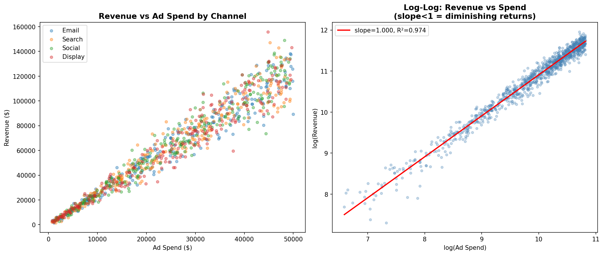
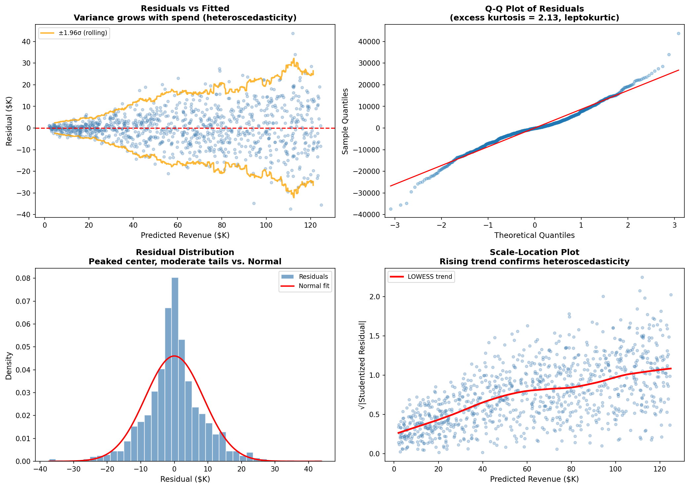
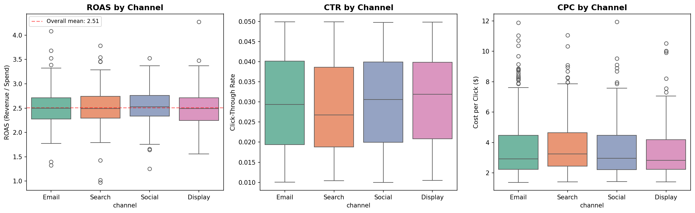
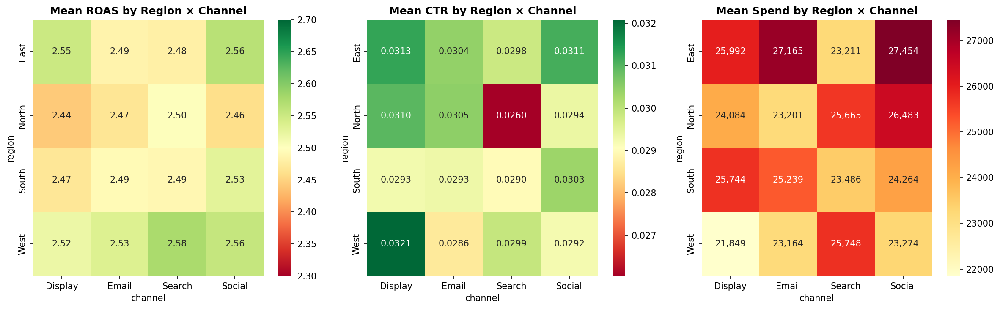
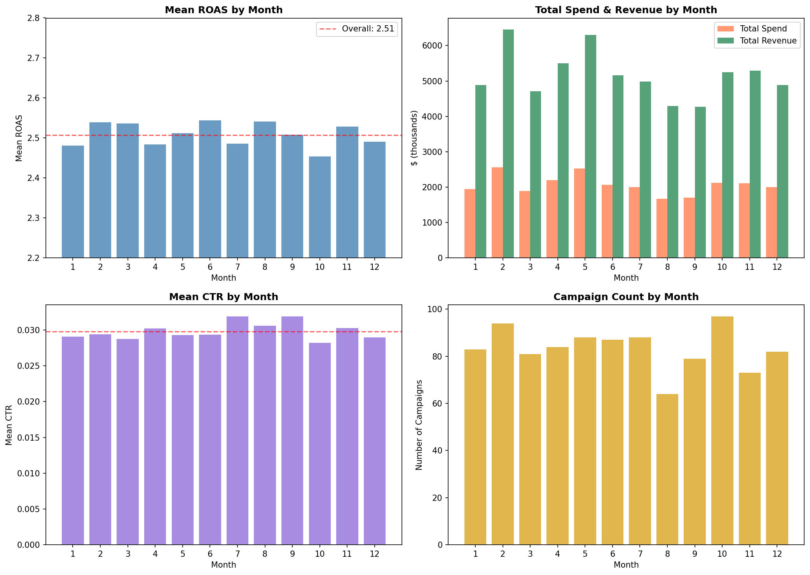
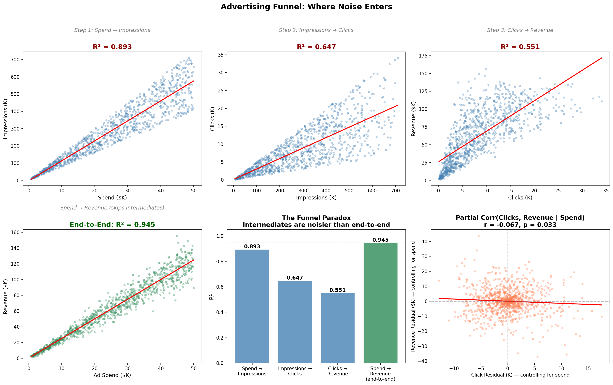
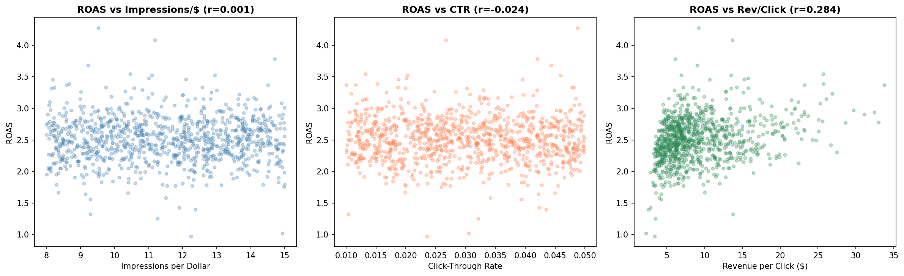
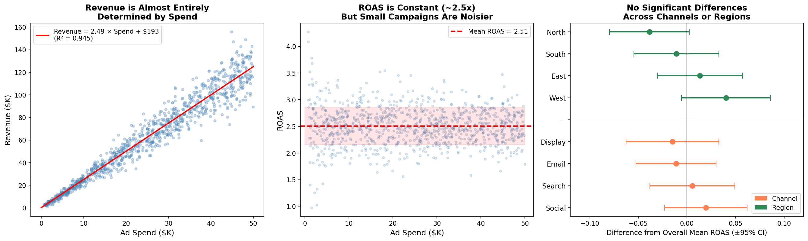
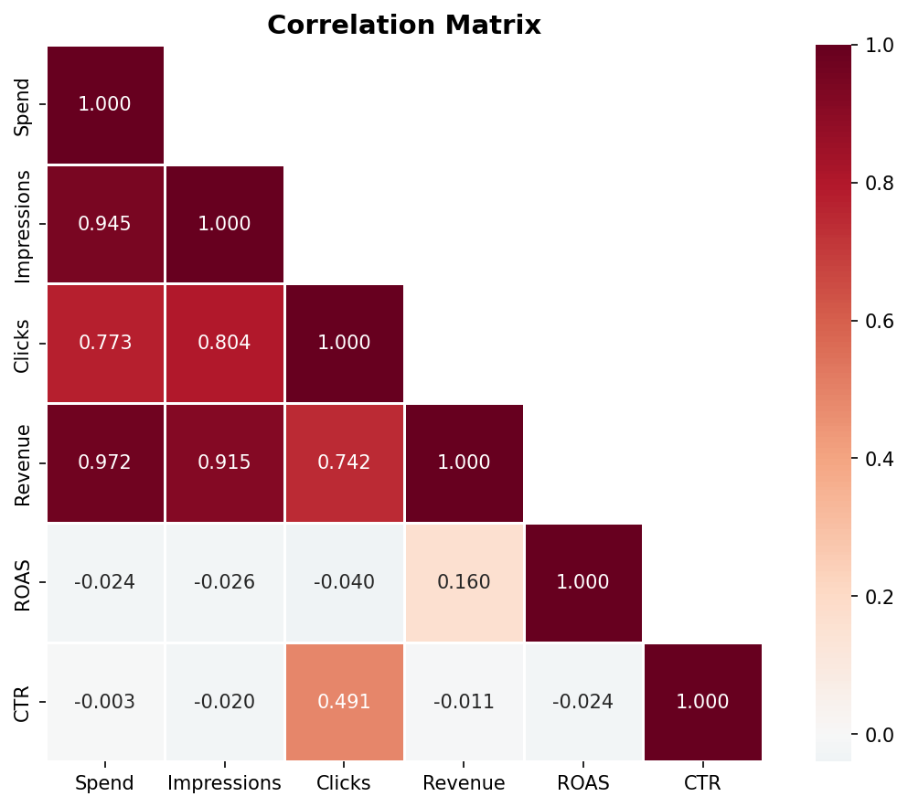

# Marketing Campaign Performance Analysis

## Dataset Overview

This dataset contains **1,000 marketing campaigns** with 8 variables:

| Variable | Type | Range | Description |
|----------|------|-------|-------------|
| campaign_id | int | 1–1,000 | Unique identifier |
| region | categorical | East, West, North, South | Geographic region |
| channel | categorical | Email, Search, Social, Display | Marketing channel |
| ad_spend_usd | float | $729–$49,986 | Advertising expenditure |
| impressions | int | 7,126–709,259 | Ad impressions delivered |
| clicks | int | 145–34,102 | Clicks on ads |
| revenue_usd | float | $1,481–$155,838 | Revenue generated |
| month | int | 1–12 | Calendar month |

There are no missing values. Campaigns are roughly evenly distributed across regions (240–261 each), channels (226–266 each), and months (64–97 each).

---

## Key Findings

### 1. Ad Spend Is the Sole Driver of Revenue (R² = 0.945)

The dominant finding is that **ad spend alone explains 94.5% of the variance in revenue**. The relationship is almost perfectly linear:

> **Revenue ≈ 2.49 × Ad Spend + $193**

This means every additional dollar of ad spend generates approximately **$2.49 in revenue**, yielding a mean ROAS of **2.51** (median 2.50, SD 0.35). The intercept is negligible relative to typical spend levels.

A log-log regression confirms constant returns to scale: the elasticity of revenue with respect to spend is **1.00** (95% CI: 0.99–1.01). There are **no diminishing returns** — doubling spend doubles revenue across the full range of $729 to $49,986.

Adding channel, region, month, impressions, and clicks to the model does not meaningfully improve prediction. A Random Forest with all features achieves cross-validated R² = 0.94, identical to the single-variable linear model. Ad spend accounts for **96.6% of feature importance** in the RF model.

The model's residuals exhibit **heteroscedasticity** (Breusch-Pagan LM = 160.3, p < 0.001): absolute residual magnitude grows with predicted revenue, visible as a clear fan shape in the residuals-vs-fitted plot and a rising LOWESS trend in the scale-location plot. Residuals are also **leptokurtic** (excess kurtosis = 2.13, Shapiro-Wilk p < 0.001) — more concentrated near zero than a normal distribution, with moderate tails. These two findings are related: mixing small-variance residuals from low-spend campaigns with large-variance residuals from high-spend campaigns produces a peaked aggregate distribution. The OLS coefficient estimates remain unbiased under heteroscedasticity, and a weighted least squares model (weights = 1/spend²) confirms the slope is robust (ROAS ≈ 2.48).

*Figure: Revenue scales linearly with ad spend (left). The log-log plot (right) confirms unit elasticity (slope = 1.00, R² = 0.974).*

*Figure: (Top-left) Residuals vs fitted with rolling ±1.96σ bands showing the fan-shaped heteroscedasticity. (Top-right) Q-Q plot showing leptokurtic departure — peaked center, moderate tail extension. (Bottom-left) Residual histogram vs. normal overlay confirms the peaked shape. (Bottom-right) Scale-location plot with LOWESS smoother confirms rising residual spread.*

### 2. No Meaningful Differences Across Channels

ROAS is statistically indistinguishable across the four channels:

| Channel | Mean ROAS | Median ROAS | n |
|---------|-----------|-------------|---|
| Social | 2.53 | 2.53 | 250 |
| Search | 2.51 | 2.49 | 258 |
| Email | 2.50 | 2.50 | 266 |
| Display | 2.49 | 2.49 | 226 |

One-way ANOVA: **F = 0.50, p = 0.68**. No pairwise comparison approaches significance (all Bonferroni-adjusted p > 1.0).

The advertising funnel also operates identically across channels:
- **Impressions per dollar**: 11.4–11.9 (virtually identical)
- **Click-through rate**: 2.8%–3.1% (no significant difference)
- **Revenue per click**: $7.19–$7.74 (no significant difference)

This means not only is the end result (ROAS) the same, but the *mechanism* is the same: each channel converts spend to impressions, impressions to clicks, and clicks to revenue at the same rates.

One nuance visible in the CPC boxplots: cost-per-click distributions are **right-skewed** (skewness = 1.41; mean $3.64, median $3.02, 95th percentile $7.44). Outlier CPC values above $8–$12 occur across all channels and are driven by small campaigns with few clicks, where per-click cost is more volatile. This skewness does not affect aggregate ROAS conclusions but is relevant for individual campaign-level budgeting.

*Figure: ROAS and CTR are nearly identical across channels. CPC shows right-skew with outliers from small campaigns.*

### 3. No Meaningful Differences Across Regions

Region-level ROAS ranges from 2.47 (North) to 2.55 (West). The one-way ANOVA yields F = 2.30, p = 0.076 — not significant at the 0.05 level, and the effect size is negligible (maximum difference of 0.08 ROAS units, ~3% relative).

The two-way ANOVA for the channel × region interaction is not significant (**F = 0.45, p = 0.91**), confirming that no particular channel-region combination outperforms or underperforms.

*Figure: ROAS, CTR, and mean spend are uniformly distributed across region × channel combinations.*

### 4. No Seasonal Patterns

ROAS does not vary systematically across months (ANOVA F = 0.61, p = 0.82; Kruskal-Wallis H = 8.20, p = 0.70). Monthly mean ROAS ranges from 2.45 (October) to 2.54 (June), well within noise.

Total spend and campaign counts vary somewhat by month (e.g., August has only 64 campaigns vs. October's 97), but this variation does not translate into ROAS differences.

*Figure: Monthly ROAS (top-left) shows no trend. Spend, CTR, and campaign count fluctuate but do not affect efficiency.*

### 5. The Click Step Is Where Funnel Noise Enters

The advertising funnel has three steps: Spend → Impressions → Clicks → Revenue. Examining each step's predictive tightness reveals where uncertainty enters the system:

| Funnel Step | R² |
|---|---|
| Spend → Impressions | 0.893 |
| Impressions → Clicks | 0.647 |
| Clicks → Revenue | 0.551 |
| **Spend → Revenue (end-to-end)** | **0.945** |

Each funnel step is noisier than the previous one, yet the **end-to-end relationship (Spend → Revenue) is tighter than any individual step**. This is the funnel paradox: the intermediate variables (impressions, clicks) introduce noise rather than mediating the relationship. Revenue is more directly coupled to spend than to the intermediates that supposedly produce it.

Confirming this, the **partial correlation of clicks with revenue — after controlling for spend — is slightly negative** (r = −0.067, p = 0.033). Campaigns that generate more clicks than expected for their spend level tend to produce marginally *less* revenue than expected. This suggests a mild quantity-quality trade-off: campaigns attracting more clicks per dollar may be reaching less commercially valuable audiences. The effect is small but statistically significant.

*Figure: (Top row) R² degrades through each funnel step: 0.893 → 0.647 → 0.551. (Bottom-left) End-to-end Spend → Revenue R² = 0.945 is stronger than any step. (Bottom-center) Bar chart of the paradox. (Bottom-right) After controlling for spend, extra clicks predict slightly less revenue (r = −0.067).*

*Figure: ROAS decomposition into Impressions/$, CTR, and Revenue/Click. Only Revenue/Click has a meaningful (though modest) correlation with ROAS (r = 0.284).*

### 6. Small Campaigns Have Disproportionate ROAS Variance

The one meaningful source of variation: **ROAS volatility decreases sharply with campaign size**.

| Spend Decile | Mean Spend | ROAS CV | ROAS Range |
|--------------|-----------|---------|------------|
| D0 (smallest) | $2,881 | 0.231 | 0.97–4.27 |
| D1 | $7,194 | 0.131 | 1.79–3.37 |
| D5 | $27,365 | 0.121 | 1.79–3.21 |
| D9 (largest) | $47,389 | 0.113 | 1.79–3.25 |

The smallest decile has **2× the coefficient of variation** of the largest. All five campaigns with ROAS below 1.4 had spend under $2,800. All five with ROAS above 3.55 had spend under $18,200 (four under $1,700). This is a statistical artifact: small campaigns have fewer impressions and clicks, so random variation has a larger proportional impact on outcomes. This is also the primary driver of the heteroscedastic and leptokurtic residual patterns described in Finding 1.

*Figure: (Left) Revenue is linearly determined by spend. (Center) ROAS clusters around 2.5 with a funnel-shaped variance pattern. (Right) No channel or region deviates significantly from the overall mean.*

---

## What the Findings Mean

### Practical Implications

1. **Budget allocation by channel is irrelevant for ROAS.** Since all four channels deliver identical returns (~$2.50 per dollar), there is no efficiency gain from shifting budget between Email, Search, Social, and Display. Budget decisions should be driven by other criteria (brand building, reach diversity, audience targeting) rather than expected ROAS.

2. **Geographic budget allocation is also irrelevant for ROAS.** North, South, East, and West regions perform identically. Regional budget decisions should be based on market size, competitive dynamics, or strategic priorities — not expected efficiency.

3. **No diminishing returns up to $50K/campaign.** The linear spend-revenue relationship holds across the full observed range. There is no evidence of saturation or decreasing marginal returns, suggesting the company could profitably scale individual campaigns beyond current levels.

4. **Clicks are not a useful optimization target.** Given the funnel paradox (Finding 5), optimizing for clicks may not improve — and could marginally harm — revenue outcomes. The negative partial correlation (r = −0.067) suggests that chasing higher click volume, holding spend constant, is counterproductive. If anything, campaigns should optimize for click *quality* (revenue per click) rather than click *quantity*.

5. **Small campaigns carry execution risk.** Campaigns under ~$5,000 have substantially more volatile outcomes. A campaign spending $1,500 could plausibly achieve ROAS of 1.0 (break-even) or 4.0. Organizations should set minimum campaign budgets to reduce outcome variance, or accept that small-budget campaigns require a portfolio approach.

*Figure: Pairwise correlations. Note ROAS is essentially uncorrelated with all raw metrics (spend, impressions, clicks, revenue). CTR is weakly negatively correlated with spend (r = −0.003) and impressions (r = −0.020).*

### Revenue Prediction

For budgeting and forecasting, a simple linear model suffices:

> **Expected Revenue = 2.49 × Planned Spend**

This model has cross-validated R² = 0.945 (5-fold CV, SD = 0.003). Due to heteroscedasticity, prediction intervals should **not** be treated as uniform: for a $5,000 campaign, the 95% prediction interval is roughly ±$3.9K (±31% of expected revenue); for a $45,000 campaign, it is roughly ±$27.6K (±25% of expected revenue). Absolute uncertainty scales with spend, though relative uncertainty narrows modestly. The overall residual standard deviation (~$8,666) is a blended average that overstates uncertainty for small campaigns and understates it for large ones.

---

## Limitations and Caveats

### What I Assumed

- **Independence of campaigns.** Each row is treated as an independent campaign. If campaigns within the same region-channel-month compete for the same audience, ROAS estimates may be biased.
- **No confounders measured.** The dataset lacks targeting criteria, creative quality, competitive intensity, product type, or audience demographics. The uniformity of ROAS across channels could reflect genuinely equal performance, or it could mask confounders that happen to balance out in aggregate.

### What Could Be Wrong

- **The uniformity of ROAS is itself noteworthy and potentially suspicious.** In typical marketing datasets, channels exhibit different efficiency profiles because they reach different audience segments through different mechanisms (intent-based search vs. interruption-based social). A ROAS of exactly ~2.5 across all slices — channel, region, month, spend level — suggests either (a) a mature, highly optimized marketing operation where inefficiencies have been arbitraged away, or (b) a data generation process that does not encode real-world channel differences. This analysis cannot distinguish between these possibilities.
- **Heteroscedasticity affects prediction intervals.** While the OLS coefficient estimates are unbiased, standard errors are underestimated for high-spend campaigns. The constant residual standard deviation of ~$8,666 overstates precision for large campaigns and understates it for small ones. For forecasting, prediction intervals should scale with spend (e.g., via WLS or log-transformed models). However, the log-log model — while handling multiplicative variance — introduces *worse* residual pathology (skew = −0.83, excess kurtosis = 3.95) and is still heteroscedastic (Breusch-Pagan p < 0.001), making it a poor alternative. The linear OLS model with heteroscedasticity-robust standard errors is the most practical choice.
- **The negative partial correlation of clicks with revenue is borderline.** At p = 0.033 and r = −0.067, this is statistically significant but small. With 1,000 observations and no multiple-testing adjustment for this exploratory finding, it should be interpreted cautiously. It may reflect a real quantity-quality trade-off, or it may be noise.
- **No causal claims.** The strong spend→revenue correlation is consistent with a causal relationship (spending money on ads generates revenue), but this observational data cannot rule out reverse causality (profitable products receive more ad budget) or common causes.

### What I Didn't Investigate

- **Customer-level outcomes.** This dataset has no customer acquisition cost, lifetime value, or retention data. A channel could deliver the same ROAS but attract lower-quality customers.
- **Interaction with external factors.** Competitor activity, macroeconomic conditions, and product launches likely affect campaign performance but are not captured.
- **Within-campaign dynamics.** Monthly aggregation may hide patterns in daily or weekly performance (e.g., day-of-week effects, ramp-up periods).
- **Budget optimization.** While ROAS is constant across channels, a more sophisticated analysis could examine whether portfolio diversification reduces overall risk even if expected returns are identical.

---

## Methodology Notes

- **Statistical tests:** One-way and two-way ANOVA, pairwise t-tests with Bonferroni correction, Kruskal-Wallis (non-parametric), Spearman rank correlation, Breusch-Pagan heteroscedasticity test, Shapiro-Wilk normality test.
- **Models:** OLS regression (simple and multiple), log-log regression, weighted least squares, Random Forest regression. All validated with 5-fold cross-validation.
- **Plots saved:** `channel_performance.png`, `spend_vs_revenue.png`, `regression_diagnostics.png`, `seasonal_patterns.png`, `roas_decomposition.png`, `region_channel_heatmaps.png`, `funnel_analysis.png`, `funnel_noise_analysis.png`, `key_findings_summary.png`, `correlation_matrix.png`.
