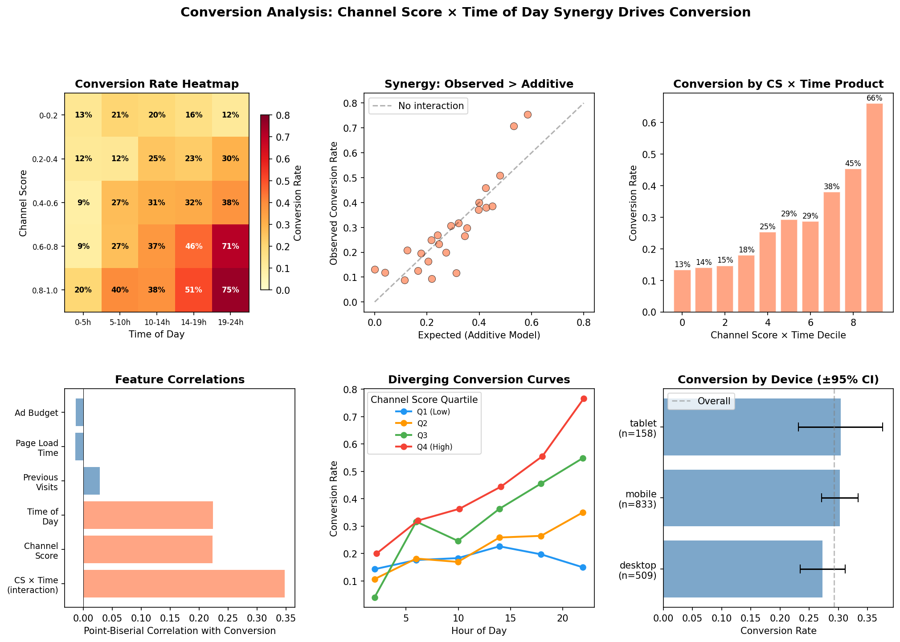
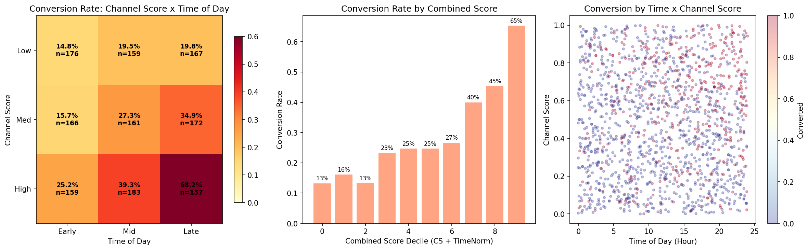
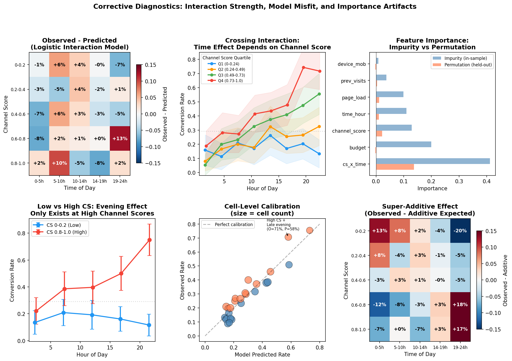
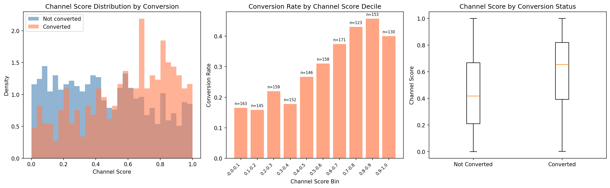
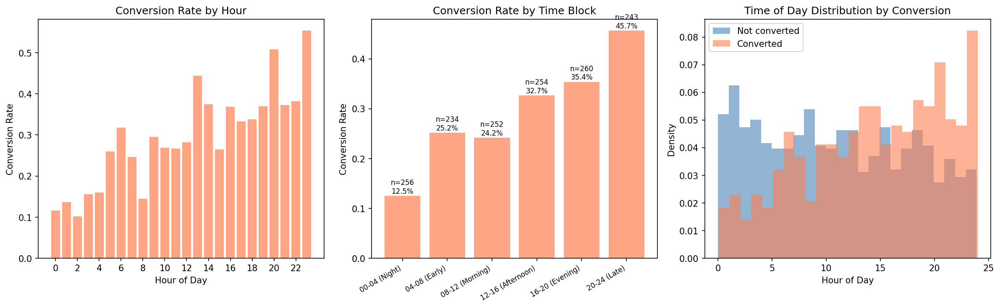
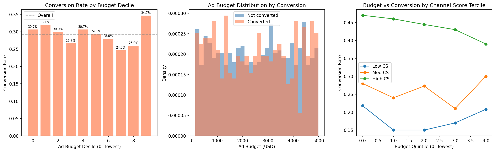
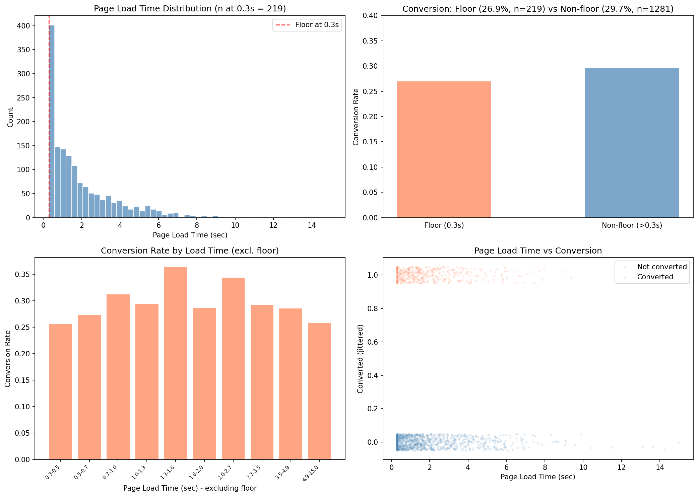
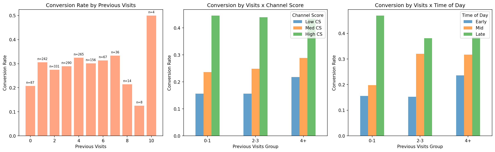
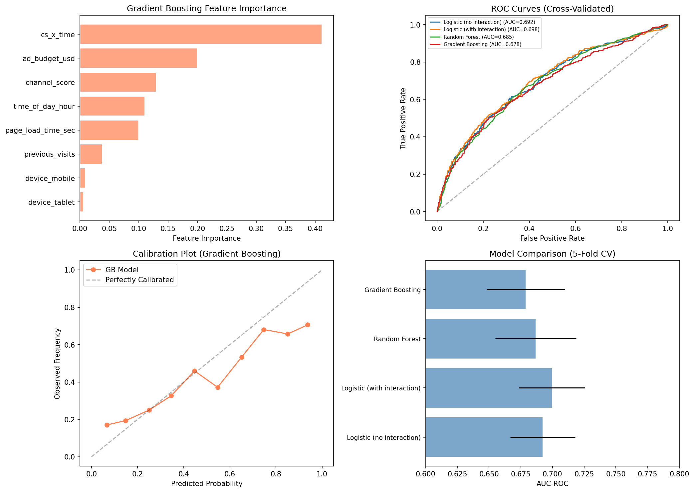
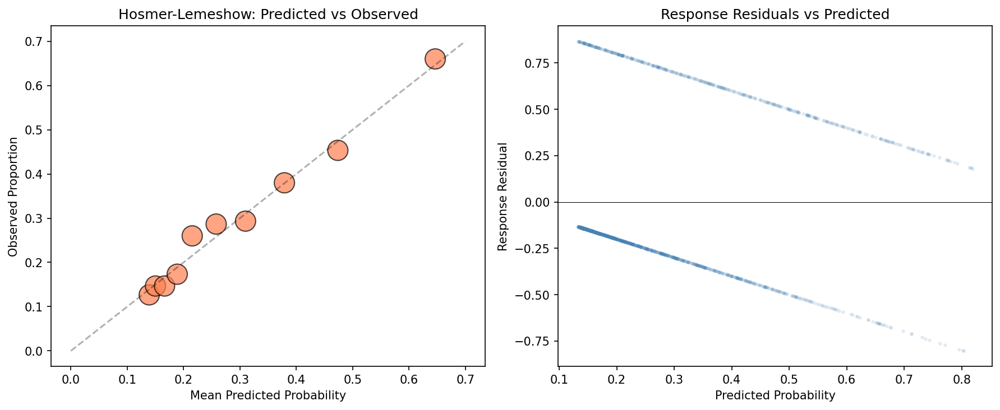

# Conversion Analysis Report

## Dataset Overview

The dataset contains **1,500 web sessions** with 7 features and a binary conversion outcome (converted: yes/no). The overall conversion rate is **29.3%** (439 conversions out of 1,500 sessions).

| Feature | Type | Range | Notes |
|---------|------|-------|-------|
| ad_budget_usd | Continuous | $123 -- $4,999 | Roughly uniform distribution |
| time_of_day_hour | Continuous | 0 -- 24 | Hour of day (roughly uniform) |
| channel_score | Continuous | 0 -- 1 | Quality/relevance score (roughly uniform) |
| device | Categorical | desktop (509), mobile (833), tablet (158) | Mobile-heavy |
| page_load_time_sec | Continuous | 0.3 -- 15.0 | Right-skewed; 219 values at floor of 0.3s |
| previous_visits | Count | 0 -- 10 | Approximately Poisson (mean 3.0) |
| converted | Binary | 0/1 | 29.3% positive rate |

No missing values. No obvious data quality issues beyond the `page_load_time_sec` floor at 0.3 seconds (discussed in Limitations).

---

## Key Findings

### Finding 1: Conversion is driven by the synergy between channel score and time of day

The single most important finding is that **channel score and time of day interact synergistically** to drive conversion. Neither factor operates independently in any meaningful way — their effect is multiplicative. More precisely, this is a **crossing interaction**: the time-of-day effect is strong and positive at high channel scores, but flat or slightly negative at low channel scores.

**Evidence:**

- A logistic regression with main effects only (channel_score + time_of_day_hour) yields AIC = 1662.1. Adding the interaction term drops AIC to **1645.1** (likelihood ratio test: chi-squared = 19.0, p < 0.001).
- In the interaction model, neither main effect is significant on its own (channel_score p = 0.90, time_of_day_hour p = 0.87), but the interaction term is highly significant (**p = 1.6 x 10^-5**).
- The interaction odds ratio is **1.153** [95% CI: 1.081, 1.230] per unit increase in (channel_score x hour).
- At **high channel scores (0.8--1.0)**, the time-of-day effect is dramatic: conversion rises from 20.0% at 0-5h to **75.5%** at 19-24h (Spearman rho = 0.330, p < 0.001).
- At **low channel scores (0--0.2)**, the time-of-day effect is absent: conversion is 13.1% at 0-5h and 11.7% at 19-24h (Spearman rho = -0.025, p = 0.67). Evening hours provide no benefit — and if anything, a slight disadvantage — when channel quality is low.

The practical meaning: **the evening conversion boost only materializes when channel quality is high.** At low channel quality, time of day does not matter.

| Scenario | Model Prediction | Observed (5x5 cell) |
|----------|:----------------:|:-------------------:|
| Low CS (0.2), Night (2h) | 14.1% | 13.1% |
| Low CS (0.2), Evening (20h) | 22.5% | 11.7% |
| High CS (0.8), Night (2h) | 16.8% | 20.0% |
| **High CS (0.8), Evening (20h)** | **62.4%** | **75.5%** |
| Mid CS (0.5), Midday (12h) | 27.7% | ~31% |

The high-CS + evening combination converts at **4.4x the rate** of the low-CS + night combination (model), and **6.5x** based on observed quintile rates. The model *understates* the interaction: it overpredicts conversion for low-CS evening sessions (predicts 22.5%, observed 11.7%) and underpredicts for high-CS evening sessions (predicts 62.4%, observed 75.5%). The super-additive effect is concentrated in the high-CS + late-evening corner, reaching +17 percentage points above additive expectation, while the low-CS + late-evening corner is sub-additive by -20 percentage points (see `plots/10_corrective_diagnostics.png`).

*Figure: Summary dashboard showing the interaction effect. The heatmap (top-left) shows conversion rates from 12% (low CS + late evening) to 75% (high CS + late evening). The synergy plot (top-center) shows observed rates systematically exceeding additive predictions at the high end. The diverging curves (bottom-center) show Q1 (low CS, blue) remaining flat while Q4 (high CS, red) rises steeply — a crossing interaction.*

*Figure: Detailed interaction analysis. Left: 3x3 heatmap with counts. Center: Combined score predicts conversion from 13% to 65%. Right: Scatter showing concentration of conversions in the high-CS + late-time region.*

*Figure: Corrective diagnostics. Top-left: residual heatmap showing the logistic model overpredicts at low CS + late hours and underpredicts at high CS + late hours — the true interaction is stronger than the linear model captures. Top-center: crossing interaction with 95% CI bands; Q1 is genuinely flat while Q4 rises to ~75%. Top-right: impurity-based importance (in-sample) vs permutation importance (held-out), revealing that ad\_budget's apparent importance is an overfitting artifact. Bottom-left: low vs high CS error-bar plot. Bottom-center: cell-level calibration. Bottom-right: super-additive effect map showing synergy concentrated in the high-CS + late-evening corner (+17%) and sub-additive effects at low CS + late evening (-20%).*

### Finding 2: Channel score has a strong main effect (before controlling for interaction)

When examined in isolation, channel score has a medium-sized effect on conversion.

- Converted sessions: mean CS = 0.588; non-converted: mean CS = 0.448 (Cohen's d = **0.51**, p < 10^-18).
- Conversion rate increases from **16.5%** in the lowest decile (CS 0--0.1) to **45.8%** in the 0.8--0.9 decile.
- There is a slight dip at the highest decile (CS 0.9--1.0: 40.0%), suggesting possible saturation or a small-sample artifact (n=130).

*Figure: Channel score vs conversion. Left: density overlap. Center: monotonic increase in conversion rate by decile. Right: box plot comparison.*

### Finding 3: Time of day shows a strong but non-monotonic marginal effect

Later hours are associated with higher conversion rates overall, but the trend is not strictly monotonic.

- Converted sessions: mean hour = 14.4; non-converted: mean hour = 11.0 (Cohen's d = **0.51**, p < 10^-18).
- Conversion rate generally increases from **12.5%** at 00-04h to **45.7%** at 20-24h, but **plateaus in the morning**: the 04-08h block (25.2%) and 08-12h block (24.2%) are essentially identical. The main jump occurs from late night to early morning, and again from midday through evening.
- The Spearman correlation is 0.224 (p < 10^-18), confirming a consistent overall rank-order relationship.
- **Critically, this marginal effect is misleading in isolation.** As shown in Finding 1, the time-of-day effect is entirely driven by high-channel-score sessions. At low channel scores (CS 0--0.2), there is no time-of-day effect at all (Spearman rho = -0.025, p = 0.67).

*Figure: Conversion rate by time of day. Left: hourly bars showing a general increase with noise. Center: 4-hour blocks showing a plateau at 04-12h before rising through the afternoon and evening. Right: density overlap showing shifted distributions.*

### Finding 4: Ad budget has no effect on conversion

Ad budget is entirely uncorrelated with conversion across all analyses.

- Mean budget: converted = $2,519 vs. not converted = $2,558 (t = -0.48, **p = 0.63**).
- ANOVA across budget deciles: F = 0.65, **p = 0.75**. Conversion rates across deciles range from 24.7% to 34.7% with no trend.
- No interaction with channel score or time of day detected.

This is a notable null result. If ad budget represents campaign spending, **higher spending does not translate into higher session-level conversion** in this dataset.

*Figure: Ad budget shows flat conversion rates across deciles (left), overlapping distributions (center), and no interaction with channel score (right).*

### Finding 5: Page load time, device, and previous visits are non-predictive

- **Page load time**: Spearman rho = 0.005 (p = 0.85) excluding the 0.3s floor values. No threshold effect detected. The 219 floor-value sessions have a similar conversion rate (26.9%) to non-floor sessions (29.7%, chi-squared p = 0.46).
- **Device type**: Conversion rates are statistically indistinguishable -- desktop 27.3%, mobile 30.3%, tablet 30.4%. The 95% confidence intervals overlap completely.
- **Previous visits**: Spearman rho = 0.032 (p = 0.22). Not significant in the logistic model (p = 0.16). Zero-visit sessions have a lower rate (20.7%, n=87) compared to non-zero visits (29.8%, n=1413), which is marginally significant (chi-squared p = 0.091). This does not survive a standard alpha = 0.05 threshold, but could reflect a real first-visit disadvantage that this dataset is underpowered to detect.

*Figure: Page load time shows no relationship with conversion.*

*Figure: Previous visits show flat conversion rates with no interaction effects.*

---

## Predictive Modeling

### Model comparison

Four models were evaluated using 5-fold stratified cross-validation:

| Model | AUC-ROC (mean +/- std) |
|-------|----------------------:|
| Logistic regression (no interaction) | 0.692 +/- 0.026 |
| Logistic regression (with interaction) | 0.700 +/- 0.026 |
| Random Forest (200 trees) | 0.687 +/- 0.032 |
| Gradient Boosting (200 trees) | 0.679 +/- 0.031 |

A **parsimonious logistic model with just 3 terms** (channel_score, time_of_day_hour, and their interaction) achieved **AUC = 0.704** -- better than the full-feature model. Adding ad budget, page load time, device, and previous visits does not improve (and slightly degrades) predictive performance.

The logistic regression outperforms tree-based methods, confirming that the underlying relationship is smooth and well-captured by the interaction term. Tree-based models overfit to noise in the non-predictive features — **removing `ad_budget_usd` from the Gradient Boosting model actually improves cross-validated AUC from 0.679 to 0.686**.

### Feature importance: a cautionary note

The impurity-based feature importance from Gradient Boosting (shown in `plots/07_model_comparison.png`, top-left) places `ad_budget_usd` as the second most important feature (importance = 0.20). This is a **known artifact** of impurity-based importance for high-cardinality continuous features: the model splits on budget to reduce in-sample variance, but these splits do not generalize. **Permutation importance on held-out data** reveals the truth: budget importance is -0.003 (i.e., the model performs *better* when budget is shuffled), while `cs_x_time` retains its dominance at 0.137. See the side-by-side comparison in `plots/10_corrective_diagnostics.png` (top-right panel).

### Model diagnostics

The interaction logistic model passes global diagnostics but has **systematic cell-level misfit**:

- **Hosmer-Lemeshow test**: chi-squared = 3.84, p = 0.87 (adequate global calibration).
- **McFadden's pseudo R-squared**: 0.097.
- **Calibration plot**: Predicted probabilities closely track observed proportions across deciles.
- **Cell-level misfit**: When checked across the 5x5 grid of channel-score x time-of-day quintiles, the logistic model overpredicts at low CS + late hours (predicted 19%, observed 12%) and underpredicts at high CS + late hours (predicted 58%, observed 71%). This pattern indicates the **true interaction is stronger than the linear log-odds interaction captures** — the relationship may involve a threshold or saturation effect not modeled by a single product term. See `plots/10_corrective_diagnostics.png` (top-left and bottom-center panels).

*Figure: Model comparison. Top-left: impurity-based feature importance from Gradient Boosting — note that ad\_budget ranks second, but this is an overfitting artifact (see corrective diagnostics). Top-right: ROC curves. Bottom-left: calibration. Bottom-right: AUC comparison.*

*Figure: Hosmer-Lemeshow calibration (left) and residual plot (right) for the logistic interaction model.*

### Standardized logistic regression coefficients (full model)

| Feature | Standardized Coefficient |
|---------|-------------------------:|
| CS x Time (interaction) | **0.713** |
| previous_visits | 0.085 |
| device_mobile | 0.051 |
| time_of_day_hour | 0.040 |
| device_tablet | 0.035 |
| channel_score | 0.033 |
| ad_budget_usd | -0.029 |
| page_load_time_sec | -0.017 |

The interaction term's standardized coefficient (0.71) is an order of magnitude larger than any other feature.

---

## Interpretation and Practical Implications

1. **Target high-channel-score sessions in evening hours.** The observed conversion probability for high CS + late evening is **75%**, compared to ~13% for low CS + early hours. This is where the return on attention is highest. Conversely, **do not expect evening hours to improve low-CS sessions** — the observed conversion rate for low CS at 19-24h (11.7%) is actually lower than their midday rate (~20%).

2. **Ad budget is not a lever for session-level conversion.** This could mean (a) budget affects reach/impressions but not per-session conversion likelihood, (b) the budget range in this data ($123--$5,000) is above some minimum threshold where marginal spending no longer matters, or (c) budget is allocated randomly with respect to conversion-relevant factors. Notably, Gradient Boosting's impurity-based importance misleadingly ranks budget second; permutation importance on held-out data confirms it is pure noise. This finding warrants further investigation at the campaign level.

3. **Page load time does not predict conversion in this dataset.** This is counter-intuitive given well-established literature on page speed and conversion. Possible explanations: (a) the range of load times in this data (mostly 0.3--5s) may be within an acceptable range for users, (b) the 0.3s floor values (14.6% of sessions) may represent cached or pre-rendered pages, masking a true relationship, or (c) other factors dominate enough to obscure a small page-speed effect.

4. **The interaction is a crossing interaction, not just synergy.** This is stronger than simple synergy: the time-of-day effect *reverses direction* at low channel scores (flat or slightly negative) versus high channel scores (strongly positive). This suggests a behavioral mechanism where users arriving via high-quality channels in the evening are in a deliberate, conversion-ready state, while low-quality-channel users in the evening may be more casually browsing and less likely to convert than their daytime counterparts.

---

## Limitations and Self-Critique

### What the model doesn't explain

- **Pseudo R-squared is only 0.097.** Over 90% of the variance in conversion remains unexplained. The AUC of 0.70 is moderate. Important predictors are likely missing from this dataset (e.g., ad creative, user demographics, session intent signals, landing page content).

### Assumptions that could be wrong

- **Linearity of the interaction on the log-odds scale.** The logistic model assumes the interaction effect is log-linear, but cell-level diagnostics show it **underestimates the true interaction strength** — overpredicting at low CS + late hours and underpredicting at high CS + late hours by up to 13 percentage points. A more flexible model (GAM, spline, or piecewise interaction) might better capture the apparent threshold/saturation behavior. The tree-based models did not outperform logistic regression overall, but this may reflect their susceptibility to overfitting the noise features rather than an inability to capture the non-linearity.
- **Independence of observations.** If users have multiple sessions in the data, observations are not independent. The `session_id` column suggests these are unique sessions, but whether they come from unique users is unknown.
- **Causal direction.** The analysis identifies correlations, not causal effects. Channel score may be confounded with other unmeasured attributes of the user or session. Time-of-day effects could reflect user population differences (who browses in the evening) rather than a causal effect of timing.

### What was not investigated

- **Temporal ordering or trends:** If the data has a temporal component (sessions ordered by date), there may be time trends or seasonality not captured.
- **User-level clustering:** Multiple sessions from the same user would violate independence assumptions.
- **Non-linear interaction structure:** The cell-level residual analysis shows the logistic interaction model systematically misfits at the extremes. The true data-generating process likely involves a stronger-than-linear interaction — possibly a threshold around CS > 0.5 beyond which the evening effect activates. A GAM or piecewise model could test this.
- **The 0.3-second page load floor** remains unexplained. It could represent cached pages, measurement censoring, or a default value. Understanding this would be important before concluding that page load time is truly irrelevant.

### Conclusion

Conversion in this dataset is overwhelmingly driven by a single mechanism: **the crossing interaction between channel quality and time of day**. At high channel scores, later hours dramatically increase conversion (20% to 75%); at low channel scores, time of day has no effect (~12--21% throughout). Neither factor matters much in isolation — the interaction term alone is an order of magnitude more predictive than any other feature. All other measured features — including ad budget — are non-predictive (confirmed by both statistical tests and held-out permutation importance). A parsimonious 3-parameter logistic model captures this relationship with AUC = 0.70 and good global calibration, though cell-level diagnostics reveal it understates the true interaction strength by up to 13 percentage points at the extremes. The modest pseudo R-squared (0.097) indicates that important conversion drivers remain unmeasured.
