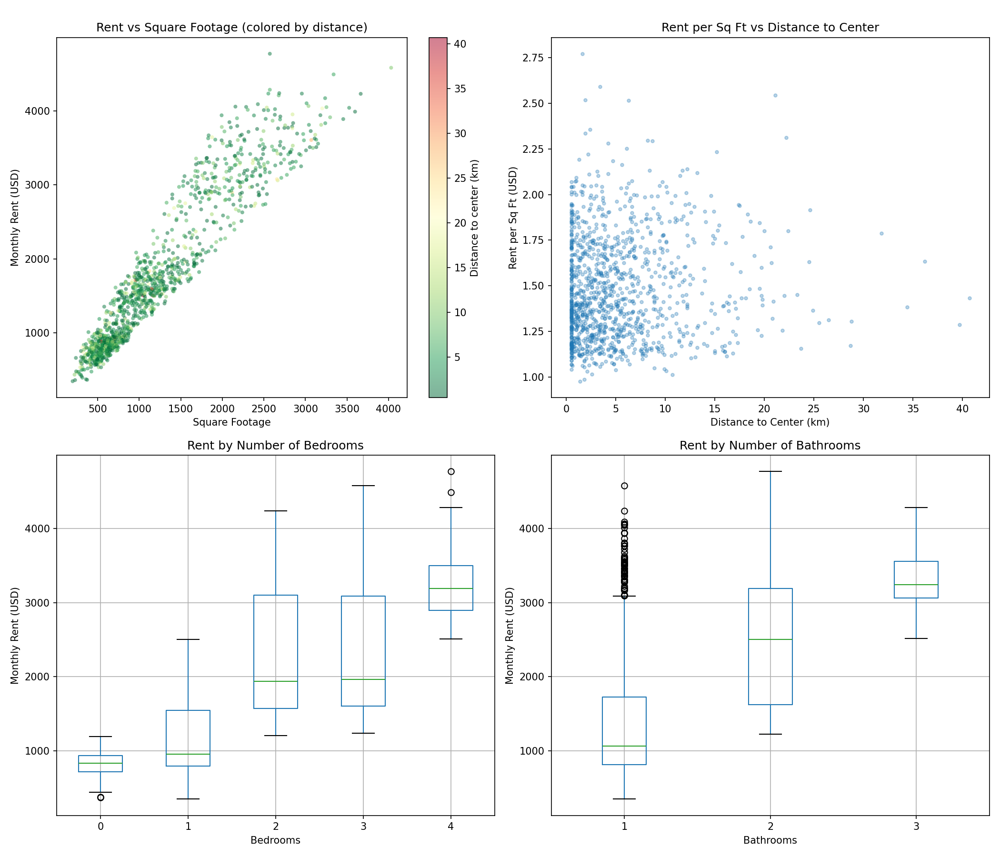
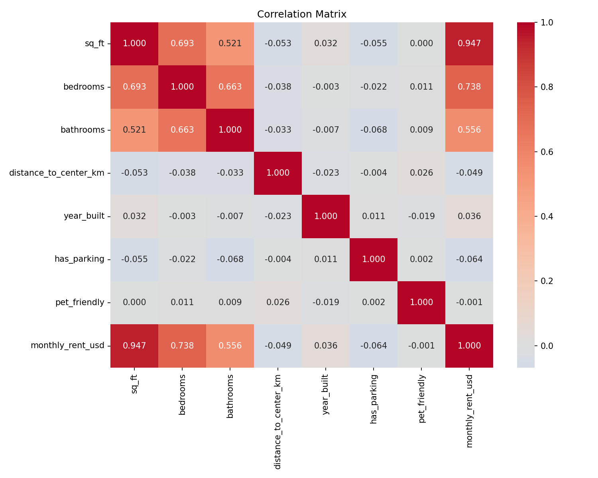
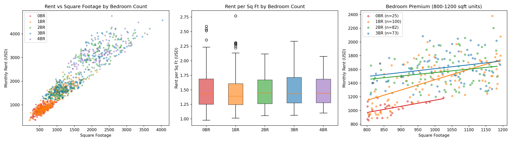
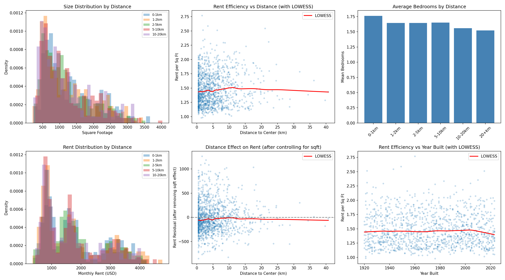
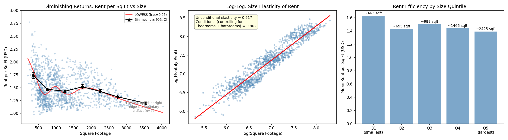
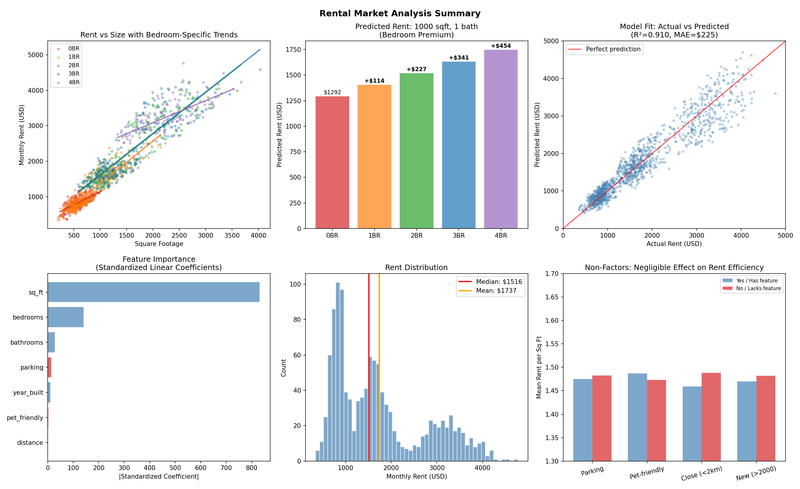
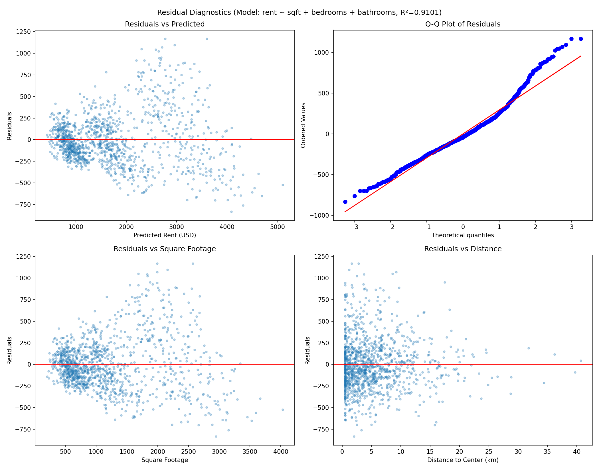
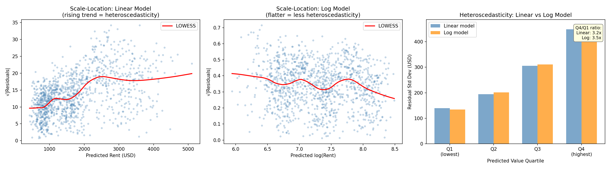

# Rental Market Analysis Report

## Dataset Overview

The dataset contains **1,200 rental listings** with 8 features describing each property:

| Feature | Type | Range | Description |
|---------|------|-------|-------------|
| sq_ft | int | 200–4,031 | Unit size in square feet |
| bedrooms | int | 0–4 | Number of bedrooms |
| bathrooms | int | 1–3 | Number of bathrooms |
| distance_to_center_km | float | 0.5–40.7 | Distance to city center |
| year_built | int | 1920–2023 | Construction year |
| has_parking | binary | 0/1 | Parking availability |
| pet_friendly | binary | 0/1 | Pet policy |
| monthly_rent_usd | int | $347–$4,769 | Target: monthly rent |

No missing values. The target variable (monthly rent) has a right-skewed distribution with a median of $1,516 and mean of $1,737.

---

## Key Findings

### 1. Square Footage Overwhelmingly Determines Rent

Square footage alone explains **89.7% of rent variance** (Pearson r = 0.947). This is a remarkably strong univariate relationship. A simple linear regression of rent on sq_ft yields:

- **Coefficient**: $1.30 per sq ft per month
- **R²**: 0.897
- **MAE**: $244

No other feature comes close. The next strongest predictor (bedrooms, r = 0.74) is largely redundant with square footage (bedrooms–sqft correlation: 0.89).


*Figure 1: Rent vs square footage (colored by distance to center), rent efficiency by distance, and rent distributions by bedroom and bathroom count.*


*Figure 2: Correlation matrix showing sq_ft dominance and high collinearity among size-related features.*

### 2. Bedrooms Command a Premium Beyond Size

After controlling for square footage (partial correlation = 0.35, p < 0.001), each additional bedroom adds approximately **$114/month** to rent, or equivalently a **7.3% premium** in the log-linear specification. This effect is economically meaningful and highly statistically significant (t = 10.1).

For a hypothetical 1,000 sq ft, 1-bathroom unit:

| Bedrooms | Predicted Rent | Premium vs Studio |
|----------|---------------|-------------------|
| 0 (studio) | $1,239 | — |
| 1 | $1,352 | +$114 |
| 2 | $1,466 | +$227 |
| 3 | $1,580 | +$341 |
| 4 | $1,693 | +$454 |

**Interpretation**: More bedrooms at the same total size means a more functional layout with distinct living spaces, which tenants value. The premium reflects a willingness to pay for spatial differentiation.


*Figure 3: Left: rent vs sqft by bedroom count with regression lines. Center: rent per sqft by bedroom count. Right: bedroom premium within medium-sized units (800–1200 sqft).*

### 3. Bathrooms Have a Small, Marginally Significant Effect

Each additional bathroom adds approximately **$53/month** (2.1%), though this effect is only marginally significant (p = 0.013 in the linear model, p = 0.072 in the log model). The high collinearity between bathrooms and other size features (VIF = 12.6) makes it difficult to isolate this effect cleanly.

### 4. Distance to City Center Does Not Affect Rent

This is the most surprising finding. Distance to center has:

- Near-zero raw correlation with rent (r = -0.049)
- Near-zero partial correlation with rent after controlling for sqft (r = 0.002)
- A statistically insignificant coefficient in every model specification tested (linear, log, inverse, LOWESS)

The LOWESS curves of both raw rent-per-sqft and size-adjusted residuals against distance are essentially flat. Properties at 0.5 km from center command the same per-sqft rate as properties at 20+ km.

| Distance Bin | Mean Rent/SqFt | Mean Rent | n |
|--------------|---------------|-----------|---|
| 0–1 km | $1.45 | $1,819 | 241 |
| 1–2 km | $1.47 | $1,740 | 150 |
| 2–5 km | $1.47 | $1,743 | 346 |
| 5–10 km | $1.49 | $1,733 | 295 |
| 10–20 km | $1.52 | $1,635 | 145 |
| 20+ km | $1.55 | $1,481 | 23 |

The slight decrease in average rent at greater distances is entirely explained by smaller average unit sizes in those bins, not by a location discount.


*Figure 4: Multi-panel investigation of the distance non-effect. LOWESS curves on raw and residualized data confirm no location premium. Property size and bedroom distributions are uniform across distances.*

### 5. Year Built, Parking, and Pet-Friendliness Are Irrelevant

None of these features have a statistically or practically significant effect on rent:

| Feature | Standardized Coefficient | p-value |
|---------|------------------------|---------|
| year_built | 0.011 | 0.218 |
| has_parking | -0.013 | 0.122 |
| pet_friendly | -0.005 | 0.784 |

A 1920s building rents for the same per-sqft rate as a 2020s building. Parking and pet policies have no measurable impact on price.

### 6. Diminishing Returns to Size

The relationship between size and rent follows a power law with sub-unit elasticity. Two measures of this elasticity are informative:

- **Unconditional elasticity** (log(rent) ~ log(sqft)): **0.917** — this is the raw size-rent relationship including the confounding effect of larger units having more bedrooms.
- **Conditional elasticity** (controlling for bedrooms and bathrooms): **0.802** — this isolates the pure size effect. A 10% increase in square footage, holding bedroom/bathroom count constant, yields only an 8.0% increase in rent.

The practical consequence is generally declining rent efficiency with size, though the pattern is not strictly monotonic:

| Size Band | Mean Rent/SqFt | n |
|-----------|---------------|---|
| 200–500 sqft | $1.74 | 138 |
| 500–1,000 sqft | $1.47 | 463 |
| 1,000–1,500 sqft | $1.43 | 260 |
| **1,500–2,000 sqft** | **$1.52** | **134** |
| 2,000–2,500 sqft | $1.43 | 115 |
| 2,500–3,000 sqft | $1.32 | 64 |
| 3,000–4,100 sqft | $1.20 | 26 |

The overall trend is clear: **smaller units are more expensive per square foot** ($1.74/sqft for the smallest vs $1.20/sqft for the largest). However, the 1,500–2,000 sqft band breaks the declining pattern with a statistically significant bump ($1.52/sqft, p = 0.003 vs both neighbors). This bump persists within bedroom counts (e.g., 2BR: $1.42 → $1.53 → $1.43 across the three middle bands), ruling out composition effects. It may reflect a market "sweet spot" where demand for mid-size family units is strongest relative to supply.

Note: the LOWESS curve in Figure 5 also shows an uptick at the extreme right (>3,000 sqft), but this is a **boundary artifact** caused by sparse data (n=26) — bin means continue to decline through the largest sizes.

This elasticity varies by bedroom count: studios (0.54) and 4-bedroom units (0.41) show the strongest diminishing returns, while 1–3 bedroom units are more consistent (~0.80–0.83). The lower elasticity for studios may reflect a floor effect — even the smallest studios require a minimum rent to cover fixed costs.


*Figure 5: Left: rent per sqft vs size with LOWESS and bin means (black dots, ±95% CI) — overall declining trend with a local bump at 1,500–2,000 sqft. Center: log-log plot showing both unconditional (0.917) and conditional (0.802) elasticities. Right: rent efficiency by size quintile.*

---

## Model Summary

### Best Model: Linear Regression (sqft + bedrooms + bathrooms)

```
Rent = $93 + $1.15 × sqft + $114 × bedrooms + $53 × bathrooms
```

| Metric | Value |
|--------|-------|
| R² (in-sample) | 0.910 |
| R² (10-fold CV) | 0.908 ± 0.008 |
| MAE (CV) | $226 ± $12 |
| MAPE | 13.9% |

Adding distance, year_built, parking, and pet_friendly does not improve the model (CV R² = 0.908, identical). A Random Forest with all features achieves modestly better performance (CV R² = 0.920, MAE = $202), capturing some nonlinearity, but the improvement is small and the three-feature linear model captures the essential structure.


*Figure 6: Summary dashboard. Top-left: per-bedroom regression lines. Top-center: bedroom premium quantified. Top-right: actual vs predicted (R²=0.910). Bottom-left: standardized feature importance. Bottom-center: rent distribution. Bottom-right: non-factors have negligible effect on rent efficiency.*


*Figure 7: Residual diagnostics for the linear model. Pronounced heteroscedasticity is visible — residual spread fans from ±$300 for low-rent predictions to ±$1,100 for high-rent predictions.*


*Figure 8: Scale-location plots comparing linear (left) and log (center) models. The linear model shows a clear rising trend in residual magnitude. Right panel: residual standard deviation by predicted-value quartile — a 3.2x ratio from Q1 ($140) to Q4 ($448) in the linear model.*

### Log-Linear Alternative

A log-linear specification (log(rent) ~ log(sqft) + bedrooms + bathrooms) better handles heteroscedasticity and yields interpretable elasticities, though it performs comparably on prediction (CV R² = 0.904, MAE = $226). The Breusch-Pagan test confirms substantial heteroscedasticity in the linear model (p < 0.001), and the scale-location plot (Figure 8) shows the log model's residual spread is considerably flatter. The log model produces errors that are roughly proportional to rent level (constant coefficient of variation), which is more appropriate for price data. **The log-linear model is preferred for statistical inference.**

---

## Interpretation and Implications

1. **This is a size-driven market.** Rent is almost entirely a function of how big the unit is. A landlord setting rent need only know the square footage and bedroom count to price competitively — the model's average error is ~$225, though accuracy varies: predictions are tighter for smaller units (~$140 std) and looser for large/expensive ones (~$450 std).

2. **Location doesn't command a premium** — at least not in this dataset. This could indicate a market with homogeneous neighborhood quality, effective transit access at all distances, or that the "distance to center" variable fails to capture the relevant location dimension (e.g., proximity to specific employment centers, school districts, or amenities).

3. **More bedrooms justify higher rent** even at the same total size. This is a real, exploitable premium: converting an open-plan space into a partitioned layout could yield ~7% more rent per added bedroom.

4. **Building age doesn't matter.** Tenants are not paying more for newer construction, which suggests either that older buildings have been renovated, or that age is genuinely irrelevant to rental value in this market.

5. **Amenities (parking, pets) are not priced in.** Either these amenities are standard enough to not differentiate, or the market doesn't segment on them.

---

## Limitations and Self-Critique

### What could be wrong

- **Omitted variable bias**: The most important limitation is what's *not* in the dataset. Neighborhood quality, unit condition, floor level, view, amenities (laundry, gym, doorman), and proximity to transit likely explain much of the remaining 9% variance. The irrelevance of "distance_to_center" might simply mean this variable is a poor proxy for true location quality.

- **Substantial heteroscedasticity**: The linear model's residual standard deviation is 3.2x larger for high-rent predictions ($448) than for low-rent predictions ($140), as confirmed by both the Breusch-Pagan test (p < 0.001) and scale-location plots (Figure 8). This means OLS standard errors are understated for coefficient inference, and prediction intervals for expensive properties are far wider than the model suggests. The log-linear model reduces this on its native scale, but the underlying pattern — errors proportional to rent level — persists.

- **Non-normal residuals**: Residuals exhibit both leptokurtosis (excess kurtosis = 1.28, heavier tails than Gaussian on both sides) and mild positive skew (0.77). The Q-Q plot (Figure 7) shows departures at both the left tail (~-3σ) and right tail (~+2.5σ). This indicates some properties command unexplained premiums or discounts beyond what the model captures. Confidence intervals and p-values derived from normality assumptions should be treated with caution, particularly at the extremes.

- **Multicollinearity**: sq_ft, bedrooms, and bathrooms are highly correlated (VIF up to 12.6 for bathrooms). Individual coefficient estimates are somewhat unstable, though the overall model is robust.

### What I didn't investigate

- **Spatial clustering**: The dataset lacks geographic coordinates, so I cannot test whether properties cluster in ways that create local sub-markets with different pricing dynamics.
- **Interaction effects**: I tested sqft × bedrooms interaction (not significant, p = 0.506), but other interactions (e.g., distance × size, year × bathrooms) were not exhaustively explored.
- **Nonlinear bedroom effects**: The model assumes a constant premium per bedroom. The premium might be non-constant (e.g., the jump from 0→1 bedroom might differ from 3→4).
- **1,500–2,000 sqft sweet spot**: The rent-per-sqft bump in this size band is statistically significant and unexplained. It could reflect supply/demand dynamics (high demand for family-sized units), but without market-level data (inventory counts, days on market), the mechanism remains speculative.
- **Causal interpretation**: All findings are correlational. The bedroom premium, for instance, could reflect selection effects (different types of tenants choose different bedroom counts) rather than a causal effect of layout on willingness-to-pay.

### What I'm confident about

- Square footage is the dominant driver of rent (robust across all specifications)
- Distance, year_built, parking, and pet-friendliness are negligible (consistent across linear, log-linear, nonparametric, and ML models)
- The bedroom premium is real and practically meaningful (~$114/month, p < 0.001)
- The model generalizes well (CV R² = 0.908, stable across folds)
