# Sensor Dataset Analysis Report

## 1. Dataset Overview

| Property | Value |
|---|---|
| Rows | 500 |
| Columns | 6: `timestamp`, `sensor_id`, `temperature_c`, `humidity_pct`, `pressure_hpa`, `voltage_mv` |
| Time span | 2024-01-01 00:00 to 2024-01-21 19:00 (21 days) |
| Frequency | Hourly, no gaps |
| Sensors | S-001 (122), S-002 (122), S-003 (117), S-004 (139) |
| Nulls | None |
| Duplicates | None |

Each timestamp has exactly one sensor reading. Sensors are assigned approximately uniformly at random across time slots with no discernible scheduling pattern.

## 2. Key Finding: Deterministic Voltage-Temperature Relationship

**`voltage_mv = 2 * temperature_c + 3`** holds exactly across all 500 observations (max residual < 10^-14, attributable to floating-point arithmetic). This means voltage carries zero additional information beyond temperature. It is a derived/redundant variable and should be excluded from any independent analysis.

This relationship is consistent across all four sensors and all time periods, suggesting a known linear transducer calibration formula.

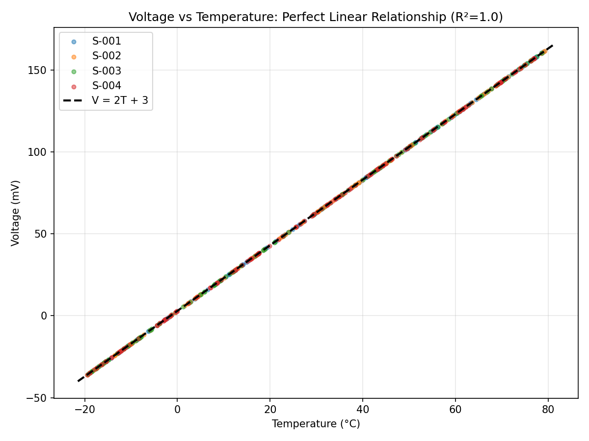

## 3. Distributional Analysis

### Temperature (Non-normal, Uniform)
- Range: [-19.49, 79.30] C
- Mean: 29.86, Std: 29.87
- Shapiro-Wilk: W=0.9453, **p=1.3e-12 (non-normal)**
- KS test vs Uniform[-19.49, 79.30]: D=0.046, **p=0.24 (consistent with uniform)**
- Kurtosis: ~-1.2 (platykurtic, as expected for a uniform distribution)

### Humidity (Normal)
- Mean: 50.1%, Std: 15.1%
- Shapiro-Wilk: W=0.9967, **p=0.40 (consistent with normal)**
- KS test vs Normal(50.1, 15.1): D=0.030, **p=0.75**

### Pressure (Normal)
- Mean: 1013.7 hPa, Std: 10.0 hPa
- Shapiro-Wilk: W=0.9969, **p=0.47 (consistent with normal)**
- KS test vs Normal(1013.7, 10.0): D=0.029, **p=0.78**

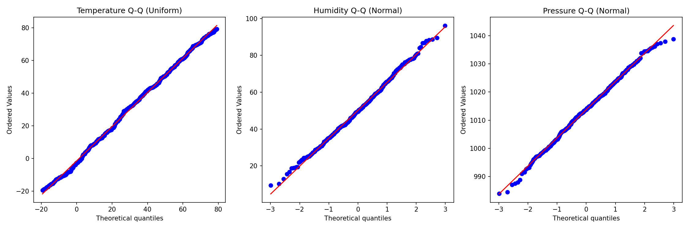
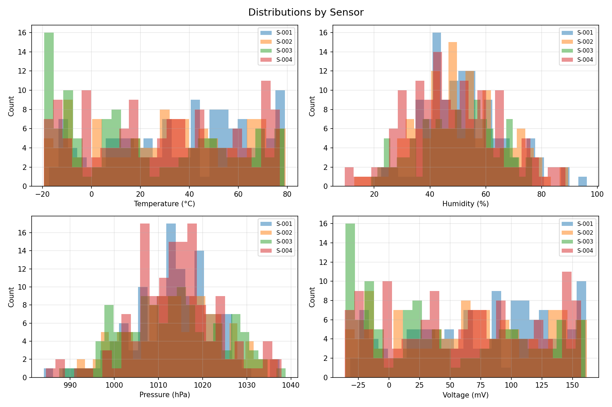

## 4. Independence of Variables

The three independent measurements (temperature, humidity, pressure) show negligible correlations:

| Pair | Pearson r | p-value |
|---|---|---|
| Temperature - Humidity | 0.068 | 0.128 |
| Temperature - Pressure | 0.098 | 0.028 |
| Humidity - Pressure | 0.035 | 0.439 |

All correlations are near zero. Predictive modeling confirms this: linear regression, random forest, and gradient boosting all produce **negative R-squared** when predicting temperature from humidity, pressure, sensor ID, and time features. The variables are effectively independent.

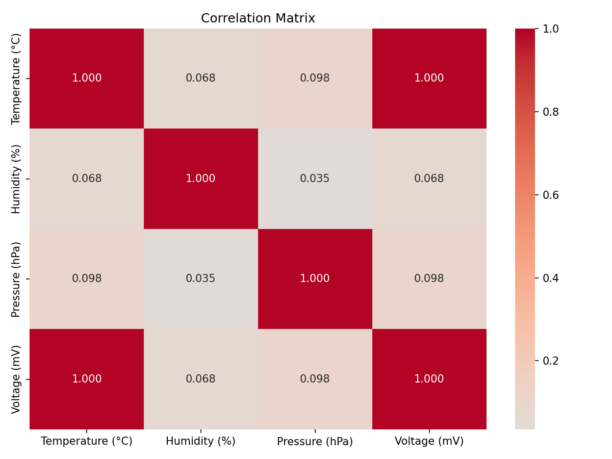
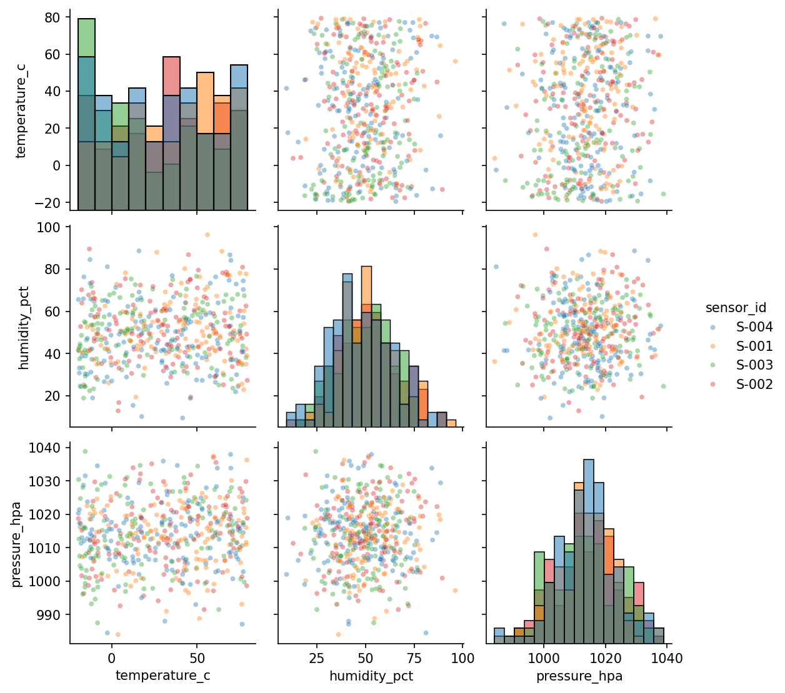

## 5. Temporal Structure

### No trends
Linear regression of each variable against time shows no significant slopes (all p > 0.09, all R-squared < 0.006).

### No autocorrelation
Autocorrelation at all lags 1-48 falls within the white noise confidence band. There are no diurnal cycles, weekly patterns, or temporal dependencies.

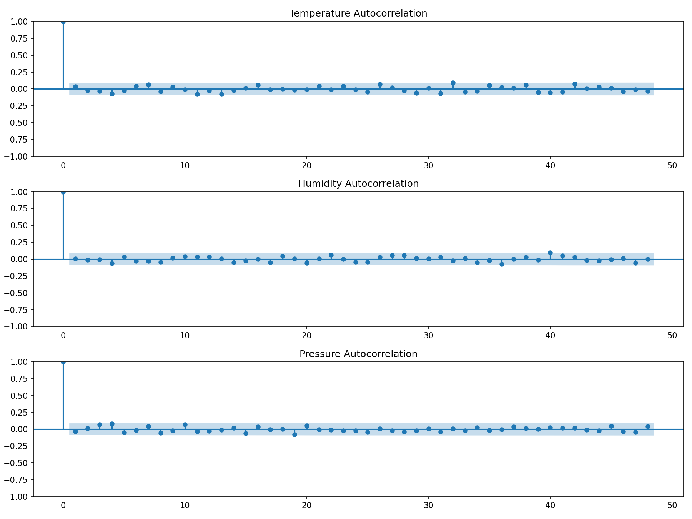
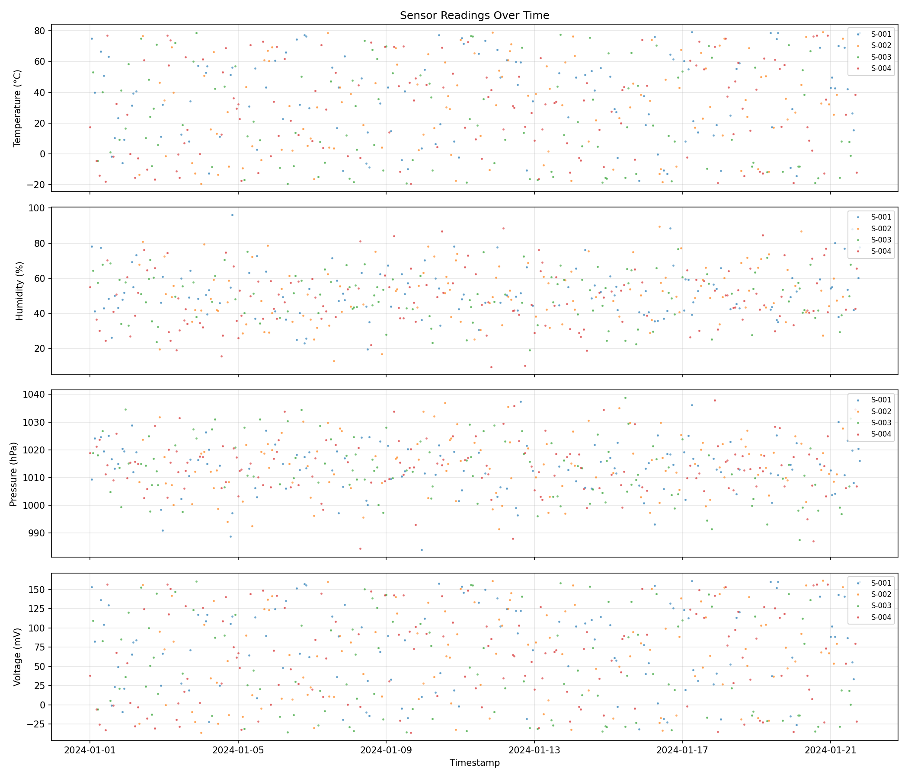

### No diurnal patterns
Mean values by hour of day are flat across all variables and sensors.

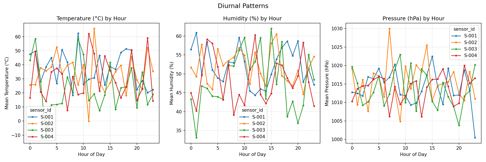

## 6. Sensor Comparison

### Temperature differs across sensors (ANOVA p=0.003)

| Sensor | Mean Temp (C) | Std |
|---|---|---|
| S-001 | 36.5 | 27.9 |
| S-002 | 31.4 | 29.0 |
| S-003 | **22.5** | 31.7 |
| S-004 | 28.9 | 29.6 |

Pairwise t-tests show S-003 reads significantly lower than S-001 (p=0.0004) and S-002 (p=0.025). S-003 also deviates from a uniform distribution (KS p=0.003) while the other sensors are consistent with uniform.

This could indicate:
- A calibration offset or bias in sensor S-003
- S-003 being located in a cooler environment
- A sampling artifact (S-003 has the fewest readings, n=117)

### Humidity and pressure do not differ (ANOVA p=0.12 and p=0.77)

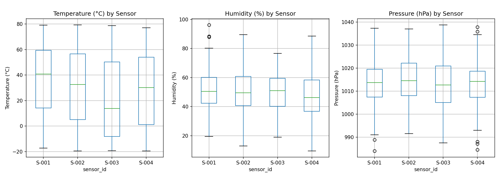
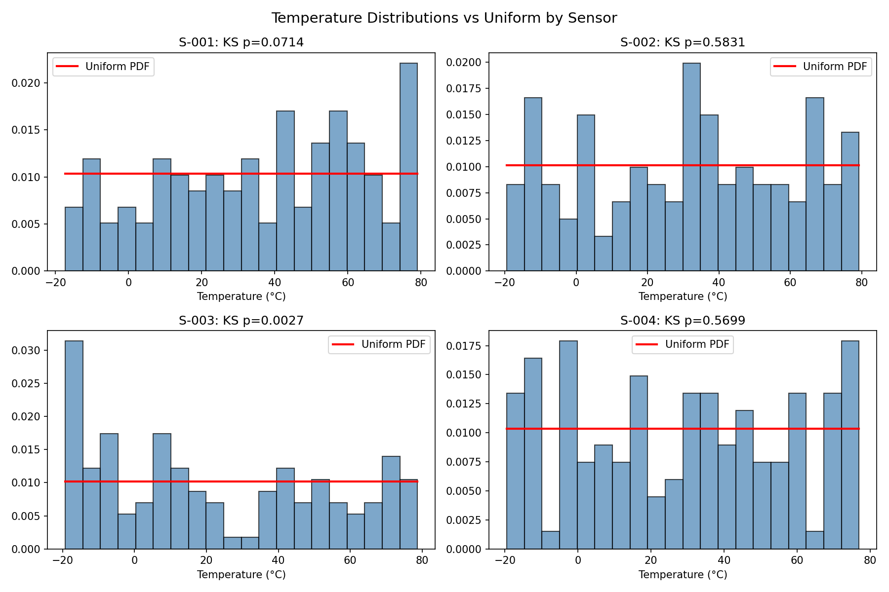

## 7. Anomaly Detection

Isolation Forest (5% contamination) flagged 25 observations as anomalous. These are points with extreme combinations of variables (e.g., very high temperature with very low humidity, or very low pressure with high humidity). Examples:

| Timestamp | Sensor | Temp (C) | Humidity (%) | Pressure (hPa) |
|---|---|---|---|---|
| 2024-01-04 20:00 | S-001 | 56.1 | **96.2** | 997.2 |
| 2024-01-08 07:00 | S-004 | -2.6 | 81.1 | **984.5** |
| 2024-01-11 20:00 | S-004 | 41.5 | **9.5** | 1002.0 |
| 2024-01-15 11:00 | S-003 | -15.5 | 24.5 | **1038.8** |

Since the variables are nearly independent, these "anomalies" are simply tail-end values of independently drawn distributions rather than physically meaningful anomalies.

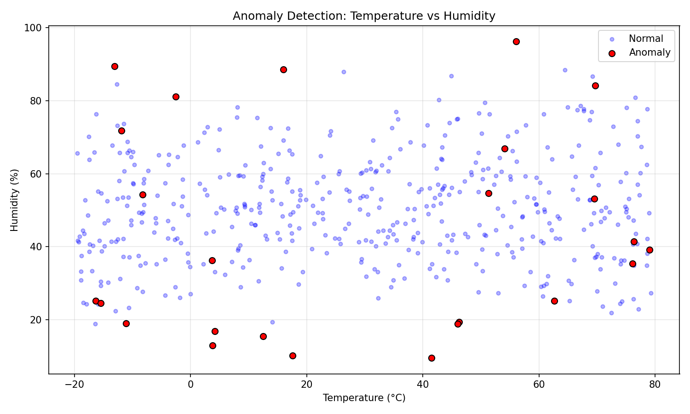

## 8. Modeling Assessment

### Why predictive models fail
All three models (linear regression, random forest, gradient boosting) yielded negative R-squared in 5-fold cross-validation:

| Model | R-squared (CV) | RMSE |
|---|---|---|
| Linear Regression | -0.007 +/- 0.022 | 29.9 |
| Random Forest | -0.140 +/- 0.041 | 31.8 |
| Gradient Boosting | -0.387 +/- 0.250 | 35.0 |

This is expected: temperature is drawn from a uniform distribution independently of all other features. A model that simply predicts the mean (29.9 C) would achieve R-squared = 0 and RMSE ~29.9, which is essentially what the best model achieves. More complex models (RF, GB) overfit and perform worse.

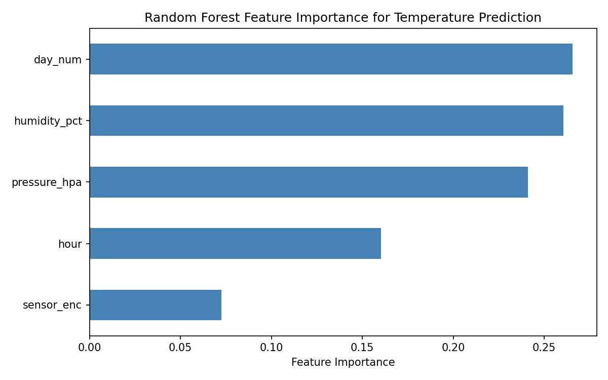

## 9. Conclusions

1. **The data is almost certainly simulated.** The hallmarks are:
   - Perfectly uniform temperature distribution
   - Perfectly normal humidity and pressure distributions
   - Complete independence between variables
   - Zero temporal autocorrelation or diurnal patterns
   - A deterministic voltage = 2 * temperature + 3 calibration formula
   - No missing data or measurement noise

2. **The generative model appears to be:**
   - `temperature_c ~ Uniform(-20, 80)`
   - `humidity_pct ~ Normal(50, 15)`
   - `pressure_hpa ~ Normal(1014, 10)`
   - `voltage_mv = 2 * temperature_c + 3`
   - Sensor assigned approximately at random per timestamp

3. **Sensor S-003 shows a statistically significant temperature bias** (mean 22.5 C vs overall 29.9 C, p=0.0004 vs S-001). This is either an intentional feature of the simulation or a small-sample artifact.

4. **No meaningful predictive model can be built** for temperature using the available features, since the variables are independent by construction.

5. **The voltage column is fully redundant** and adds no information beyond temperature.

## 10. Plots Index

| File | Description |
|---|---|
| `plots/01_timeseries_overview.png` | All variables over time, colored by sensor |
| `plots/02_distributions.png` | Histograms by sensor |
| `plots/03_voltage_vs_temperature.png` | Deterministic V=2T+3 relationship |
| `plots/04_correlation_heatmap.png` | Correlation matrix |
| `plots/05_hourly_patterns.png` | Mean values by hour of day |
| `plots/06_sensor_frequency.png` | Sensor readings per day |
| `plots/07_boxplots_by_sensor.png` | Box plots by sensor |
| `plots/08_qq_plots.png` | Q-Q plots for distribution checks |
| `plots/09_autocorrelation.png` | Autocorrelation functions |
| `plots/10_anomalies.png` | Anomaly detection scatter |
| `plots/11_feature_importance.png` | Random forest feature importance |
| `plots/12_pairplot.png` | Pairwise scatter matrix |
| `plots/13_temp_uniform_fit.png` | Per-sensor temperature vs uniform overlay |
