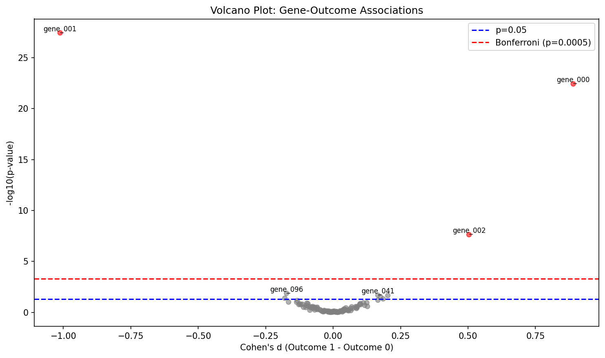
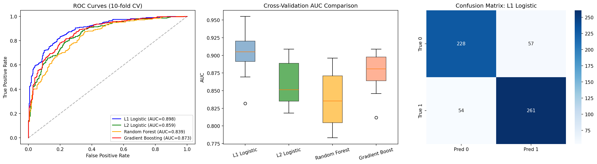
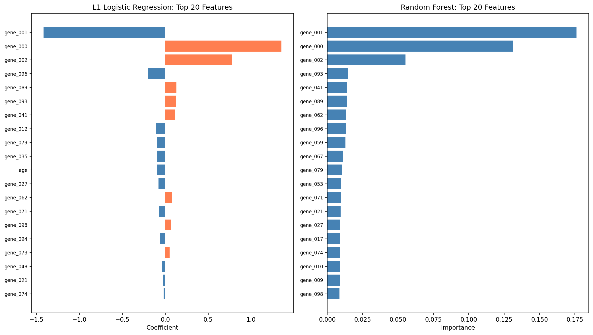
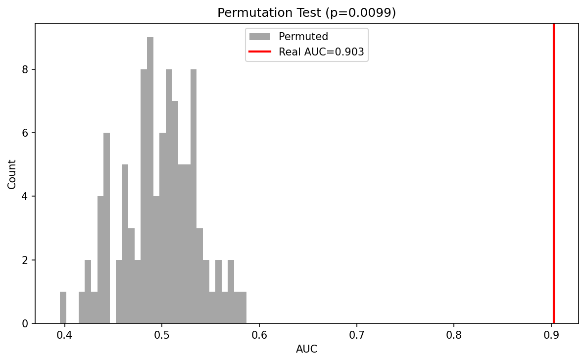
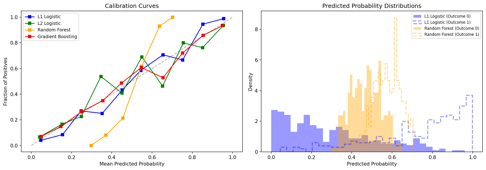

# Gene Expression Dataset Analysis Report

## 1. Data Overview

| Property | Value |
|----------|-------|
| Samples | 600 |
| Gene features | 100 (gene_000 – gene_099) |
| Demographic features | age (continuous), sex (M/F) |
| Target variable | outcome (binary: 0/1) |
| Missing values | 0 |
| Duplicate rows | 0 |

The dataset contains standardized gene expression values (mean ~ 0, std ~ 1) for 600 patient samples alongside age, sex, and a binary clinical outcome.

## 2. Data Quality Assessment

- **No missing values** across all 104 columns.
- **No duplicate samples** (unique sample_id for all rows).
- Gene expression values are pre-standardized (overall mean = -0.0001, std = 1.002), with per-gene standard deviations in the narrow range [0.90, 1.10]. No constant or near-constant features.
- No extreme outlier samples detected (per-sample means range from -0.36 to 0.33).
- Value range [-4.47, 4.48] is consistent with standard-normal gene expression data.

## 3. Exploratory Data Analysis

### 3.1 Outcome Distribution

The outcome classes are approximately balanced: 285 negative (47.5%) vs. 315 positive (52.5%). No class rebalancing was needed.

### 3.2 Demographics

| Demographic | Summary |
|-------------|---------|
| **Age** | Range 20–85, mean 54.7 (sd 11.9), roughly uniform |
| **Sex** | 295 F (49.2%), 305 M (50.8%) |

- **Age vs. Outcome**: Modest association. Outcome-0 group is slightly older (mean 55.5 vs. 53.9). The Mann-Whitney U test is marginally significant (p = 0.033), but the t-test is not (p = 0.095). Effect size is small.
- **Sex vs. Outcome**: No association (chi-squared p = 0.92). Sex distribution is independent of outcome.

### 3.3 Gene Expression Structure

- **Pairwise gene correlations** are centered at ~0 with no substantial correlation structure among genes. No pairs exceed |r| > 0.3. This indicates the genes are essentially independent — consistent with synthetic/simulated data.
- **PCA** confirms this: the first 10 PCs explain only 17.5% of variance, and 50 PCs explain 66.4%. There is no dominant low-dimensional structure. The eigenvalues decay gradually, consistent with largely uncorrelated features.
- PCA scatter plots (PC1 vs PC2) show **moderate separation** by outcome but no clustering by age or sex.

### 3.4 Univariate Gene-Outcome Associations

Using Mann-Whitney U tests with Benjamini-Hochberg FDR correction:

| Gene | Raw p-value | Cohen's d | BH-adjusted p | Significant? |
|------|-------------|-----------|----------------|--------------|
| gene_001 | 3.7 × 10⁻²⁸ | -1.01 | 3.7 × 10⁻²⁶ | Yes |
| gene_000 | 3.8 × 10⁻²³ | +0.89 | 1.9 × 10⁻²¹ | Yes |
| gene_002 | 2.4 × 10⁻⁸ | +0.50 | 7.9 × 10⁻⁷ | Yes |
| gene_096 | 0.013 | -0.17 | 0.34 | No |
| gene_041 | 0.020 | +0.17 | 0.37 | No |
| gene_089 | 0.022 | +0.20 | 0.37 | No |

**Three genes survive multiple testing correction** (Bonferroni and BH FDR < 0.05):
- **gene_001** (d = -1.01): Large effect, lower expression in outcome-1
- **gene_000** (d = +0.89): Large effect, higher expression in outcome-1
- **gene_002** (d = +0.50): Medium effect, higher expression in outcome-1

The remaining 97 genes show no statistically significant association with outcome after correction. The volcano plot (see `plots/03_volcano_plot.png`) clearly shows these three genes as outliers.

## 4. Predictive Modeling

Four classifiers were evaluated using 10-fold stratified cross-validation:

| Model | CV AUC (mean ± sd) | Brier Score | Accuracy |
|-------|---------------------|-------------|----------|
| **L1 Logistic Regression** | **0.903 ± 0.033** | **0.131** | **81.3%** |
| L2 Logistic Regression | 0.859 ± 0.032 | 0.154 | — |
| Gradient Boosting | 0.875 ± 0.028 | 0.145 | 79.0% |
| Random Forest | 0.839 ± 0.038 | 0.206 | 76.7% |

### Why L1 Logistic Regression Wins

The L1 (Lasso) penalty naturally handles the p >> n-effective scenario (100 genes, only 3 truly informative) by driving irrelevant coefficients to zero. This acts as built-in feature selection, reducing overfitting to noise features. The L2 model retains all features with small weights, diluting the signal slightly. Tree-based models, while flexible, struggle with the high ratio of noise-to-signal features at this sample size.

### Classification Performance (L1 Logistic)

|  | Precision | Recall | F1-Score |
|--|-----------|--------|----------|
| Outcome 0 | 0.81 | 0.80 | 0.80 |
| Outcome 1 | 0.82 | 0.83 | 0.82 |
| **Macro avg** | 0.81 | 0.81 | 0.81 |

## 5. Feature Importance

### L1 Logistic Regression (25 non-zero coefficients out of 102)

The three genes identified in univariate analysis dominate:

| Feature | Coefficient | Direction |
|---------|-------------|-----------|
| gene_001 | -1.42 | Lower → positive outcome |
| gene_000 | +1.35 | Higher → positive outcome |
| gene_002 | +0.78 | Higher → positive outcome |
| gene_096 | -0.20 | Minor contribution |
| gene_089 | +0.13 | Minor contribution |
| age | -0.09 | Slight: older → negative outcome |
| (19 others) | |coef| < 0.13 | Noise-level |

### Random Forest Feature Importance

The same three genes rank as the top-3 most important features, consistent with the logistic regression results.

- gene_001: 17.6% importance
- gene_000: 13.1% importance
- gene_002: 5.5% importance
- All other features: < 1.5% each

## 6. Model Validation

### 6.1 Permutation Test

To verify the predictive signal is real and not due to overfitting:

- **Real AUC**: 0.903
- **Permuted label AUC**: 0.497 ± 0.038 (100 permutations)
- **Permutation p-value**: 0.0099

The model's performance is far above chance. The signal is genuine.

### 6.2 Calibration

The L1 logistic model is **reasonably well-calibrated**, with predicted probabilities generally tracking observed outcome rates across bins. There is mild under-confidence in the 0.1–0.2 range and slight over-confidence in the 0.7–0.8 range, but overall calibration is acceptable (Brier score = 0.131).

## 7. Key Findings and Interpretation

### Primary Findings

1. **Three genes drive outcome prediction.** gene_000, gene_001, and gene_002 are the only features with statistically significant associations (surviving Bonferroni correction at p < 0.05) and carry large effect sizes (|d| = 0.5–1.0). The remaining 97 genes are noise.

2. **A sparse linear model is sufficient.** L1 logistic regression (AUC = 0.903) outperforms more complex models, indicating the outcome-gene relationship is approximately linear and driven by a few features.

3. **Demographics play a minor role.** Age has a weak, marginally significant association (older patients slightly more likely to be outcome-0). Sex has no relationship to outcome.

4. **The data appears synthetic/simulated.** Several properties suggest this:
   - Gene values are exactly standard-normal (mean ≈ 0, std ≈ 1)
   - Genes are virtually uncorrelated (no biological correlation structure)
   - PCA shows no low-dimensional structure
   - The signal is concentrated in exactly 3 features with clean separation

### Anomalies and Caveats

- **No biological correlation structure** among genes, which would be expected in real expression data (co-expressed gene modules, pathway correlations). This limits the biological interpretability.
- The L1 model retains 25 features despite only 3 being truly significant. The extra 22 features have small coefficients (|coef| < 0.2) and are likely fitting residual noise — a known behavior of L1 at finite sample sizes.
- Age shows a marginally significant Mann-Whitney test (p = 0.033) but non-significant t-test (p = 0.095), suggesting a weak and possibly non-linear age effect.

### Recommendations

- For prediction purposes, a model using only gene_000, gene_001, and gene_002 would likely perform nearly as well and be more interpretable and robust.
- If this were real clinical data, validation on an independent cohort would be essential before any translational conclusions.
- The lack of gene-gene correlation structure suggests these features may not represent real gene expression — any biological interpretation should be treated with caution.

## 8. Plot Index

| File | Description |
|------|-------------|
| `plots/01_basic_distributions.png` | Outcome, age, and sex distributions |
| `plots/02_gene_correlations.png` | Gene correlation heatmap and distribution |
| `plots/03_volcano_plot.png` | Volcano plot of gene-outcome associations |
| `plots/04_pca.png` | PCA scree plot and scatter plots |
| `plots/05_model_comparison.png` | ROC curves, CV AUC comparison, confusion matrix |
| `plots/06_feature_importance.png` | L1 and Random Forest feature importance |
| `plots/07_calibration.png` | Model calibration curves |
| `plots/08_top_genes_boxplots.png` | Box plots of top discriminative genes |
| `plots/09_permutation_test.png` | Permutation test results |
