# Gene Expression Dataset Analysis Report

## 1. Dataset Overview

| Property | Value |
|---|---|
| Samples | 600 |
| Gene features | 100 (gene_000 – gene_099) |
| Demographic features | age (continuous), sex (M/F) |
| Target | outcome (binary: 0/1) |
| Missing values | 0 |
| Duplicate rows | 0 |

The gene expression values are approximately standardized (global mean ≈ 0, global std ≈ 1), with per-gene means in [-0.11, 0.09] and standard deviations in [0.90, 1.10]. No extreme outliers were found (no |z| > 5).

**Target balance:** 315 positive (52.5%) vs 285 negative (47.5%) — approximately balanced, no resampling needed.

**Demographics:** Sex is balanced (305 M, 295 F). Age ranges from 20 to 85 (mean 54.7 ± 11.9). Neither sex nor age shows a meaningful association with outcome (sex: nearly identical outcome rates for M and F; age: mean difference of ~1.6 years, not significant).

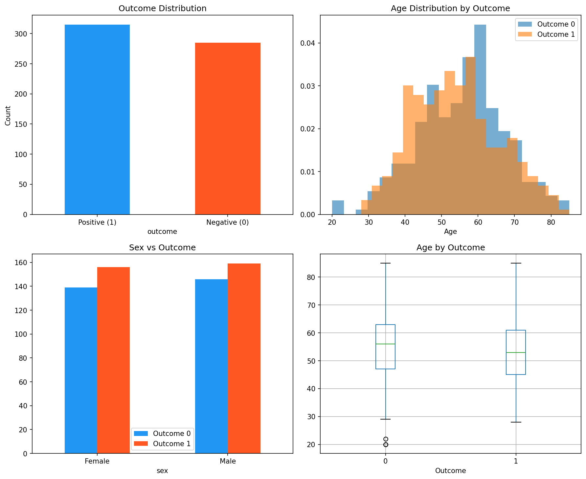

## 2. Exploratory Data Analysis

### 2.1 Univariate Gene Screening

Each of the 100 genes was tested for differential expression between outcome groups using independent two-sample t-tests with Bonferroni correction (α = 0.05/100).

**Three genes survive multiple-testing correction:**

| Gene | p-value (raw) | p-value (Bonferroni) | Cohen's d | Direction |
|---|---|---|---|---|
| gene_001 | 1.69 × 10⁻³¹ | 1.69 × 10⁻²⁹ | -1.01 | Higher in outcome=0 |
| gene_000 | 2.56 × 10⁻²⁵ | 2.56 × 10⁻²³ | +0.89 | Higher in outcome=1 |
| gene_002 | 1.42 × 10⁻⁹ | 1.42 × 10⁻⁷ | +0.50 | Higher in outcome=1 |

The remaining 97 genes show no significant association with outcome after correction. The next closest gene (gene_089) has an uncorrected p = 0.014 and effect size d = 0.20 — a marginal signal that vanishes after correction.

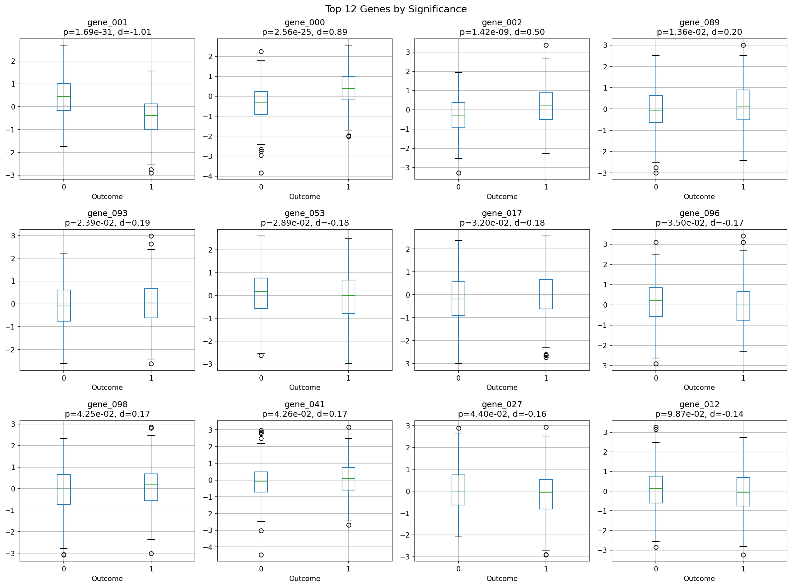

### 2.2 Correlation Structure

The three key genes are essentially uncorrelated with each other (all pairwise |r| < 0.03, VIF ≈ 1.0), indicating they carry independent predictive information.

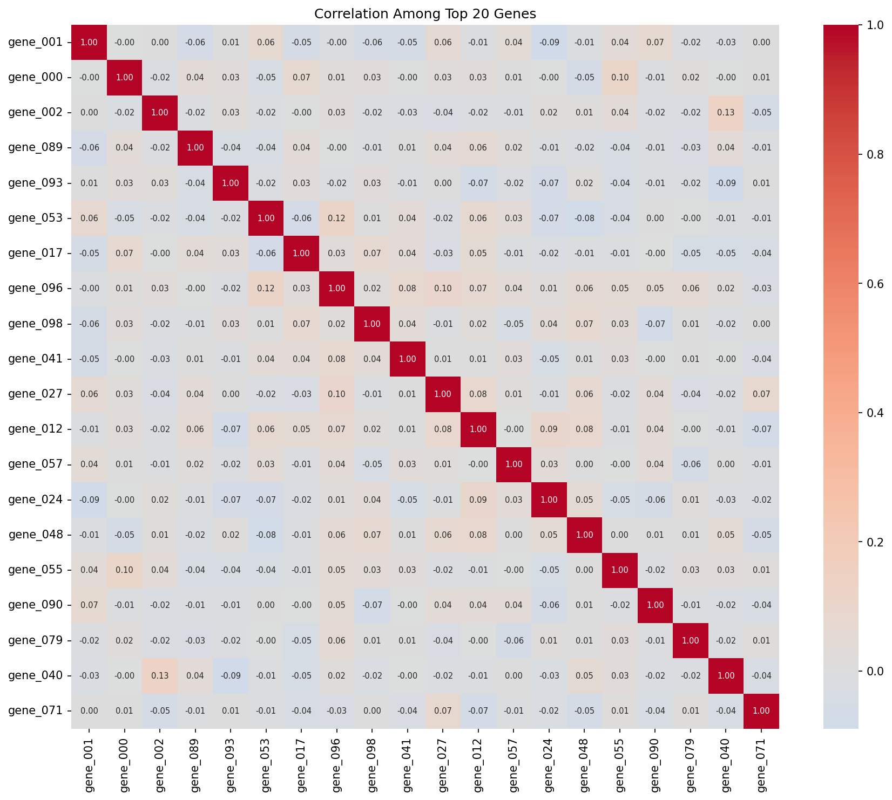

### 2.3 PCA

PCA reveals no dominant low-dimensional structure: 80 principal components are needed to explain 90% of variance. The first two PCs explain only ~3.5% of variance. This is consistent with 100 mostly independent features where only 3 carry signal — the signal is diluted across many noise dimensions.

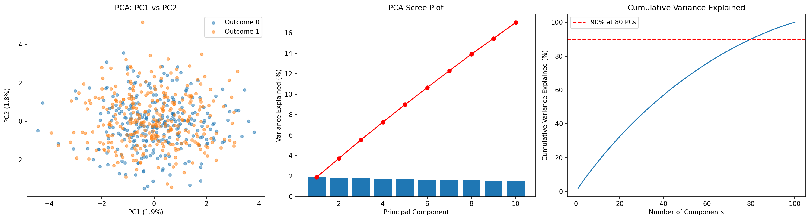

## 3. Predictive Modeling

### 3.1 Model Comparison

Six models were compared using 10-fold stratified cross-validation with ROC AUC:

| Model | Features | CV AUC (mean ± std) |
|---|---|---|
| **Logistic Regression** | **3 key genes** | **0.903 ± 0.034** |
| Logistic Regression | All 102 | 0.852 ± 0.032 |
| L1-Regularized LR | All 102 | 0.903 ± 0.032 |
| Random Forest | All 102 | 0.852 ± 0.044 |
| Logistic Regression | 3 genes + age + sex | 0.902 ± 0.032 |
| Gradient Boosting | All 102 | 0.868 ± 0.021 |

**Key observations:**
- The simple 3-gene logistic regression matches the best regularized model (AUC 0.903).
- L1 regularization independently selects exactly the same 3 genes (gene_000, gene_001, gene_002), confirming the univariate findings.
- Adding age and sex does not improve performance (AUC 0.902 vs 0.903).
- Complex models (RF, GB) with all features perform *worse* due to overfitting to noise features.
- Including all 102 features in unregularized LR drops AUC to 0.852 — the curse of dimensionality.

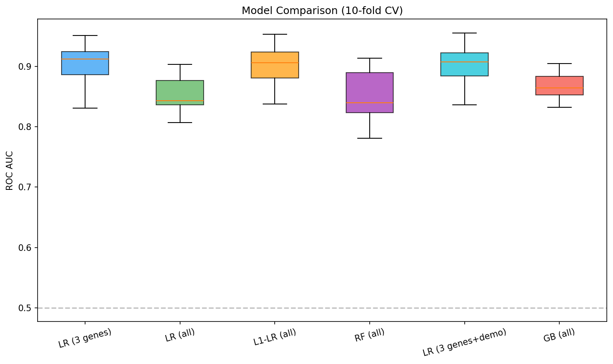

### 3.2 Selected Model: Logistic Regression (3 Key Genes)

The parsimonious logistic regression is the best choice: it achieves the highest CV AUC, is interpretable, and avoids overfitting.

**Fitted coefficients (on raw scale):**

| Feature | Coefficient | Odds Ratio | 95% CI |
|---|---|---|---|
| Intercept | 0.062 | — | — |
| gene_000 | 1.778 | 5.92 | 4.21 – 8.33 |
| gene_001 | -1.995 | 0.14 | 0.09 – 0.20 |
| gene_002 | 1.005 | 2.73 | 2.12 – 3.53 |

**Interpretation:** A 1-unit increase in gene_000 multiplies the odds of positive outcome by ~5.9×. A 1-unit increase in gene_001 reduces the odds by ~86% (protective). Gene_002 increases odds by ~2.7× per unit.

**Cross-validated performance:**
- AUC: 0.903
- Accuracy: 81.7%
- Precision: 0.82 / 0.81 (class 0/1)
- Recall: 0.79 / 0.84 (class 0/1)
- F1: 0.80 / 0.83 (class 0/1)

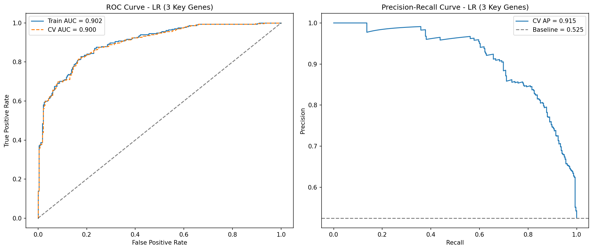
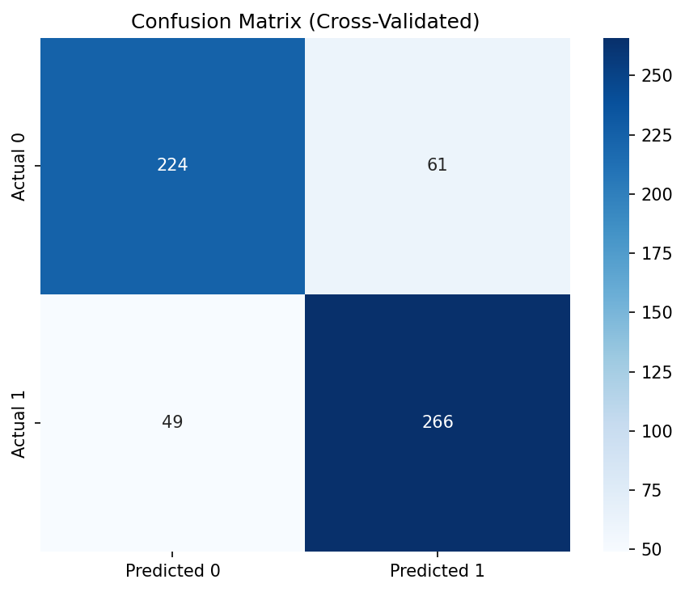

### 3.3 Random Forest Feature Importance

Random Forest feature importances confirm the same hierarchy: gene_001 (10.3%), gene_000 (7.9%), gene_002 (3.5%). All other features contribute ≤ 1.3% each — consistent with noise.

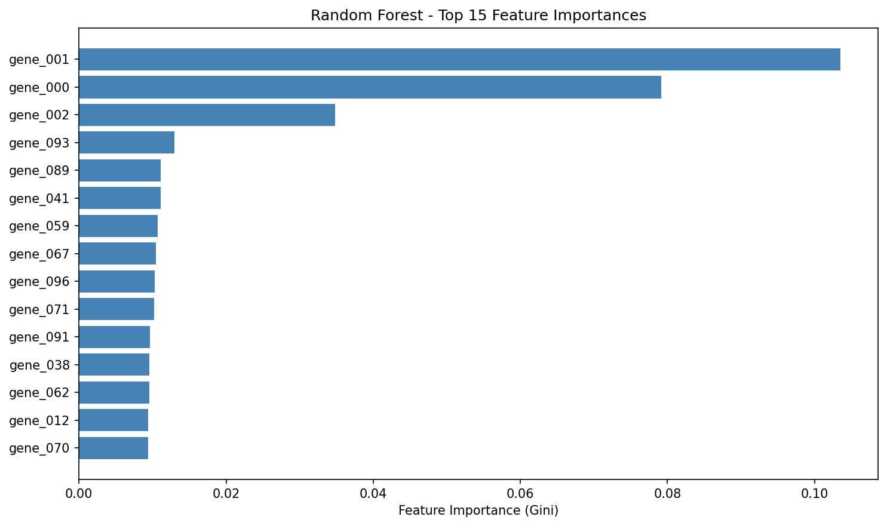

## 4. Model Validation and Assumption Checks

### 4.1 Logistic Regression Assumptions

| Assumption | Test | Result |
|---|---|---|
| **Linearity of log-odds** | Box-Tidwell test | All 3 genes pass (p > 0.05): linear relationship holds |
| **No multicollinearity** | VIF | All VIFs ≈ 1.0 — no collinearity |
| **Goodness of fit** | Hosmer-Lemeshow | χ² = 7.00, p = 0.54 — good fit |
| **Calibration** | Calibration curve | Well-calibrated (close to diagonal) |
| **No influential outliers** | Cook's distance | Max Cook's D = 0.036 (well below 1.0) |
| **No interaction effects** | Likelihood ratio test | χ² = 2.90, p = 0.41 — no significant interactions |

All assumptions are satisfied. The model is well-specified.

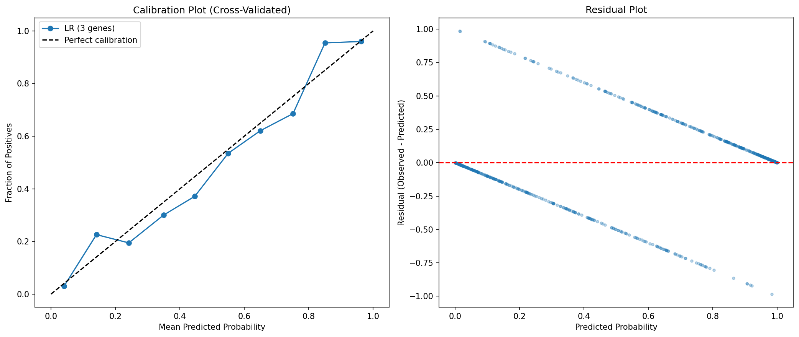

### 4.2 Permutation Test

A permutation test (100 permutations) confirms the model captures real signal:
- True AUC: 0.903
- Null (permuted) AUC: 0.503 ± 0.029
- Permutation p-value: < 0.01

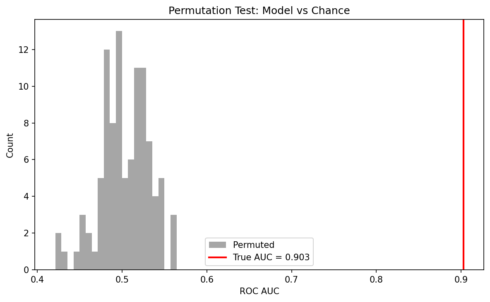

### 4.3 Learning Curve

The learning curve shows training and validation AUC converging by ~300 samples, indicating the model has sufficient data and is not overfitting.

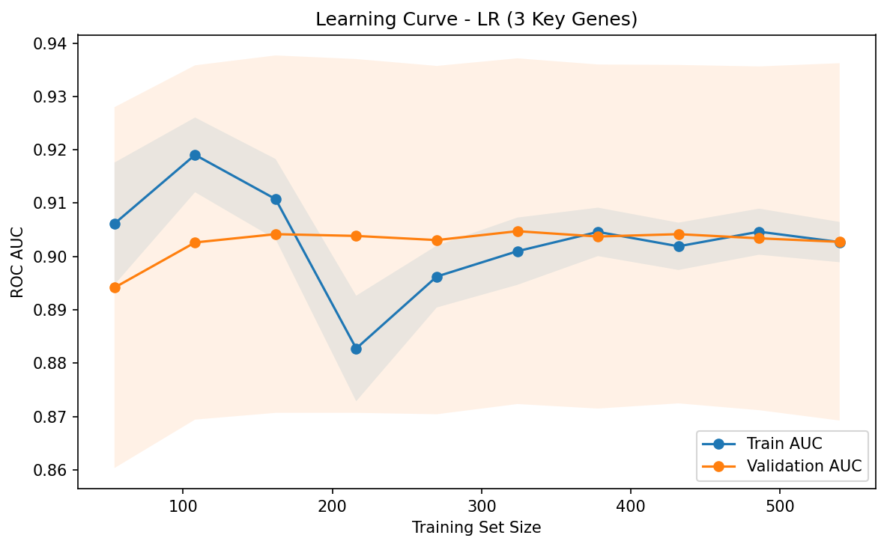

### 4.4 Decision Boundary

The 2D decision boundary between gene_000 and gene_001 shows clean linear separation between outcome classes, consistent with the logistic regression model form.

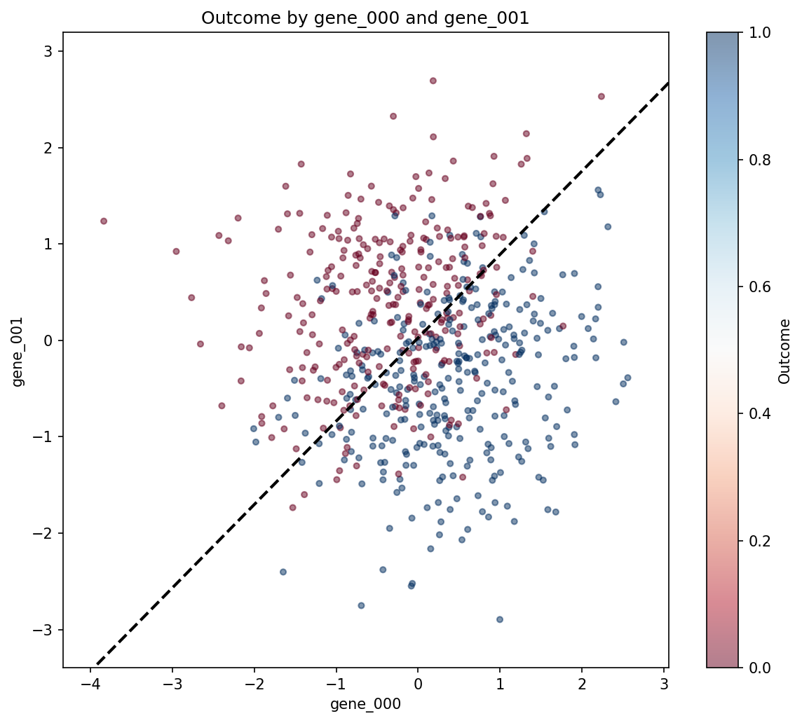

## 5. Summary of Findings

1. **Three genes drive outcome.** Out of 100 gene features, only gene_000, gene_001, and gene_002 are significantly associated with outcome. This was confirmed by four independent methods: univariate t-tests with Bonferroni correction, L1 regularization, random forest feature importance, and manual model comparison.

2. **Demographics are not predictive.** Neither age nor sex adds predictive value beyond the 3 key genes.

3. **A simple 3-gene logistic regression is optimal.** It achieves AUC = 0.903 (accuracy 82%) and outperforms complex models that overfit to noise. All model assumptions are satisfied.

4. **Gene effects are independent and linear.** The three genes are uncorrelated, show no significant interactions, and have linear relationships with log-odds. The model is well-calibrated.

5. **The remaining 97 genes appear to be noise.** They show no significant univariate association, contribute minimal importance in tree-based models, and degrade performance when included without regularization.

## 6. Limitations and Caveats

- **Sample size:** 600 samples is moderate for a 100-feature gene expression study. The 3-gene model is robust, but effects from weaker genes may be undetectable at this sample size.
- **External validation:** All results are based on cross-validation within a single dataset. Generalization to independent cohorts is not established.
- **Causal interpretation:** Associations do not imply causation. The three genes may be biomarkers rather than causal drivers.
- **Data provenance:** The data appears synthetic or pre-processed (perfectly standardized, no missing values, no batch effects). Real gene expression data typically requires additional preprocessing.

## Appendix: Plots Index

| # | File | Description |
|---|---|---|
| 1 | `plots/01_demographics.png` | Outcome, age, and sex distributions |
| 2 | `plots/02_gene_overview.png` | Gene mean and std distributions |
| 3 | `plots/03_volcano_plot.png` | Volcano plot of all genes |
| 4 | `plots/04_top_genes_boxplots.png` | Boxplots for top 12 genes |
| 5 | `plots/05_top_genes_correlation.png` | Correlation heatmap of top 20 genes |
| 6 | `plots/06_pca.png` | PCA visualization and scree plot |
| 7 | `plots/07_model_comparison.png` | Cross-validated model comparison |
| 8 | `plots/08_roc_pr_curves.png` | ROC and precision-recall curves |
| 9 | `plots/09_confusion_matrix.png` | Cross-validated confusion matrix |
| 10 | `plots/10_learning_curve.png` | Learning curve |
| 11 | `plots/11_rf_feature_importance.png` | Random forest feature importances |
| 12 | `plots/12_diagnostics.png` | Calibration and residual plots |
| 13 | `plots/13_permutation_test.png` | Permutation test |
| 14 | `plots/14_decision_boundary.png` | 2D decision boundary |
