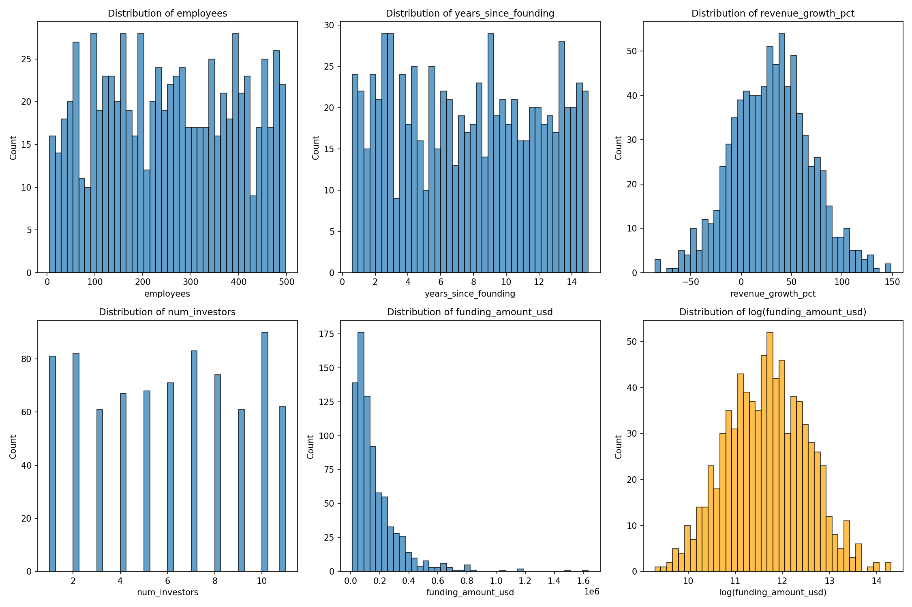
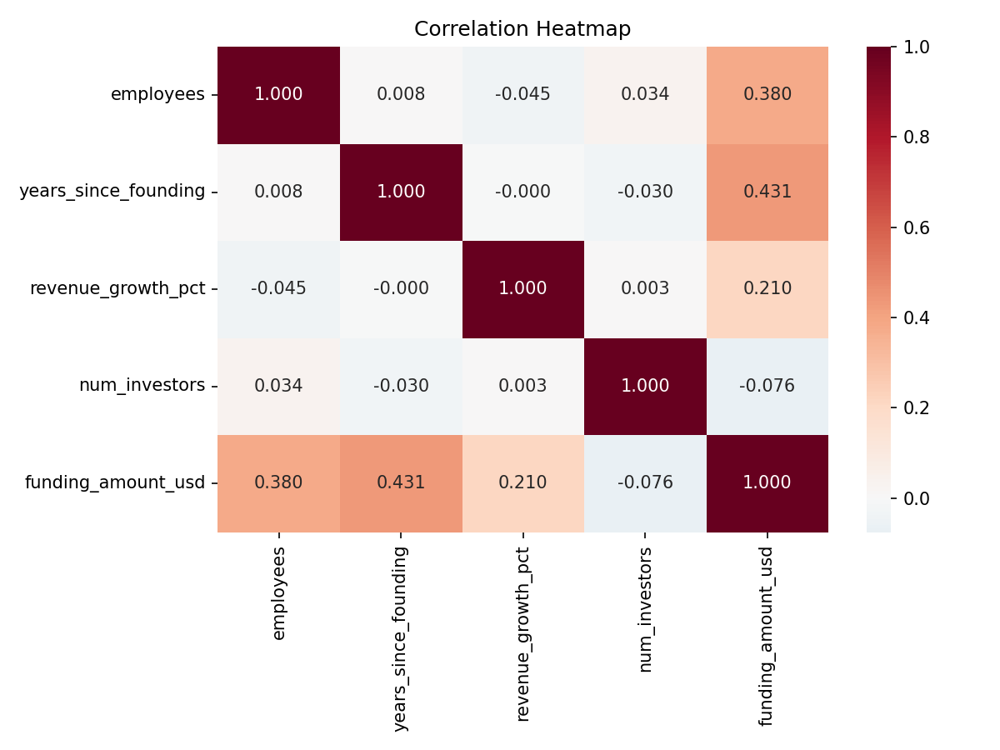
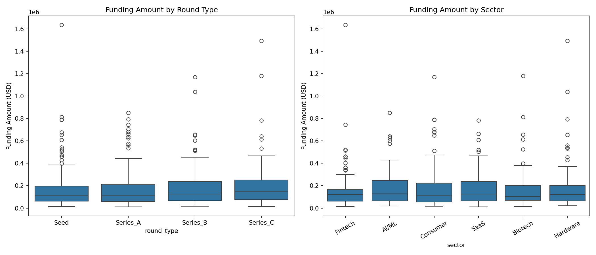
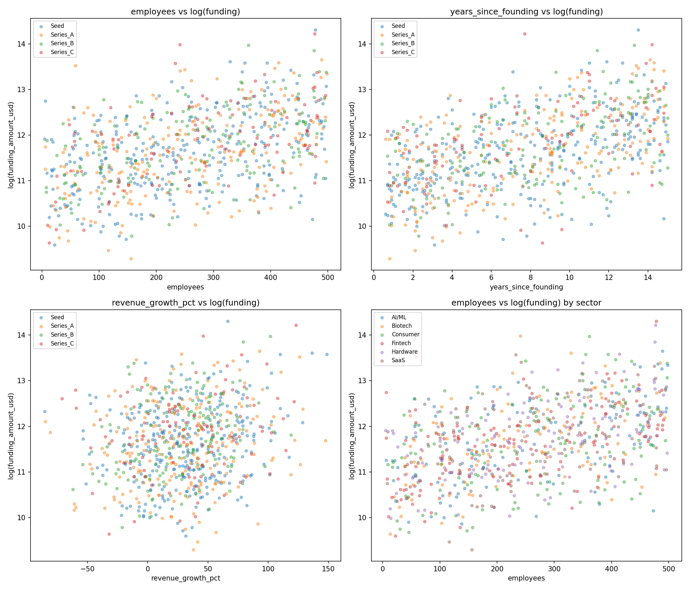
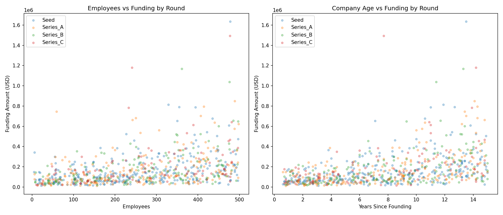
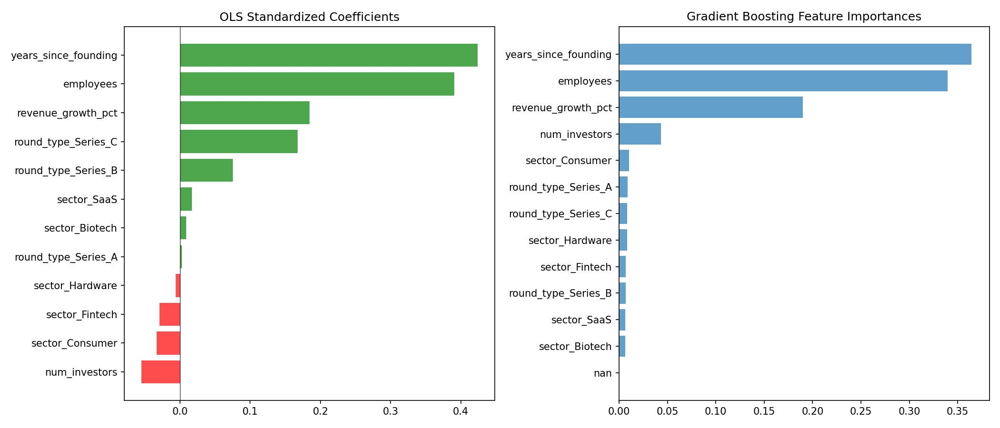
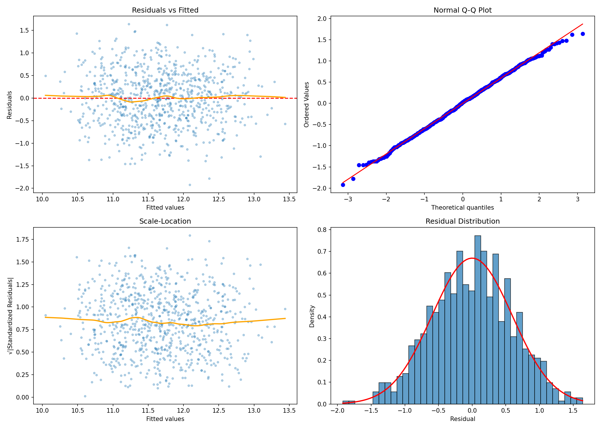
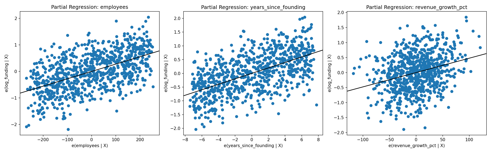
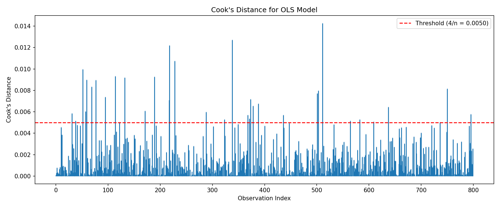

# Startup Funding Dataset: Analysis Report

## 1. Dataset Overview

| Property | Value |
|---|---|
| Observations | 800 |
| Features | 8 (3 categorical, 5 numeric) |
| Target variable | `funding_amount_usd` |
| Missing values | 0 |
| Duplicate rows | 0 |

**Features:**
- `company_id`: Unique identifier (CO-0000 to CO-0799)
- `sector`: Company sector (6 categories: AI/ML, Biotech, Consumer, Fintech, Hardware, SaaS)
- `round_type`: Funding round (4 categories: Seed, Series_A, Series_B, Series_C)
- `employees`: Company headcount (range: 5-498)
- `years_since_founding`: Company age in years (range: 0.6-15.0)
- `revenue_growth_pct`: Revenue growth percentage (range: -85.5% to 148.6%)
- `num_investors`: Number of investors in the round (range: 1-11)
- `funding_amount_usd`: Funding received in USD (range: $10,846 - $1,633,984)

**Sector distribution:** Roughly balanced (124-143 per sector).
**Round distribution:** Skewed toward early stage — Seed (324), Series_A (219), Series_B (155), Series_C (102).

## 2. Data Quality Assessment

The dataset is clean with no missing values or duplicates. However, several features show distributional characteristics consistent with synthetic data generation:

- **`employees`** and **`years_since_founding`**: Nearly perfectly uniform distributions (KS test p=0.33 and p=0.38 respectively; skewness ~0.01). Real-world company sizes and ages would exhibit right skew.
- **`revenue_growth_pct`**: Near-perfectly normal (KS test p=0.999, skewness=0.03).
- **`num_investors`**: Appears discrete-uniform with range [1, 11].
- **`funding_amount_usd`**: Heavily right-skewed (skewness=3.23, kurtosis=17.0), with 42 outliers by IQR method. However, it becomes well-behaved after log-transformation (Shapiro-Wilk p=0.15).

**Conclusion:** This dataset is very likely synthetically generated. The input features are drawn from uniform/normal distributions, and funding follows a log-normal distribution conditional on the features. This does not invalidate analysis but should inform interpretation.

## 3. Exploratory Data Analysis

### 3.1 Univariate Distributions

Key observations:
- Numeric predictors are uniformly or normally distributed (see Data Quality section).
- `funding_amount_usd` is extremely right-skewed with a long tail. The log-transformed version is approximately normal, making it the appropriate modeling target.

### 3.2 Correlations

| Feature | Correlation with `funding_amount_usd` |
|---|---|
| `years_since_founding` | 0.431 |
| `employees` | 0.380 |
| `revenue_growth_pct` | 0.210 |
| `num_investors` | -0.076 |

The three strongest predictors of funding are company age, headcount, and revenue growth. Importantly, the predictors are essentially uncorrelated with each other (all pairwise |r| < 0.05), indicating independent effects with no multicollinearity (confirmed by VIF values all ~1.0).

### 3.3 Categorical Effects

- **Sector has no significant effect on funding** (one-way ANOVA: F=0.38, p=0.864). All sectors show similar funding distributions.
- **Round type shows a marginal effect** (ANOVA: F=2.88, p=0.035). Later rounds (Series_C) receive modestly higher funding, but the effect is weak after controlling for other variables.

### 3.4 Scatter Relationships

The scatter plots reveal positive, approximately linear relationships between log(funding) and each of the three key predictors. There is substantial residual scatter, indicating that about half the variance in funding is not explained by these features alone.

## 4. Modeling

### 4.1 Model Choice Rationale

Given:
- Log-normal distribution of the target variable
- Linear relationships observed in scatter plots
- Independent, uncorrelated predictors

The natural starting point is **OLS regression on log(funding_amount_usd)**. Tree-based models were tested as alternatives for potential nonlinear effects.

### 4.2 OLS Regression Results

**Model:** log(funding) ~ employees + years_since_founding + revenue_growth_pct + num_investors + sector + round_type

| Metric | Value |
|---|---|
| R-squared | 0.513 |
| Adjusted R-squared | 0.505 |
| F-statistic | 68.99 (p < 2.2e-16) |

**Significant coefficients (p < 0.05):**

| Predictor | Coefficient | Std Error | t-statistic | p-value | Interpretation |
|---|---|---|---|---|---|
| `employees` | 0.0028 | 0.0002 | 18.27 | <0.001 | Each additional employee associated with +0.28% funding |
| `years_since_founding` | 0.0993 | 0.005 | 19.92 | <0.001 | Each additional year associated with +10.4% funding |
| `revenue_growth_pct` | 0.0048 | 0.001 | 8.64 | <0.001 | Each 1pp growth associated with +0.48% funding |
| `num_investors` | -0.0173 | 0.007 | -2.59 | 0.010 | Each additional investor associated with -1.7% funding |
| `round_type_Series_C` | 0.1675 | 0.069 | 2.44 | 0.015 | Series C rounds receive ~18% more than Seed |

**Non-significant predictors:** All sector dummies (p > 0.6) and Series_A/Series_B round dummies (p > 0.2).

**Standardized coefficient ranking:** `years_since_founding` (0.465) > `employees` (0.427) > `revenue_growth_pct` (0.202) > `num_investors` (-0.065).

### 4.3 Cross-Validated Model Comparison

| Model | CV R-squared | RMSE | MAE |
|---|---|---|---|
| **Linear Regression** | **0.488 +/- 0.044** | **0.608 +/- 0.014** | **0.492 +/- 0.014** |
| Random Forest | 0.412 +/- 0.046 | 0.651 +/- 0.010 | 0.523 +/- 0.014 |
| Gradient Boosting | 0.324 +/- 0.056 | 0.698 +/- 0.006 | 0.565 +/- 0.011 |

Linear regression outperforms both tree-based models. This confirms that the underlying relationship is genuinely linear — there are no nonlinear patterns for the ensemble methods to exploit.

**Interaction and polynomial tests:**
- Adding pairwise interaction terms: R-squared increased from 0.513 to 0.514 (negligible). All interaction terms non-significant (p > 0.16).
- Polynomial features (degree 2, 3): Cross-validated R-squared *decreased* (0.491, 0.465), confirming overfitting with additional complexity.

### 4.4 Feature Importance

Both OLS standardized coefficients and Gradient Boosting feature importances agree on the ranking: **years_since_founding > employees > revenue_growth_pct >> everything else**.

## 5. Model Diagnostics

### 5.1 Residual Normality
- **Shapiro-Wilk test:** W=0.999, p=0.982. Residuals are very well-approximated by a normal distribution.
- **Q-Q plot:** Points fall tightly along the diagonal with no systematic departures.

### 5.2 Homoscedasticity
- **Breusch-Pagan test:** p=0.024 (marginally significant). There is mild heteroscedasticity.
- **Residuals vs fitted plot:** Shows no dramatic fanning pattern, but variance is slightly larger for higher fitted values.
- In practice, this is mild enough that OLS standard errors remain reasonable. Robust standard errors (HC3) could be used for stricter inference.

### 5.3 Independence
- **Durbin-Watson:** 1.974 (ideal ~2.0). No autocorrelation.
- **Lag-1 autocorrelation of residuals:** 0.012 (effectively zero).

### 5.4 Multicollinearity
- All numeric predictor VIFs ~1.0. No multicollinearity concerns.

### 5.5 Influential Observations
- 35 observations exceed Cook's distance threshold (4/n = 0.005).
- High-funding outliers tend to have more employees (mean 387 vs 255), older age (12.1 vs 7.7 years), and higher revenue growth (56.8% vs 30.2%).
- These are not erroneous — they are companies with strong fundamentals that received commensurately high funding. No reason to exclude them.

## 6. Key Findings

1. **Funding follows a log-linear model.** Approximately 51% of the variance in log(funding) is explained by three continuous predictors: company age, headcount, and revenue growth rate. The relationship is purely additive (no interaction effects) and linear (no polynomial improvement).

2. **Company maturity is the strongest predictor.** Each additional year since founding is associated with ~10% higher funding. Each additional employee is associated with ~0.3% higher funding. These are the two dominant factors.

3. **Revenue growth matters, but less than size/age.** Each percentage point of revenue growth contributes ~0.5% additional funding. This is statistically significant but weaker than structural factors.

4. **More investors paradoxically predicts slightly lower funding** (each additional investor = -1.7% funding, p=0.01). This may reflect syndication dynamics: larger investor syndicates may occur in more uncertain deals where no single investor wants full exposure.

5. **Sector is irrelevant.** There is no statistically significant difference in funding across the six sectors (AI/ML, Biotech, Consumer, Fintech, Hardware, SaaS). ANOVA p=0.864.

6. **Round type has a weak effect.** Only Series C shows a significant premium (~18%) over Seed rounds after controlling for other variables. The difference between Seed, Series A, and Series B is not significant — company fundamentals matter more than the round label.

7. **About 49% of funding variance is unexplained.** The residual scatter is normally distributed with no discernible structure, suggesting the unexplained variance represents genuine randomness (negotiation outcomes, market timing, etc.) rather than missing systematic predictors.

## 7. Limitations and Caveats

- **Likely synthetic data.** The uniform/normal feature distributions and clean structure suggest this dataset was generated programmatically. Results describe the data-generating process rather than real-world startup dynamics.
- **No causal claims.** All relationships are correlational. Hiring more employees does not *cause* higher funding — both may be driven by unmeasured factors.
- **Mild heteroscedasticity.** Standard errors may be slightly underestimated for the highest-funded companies. Robust standard errors are recommended for formal inference.
- **Cross-sectional only.** The dataset captures a single snapshot. Longitudinal dynamics (growth trajectories, sequential rounds) cannot be assessed.

## 8. Plot Index

| File | Description |
|---|---|
| `plots/01_distributions.png` | Distributions of all numeric variables + log-transformed funding |
| `plots/02_correlation_heatmap.png` | Correlation matrix heatmap |
| `plots/03_scatter_relationships.png` | Scatter plots of key predictors vs log(funding) |
| `plots/04_boxplots_categorical.png` | Funding distributions by sector and round type |
| `plots/05_interactions.png` | Funding vs predictors colored by round type |
| `plots/06_diagnostic_plots.png` | OLS diagnostic plots (residuals, Q-Q, scale-location) |
| `plots/07_feature_importance.png` | Standardized coefficients and GB feature importances |
| `plots/08_partial_regression.png` | Partial regression plots for top 3 predictors |
| `plots/09_cooks_distance.png` | Cook's distance for influential observation detection |
