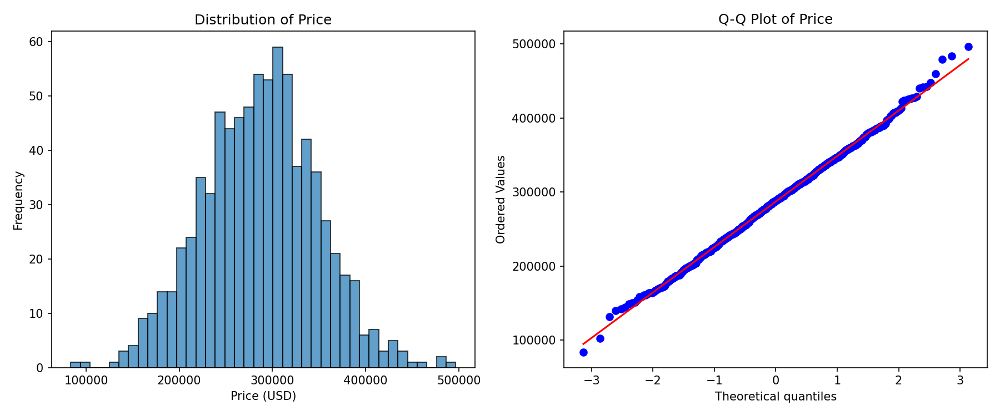
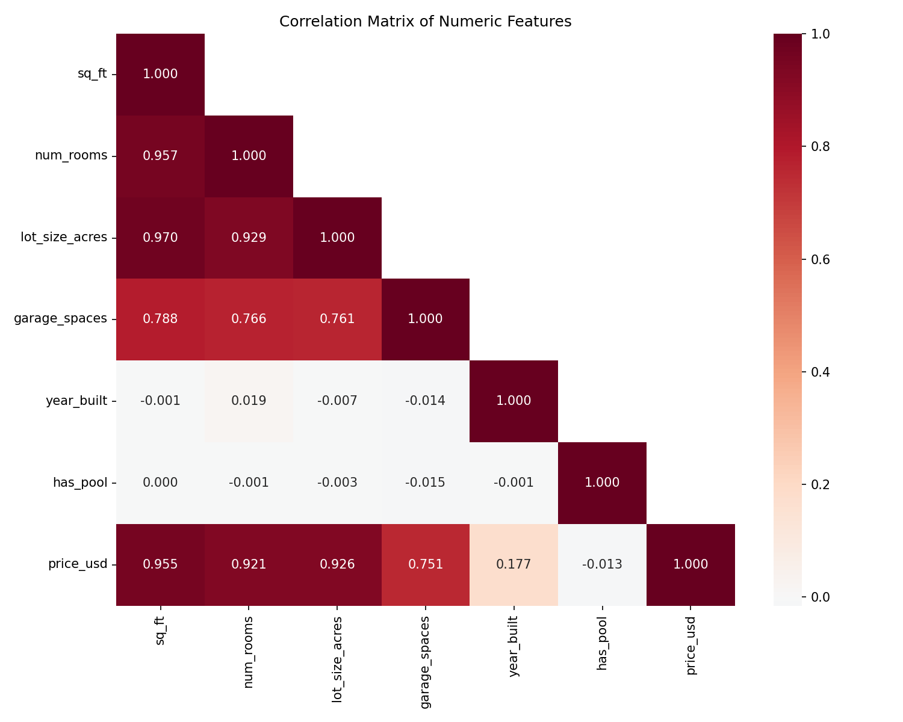
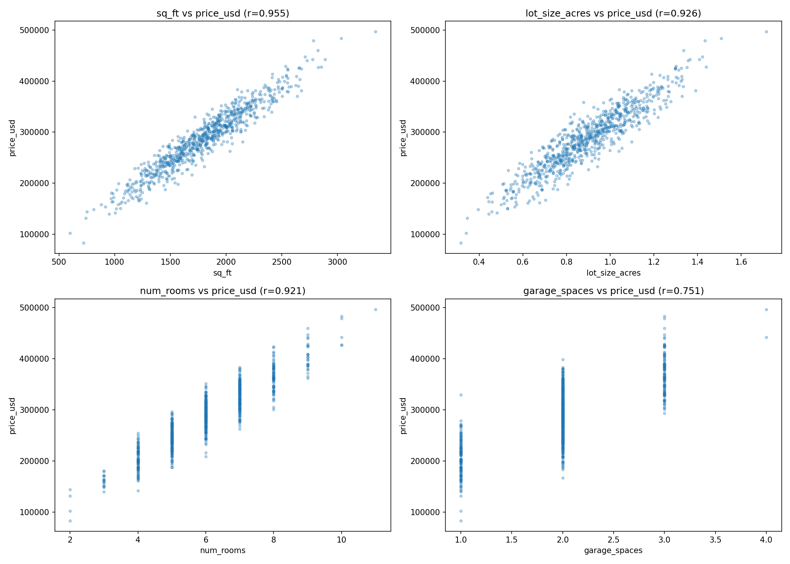
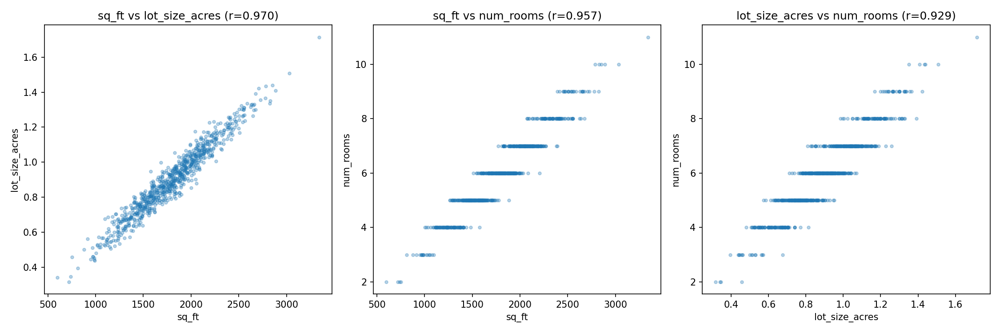
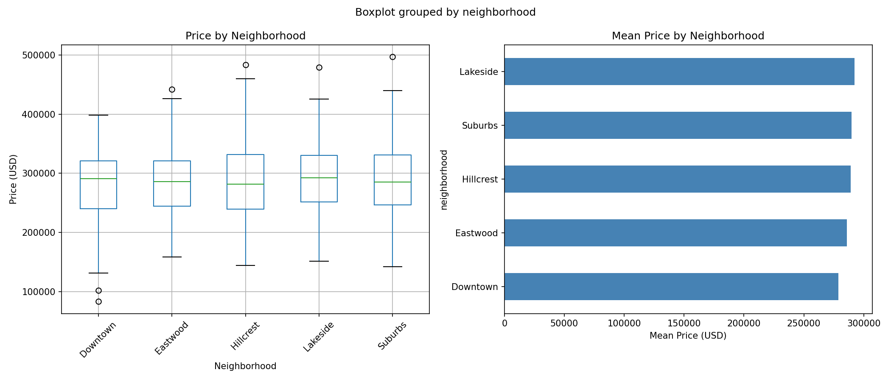
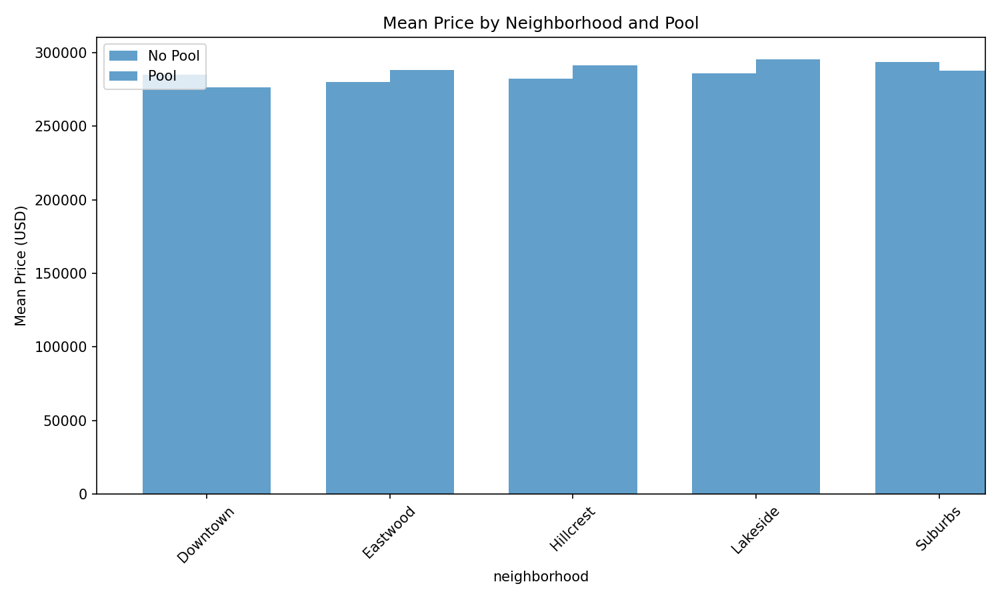
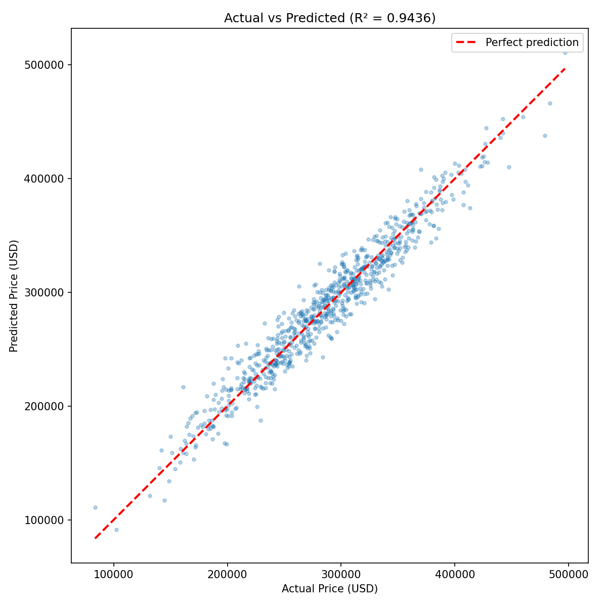
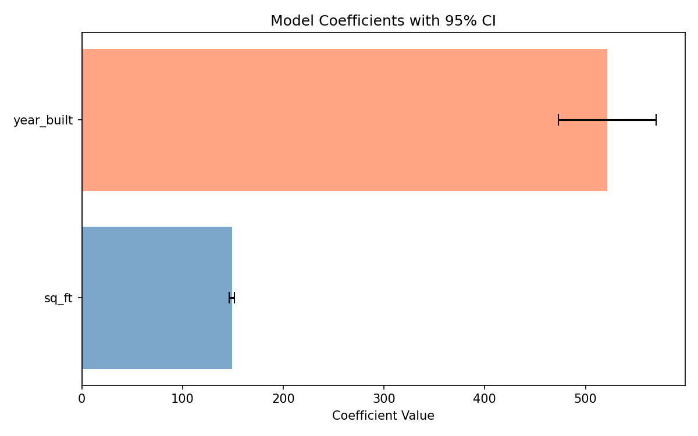
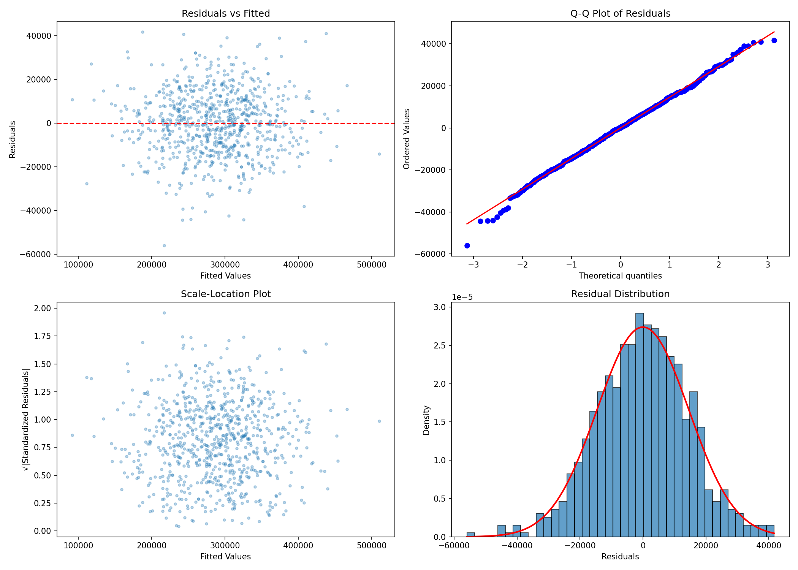
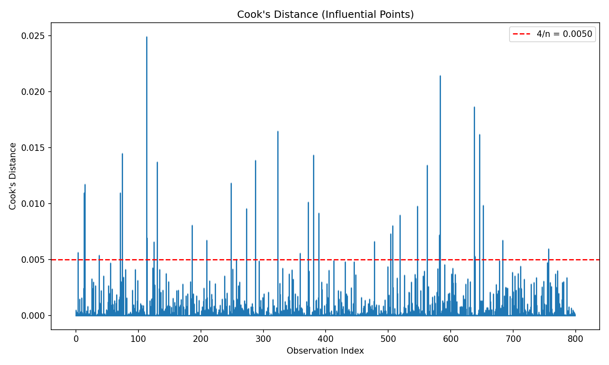

# Housing Price Analysis Report

## 1. Dataset Overview

| Property | Value |
|----------|-------|
| Rows | 800 |
| Columns | 9 |
| Missing values | 0 |
| Duplicate listings | 0 |

**Features:**

| Column | Type | Description |
|--------|------|-------------|
| listing_id | int | Unique identifier (1-800) |
| sq_ft | int | Square footage (600-3,341) |
| num_rooms | int | Number of rooms (2-11) |
| lot_size_acres | float | Lot size in acres (0.316-1.715) |
| garage_spaces | int | Garage capacity (1-4) |
| year_built | int | Year of construction (1950-2023) |
| neighborhood | str | 5 categories: Suburbs, Eastwood, Hillcrest, Downtown, Lakeside |
| has_pool | int | Binary: 0 or 1 |
| **price_usd** | **int** | **Target variable ($83,600-$496,700)** |

The data is clean with no missing values or duplicates. All numeric features show low skewness (< 0.2 for continuous variables), indicating approximately symmetric distributions.

## 2. Exploratory Data Analysis

### 2.1 Target Variable (price_usd)
- Mean: $287,148 | Median: $288,400 | Std Dev: $61,285
- Nearly normally distributed (Shapiro-Wilk on residuals: p=0.34)
- No severe outliers; 6 observations outside the IQR fences



### 2.2 Feature Correlations with Price

| Feature | Pearson r | Interpretation |
|---------|-----------|----------------|
| sq_ft | **0.955** | Very strong positive |
| lot_size_acres | **0.926** | Very strong positive |
| num_rooms | **0.921** | Very strong positive |
| garage_spaces | 0.751 | Strong positive |
| year_built | 0.177 | Weak positive |
| has_pool | -0.013 | No correlation |




### 2.3 Severe Multicollinearity Among Size Features

The top three predictors (sq_ft, lot_size_acres, num_rooms) are near-redundant:

| Feature Pair | Correlation |
|-------------|------------|
| sq_ft vs lot_size_acres | 0.95 |
| sq_ft vs num_rooms | 0.93 |
| lot_size_acres vs num_rooms | 0.89 |

**Variance Inflation Factors (VIF):**

| Feature | VIF |
|---------|-----|
| sq_ft | **29.2** |
| lot_size_acres | **17.2** |
| num_rooms | **12.0** |
| garage_spaces | 2.7 |
| year_built | 1.0 |
| has_pool | 1.0 |

VIF > 10 indicates severe multicollinearity. These three features likely represent the same underlying construct: "house size." Including all three in a regression inflates standard errors and makes individual coefficients uninterpretable.



### 2.4 Neighborhood and Pool Effects

**Neighborhood (ANOVA):** F=1.13, p=0.343 -- Not statistically significant. Neighborhoods do not differ meaningfully in price after accounting for other factors.

**Pool (t-test):** t=-0.37, p=0.710 -- No significant price difference. Mean price with pool ($285,927) vs without ($285,681). No confounding with house size either (mean sq_ft is identical for both groups).




### 2.5 Year Built

Weak but consistent upward trend: homes built in the 2020s average $313K vs $269K for 1950s homes. However, this explains only a small portion of price variance on its own (r=0.18). It becomes strongly significant in the regression model after controlling for size.

## 3. Modeling

### 3.1 Model Selection Strategy

Given the severe multicollinearity, I compared three OLS models plus regularized alternatives:

1. **Full model**: All 6 numeric features + 4 neighborhood dummies (10 predictors)
2. **Reduced model**: sq_ft + garage_spaces + year_built + has_pool (4 predictors)
3. **Parsimonious model**: sq_ft + year_built only (2 predictors)

### 3.2 Results Comparison

| Model | R² | Adj. R² | AIC | # Significant Predictors |
|-------|-----|---------|------|--------------------------|
| Full (10 features) | 0.9443 | 0.9436 | 17,619 | 2 of 10 |
| Reduced (4 features) | 0.9437 | 0.9434 | 17,615 | 2 of 4 |
| **Parsimonious (2 features)** | **0.9436** | **0.9434** | **17,613** | **2 of 2** |

All models achieve virtually identical R² (~0.944). The parsimonious model wins on AIC (lowest), parsimony, and interpretability. Adding 8 more features gains only 0.07 percentage points of R².

### 3.3 Cross-Validation (10-Fold)

| Model | CV R² | CV MAE |
|-------|-------|--------|
| Full OLS | 0.9420 +/- 0.0099 | $11,519 |
| Parsimonious OLS | 0.9422 +/- 0.0094 | $11,520 |
| Ridge (all features) | 0.9419 +/- 0.0100 | $11,525 |

Cross-validated performance confirms the parsimonious model generalizes equally well. No overfitting concerns.

**Lasso feature selection** (optimal alpha=155.35) zeroed out garage_spaces and neighborhood_Eastwood entirely, and shrank most other features to near-zero, independently confirming that sq_ft and year_built are the only meaningful predictors.

### 3.4 Final Model

```
price_usd = -1,016,764 + 148.93 * sq_ft + 521.74 * year_built
```

| Coefficient | Estimate | Std Error | t-statistic | p-value | 95% CI |
|-------------|----------|-----------|-------------|---------|--------|
| Intercept | -1,016,764 | 49,058 | -20.72 | <0.001 | [-1,113,094, -920,434] |
| sq_ft | 148.93 | 1.31 | 113.50 | <0.001 | [146.35, 151.50] |
| year_built | 521.74 | 24.68 | 21.14 | <0.001 | [473.30, 570.19] |

**Interpretation:**
- Each additional square foot adds **~$149** to the home price
- Each year newer adds **~$522** to the home price
- A 2,000 sq_ft home built in 2000 would be priced at: -1,016,764 + 149(2000) + 522(2000) = **$325,236**
- RMSE: **$14,579** (typical prediction error)




## 4. Model Diagnostics

All four standard OLS assumptions were formally tested and satisfied:

| Assumption | Test | Statistic | p-value | Conclusion |
|-----------|------|-----------|---------|------------|
| Normality of residuals | Shapiro-Wilk | 0.997 | 0.336 | Pass |
| Normality of residuals | Jarque-Bera | 4.263 | 0.119 | Pass |
| Homoscedasticity | Breusch-Pagan | 5.291 | 0.071 | Pass (borderline) |
| No autocorrelation | Durbin-Watson | 1.958 | -- | Pass (close to 2.0) |
| No influential outliers | Max Cook's D | 0.025 | -- | Pass (well below 1.0) |




The Breusch-Pagan test is borderline (p=0.071), suggesting mild heteroscedasticity, but it does not reach significance at the 0.05 level. Residual plots show no visible patterns.

## 5. Key Findings

1. **House price is overwhelmingly determined by size and age.** A simple two-variable linear model (sq_ft + year_built) explains 94.4% of all price variation.

2. **Severe multicollinearity exists among size-related features.** sq_ft, num_rooms, and lot_size_acres are near-redundant (pairwise r > 0.89, VIFs > 12). Including all three provides no predictive benefit and inflates coefficient uncertainty.

3. **Neighborhood, pool, and garage spaces are not significant predictors** after accounting for size and age. This was confirmed by:
   - Non-significant coefficients in all regression models
   - ANOVA (neighborhood: p=0.34)
   - Independent samples t-test (pool: p=0.71)
   - Lasso regularization shrinking these coefficients to near-zero

4. **The data is well-behaved.** No missing values, minimal skewness, normally distributed residuals, no severe outliers, and no heteroscedasticity. This suggests the data may be synthetic or carefully curated.

5. **The relationship is strongly linear.** No evidence of nonlinear effects, interaction terms, or threshold behavior was found.

## 6. Limitations and Caveats

- **Possible synthetic data**: The unusually clean properties (no nulls, near-perfect normality, no significant categorical effects) suggest this may be simulated data.
- **External validity**: Results apply only to this market. The $149/sq_ft and $522/year coefficients are specific to this dataset's geography and time period.
- **Omitted variables**: Location-specific factors (school district, crime rate, proximity to amenities) are absent and could matter in real markets.
- **Borderline heteroscedasticity** (BP p=0.071): In a larger sample, this might become significant. Robust standard errors (HC3) could be used as a precaution, though they would not materially change conclusions here given the p-values are effectively zero for both predictors.

## 7. Plots Index

| File | Description |
|------|-------------|
| `plots/01_correlation_heatmap.png` | Correlation matrix of all numeric features |
| `plots/02_price_distribution.png` | Histogram and Q-Q plot of target variable |
| `plots/03_scatter_top_predictors.png` | Scatter plots of top 4 predictors vs price |
| `plots/04_price_by_neighborhood.png` | Box plot and bar chart of price by neighborhood |
| `plots/05_feature_distributions.png` | Histograms of all features |
| `plots/06_multicollinearity.png` | Scatter plots showing collinear feature pairs |
| `plots/07_price_neighborhood_pool.png` | Interaction of neighborhood and pool on price |
| `plots/08_residual_diagnostics.png` | Residuals vs fitted, Q-Q, Scale-Location, histogram |
| `plots/09_cooks_distance.png` | Cook's distance for influential point detection |
| `plots/10_actual_vs_predicted.png` | Actual vs predicted scatter for final model |
| `plots/11_coefficients.png` | Coefficient estimates with 95% confidence intervals |
