# Rental Listing Dataset Analysis Report

## 1. Dataset Overview

| Property | Value |
|---|---|
| Rows | 1,200 |
| Columns | 9 |
| Missing Values | 0 |
| Duplicate Rows | 0 |
| Target Variable | `monthly_rent_usd` |

**Features:**
- **Continuous:** `sq_ft` (200-4031), `distance_to_center_km` (0.5-40.7), `year_built` (1920-2023)
- **Discrete:** `bedrooms` (0-4), `bathrooms` (1-3)
- **Binary:** `has_parking` (0/1), `pet_friendly` (0/1)
- **ID:** `listing_id` (dropped for analysis)

The data is clean: no missing values, no duplicate records, and all columns have plausible data types. No encoding issues or impossible values were detected.

## 2. Exploratory Data Analysis

### 2.1 Target Distribution

Monthly rent ranges from $347 to $4,769 with a mean of $1,737 and median of $1,516 (right-skewed, skewness = 0.82). This skew is typical for rental data where a smaller number of large luxury units pull the tail.

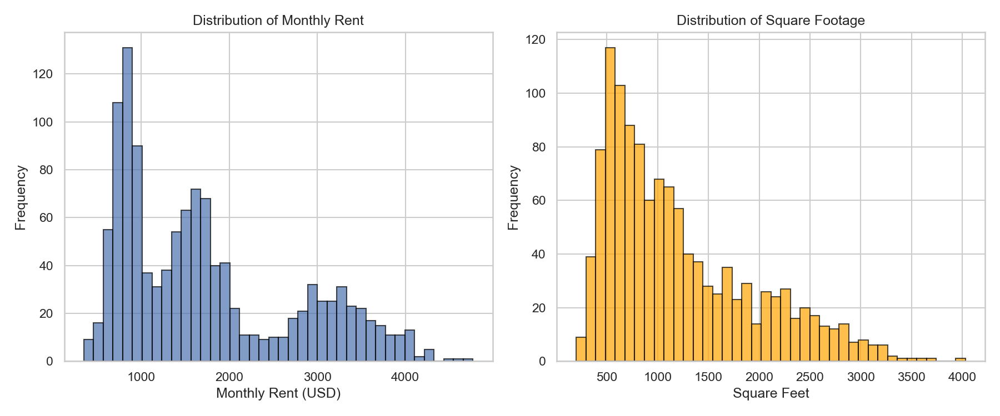

### 2.2 Correlation Structure

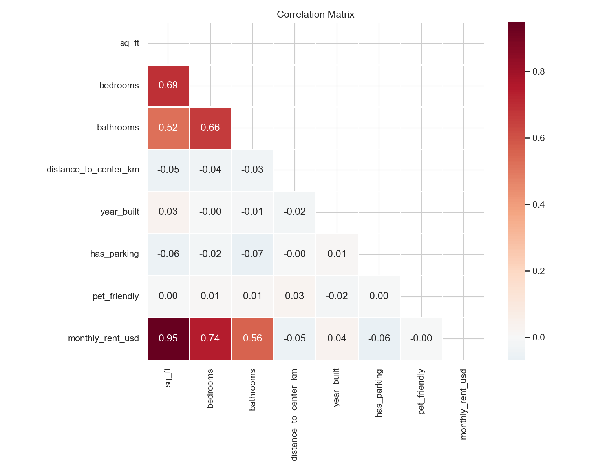

The correlation matrix reveals a clear hierarchy of feature importance:

| Feature | Correlation with Rent |
|---|---|
| `sq_ft` | **0.947** |
| `bedrooms` | 0.738 |
| `bathrooms` | 0.556 |
| `year_built` | 0.036 |
| `distance_to_center_km` | -0.049 |
| `has_parking` | -0.064 |
| `pet_friendly` | -0.001 |

**Key finding:** Square footage dominates rent determination. The 0.947 correlation is extremely strong. `bedrooms` and `bathrooms` are also correlated with rent, but are themselves highly correlated with `sq_ft` (0.693 and 0.521 respectively), so much of their apparent effect is mediated through unit size.

`distance_to_center_km`, `year_built`, `has_parking`, and `pet_friendly` have negligible linear correlations with rent (all |r| < 0.07).

### 2.3 Feature Relationships

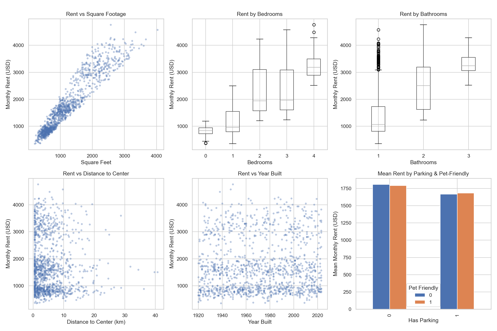

- **sq_ft vs rent:** Nearly linear, tight relationship. The dominant pricing signal.
- **Bedrooms:** Rent increases with bedroom count, but this largely reflects that more bedrooms = more sq_ft.
- **Distance to center:** No visible rent gradient by distance — surprising for real estate data, suggesting this market prices primarily on unit size, not location.
- **Year built:** No discernible trend.
- **Parking & pet-friendly:** No meaningful rent difference.

### 2.4 Price Per Square Foot

The price per square foot is remarkably stable (mean $1.48/sqft, std $0.28), confirming that **rent is almost entirely determined by unit size**. The price-per-sqft shows no relationship with distance to center, further confirming location is not a pricing factor in this dataset.

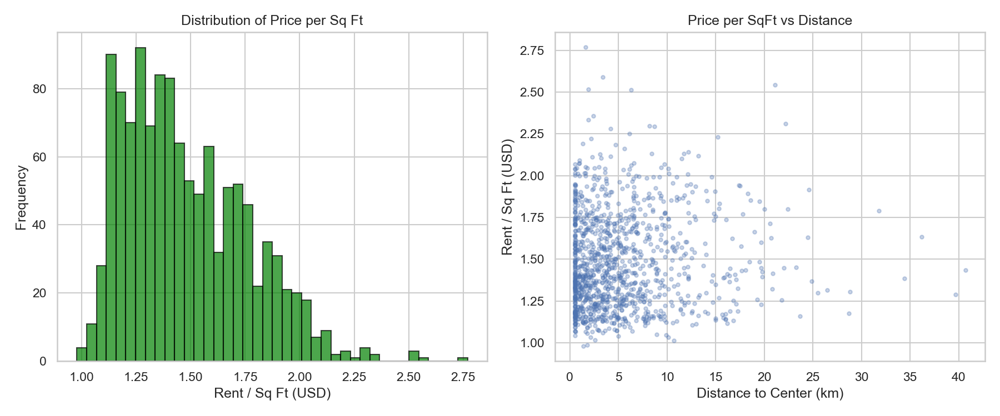

### 2.5 All Distributions

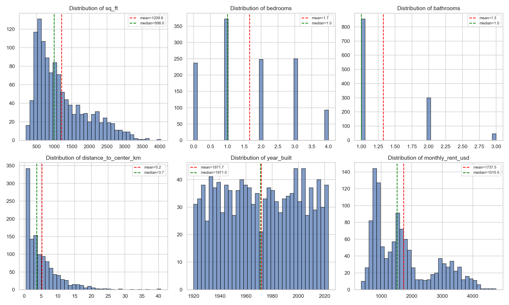

- `sq_ft`: Right-skewed (skewness = 1.0), 13 IQR outliers on the upper end
- `distance_to_center_km`: Heavily right-skewed (skewness = 2.1), 63 IQR outliers
- `year_built`: Approximately symmetric, spanning a century of construction

## 3. Modeling

### 3.1 Ordinary Least Squares (OLS)

The baseline linear regression yields:

| Metric | Value |
|---|---|
| R-squared | 0.910 |
| Adj. R-squared | 0.910 |
| F-statistic | 1,730 (p < 0.001) |

**Significant predictors (p < 0.05):**
| Predictor | Coefficient | Interpretation |
|---|---|---|
| `sq_ft` | +$1.14/sqft | Each additional sq ft adds ~$1.14 to rent |
| `bedrooms` | +$114.86/bedroom | Each additional bedroom adds ~$115 (controlling for sq_ft) |
| `bathrooms` | +$51.28/bathroom | Each additional bathroom adds ~$51 (controlling for sq_ft) |

**Non-significant predictors (p > 0.05):** `distance_to_center_km` (p=0.90), `year_built` (p=0.22), `has_parking` (p=0.12), `pet_friendly` (p=0.78). None of these contribute meaningfully to rent prediction.

**Multicollinearity check (VIF):** All VIF values are below 2.6, indicating no problematic multicollinearity. The high condition number (155,000) is due to the `year_built` feature scale, not structural multicollinearity.

### 3.2 OLS Diagnostic Checks

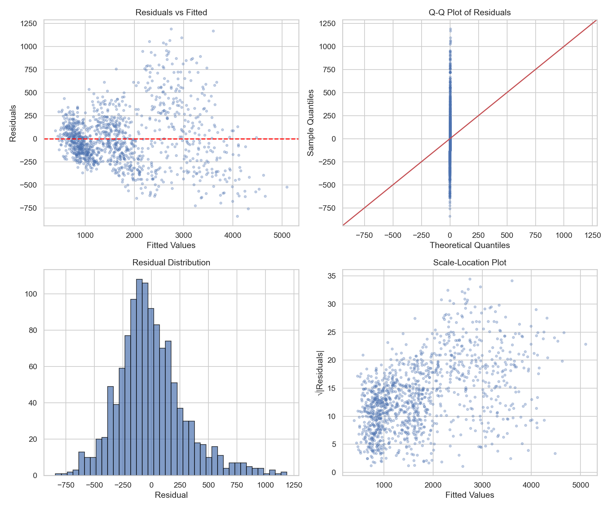

| Diagnostic | Test | Result | Implication |
|---|---|---|---|
| Autocorrelation | Durbin-Watson | 1.93 | No autocorrelation (close to 2.0) |
| Heteroscedasticity | Breusch-Pagan | p < 0.001 | Residual variance increases with fitted values |
| Normality | Jarque-Bera | p < 0.001 | Residuals are right-skewed (skew=0.76, kurtosis=4.29) |

The residual-vs-fitted plot reveals **fan-shaped heteroscedasticity**: prediction error increases for higher-rent units. This is typical in rental data — larger, more expensive units have more price variability.

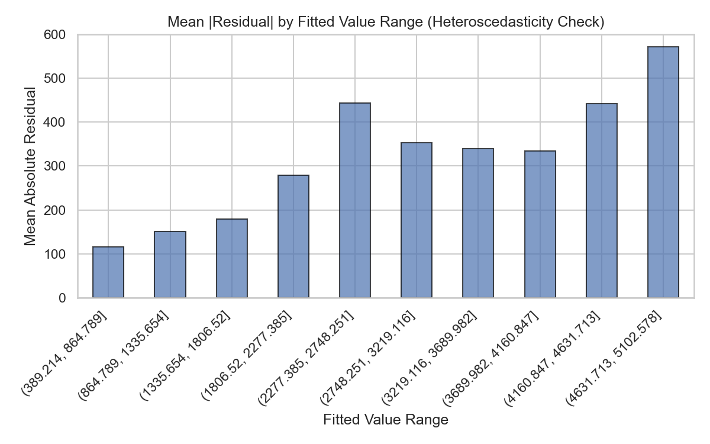

### 3.3 Log-Log Model

To address heteroscedasticity and skewness, a log-log specification was tested:

**log(rent) ~ log(sq_ft) + bedrooms + bathrooms + ...**

| Metric | Linear Model | Log-Log Model |
|---|---|---|
| R-squared | 0.910 | 0.918 |
| Residual Skewness | 0.76 | 0.18 |
| Residual Kurtosis | 4.29 | 2.52 |
| Breusch-Pagan p-value | < 0.001 | 0.001 |

The log-log model improves R-squared to 0.918 and dramatically reduces residual skewness (from 0.76 to 0.18). Heteroscedasticity is reduced but not fully eliminated (still significant at p=0.001).

**Interpretation of log-log coefficients:**
- `log_sqft` coefficient = 0.80: A 1% increase in sq_ft is associated with a 0.80% increase in rent (slightly sub-linear elasticity — diminishing returns for very large units).
- `bedrooms` coefficient = 0.071: Each additional bedroom adds ~7.1% to rent, controlling for sq_ft.

### 3.4 Nonlinearity Check

A quadratic term (sq_ft^2) is statistically significant (p < 0.001) with a negative coefficient (-0.000105), confirming **diminishing marginal returns** for larger units. However, the practical improvement is small (R-squared goes from 0.910 to 0.914).

An interaction term (sq_ft x bedrooms) is also significant (p=0.003), suggesting that the per-sqft premium is slightly lower when bedroom count is higher (more partitioned space is worth marginally less per sqft).

### 3.5 Model Comparison (5-Fold Cross-Validation)

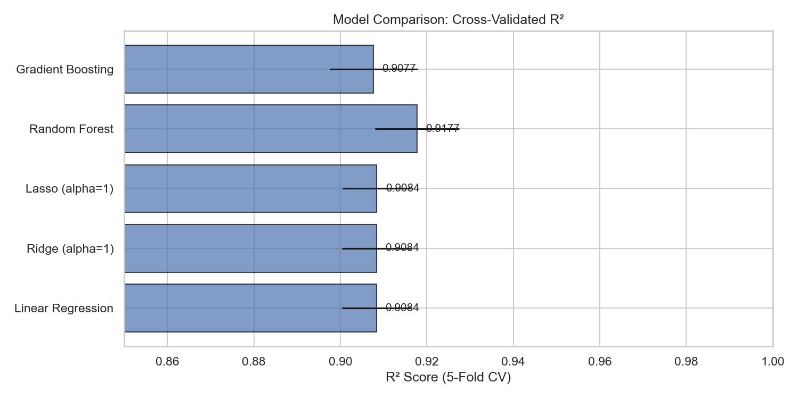

| Model | CV R-squared | CV RMSE | CV MAE |
|---|---|---|---|
| Linear Regression | 0.908 +/- 0.008 | $300 +/- $10 | $226 +/- $8 |
| Ridge (alpha=1) | 0.908 +/- 0.008 | $300 +/- $10 | $226 +/- $8 |
| Lasso (alpha=1) | 0.908 +/- 0.008 | $300 +/- $10 | $226 +/- $8 |
| **Random Forest** | **0.918 +/- 0.010** | **$284 +/- $6** | **$202 +/- $4** |
| Gradient Boosting | 0.908 +/- 0.010 | $301 +/- $5 | $214 +/- $3 |

Random Forest marginally outperforms the linear models, likely because it captures the slight nonlinearities (diminishing returns at large sq_ft, interaction effects). Ridge and Lasso provide no benefit over OLS — consistent with the low multicollinearity.

### 3.6 Feature Importance

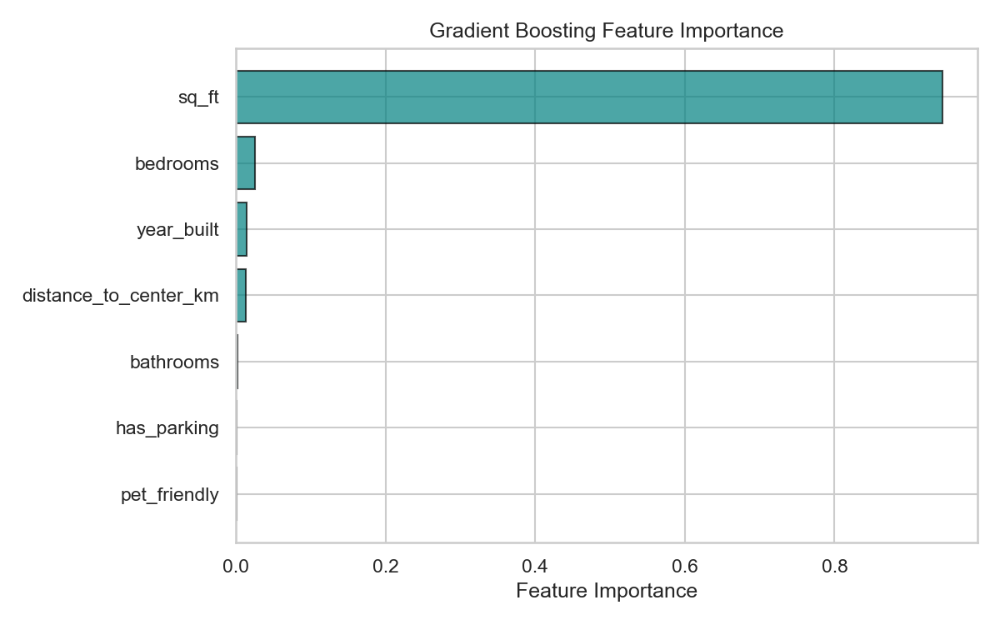

Both the OLS coefficients and Gradient Boosting feature importance confirm the same story:

- **sq_ft** is overwhelmingly dominant (94.4% of GB importance)
- **bedrooms** is a distant second (2.5%)
- All other features combined account for <3.2%

### 3.7 Partial Dependence Plots

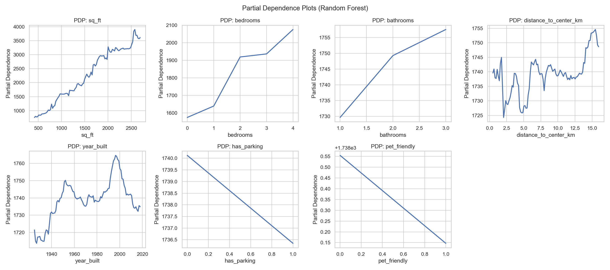

The partial dependence plots confirm:
- `sq_ft`: Strong, approximately linear positive relationship with slight flattening at high values
- `bedrooms`: Step-wise increases, most pronounced at 2+ bedrooms
- `bathrooms`: Small positive effect
- All other features: Essentially flat — no predictive contribution

### 3.8 Predicted vs. Actual

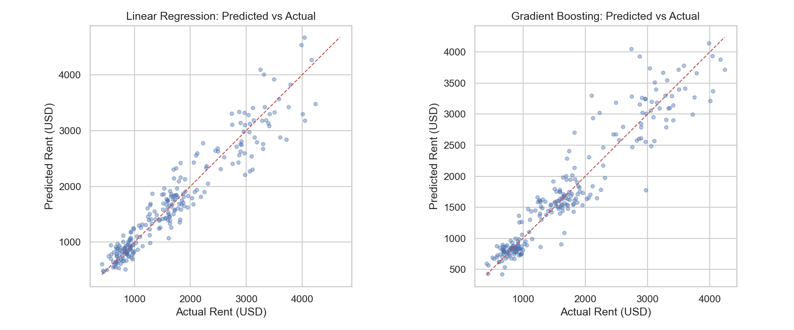

Both models track the diagonal well. Scatter increases for higher rents, consistent with the heteroscedasticity finding.

## 4. Key Findings

1. **Rent is overwhelmingly determined by unit size.** Square footage alone explains ~90% of rent variance (r=0.947). The market prices almost entirely on a per-sqft basis at approximately $1.14-$1.48/sqft depending on unit characteristics.

2. **Bedrooms add a premium beyond their sqft contribution.** Controlling for square footage, each additional bedroom adds ~$115/month — likely reflecting the value of separate, enclosed rooms versus open-plan layouts.

3. **Location (distance to center), building age, parking, and pet-friendliness do not meaningfully affect rent** in this dataset. This is the most surprising finding: typically, distance to city center is a primary rental pricing factor. Its absence here suggests either (a) a market where location effects are minimal, (b) the distance variable captures a dimension that doesn't map to desirability, or (c) location effects exist but operate through sq_ft (central units may be smaller).

4. **Diminishing returns at scale.** Very large units see a slightly lower per-sqft rent, confirmed by both the significant quadratic term and the log-log model's elasticity of 0.80 (sub-unitary).

5. **Heteroscedasticity is present but manageable.** Larger, more expensive units have more price variability. For inference, robust standard errors or the log model should be preferred. For prediction, the effect is modest (~$300 RMSE on a $1,737 mean, or ~17% coefficient of variation).

6. **Simple models perform nearly as well as complex ones.** The Random Forest gains only ~1 percentage point of R-squared over linear regression. Given the near-perfect linear relationship between sq_ft and rent, the added complexity of ensemble methods provides minimal benefit.

## 5. Recommendations

- **For prediction:** A simple linear regression with `sq_ft`, `bedrooms`, and `bathrooms` is sufficient and interpretable. Expected prediction error is ~$300 (RMSE) or ~$225 (MAE). For slightly better calibration, use the log-log model specification.

- **For inference:** Use the log-log OLS model with heteroscedasticity-robust (HC3) standard errors. Only `sq_ft`, `bedrooms`, and `bathrooms` are significant. The other 4 features can be dropped without loss.

- **For business use:** Rent pricing in this market is almost entirely a function of unit size. A quick estimate of `$1.14 x sq_ft + $115 x bedrooms + $51 x bathrooms` provides a reasonable baseline. Factors like parking, pet policies, building age, and distance to center are not priced into this market.

## 6. Limitations

- Cross-sectional data only — no temporal trends or seasonal effects.
- No neighborhood/zip code granularity beyond `distance_to_center_km`.
- No information on unit condition, amenities, floor level, or listing platform.
- The uniformity of price-per-sqft (~$1.48 with low variance) is unusual and may indicate synthetic or curated data, or a highly commoditized rental market.
