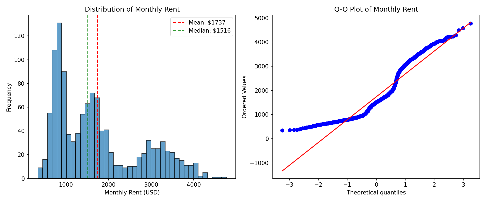
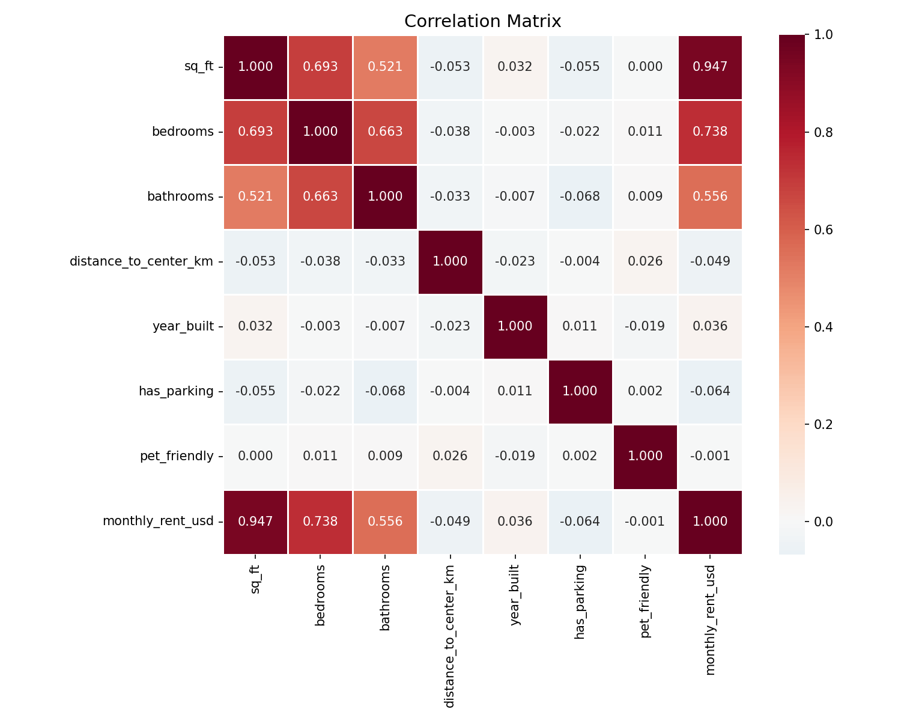
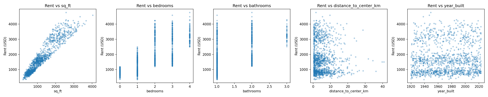
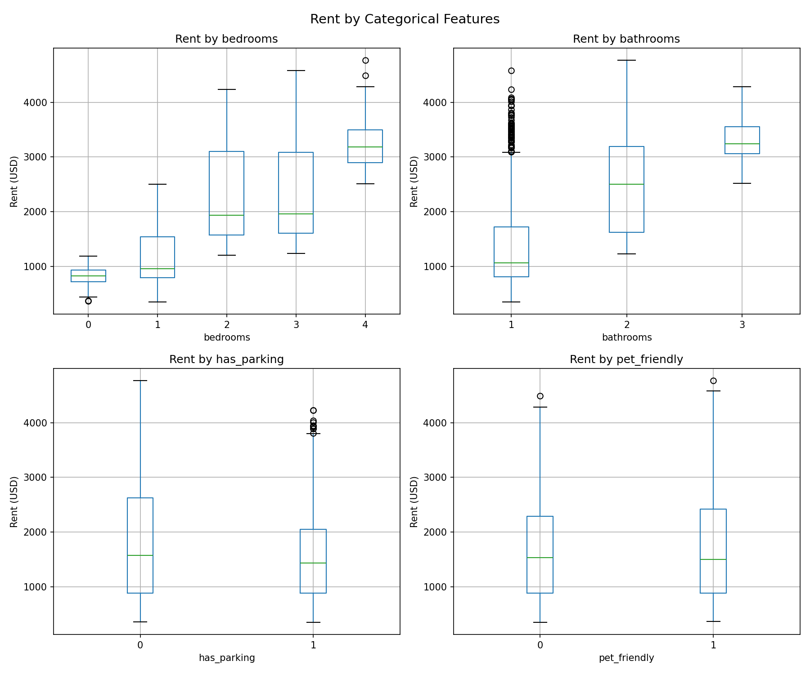
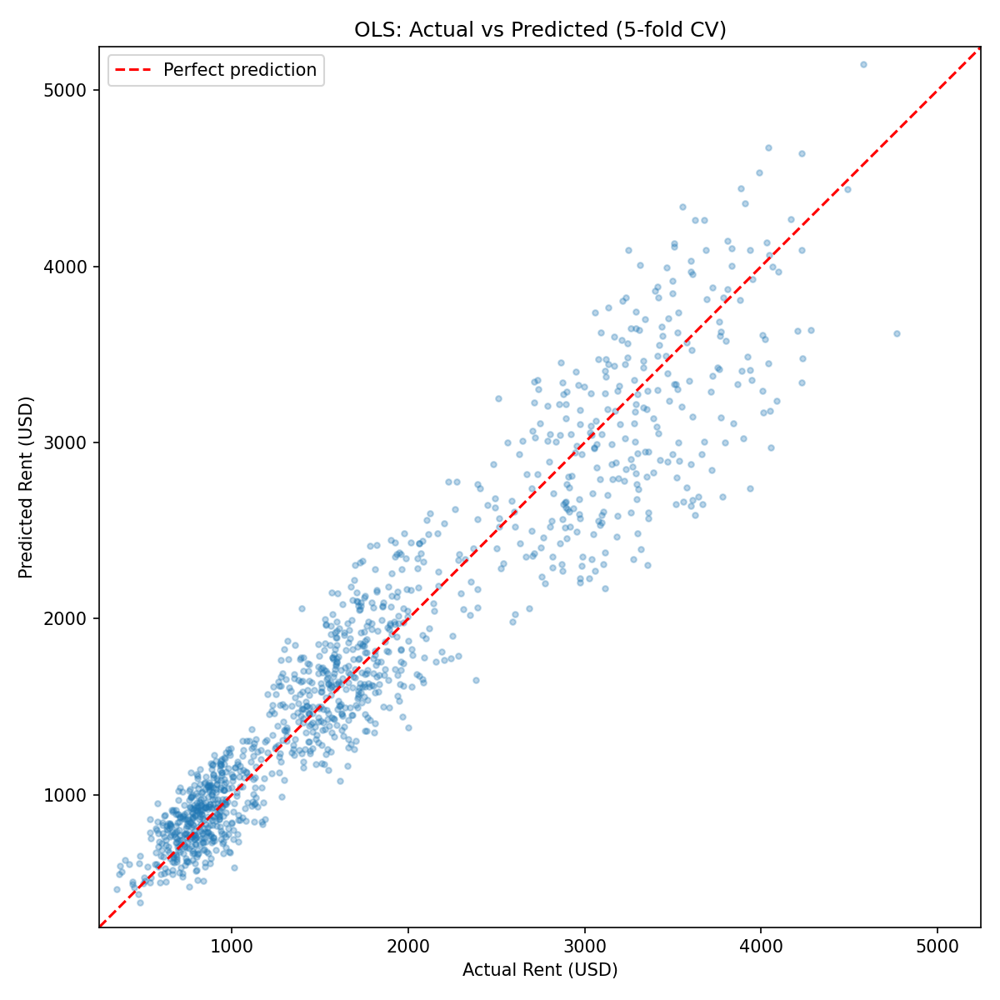
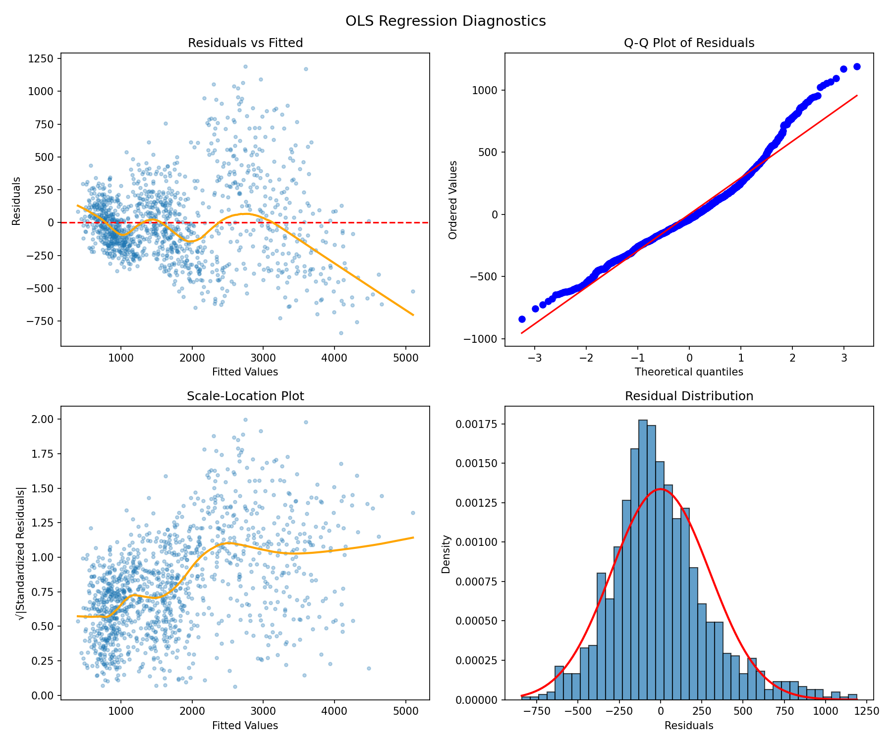

# Rental Price Analysis Report

## 1. Dataset Overview

| Property | Value |
|----------|-------|
| Rows | 1,200 |
| Features | 8 (7 predictors + 1 target) |
| Missing values | 0 |
| Duplicate rows | 0 |
| Target variable | `monthly_rent_usd` |

**Features:**

| Feature | Type | Range | Description |
|---------|------|-------|-------------|
| `sq_ft` | Continuous | 200 -- 4,031 | Square footage |
| `bedrooms` | Ordinal | 0 -- 4 | Number of bedrooms |
| `bathrooms` | Ordinal | 1 -- 3 | Number of bathrooms |
| `distance_to_center_km` | Continuous | 0.5 -- 40.7 | Distance to city center |
| `year_built` | Continuous | 1920 -- 2023 | Year of construction |
| `has_parking` | Binary | 0/1 | Parking availability |
| `pet_friendly` | Binary | 0/1 | Pet-friendly policy |

**Target:** `monthly_rent_usd` ranges from $347 to $4,769 (mean $1,737, median $1,516, right-skewed).

## 2. Data Quality Assessment

- **No missing data** across all columns.
- **No duplicate records** (each `listing_id` is unique).
- **No apparent data entry errors:** all values fall within plausible ranges.
- **Outliers detected:**
  - `sq_ft`: 13 observations above 3,167 sq ft (IQR upper fence). These are large but plausible luxury listings.
  - `distance_to_center_km`: 63 observations beyond 15.7 km. The distribution is heavily right-skewed (skew = 2.13). The maximum of 40.7 km represents a long tail of suburban/exurban listings.
  - `monthly_rent_usd`: 1 observation above $4,600 (the $4,769 maximum). Plausible for a very large unit.
- **No outliers were removed** as all values represent realistic rental scenarios.

## 3. Exploratory Data Analysis

### 3.1 Target Distribution

Monthly rent is right-skewed (skew = 0.82) with a long upper tail. The mean ($1,737) exceeds the median ($1,516), consistent with a small number of expensive large-unit listings pulling the average up.



### 3.2 Feature Correlations

The correlation analysis reveals a strikingly simple structure:

| Feature | Correlation with Rent |
|---------|----------------------|
| `sq_ft` | **0.947** |
| `bedrooms` | **0.738** |
| `bathrooms` | **0.556** |
| `distance_to_center_km` | -0.049 |
| `year_built` | 0.036 |
| `has_parking` | -0.064 |
| `pet_friendly` | -0.001 |

**Key observation:** Rent is overwhelmingly determined by unit size (`sq_ft`). The strong correlations of `bedrooms` (0.738) and `bathrooms` (0.556) with rent are largely mediated through their correlation with `sq_ft` (bedrooms-sqft: 0.69, bathrooms-sqft: 0.52).

**Surprising finding:** `distance_to_center_km`, `year_built`, `has_parking`, and `pet_friendly` have near-zero correlation with rent. In most housing markets, location (distance) is a primary driver. Its irrelevance here suggests either a market where location premiums are minimal, or that the "center" reference point does not correspond to a desirable hub.



### 3.3 Multicollinearity

Variance Inflation Factors (VIF) are low for all predictors:

| Feature | VIF |
|---------|-----|
| `sq_ft` | 1.96 |
| `bedrooms` | 2.55 |
| `bathrooms` | 1.82 |
| All others | ~1.00 |

No concerning multicollinearity (all VIFs < 3).

### 3.4 Scatter Plots and Relationships

- **`sq_ft` vs rent:** Near-perfect linear relationship. Pearson (0.947) and Spearman (0.951) correlations are nearly identical, confirming linearity. Log-transforming `sq_ft` worsens the fit (r = 0.922), confirming a linear (not log-linear) relationship.
- **`bedrooms` and `bathrooms`:** Show clear step-wise increases in rent, but these are largely collinear with `sq_ft`.
- **`distance_to_center_km`:** No discernible pattern with rent at any scale.




## 4. Modeling

### 4.1 Full OLS Regression

A linear regression with all 7 predictors was fit:

```
monthly_rent_usd = -592.28 + 1.14*sq_ft + 114.86*bedrooms + 51.28*bathrooms
                   + 0.21*distance + 0.36*year_built - 26.89*has_parking - 4.84*pet_friendly
```

| Metric | Value |
|--------|-------|
| R-squared | 0.910 |
| Adjusted R-squared | 0.910 |
| AIC | 17,097 |

**Significant predictors (p < 0.05):**
- `sq_ft` (p < 0.001): Each additional sq ft adds ~$1.14/month
- `bedrooms` (p < 0.001): Each additional bedroom adds ~$115/month (beyond sq_ft effect)
- `bathrooms` (p = 0.017): Each additional bathroom adds ~$51/month

**Non-significant predictors (p > 0.05):** `distance_to_center_km` (p = 0.90), `year_built` (p = 0.22), `has_parking` (p = 0.12), `pet_friendly` (p = 0.78).

### 4.2 Parsimonious Model

A 3-predictor model using only the significant features:

```
monthly_rent_usd = 93.43 + 1.15*sq_ft + 113.59*bedrooms + 53.10*bathrooms
```

| Metric | Full Model (7 features) | Parsimonious (3 features) |
|--------|------------------------|--------------------------|
| R-squared | 0.910 | 0.910 |
| Adj. R-squared | 0.910 | 0.910 |
| AIC | 17,097 | 17,093 |

The parsimonious model has a slightly better AIC (lower is better) with identical R-squared, confirming that the 4 dropped features contribute no predictive value.

### 4.3 Cross-Validated Model Comparison

Five-fold cross-validation across multiple model families:

| Model | CV R-squared | CV MAE | CV RMSE |
|-------|-------------|--------|---------|
| OLS | 0.908 +/- 0.008 | $226 | $300 |
| Ridge | 0.908 +/- 0.008 | $226 | $300 |
| Lasso | 0.908 +/- 0.008 | $226 | $300 |
| **Random Forest** | **0.918 +/- 0.010** | **$202** | **$284** |
| Gradient Boosting | 0.908 +/- 0.010 | $214 | $301 |

- All linear methods perform identically (R-squared = 0.908), confirming no regularization benefit (no overfitting, no feature selection issue).
- Random Forest achieves the best performance (R-squared = 0.918), capturing ~1% more variance through non-linear interactions. This modest gain suggests minor non-linearities exist but the relationship is fundamentally linear.
- The close match between training R-squared (0.910) and CV R-squared (0.908) confirms the model generalizes well.




### 4.4 Feature Importance

Both OLS standardized coefficients and Random Forest importance agree: `sq_ft` dominates overwhelmingly.

| Feature | RF Importance | OLS Standardized Coeff |
|---------|--------------|----------------------|
| `sq_ft` | 0.944 | 0.834 |
| `bedrooms` | 0.021 | 0.141 |
| `year_built` | 0.015 | 0.011 |
| `distance_to_center_km` | 0.012 | 0.001 |
| `bathrooms` | 0.003 | 0.028 |
| `has_parking` | 0.002 | -0.014 |
| `pet_friendly` | 0.002 | 0.000 |


## 5. Assumption Checking

### 5.1 Linearity
Confirmed. The residuals-vs-fitted plot shows no systematic curvature, and the LOWESS line stays near zero. Pearson and Spearman correlations for `sq_ft` vs rent are nearly identical (0.947 vs 0.951).

### 5.2 Independence
Durbin-Watson statistic = 1.93 (close to 2.0), indicating no autocorrelation. This is expected since the data are cross-sectional listings, not time series.

### 5.3 Normality of Residuals
**Violated.** Both Shapiro-Wilk (p < 0.001) and Jarque-Bera (p < 0.001) reject normality. Residuals are right-skewed (skew = 0.76) with heavier-than-normal tails (kurtosis = 4.28). However, with n = 1,200, the Central Limit Theorem ensures that coefficient estimates and standard errors are asymptotically valid. This is a minor concern.

### 5.4 Homoscedasticity
**Violated.** The Breusch-Pagan test strongly rejects constant variance (p < 0.001). Residual standard deviation increases with apartment size:

| Sq Ft Range | Residual Std Dev |
|-------------|-----------------|
| 200 -- 578 | $144 |
| 578 -- 825 | $164 |
| 825 -- 1,171 | $227 |
| 1,171 -- 1,843 | $388 |
| 1,843 -- 4,031 | $440 |

Larger apartments have more variable rents (3x higher variance for the largest vs smallest quintile). This is economically intuitive: luxury units have more pricing flexibility.

**Mitigation:** Using heteroscedasticity-consistent (HC3) robust standard errors, the same three predictors remain significant. Bathrooms becomes marginally significant (p = 0.064 vs 0.017 under standard SE). Core conclusions are robust.

### 5.5 No Multicollinearity
Confirmed. All VIFs < 3.



## 6. Key Findings

1. **Rent is overwhelmingly determined by unit size.** Square footage alone explains 89.7% of the variance in monthly rent. The marginal rate is approximately **$1.15 per square foot per month**.

2. **Bedrooms and bathrooms add modest independent value** beyond square footage: ~$114/month per bedroom, ~$53/month per bathroom. These likely reflect layout preferences or perceived prestige rather than pure space.

3. **Location, age, parking, and pet-friendliness are irrelevant** to rent in this market. Distance to center, year built, parking, and pet-friendly policies have no statistically significant relationship with rent. This is the most surprising finding, especially for distance.

4. **The relationship is fundamentally linear.** No transformations, non-linear models, or interaction terms meaningfully improve on simple linear regression. Random Forest gains only 1% more R-squared.

5. **Heteroscedasticity is present but non-threatening.** Larger apartments show 3x more rent variability. Confidence intervals should use robust standard errors, but point estimates and overall conclusions are unaffected.

6. **The recommended model is the parsimonious OLS:**
   ```
   Rent = $93 + $1.15 * sq_ft + $114 * bedrooms + $53 * bathrooms
   ```
   This achieves R-squared = 0.910 with just 3 interpretable predictors and generalizes well (CV R-squared = 0.908).

## 7. Limitations and Caveats

- **No location granularity.** The single `distance_to_center_km` variable may not capture neighborhood effects, school districts, or transit access that drive real-world rent variation.
- **Heteroscedasticity** means prediction intervals widen for larger units. A weighted least squares or log-rent model could improve interval estimation.
- **Cross-sectional data only.** No temporal trends or seasonal effects can be assessed.
- **The dataset appears synthetic or from a single, homogeneous market** given the near-perfect linear relationship and absence of location effects. Real rental markets typically show stronger location and age effects.

## 8. Plot Index

| File | Description |
|------|-------------|
| `plots/01_correlation_heatmap.png` | Correlation matrix of all features |
| `plots/02_rent_distribution.png` | Target variable distribution and Q-Q plot |
| `plots/03_feature_distributions.png` | Histograms of all features |
| `plots/04_scatter_vs_rent.png` | Scatter plots of continuous features vs rent |
| `plots/05_boxplots_by_category.png` | Rent distributions by categorical features |
| `plots/06_residual_diagnostics.png` | Four-panel OLS residual diagnostics |
| `plots/07_model_comparison.png` | Cross-validated R-squared and MAE comparison |
| `plots/08_feature_importance.png` | RF importance and OLS standardized coefficients |
| `plots/09_actual_vs_predicted.png` | Actual vs predicted rent (cross-validated) |
