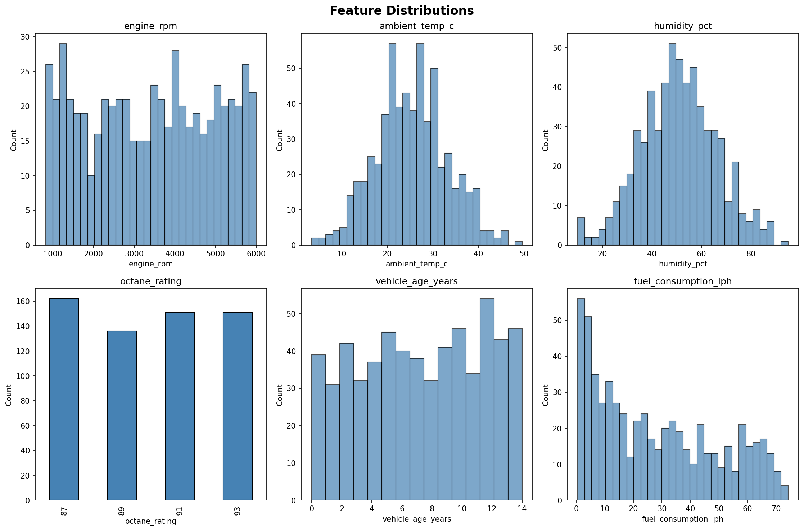
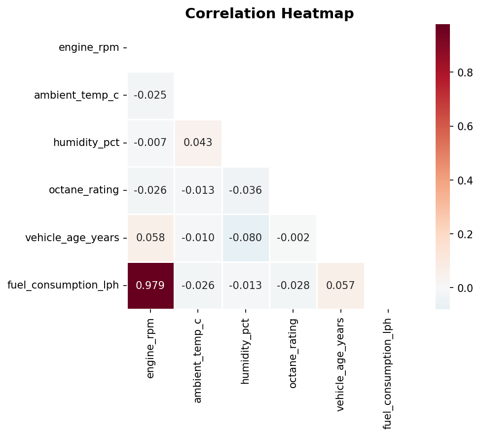
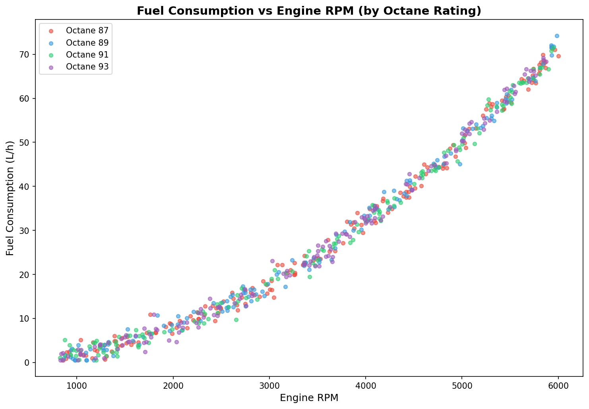
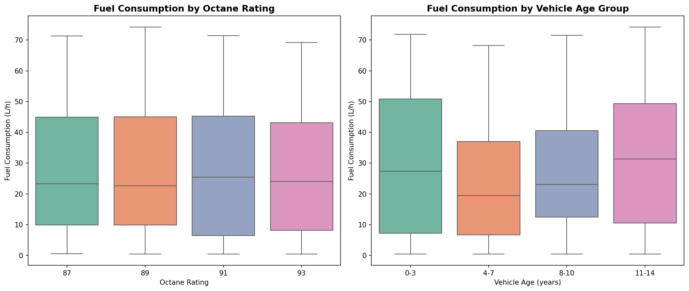
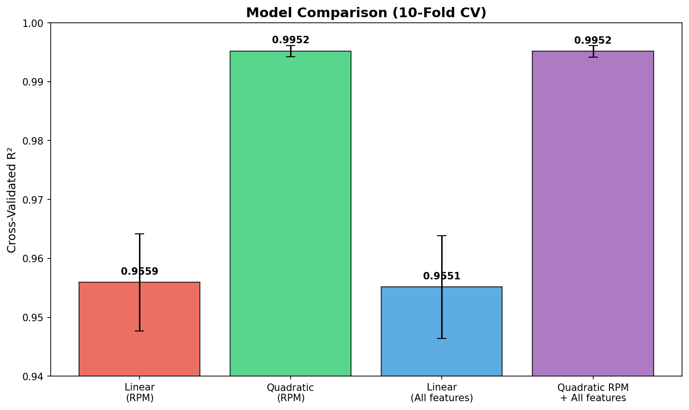
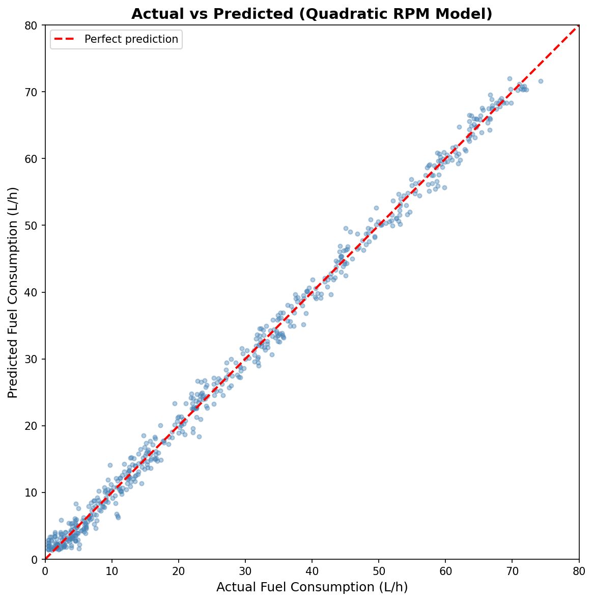
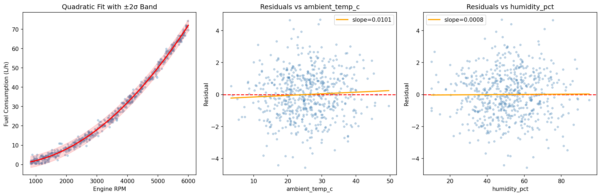
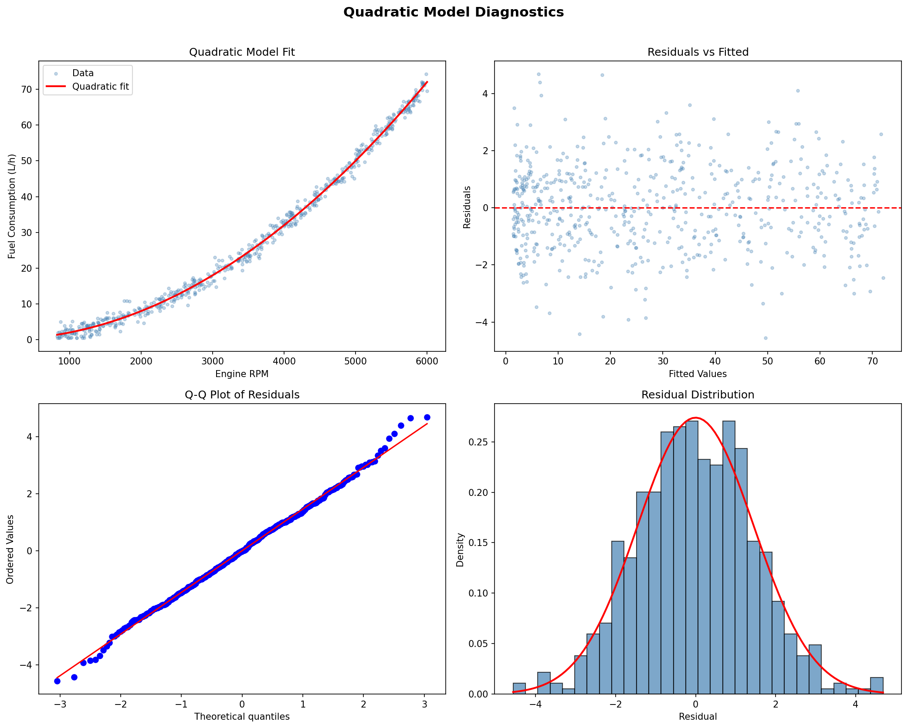

# Fuel Consumption Analysis Report

## 1. Dataset Overview

| Property | Value |
|---|---|
| Rows | 600 |
| Columns | 7 |
| Missing values | 0 |
| Duplicate rows | 0 |

**Columns:**

| Column | Type | Range | Description |
|---|---|---|---|
| `test_id` | int | 1--600 | Unique test identifier |
| `engine_rpm` | int | 826--5999 | Engine speed (revolutions per minute) |
| `ambient_temp_c` | float | 3.4--49.6 | Ambient temperature (Celsius) |
| `humidity_pct` | float | 10.0--95.0 | Relative humidity (%) |
| `octane_rating` | int | {87, 89, 91, 93} | Fuel octane rating (4 discrete levels) |
| `vehicle_age_years` | int | 0--14 | Vehicle age in years |
| `fuel_consumption_lph` | float | 0.50--74.22 | **Target**: fuel consumption (liters per hour) |

The dataset is clean: no nulls, no duplicates, no obvious encoding errors. All numeric types are appropriate. `octane_rating` functions as a categorical variable with 4 balanced groups (136--162 observations each).

## 2. Exploratory Data Analysis

### 2.1 Feature Distributions



- **engine_rpm**: approximately uniform across 826--5999 (negative kurtosis = -1.25 confirms platykurtic/uniform shape).
- **ambient_temp_c**: roughly normal, centered at 25.4 C, range 3.4--49.6 C.
- **humidity_pct**: roughly uniform/normal, range 10--95%.
- **octane_rating**: balanced categorical (87: 162, 89: 136, 91: 151, 93: 151).
- **vehicle_age_years**: approximately uniform across 0--14 years.
- **fuel_consumption_lph**: right-skewed (skew = 0.46), consistent with a nonlinear (quadratic) relationship with RPM.

### 2.2 Correlation Structure



The correlation matrix reveals a single dominant relationship:

| Feature pair | Pearson r |
|---|---|
| engine_rpm vs fuel_consumption_lph | **0.979** |
| All other pairs | |r| < 0.08 |

Engine RPM explains virtually all variance in fuel consumption. The other features (temperature, humidity, octane rating, vehicle age) are essentially uncorrelated with both RPM and consumption.

### 2.3 Primary Relationship: RPM vs Fuel Consumption



The scatter plot shows a clear **nonlinear (quadratic/parabolic)** relationship between engine RPM and fuel consumption. Points from all four octane ratings overlap completely, confirming octane has no meaningful effect.

### 2.4 Secondary Feature Effects



- **Octane rating**: One-way ANOVA F = 0.16, p = 0.92. Kruskal-Wallis H = 0.54, p = 0.91. No significant effect on fuel consumption at any conventional significance level.
- **Vehicle age**: No meaningful trend. Mean consumption is constant across age groups after controlling for RPM.
- **Ambient temperature**: No significant effect. Mean consumption is consistent across temperature bins (26--30 L/h in all groups).
- **Humidity**: No significant effect (r = -0.013 with consumption).

After controlling for RPM via partial correlation, the octane-consumption correlation is r = -0.011 (negligible).

## 3. Model Building

### 3.1 Model Comparison

Four models were evaluated using 10-fold cross-validation:

| Model | Train R^2 | CV R^2 (mean +/- std) | MAE | RMSE |
|---|---|---|---|---|
| Linear (RPM only) | 0.9578 | 0.9559 +/- 0.0083 | 3.81 | 4.41 |
| **Quadratic (RPM only)** | **0.9954** | **0.9952 +/- 0.0010** | **1.16** | **1.46** |
| Multiple Linear (all features) | 0.9579 | 0.9551 +/- 0.0087 | 3.80 | 4.41 |
| Quadratic RPM + all features | 0.9955 | 0.9952 +/- 0.0010 | 1.16 | 1.45 |



**Key observations:**

1. The quadratic term in RPM produces a massive improvement: R^2 jumps from 0.958 to 0.995 (RMSE drops from 4.41 to 1.46 L/h).
2. Adding all other features to either model yields negligible improvement (< 0.001 in R^2).
3. A cubic term adds nothing (R^2 stays at 0.9954).
4. The simplest adequate model is **Quadratic RPM only**.

### 3.2 Selected Model: Quadratic Polynomial in RPM

The OLS regression yields:

```
fuel_consumption = 0.066 - 0.000032 * RPM + 0.000002005 * RPM^2
```

| Term | Coefficient | Std Error | t-stat | p-value |
|---|---|---|---|---|
| Intercept | 0.066 | 0.298 | 0.22 | 0.825 |
| RPM | -3.20e-05 | 1.98e-04 | -0.16 | 0.872 |
| RPM^2 | **2.005e-06** | **2.87e-08** | **69.94** | **< 0.001** |

Only the quadratic term is statistically significant (t = 69.9, p ~ 0). The intercept and linear term are not significant, meaning the relationship simplifies to approximately:

```
fuel_consumption ~ 2.0e-6 * RPM^2
```

This is consistent with the physics of internal combustion engines, where fuel consumption scales with power output, which itself scales roughly with RPM squared at constant load.

### 3.3 Model Fit Visualization




## 4. Model Diagnostics



### 4.1 Residual Normality

- **Shapiro-Wilk test**: W = 0.998, p = 0.70 (fail to reject normality).
- **Skewness**: 0.042 (near zero).
- **Kurtosis**: 3.17 (near normal value of 3).
- The Q-Q plot shows residuals closely following the theoretical normal line.

Residuals are well-behaved and normally distributed.

### 4.2 Homoscedasticity

- **Breusch-Pagan test**: LM = 2.96, p = 0.23 (fail to reject homoscedasticity).
- The residuals-vs-fitted plot shows no fan shape or systematic pattern.

Constant variance assumption is satisfied.

### 4.3 Independence

- **Durbin-Watson statistic**: 2.03 (ideal value = 2.0).

No evidence of autocorrelation in residuals.

### 4.4 Residual Summary

| Statistic | Value |
|---|---|
| Mean | 0.000 |
| Std Dev | 1.456 L/h |
| Min | -4.56 L/h |
| Max | +4.68 L/h |
| Outliers (IQR method) | 0 |

### 4.5 Multicollinearity Note

The condition number (8.84e+07) is large due to the correlation between RPM and RPM^2 (inherent in polynomial regression). This does not affect predictions or R^2 but inflates standard errors on the individual coefficients for the linear and constant terms. Centering RPM before squaring would reduce this, but since the model's predictive performance is our primary goal, this is a cosmetic issue.

## 5. Key Findings

1. **Engine RPM is the sole meaningful predictor of fuel consumption.** It explains 99.5% of the variance via a quadratic relationship. No other feature contributes meaningfully.

2. **The relationship is quadratic, not linear.** Fuel consumption scales approximately as RPM^2, consistent with engine physics (power ~ RPM^2 at constant torque, and fuel consumption tracks power output).

3. **Octane rating has no effect on fuel consumption.** Despite testing four octane levels (87, 89, 91, 93), ANOVA (p = 0.92) and nonparametric tests (p = 0.91) show no difference. This holds even when controlling for RPM.

4. **Ambient temperature, humidity, and vehicle age have no detectable effect.** Their correlations with fuel consumption are all |r| < 0.08, and adding them to the model does not improve R^2 or reduce RMSE.

5. **The model is well-specified.** All OLS assumptions are met: residuals are normal (Shapiro-Wilk p = 0.70), homoscedastic (Breusch-Pagan p = 0.23), and independent (Durbin-Watson = 2.03). There are no outliers.

6. **The data appears to be generated from a controlled experiment.** Features are approximately uniformly distributed and mutually independent, suggesting a designed experiment (possibly a factorial or space-filling design). The absence of confounders is consistent with this.

## 6. Practical Implications

- To reduce fuel consumption, the primary lever is reducing engine RPM (e.g., through gearing, cruise control, or driver behavior).
- Switching to higher-octane fuel does not reduce fuel consumption in this dataset.
- Environmental conditions (temperature, humidity) and vehicle age do not materially affect consumption rates within the tested ranges.

## 7. Plots Index

| File | Description |
|---|---|
| `plots/01_distributions.png` | Feature distributions |
| `plots/02_correlation_heatmap.png` | Correlation matrix heatmap |
| `plots/03_rpm_vs_consumption.png` | RPM vs consumption scatter (by octane) |
| `plots/04_pairplot.png` | Pairwise feature relationships |
| `plots/05_boxplots.png` | Consumption by octane and vehicle age |
| `plots/06_linearity_check.png` | Linear vs quadratic fit comparison |
| `plots/07_model_comparison.png` | 10-fold CV model comparison |
| `plots/08_model_diagnostics.png` | Residual diagnostics (4-panel) |
| `plots/09_actual_vs_predicted.png` | Actual vs predicted scatter |
| `plots/10_residuals_vs_features.png` | Residuals vs secondary features |
