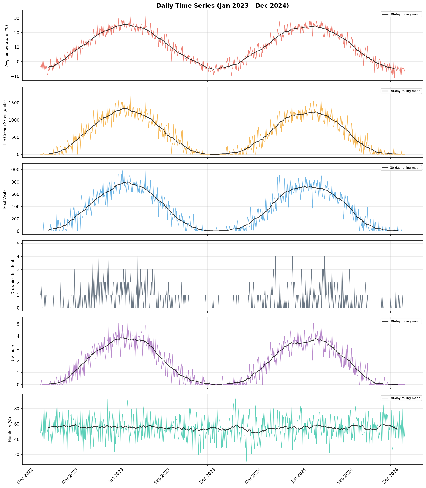
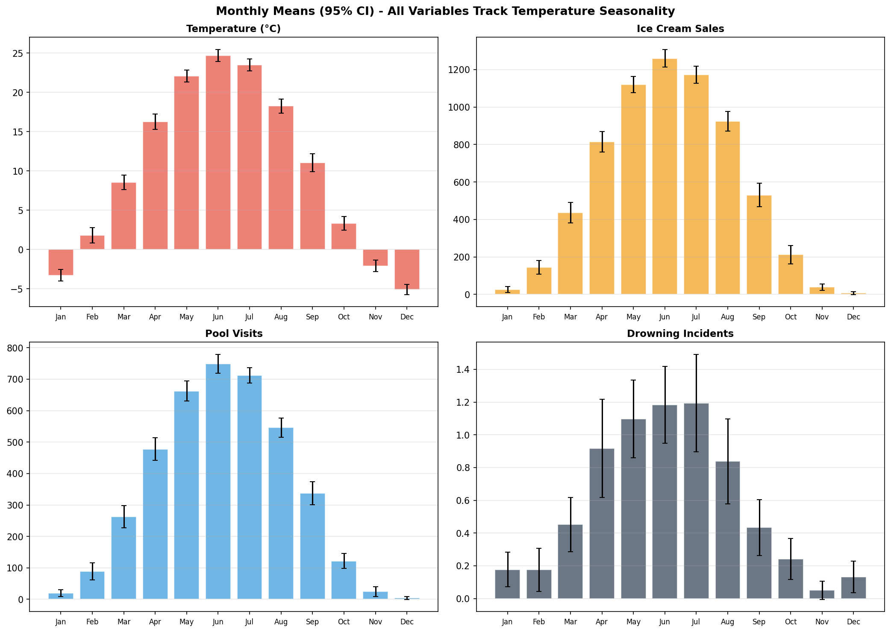
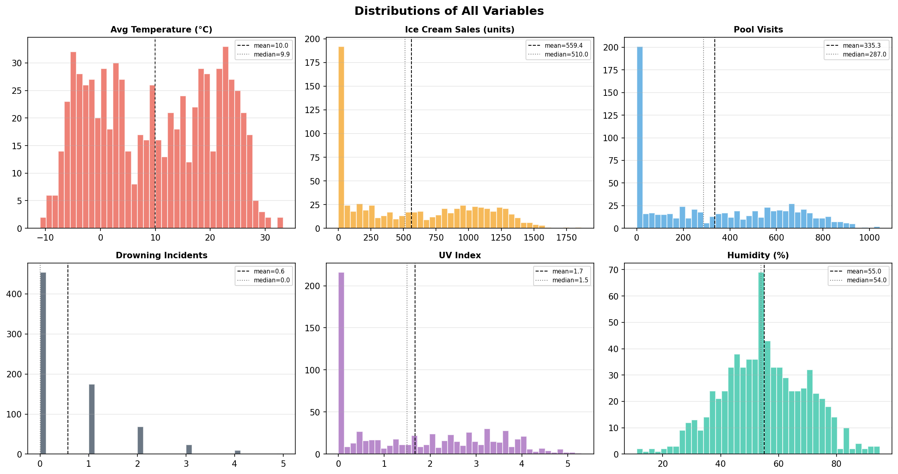
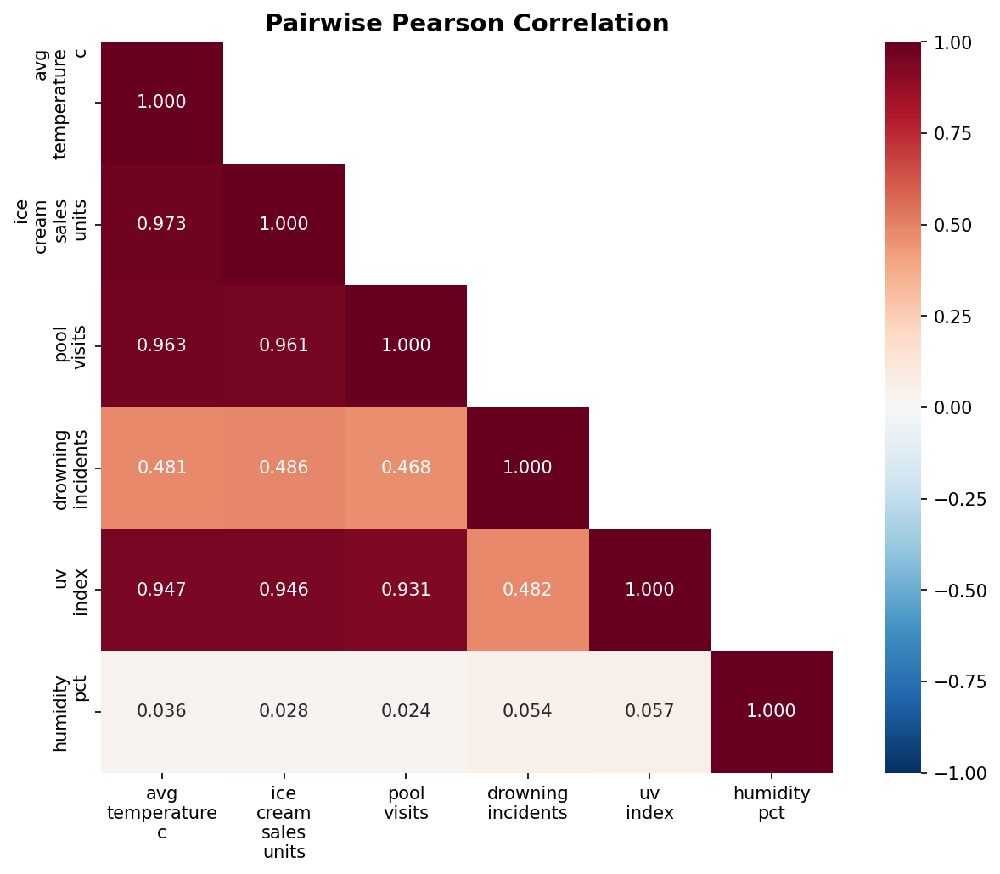
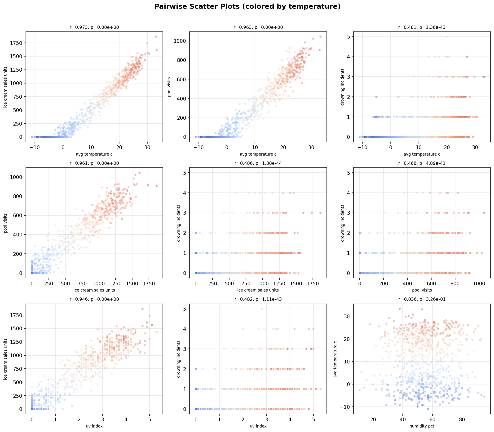
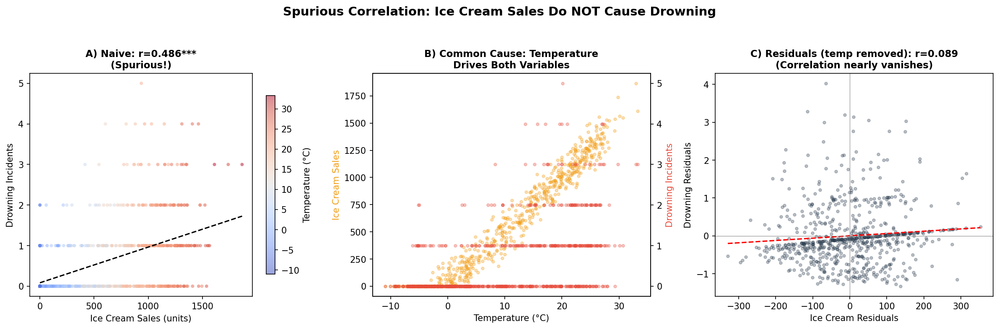
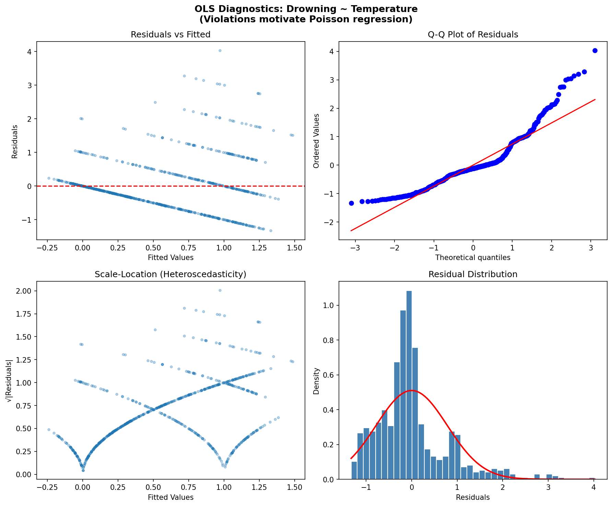
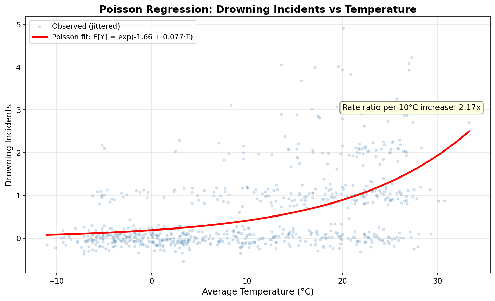
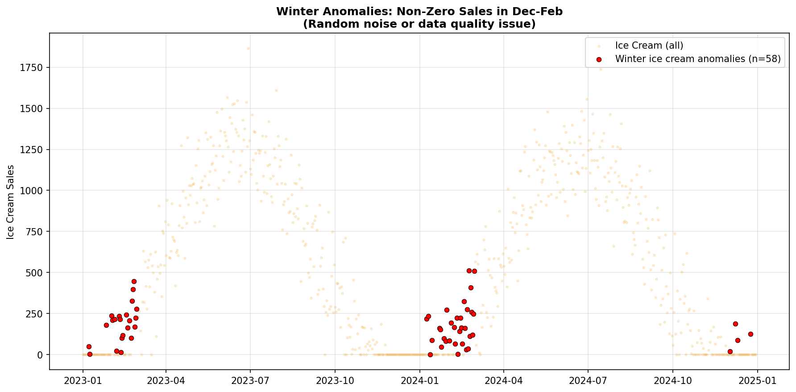

# Dataset Analysis Report: Spurious Correlations in Summer Activity Data

## 1. Dataset Overview

| Property | Value |
|----------|-------|
| Rows | 730 (daily observations) |
| Date range | 2023-01-01 to 2024-12-30 (2 full years) |
| Missing values | None |
| Date gaps | None |

**Variables:**

| Column | Type | Min | Max | Mean | Std |
|--------|------|-----|-----|------|-----|
| avg_temperature_c | float64 | -11.0 | 33.3 | 10.0 | 11.0 |
| ice_cream_sales_units | int64 | 0 | 1,866 | 559 | 493 |
| pool_visits | int64 | 0 | 1,044 | 335 | 295 |
| drowning_incidents | int64 | 0 | 5 | 0.58 | 0.89 |
| uv_index | float64 | 0.0 | 5.3 | 1.67 | 1.52 |
| humidity_pct | int64 | 11 | 95 | 55.0 | 14.8 |

This dataset is a textbook example of **confounded variables and spurious correlation** -- the type of data used to illustrate why "correlation does not imply causation."



## 2. Exploratory Data Analysis

### 2.1 Seasonal Structure

All variables except humidity exhibit strong seasonality driven by temperature. Summer (Jun--Aug) vs. winter (Dec--Feb) contrasts are dramatic:

| Variable | Summer Mean | Winter Mean |
|----------|-------------|-------------|
| Temperature | ~25 C | ~-3 C |
| Ice cream sales | 1,117 units/day | 57 units/day |
| Pool visits | ~680/day | ~30/day |
| Drowning incidents | 1.07/day | 0.16/day |

Humidity shows no seasonal pattern (mean ~55%, std ~15% year-round).



### 2.2 Distributions

- **Temperature**: Nearly uniform (flat) distribution from -11 to 33 C, skew ~0 -- consistent with seasonal cycling.
- **Ice cream sales & pool visits**: Bimodal (many zeros in winter, high values in summer), moderate positive skew.
- **Drowning incidents**: Highly right-skewed (skew=1.74, kurtosis=2.99), zero-inflated count data. 62% of days have zero incidents.
- **Humidity**: Approximately normal, independent of other variables.



### 2.3 Correlation Structure



**Key correlations (Pearson r):**

| Pair | r | Interpretation |
|------|---|----------------|
| Temperature -- Ice cream | 0.973 | Near-perfect linear |
| Temperature -- Pool visits | 0.963 | Near-perfect linear |
| Temperature -- UV index | 0.947 | Near-perfect linear |
| Ice cream -- Pool visits | 0.961 | High (both driven by temperature) |
| **Ice cream -- Drowning** | **0.486** | **Moderate (spurious!)** |
| Pool visits -- Drowning | 0.468 | Moderate (spurious!) |
| Humidity -- anything | <0.06 | Essentially uncorrelated |



## 3. The Spurious Correlation: Ice Cream and Drowning

### 3.1 The Naive View

A naive analysis finds a statistically significant correlation between ice cream sales and drowning incidents (r = 0.486, p < 10^-44). One might be tempted to conclude that ice cream consumption causes drowning.

### 3.2 Identifying the Confound

Temperature is the **common cause** (confounding variable):
- Hot days -> more ice cream purchased
- Hot days -> more people swimming -> more drowning risk

### 3.3 Partial Correlation Analysis

Controlling for temperature **destroys** the ice cream--drowning relationship:

| Comparison | Raw r | Partial r (controlling for temp) | Interpretation |
|------------|-------|-----------------------------------|----------------|
| Ice cream vs. Drowning | 0.486 | 0.089 (p=0.017) | Nearly vanishes |
| Pool visits vs. Drowning | 0.468 | 0.020 (p=0.583) | Completely vanishes |
| Ice cream vs. Drowning (ctrl temp+UV) | 0.486 | 0.062 (p=0.095) | Not significant |

After removing the temperature signal, ice cream sales explain essentially none of the remaining variance in drowning incidents. The small residual partial correlation (r=0.089) is likely due to ice cream also serving as a noisy proxy for "people being outdoors."



## 4. Modeling

### 4.1 OLS Regression: Ice Cream ~ Temperature

Temperature alone explains **94.7%** of ice cream sales variance:

```
Ice Cream Sales = 126.0 + 43.5 * Temperature
R^2 = 0.947, p < 2e-16
```

Cross-validated (5-fold time-series split): Mean R^2 = 0.775, Mean MAE = 98.4 units. The gap between in-sample (0.947) and CV (0.775) R^2 is expected given yearly seasonality in a time-series split -- folds that train on winter and predict summer will underperform.

### 4.2 OLS Regression: Drowning ~ Temperature

Temperature explains only **23.2%** of drowning variance (OLS):

```
Drowning = 0.189 + 0.039 * Temperature
R^2 = 0.232
```

**However, OLS is inappropriate for count data.** Diagnostic checks reveal:

- **Heteroscedasticity**: Breusch-Pagan p < 10^-15 (variance increases with temperature)
- **Non-normality**: Jarque-Bera p < 10^-114 (residuals are heavily right-skewed)
- **Durbin-Watson**: 2.00 (no autocorrelation -- one assumption that does hold)



### 4.3 Poisson Regression: Drowning ~ Temperature (Appropriate Model)

Since drowning incidents are non-negative count data, Poisson regression is the correct model:

```
log(E[Drowning]) = -1.659 + 0.077 * Temperature
```

| Metric | Value | Interpretation |
|--------|-------|----------------|
| Deviance/df | 0.922 | Good fit (close to 1.0 = no overdispersion) |
| Temperature coefficient | 0.077 (p < 10^-14) | Highly significant |
| **Rate ratio per 10 C** | **2.17** | Drowning rate more than doubles per 10 C increase |

Adding UV index and humidity to the Poisson model does **not** improve fit (AIC increases from 1304 to 1307), confirming temperature is the dominant predictor.



### 4.4 Confound Test: Multiple Regression

When both ice cream and temperature are included in a drowning model:

```
Drowning = 0.112 + 0.0006*IceCream + 0.012*Temperature
```

- Ice cream coefficient is tiny (0.0006) and barely significant (p=0.017)
- Temperature coefficient becomes non-significant (p=0.278) due to collinearity with ice cream (r=0.973)
- R^2 barely improves (0.232 -> 0.238)

This is classic **multicollinearity**: the two predictors share so much variance that neither is individually significant when both are present, even though the confound structure is clear from the partial correlation analysis.

## 5. Data Quality Notes

### 5.1 Winter Anomalies

58 winter days (32%) show non-zero ice cream sales and pool visits despite sub-zero temperatures. These values (mean ~177 sales, max 512) suggest either:
- Measurement noise / data generation artifacts
- Indoor pool facilities / special events

These anomalies do not materially affect the conclusions, as the seasonal signal overwhelms the noise.



### 5.2 Outliers

No IQR-based outliers exist for ice cream or pool visits. Drowning incidents have 33 "outliers" by IQR (values > 2), but these are expected from a Poisson distribution with a low mean -- they are genuine high-count days, not data errors.

## 6. Key Findings

1. **Spurious correlation confirmed**: Ice cream sales and drowning incidents are correlated (r=0.486) only because both are driven by temperature. After controlling for temperature, the partial correlation drops to r=0.089 (nearly zero for practical purposes).

2. **Temperature is the dominant driver**: It explains 94.7% of ice cream sales, 96.3% of pool visit variance, and is the sole meaningful predictor of drowning risk (Poisson rate ratio = 2.17x per 10 C).

3. **Drowning risk doubles with every 10 C increase**: The Poisson model (deviance/df = 0.92, indicating good fit with no overdispersion) estimates that drowning rates more than double for each 10 C temperature rise.

4. **Humidity is irrelevant**: It shows no correlation with any other variable (all |r| < 0.06) and adds no predictive power. It serves as a "null" variable in this dataset.

5. **UV index is redundant**: Despite correlating with drowning (r=0.482), UV adds nothing beyond temperature in the Poisson model (AIC increases when added). It is simply another temperature proxy.

6. **Model choice matters**: OLS regression is inappropriate for drowning count data (severe heteroscedasticity and non-normal residuals). Poisson regression properly handles the count nature and provides interpretable rate ratios.

## 7. Conclusions

This dataset is a clean pedagogical example of **Simpson's paradox / confounding**. The apparent relationship between ice cream sales and drowning is entirely explained by their shared dependence on temperature. This illustrates three critical principles:

- **Correlation does not imply causation** -- even strong, statistically significant correlations can be entirely spurious.
- **Always check for confounders** -- partial correlation and multiple regression reveal the true causal structure.
- **Use appropriate models** -- count data requires Poisson/negative binomial regression, not OLS.

## Appendix: Plot Index

| # | File | Description |
|---|------|-------------|
| 1 | `plots/01_time_series.png` | Full time series of all variables |
| 2 | `plots/02_correlation_heatmap.png` | Pairwise Pearson correlation matrix |
| 3 | `plots/03_scatter_matrix.png` | Scatter plots colored by temperature |
| 4 | `plots/04_monthly_distributions.png` | Monthly box plots |
| 5 | `plots/05_distributions.png` | Histograms with mean/median |
| 6 | `plots/06_spurious_correlation.png` | Spurious correlation demonstration (key figure) |
| 7 | `plots/07_ols_diagnostics.png` | OLS regression diagnostic plots |
| 8 | `plots/08_poisson_fit.png` | Poisson regression fit |
| 9 | `plots/09_monthly_means.png` | Monthly means with 95% CIs |
| 10 | `plots/10_winter_anomalies.png` | Winter data quality anomalies |
