# Customer Behavior Analysis Report

## 1. Dataset Overview

| Property | Value |
|----------|-------|
| Rows | 600 |
| Columns | 7 |
| Missing values | 0 |
| Duplicate rows | 0 |
| Duplicate customer IDs | 0 |

**Features:**

| Feature | Type | Mean | Std | Min | Max |
|---------|------|------|-----|-----|-----|
| avg_order_value | float64 | 73.27 | 38.91 | 16.16 | 128.76 |
| purchase_frequency_monthly | float64 | 8.68 | 5.18 | 0.10 | 18.41 |
| days_since_last_purchase | float64 | 23.30 | 16.56 | 0.00 | 54.26 |
| total_lifetime_spend | float64 | 2681.84 | 679.56 | 1632.24 | 4299.18 |
| support_contacts | int64 | 1.64 | 1.36 | 0 | 6 |
| account_age_months | int64 | 31.10 | 17.08 | 1 | 59 |

The data is clean: no nulls, no duplicates, no IQR-based outliers detected in any feature.

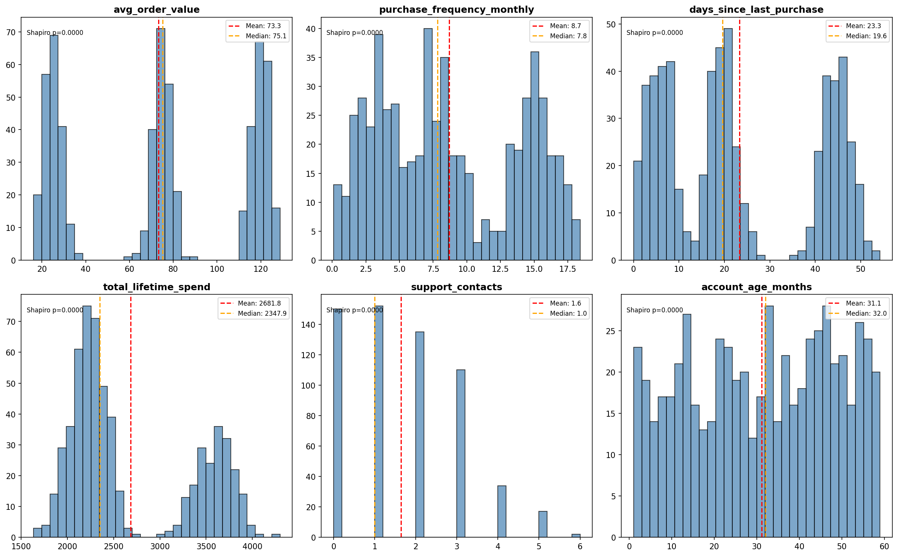

## 2. Correlation Structure

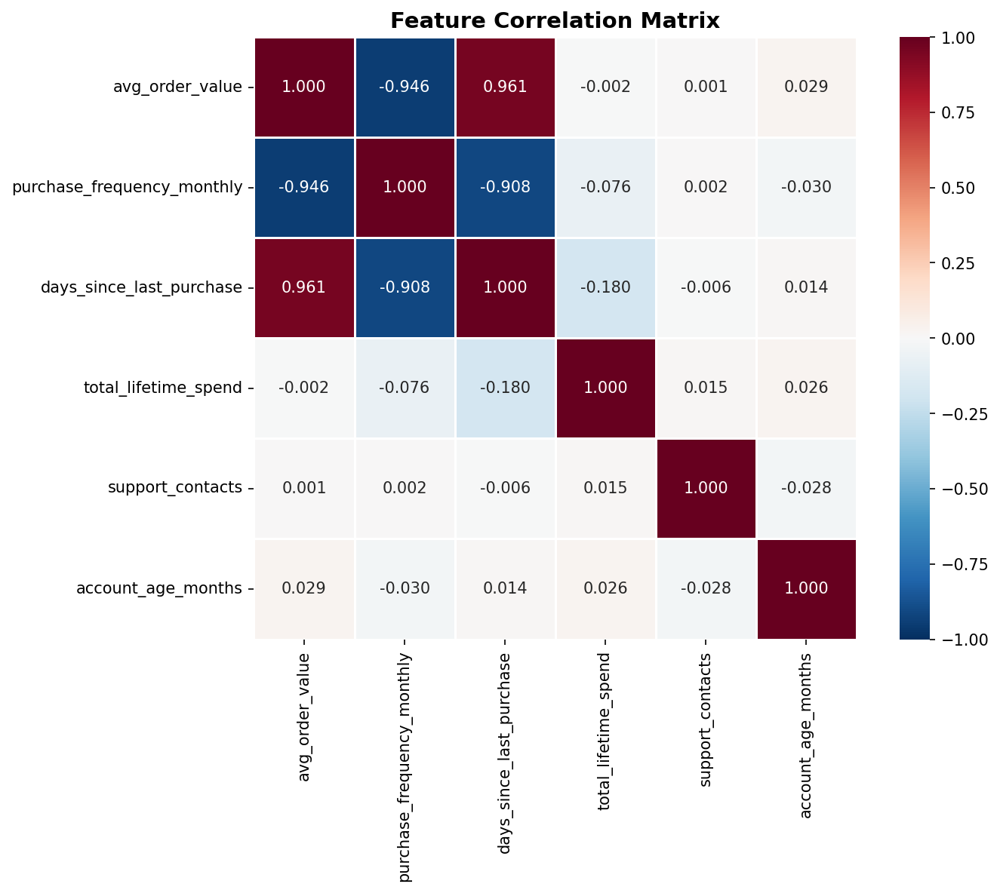

A striking correlation pattern emerged:

| Feature Pair | Pearson r |
|-------------|-----------|
| avg_order_value ↔ days_since_last_purchase | **+0.961** |
| avg_order_value ↔ purchase_frequency_monthly | **-0.946** |
| purchase_frequency_monthly ↔ days_since_last_purchase | **-0.908** |

These three behavioral features are nearly perfectly collinear — they describe a single latent dimension: **buying intensity**. Customers who buy often spend less per order and have purchased more recently; those who buy rarely spend more per order but haven't purchased in a while.

The remaining features (total_lifetime_spend, support_contacts, account_age_months) are essentially uncorrelated with this trio and with each other (|r| < 0.08 in all cases).

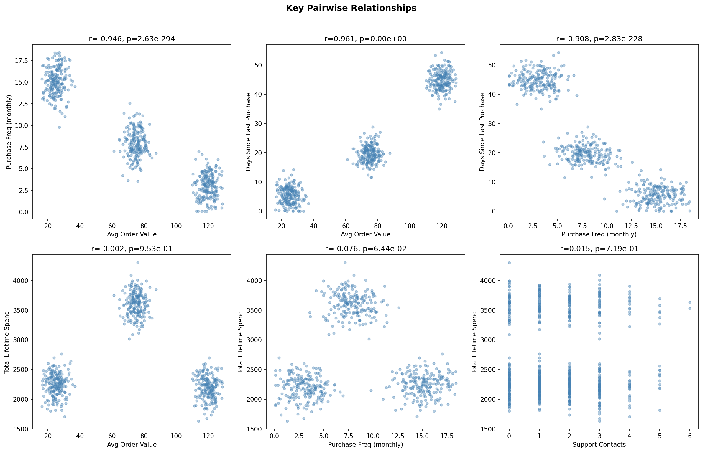

## 3. Multimodality Detection

All four behavioral features show negative kurtosis (platykurtic distributions), indicating potential multimodality. The bimodality coefficient (BC > 0.555 threshold) confirmed this:

| Feature | BC | Verdict |
|---------|----|---------|
| avg_order_value | 0.650 | **Multimodal** |
| purchase_frequency_monthly | 0.601 | **Multimodal** |
| days_since_last_purchase | 0.682 | **Multimodal** |
| total_lifetime_spend | 0.786 | **Multimodal** |
| support_contacts | 0.488 | Unimodal |
| account_age_months | 0.554 | Unimodal |

KDE analysis of avg_order_value revealed **three distinct peaks** at approximately $25, $75, and $120, strongly suggesting three natural customer segments.

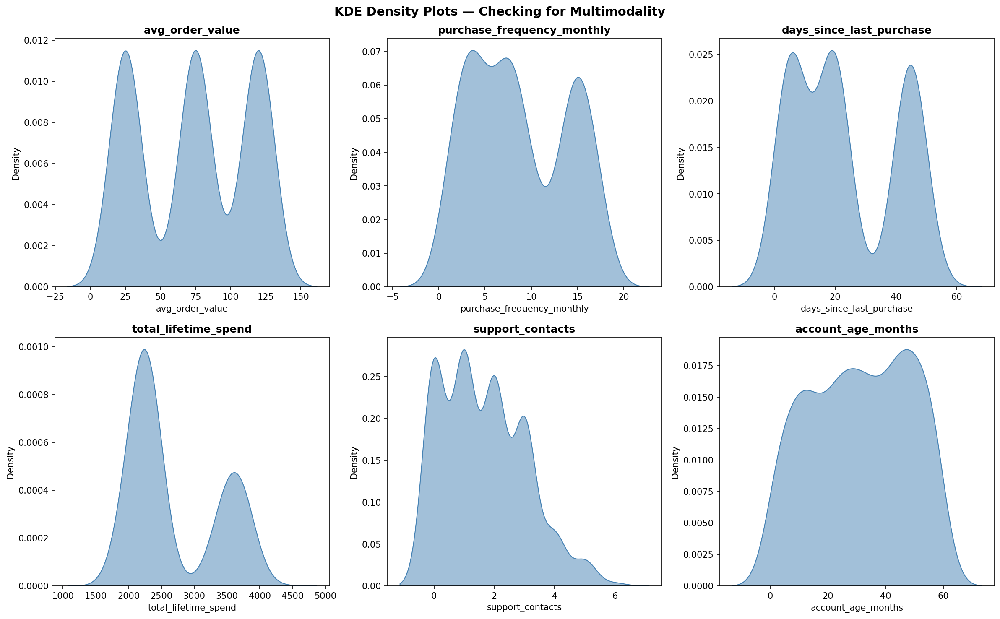

## 4. Customer Segmentation (K-Means Clustering)

### Cluster Selection

Four independent metrics unanimously selected **k = 3**:

| Metric | Best k |
|--------|--------|
| Silhouette Score (max) | 3 (0.453) |
| Calinski-Harabasz Index (max) | 3 (512.3) |
| Davies-Bouldin Index (min) | 3 (0.966) |
| Elbow Method | 3 (clear elbow) |

Cross-validation with Agglomerative Clustering produced **Adjusted Rand Index = 1.000** — perfect agreement, confirming the segments are unambiguous.

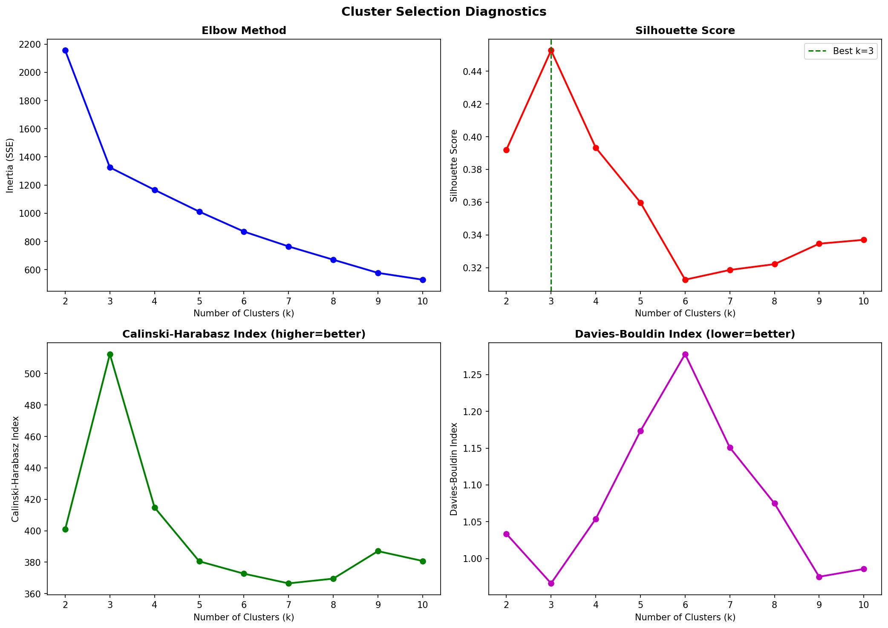
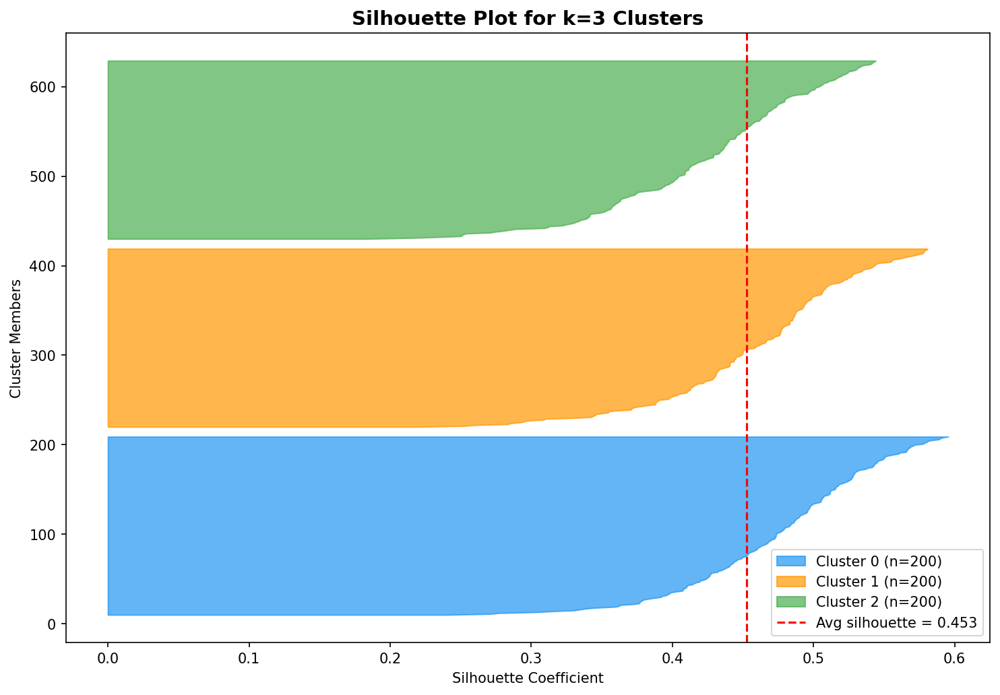
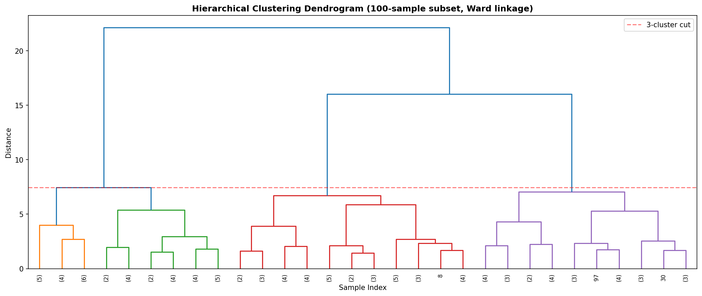

### Segment Profiles

Each cluster contains exactly 200 customers (perfectly balanced).

| Metric | Cluster 0: "Big-Ticket Infrequent" | Cluster 1: "Frequent Small-Basket" | Cluster 2: "Balanced High-Value" |
|--------|-------------------------------------|--------------------------------------|-----------------------------------|
| Avg Order Value | **$119.78** | $25.11 | $74.93 |
| Purchase Frequency | 3.05/month | **15.09/month** | 7.90/month |
| Days Since Last Purchase | 44.81 days | 5.46 days | 19.64 days |
| **Total Lifetime Spend** | $2,196 | $2,248 | **$3,601** |
| Support Contacts | 1.61 | 1.61 | 1.71 |
| Account Age | 31.1 months | 30.1 months | 32.1 months |

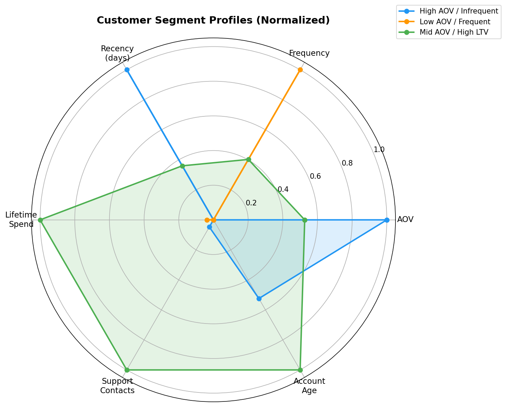
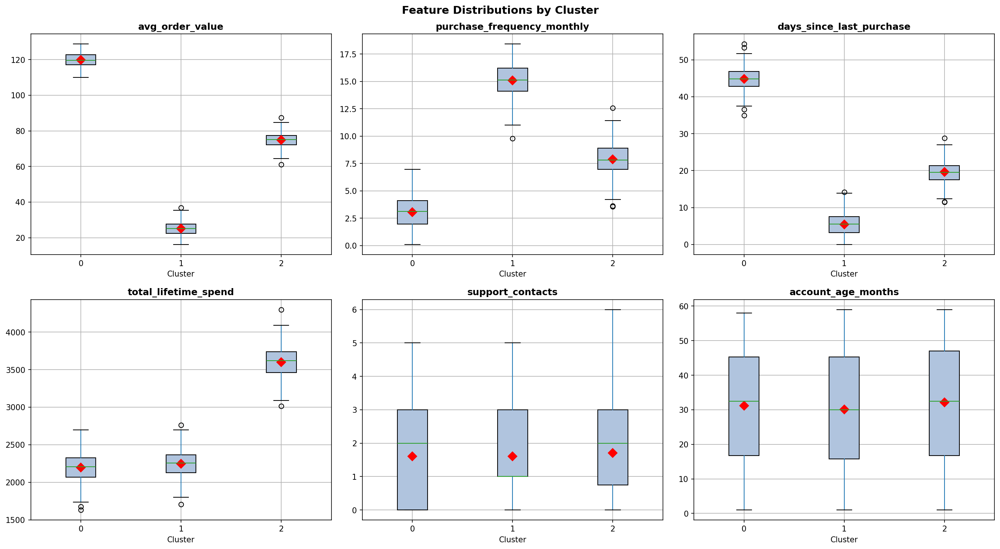
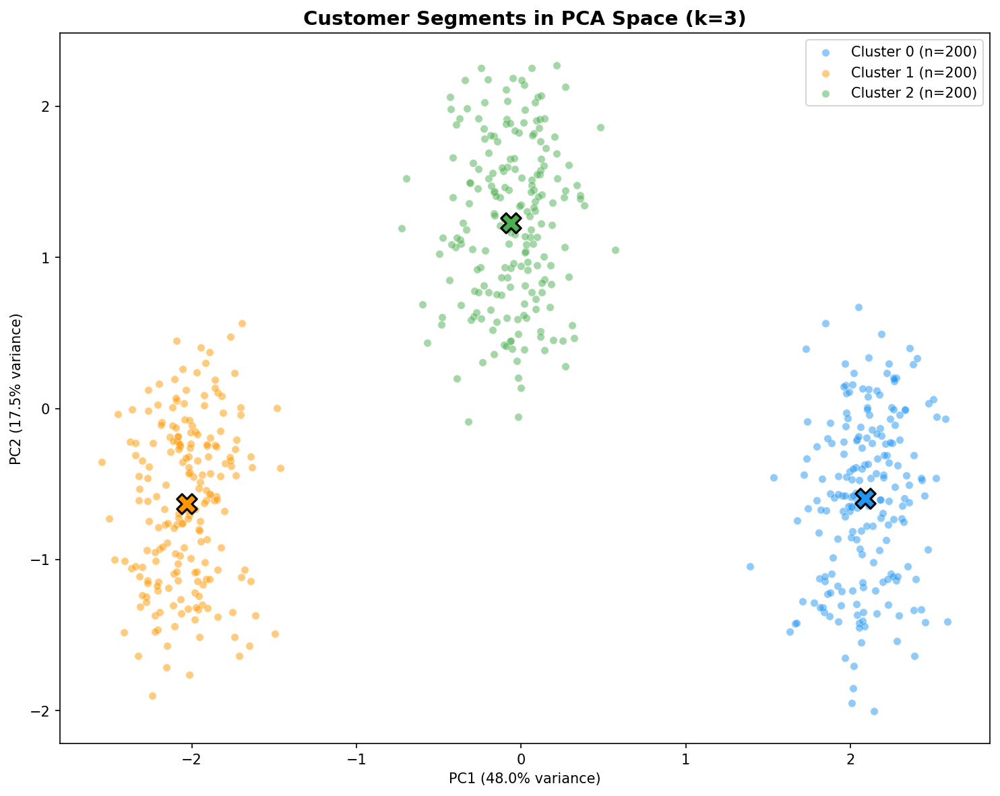

### Key Insight: The Moderation Premium

The most valuable customers are **not** the biggest spenders per transaction, nor the most frequent buyers. **Cluster 2** ("Balanced High-Value") — with moderate order values and moderate frequency — generates **60% more lifetime revenue** than either extreme segment.

This was confirmed by a Mann-Whitney U test: Cluster 2's lifetime spend is **perfectly separated** from the other two clusters (U = 0, p < 10⁻⁶⁶, rank-biserial r = -1.000). Every single customer in Cluster 2 has a higher total lifetime spend than every customer in Clusters 0 or 1.

Meanwhile, Clusters 0 and 1 have statistically similar lifetime spend despite opposite buying behaviors (Cohen's d = -0.27, a small effect).

### What Doesn't Differentiate the Segments

Support contacts (Kruskal-Wallis p = 0.80) and account age (p = 0.47) show **no significant difference** across clusters. These features are independent of the purchasing behavior that defines the segments.

## 5. Regression Analysis: What Drives Lifetime Spend?

### OLS Regression

A linear model predicting total_lifetime_spend from the other five features achieved R² = 0.468. However:

- Severe multicollinearity: VIF = 46.6 for avg_order_value, VIF = 38.3 for days_since_last_purchase
- Dropping collinear features reduced R² to 0.058 — the linear relationship is illusory, propped up by collinear redundancy

| Model | R² | Note |
|-------|----|------|
| Full OLS (5 predictors) | 0.468 | Inflated by multicollinearity (VIF > 46) |
| Reduced OLS (4 predictors) | 0.058 | True linear signal is negligible |
| **Random Forest (5-fold CV)** | **0.904** | Captures nonlinear segment structure |

### Why Random Forest Wins

The relationship between avg_order_value and total_lifetime_spend is **non-monotonic**: lifetime spend peaks at mid-range AOV (~$75) and drops at both extremes. A linear model cannot capture this inverted-U shape. Random Forest identified avg_order_value as the dominant predictor (83% importance), with days_since_last_purchase contributing 14%.

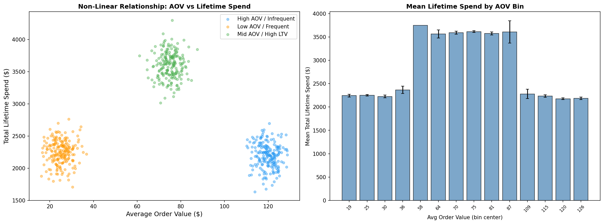
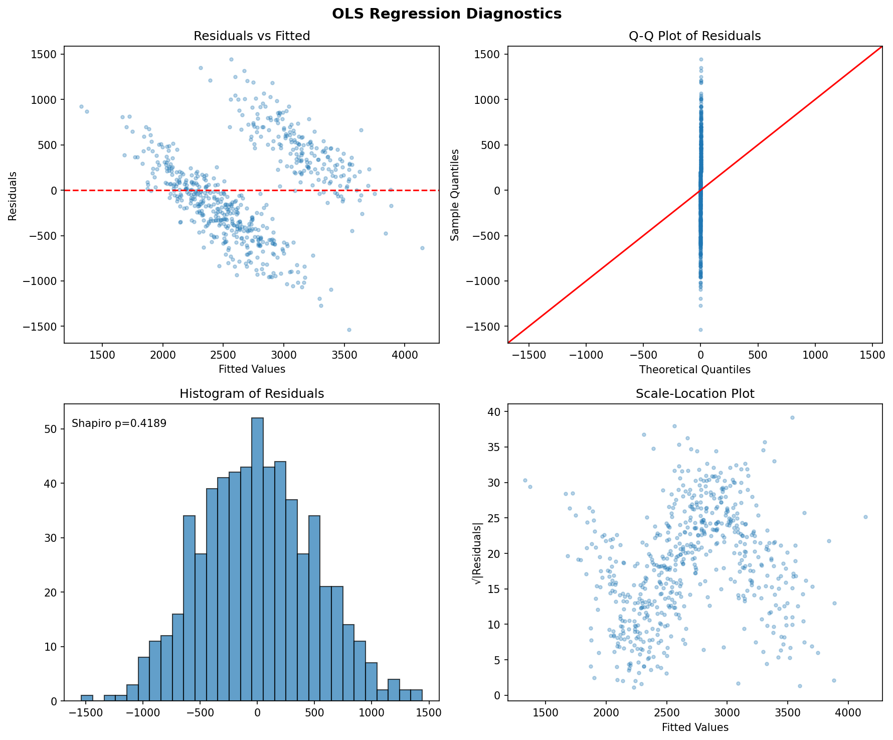

### OLS Residual Diagnostics

The full OLS model's residuals were approximately normal (Shapiro p = 0.295) with no heteroscedasticity — the linear model is correctly specified for a linear fit, it simply misses the dominant nonlinear structure.

## 6. PCA Dimensionality

PCA confirmed the feature structure:

- **PC1 (48.0% variance)**: Loaded on avg_order_value (+0.58), purchase_frequency (-0.57), and days_since_last_purchase (+0.58) — the "buying intensity" dimension
- **PC2 (17.5% variance)**: Loaded on total_lifetime_spend (+0.85) and account_age (+0.50) — the "customer value" dimension

Two PCs capture 65.5% of total variance. The three collinear features collapse onto a single principal component, confirming they measure one underlying construct.

## 7. Summary of Findings

1. **Three unambiguous customer segments exist**, defined by purchasing behavior (AOV, frequency, recency). All clustering metrics and two independent algorithms agree perfectly (ARI = 1.0).

2. **Moderate buyers are the most valuable.** Cluster 2 (mid-AOV $75, mid-frequency 8/month) generates $3,601 in lifetime revenue — 60% more than either the high-AOV infrequent buyers ($2,196) or the low-AOV frequent buyers ($2,248). This is a perfect separation with no overlap.

3. **The AOV-frequency-recency triad is a single latent dimension.** Correlations of |r| > 0.90 and a shared principal component confirm these three features are redundant. For modeling purposes, any one can represent the trio.

4. **Lifetime spend is nonlinear in purchasing behavior.** Linear regression explains only 5.8% of variance (after resolving collinearity), while Random Forest captures 90.4% by modeling the inverted-U shape.

5. **Support contacts and account age are noise variables** with respect to segmentation — they show no significant differences across segments and no predictive power for lifetime spend.

## 8. Business Recommendations

- **Prioritize the Balanced segment (Cluster 2) for retention.** These customers are the revenue backbone; losing even one costs ~$3,600.
- **Investigate conversion paths.** Can Frequent Small-Basket buyers be shifted toward moderate behavior (e.g., through bundling or upselling)? A $25→$75 AOV shift historically associates with $1,400 higher lifetime value.
- **Don't over-invest in Big-Ticket Infrequent buyers.** Despite high per-order value, they generate no more lifetime revenue than the small-basket buyers.
- **Simplify the feature set.** For any downstream models, avg_order_value alone captures the critical segmentation signal. Adding purchase_frequency and days_since_last_purchase adds collinearity without information.

## 9. Plots Index

| # | File | Description |
|---|------|-------------|
| 1 | `plots/01_distributions.png` | Histograms with normality tests |
| 2 | `plots/02_correlation_matrix.png` | Feature correlation heatmap |
| 3 | `plots/03_pairwise_scatter.png` | Key pairwise relationships |
| 4 | `plots/04_kde_multimodality.png` | KDE density plots showing multimodality |
| 5 | `plots/05_relationship_deep_dive.png` | AOV relationship deep dive |
| 6 | `plots/06_cluster_selection.png` | Elbow, silhouette, Calinski-Harabasz, Davies-Bouldin |
| 7 | `plots/07_silhouette_plot.png` | Per-sample silhouette analysis |
| 8 | `plots/08_pca_clusters.png` | Clusters in PCA space |
| 9 | `plots/09_dendrogram.png` | Hierarchical clustering dendrogram |
| 10 | `plots/10_radar_profiles.png` | Radar/spider chart of segment profiles |
| 11 | `plots/11_boxplots_by_cluster.png` | Feature distributions by cluster |
| 12 | `plots/12_regression_diagnostics.png` | OLS residual diagnostics |
| 13 | `plots/13_nonlinear_aov_vs_ltv.png` | Non-linear AOV vs lifetime spend |
| 14 | `plots/14_heatmap_freq_aov_ltv.png` | 2D heatmap: frequency × AOV → lifetime spend |
