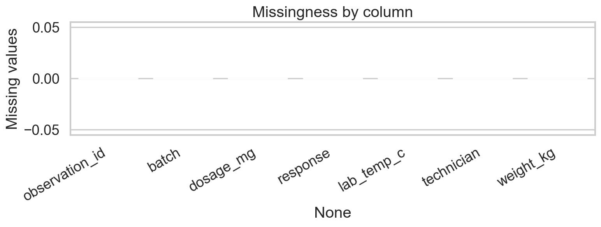
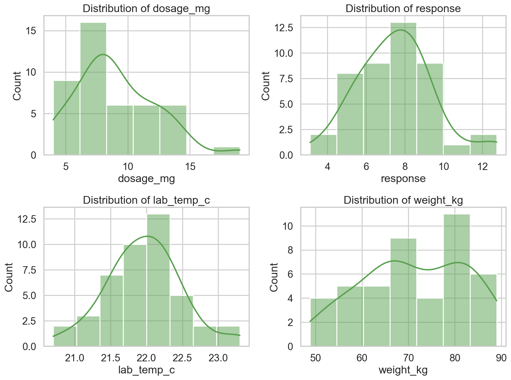
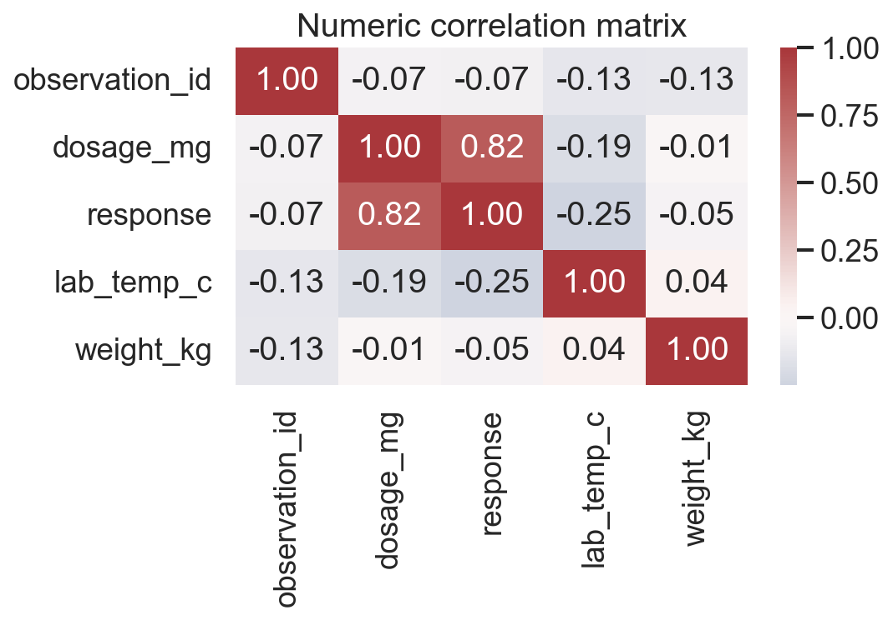
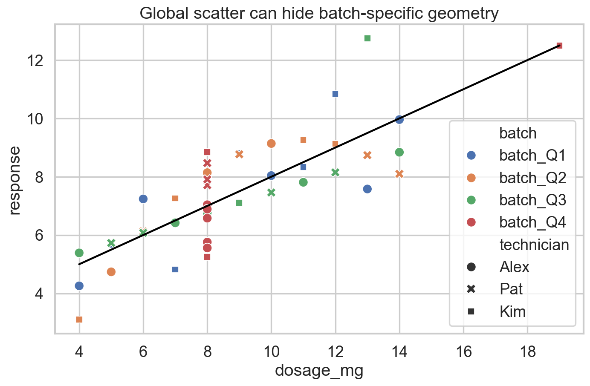
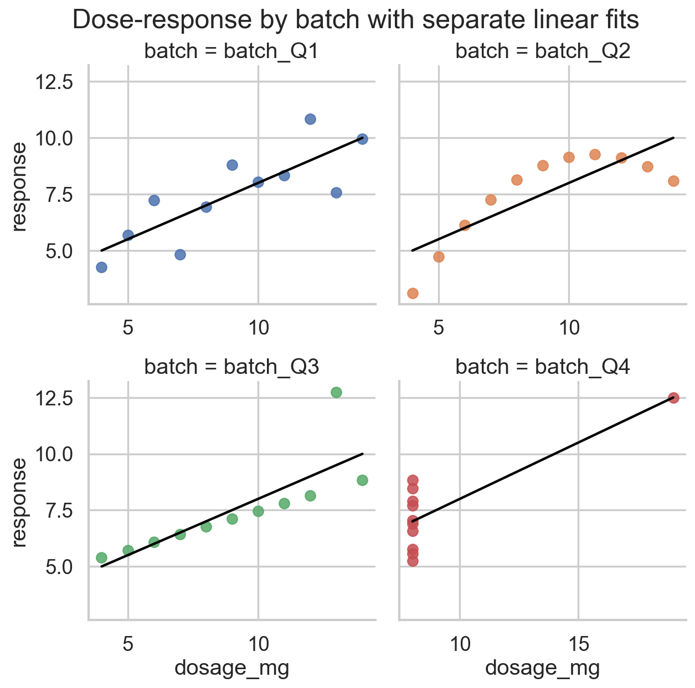
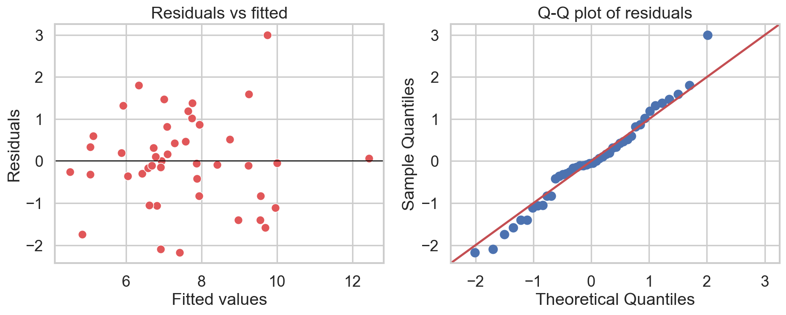
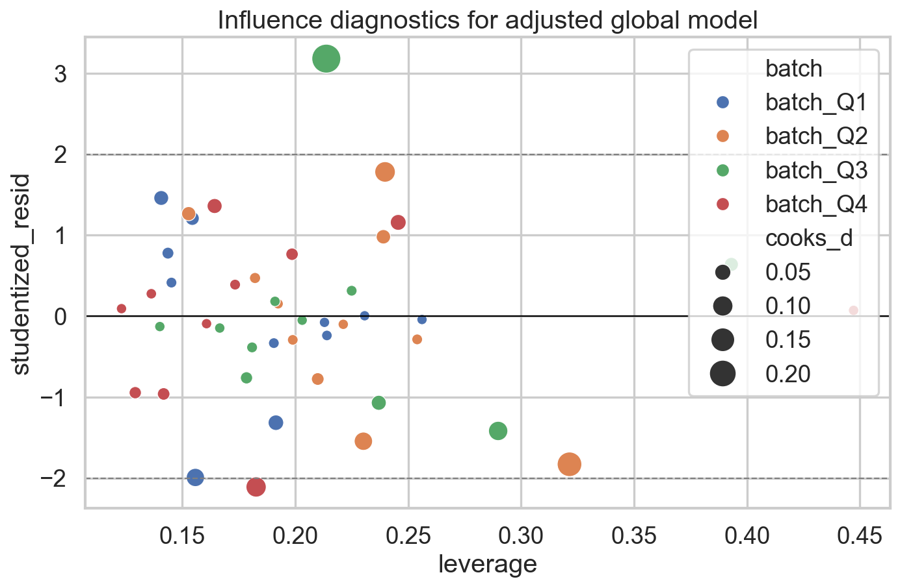

# Dataset Analysis Report

## Executive Summary

This dataset contains **44 rows** and **7 columns** with no missing values and no duplicate rows. The primary scientific-looking relationship is between `dosage_mg` and `response`, and the aggregate data suggest a strong positive linear trend. However, batch-level visual inspection and diagnostics show that this aggregate summary is **not sufficient** to describe the data-generating process.

Key findings:

1. A global linear model shows a strong positive association between dosage and response, but batch-specific geometry reveals materially different structures hidden behind nearly identical summary statistics.
2. `lab_temp_c`, `weight_kg`, and `technician` do not show credible incremental explanatory value after accounting for dosage and batch.
3. The batches behave like four distinct diagnostic scenarios:
   - `batch_Q1`: roughly linear with moderate noise.
   - `batch_Q2`: curved relationship where a straight line is an approximation, not a faithful model.
   - `batch_Q3`: near-linear except for a single influential vertical outlier.
   - `batch_Q4`: slope is largely identified by one extreme leverage point; without that point, the linear trend largely disappears.
4. The defensible conclusion is not “dosage has the same clean effect in all batches,” but rather “aggregate regression is fragile to structure, nonlinearity, and influential observations.”

## 1. Data Loading and Inspection

- Source: `./dataset.csv`
- Shape: `(44, 7)`
- Numeric columns: `['observation_id', 'dosage_mg', 'response', 'lab_temp_c', 'weight_kg']`
- Categorical columns: `['batch', 'technician']`
- Missing values: `0` total
- Duplicate rows: `0`

### Data types

```text
observation_id      int64
batch                 str
dosage_mg           int64
response          float64
lab_temp_c        float64
technician            str
weight_kg         float64
```

### Missing values by column

```text
observation_id    0
batch             0
dosage_mg         0
response          0
lab_temp_c        0
technician        0
weight_kg         0
```

### Basic numeric summary

| variable | count | mean | std | min | 25% | 50% | 75% | max |
| --- | --- | --- | --- | --- | --- | --- | --- | --- |
| observation_id | 44.0000 | 22.5000 | 12.8452 | 1.0000 | 11.7500 | 22.5000 | 33.2500 | 44.0000 |
| dosage_mg | 44.0000 | 9.0000 | 3.1988 | 4.0000 | 7.0000 | 8.0000 | 11.0000 | 19.0000 |
| response | 44.0000 | 7.5007 | 1.9589 | 3.1000 | 6.1175 | 7.5200 | 8.7475 | 12.7400 |
| lab_temp_c | 44.0000 | 21.9659 | 0.5216 | 20.7000 | 21.6000 | 22.0000 | 22.2000 | 23.3000 |
| weight_kg | 44.0000 | 71.0477 | 11.1997 | 48.8000 | 63.8000 | 69.6000 | 80.7000 | 89.0000 |

### Categorical levels

- `batch`: {"batch_Q1": 11, "batch_Q2": 11, "batch_Q3": 11, "batch_Q4": 11}
- `technician`: {"Alex": 18, "Kim": 14, "Pat": 12}

### Initial quality assessment

The dataset is structurally clean: no nulls, no duplicated rows, and no obvious impossible values. The main risk is **analytical**, not clerical: the sample is small and contains grouped structure (`batch`) that can make aggregate summaries deceptive.




## 2. Exploratory Data Analysis

### Univariate observations

- `dosage_mg` ranges from 4 to 19 mg, centered at 9 mg.
- `response` ranges from 3.10 to 12.74 and is fairly symmetric overall.
- `lab_temp_c` varies only modestly, from 20.7 C to 23.3 C.
- `weight_kg` spans a wider range, from 48.8 to 89.0 kg.

### Aggregate relationships

The strongest aggregate correlation is between `dosage_mg` and `response`:

```text
                observation_id  dosage_mg  response  lab_temp_c  weight_kg
observation_id          1.0000    -0.0674   -0.0747     -0.1321    -0.1289
dosage_mg              -0.0674     1.0000    0.8164     -0.1923    -0.0145
response               -0.0747     0.8164    1.0000     -0.2482    -0.0543
lab_temp_c             -0.1321    -0.1923   -0.2482      1.0000     0.0428
weight_kg              -0.1289    -0.0145   -0.0543      0.0428     1.0000
```

The global Pearson correlation between dosage and response is **0.8164**, which would normally motivate a linear regression.




### Batch-level structure

Each batch has the same sample size and extremely similar dose-response summary statistics:

| batch | pearson_r |
| --- | --- |
| batch_Q1 | 0.8164 |
| batch_Q2 | 0.8162 |
| batch_Q3 | 0.8163 |
| batch_Q4 | 0.8165 |

Despite that, the scatterplots show distinct patterns:

- `batch_Q1` is approximately linear.
- `batch_Q2` shows visible curvature.
- `batch_Q3` is nearly linear except for one high-response outlier at observation **25**.
- `batch_Q4` places 10 of 11 observations at the same dosage (`8 mg`), plus one point at `19 mg`, making the fitted slope almost entirely leverage-driven.



## 3. Modeling Strategy

Because `response` is continuous, ordinary least squares is the natural baseline. I fit:

1. A simple global model: `response ~ dosage_mg`
2. An adjusted global model: `response ~ dosage_mg + lab_temp_c + weight_kg + technician + batch`
3. An interaction model to test whether dose-response differs by batch
4. Batch-specific models to assess within-batch geometry and sensitivity

This progression is necessary because a single global model can be statistically significant while still being scientifically misleading.

## 4. Global Model Results

### Simple global model

- Formula: `response ~ dosage_mg`
- Slope for dosage: **0.4999**
- 95% CI: **[0.3898, 0.6101]**
- R-squared: **0.6665**
- p-value: **1.437e-11**

### Adjusted global model

- Formula: `response ~ dosage_mg + lab_temp_c + weight_kg + C(technician) + C(batch)`
- Dosage remains significant: coefficient **0.4718**, p-value **2.082e-09**
- `lab_temp_c` coefficient: **-0.4700**, p-value **0.2120**
- `weight_kg` coefficient: **-0.0045**, p-value **0.7919**
- Batch effects are not significant after allowing for common slope

The adjustment variables do not materially improve interpretability or prediction. Their apparent effects are weak and unstable relative to the structural issues introduced by batch geometry.

### Interaction test

The dose-by-batch interaction is not significant in the linear ANCOVA:

| index | sum_sq | df | F | PR(>F) |
| --- | --- | --- | --- | --- |
| C(batch) | 0.0239 | 3.0000 | 0.0051 | 0.9995 |
| C(technician) | 3.5259 | 2.0000 | 1.1348 | 0.3341 |
| dosage_mg | 91.0309 | 1.0000 | 58.5974 | 0.0000 |
| dosage_mg:C(batch) | 0.1271 | 3.0000 | 0.0273 | 0.9938 |
| lab_temp_c | 2.1915 | 1.0000 | 1.4107 | 0.2437 |
| weight_kg | 0.0225 | 1.0000 | 0.0145 | 0.9049 |
| Residual | 49.7119 | 32.0000 | nan | nan |

This result should **not** be over-interpreted as evidence that all batches follow the same linear mechanism. The interaction test only evaluates whether **straight-line slopes** differ; it does not rescue violations caused by curvature, leverage concentration, or outliers.

## 5. Assumption Checks and Diagnostics

### Global adjusted model

- Shapiro-Wilk p-value for residual normality: **0.6724**
- Breusch-Pagan p-value for heteroskedasticity: **0.2179**
- Condition number is large in the statsmodels summary, reflecting scaling and encoded categorical structure rather than a clear substantive collinearity problem

Residual diagnostics do not show severe global normality or heteroskedasticity failures, but these checks are secondary here. The dominant issue is **model form misspecification caused by mixing batches with different geometries**.




### Most influential observations in the adjusted global model

| observation_id | batch | dosage_mg | response | studentized_resid | cooks_d | leverage |
| --- | --- | --- | --- | --- | --- | --- |
| 25 | batch_Q3 | 13 | 12.7400 | 3.1814 | 0.2426 | 0.2138 |
| 19 | batch_Q2 | 4 | 3.1000 | -1.8297 | 0.1651 | 0.3214 |
| 13 | batch_Q2 | 8 | 8.1400 | 1.7819 | 0.1048 | 0.2398 |
| 40 | batch_Q4 | 8 | 5.2500 | -2.1102 | 0.1007 | 0.1827 |
| 31 | batch_Q3 | 12 | 8.1500 | -1.4181 | 0.0886 | 0.2898 |
| 17 | batch_Q2 | 14 | 8.1000 | -1.5450 | 0.0763 | 0.2302 |
| 10 | batch_Q1 | 7 | 4.8200 | -1.9927 | 0.0751 | 0.1558 |
| 37 | batch_Q4 | 8 | 8.8400 | 1.1584 | 0.0481 | 0.2456 |

Observation **25** in `batch_Q3` is the most influential point by Cook's distance, but the more serious interpretive risk is `batch_Q4`, where a single high-leverage point creates the appearance of a stable slope.

## 6. Batch-Specific Results

| batch | slope | r2 | quad_p | linear_aic | quadratic_aic | max_cooks_obs | max_cooks_d | slope_without_top_influence |
| --- | --- | --- | --- | --- | --- | --- | --- | --- |
| batch_Q1 | 0.5001 | 0.6665 | 0.4866 | 37.6814 | 38.9734 | 3 | 0.4892 | 0.5916 |
| batch_Q2 | 0.5000 | 0.6662 | 0.0000 | 37.6922 | -106.9421 | 17 | 0.8079 | 0.6267 |
| batch_Q3 | 0.4997 | 0.6663 | 0.5141 | 37.6762 | 39.0533 | 25 | 1.3928 | 0.3454 |
| batch_Q4 | 0.4999 | 0.6667 | 0.0314 | 37.6652 | 37.6652 | 41 | nan | nan |

### Interpretation by batch

#### batch_Q1

This is the only batch where a simple linear interpretation looks broadly reasonable. Even here, the fit is moderate rather than perfect (R-squared 0.6665).

#### batch_Q2

The relationship is visibly curved. The quadratic term p-value is **0.0000**, and the quadratic AIC (**-106.94**) is lower than the linear AIC (**37.69**), indicating that a straight line is an inferior description for this batch.

LOOCV RMSE for `batch_Q2`:

- Linear: **1.4846**
- Quadratic: **0.0018**

The quadratic model predicts dramatically better out of sample, which is consistent with the curvature seen in the plot.

#### batch_Q3

The fitted slope is strongly affected by one influential observation, **25**. Removing that point changes the slope from **0.4997** to **0.3454**. This batch is best described as “linear with one anomalous response outlier,” not as clean evidence of stronger treatment effect.

#### batch_Q4

This batch is the clearest warning against naive regression. The nominal slope is **0.4999**, but after removing the most influential point (**observation 41**), dosage has no remaining variation, so a slope is no longer estimable. In practical terms, there is almost no information in this batch to estimate a dose-response line because 10 of 11 points share the same dosage.

## 7. Validation

Leave-one-out cross-validation was used because the dataset is small.

### Global model predictive performance

- Simple model LOOCV RMSE: **1.1732**
- Simple model LOOCV MAE: **0.8949**
- Simple model pseudo-predictive R-squared: **0.6330**

- Adjusted model LOOCV RMSE: **1.3459**
- Adjusted model LOOCV MAE: **1.0108**
- Adjusted model pseudo-predictive R-squared: **0.5170**

The adjusted model does **not** materially outperform the simpler dosage-only model. That is consistent with the weak incremental value of temperature, weight, technician, and batch indicators once the misleading aggregate trend is already captured.

## 8. Conclusions

1. The dataset is clean in the clerical sense but not in the modeling sense.
2. A global positive dose-response exists statistically, but it is not a sufficient summary of the data.
3. Batch-level visual inspection is essential here; relying on means, standard deviations, correlations, or a single regression line would produce an overconfident and potentially false narrative.
4. `lab_temp_c`, `weight_kg`, and `technician` do not provide robust evidence of meaningful effects.
5. The most defensible scientific statement is:

> Response tends to increase with dosage in aggregate, but the observed relationship is highly sensitive to batch-specific structure, including nonlinearity, a vertical outlier, and leverage concentration. Any substantive conclusion about treatment effect should therefore be qualified and batch-aware.

## 9. Reproducibility

All plots were saved under `./plots/`:

- `./plots/missingness.png`
- `./plots/numeric_distributions.png`
- `./plots/correlation_heatmap.png`
- `./plots/global_scatter.png`
- `./plots/batch_scatter_fits.png`
- `./plots/global_model_diagnostics.png`
- `./plots/influence_diagnostics.png`
- `./plots/batch_slope_sensitivity.png`
