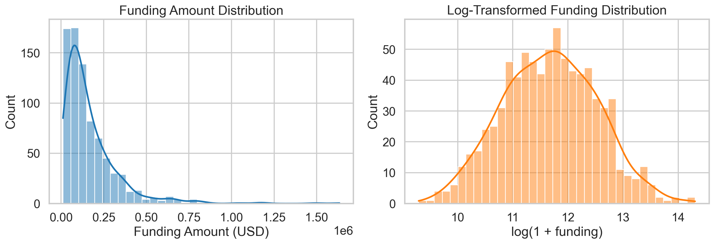
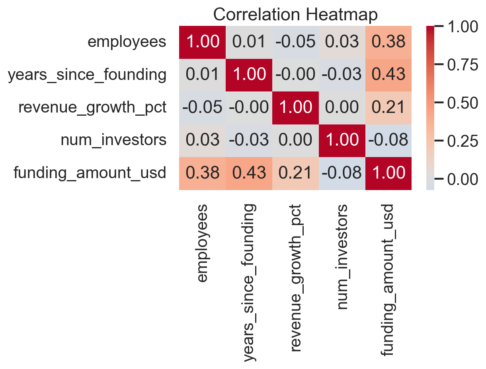
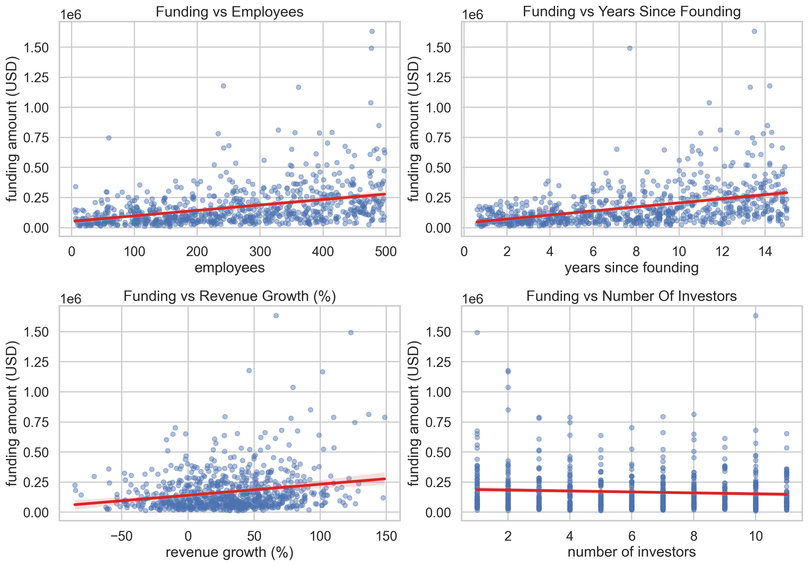
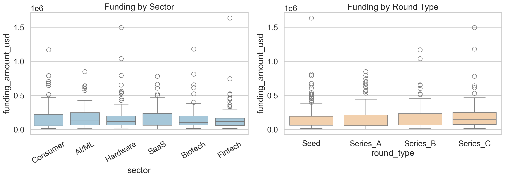
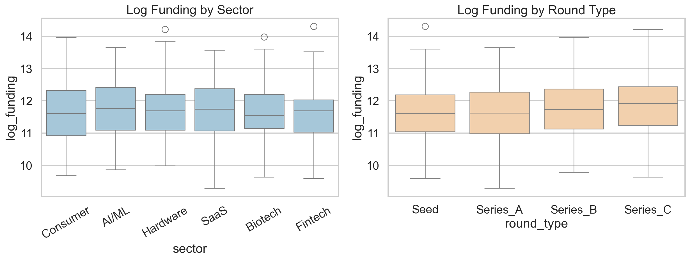
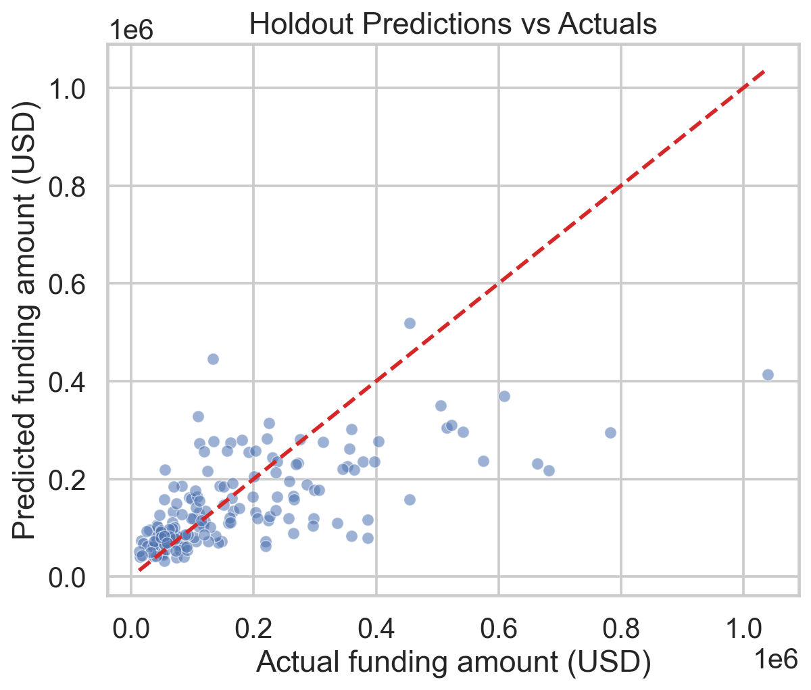
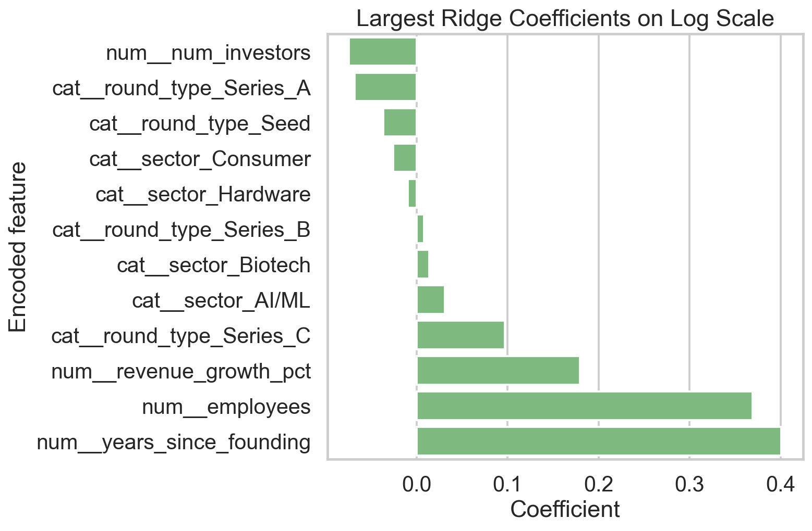
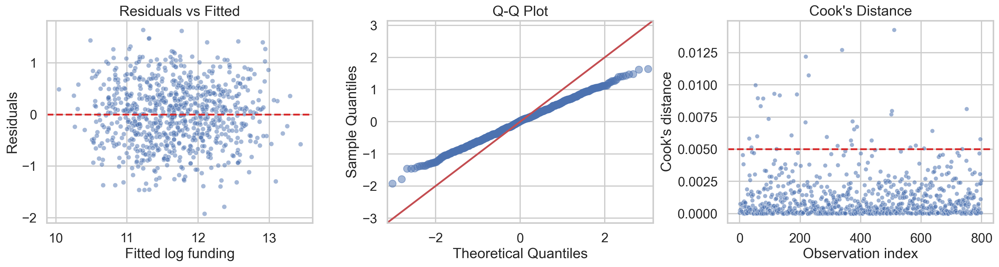

# Dataset Analysis Report

## Scope
This report analyzes [`dataset.csv`](./dataset.csv) as a funding dataset with 800 company records. The work covers data inspection, exploratory analysis, anomaly checks, predictive modeling, formal assumption checks, and visual outputs saved under [`plots/`](./plots/).

## 1. Data Loading And Inspection

### Dataset shape and integrity
- Rows: 800
- Columns: 8
- Duplicate rows: 0
- Duplicate company IDs: 0
- Missing values: none detected in any source column

### Data types
| index | dtype |
| --- | --- |
| company_id | str |
| sector | str |
| round_type | str |
| employees | int64 |
| years_since_founding | float64 |
| revenue_growth_pct | float64 |
| num_investors | int64 |
| funding_amount_usd | int64 |

### Null counts
| index | null_count |
| --- | --- |
| company_id | 0 |
| sector | 0 |
| round_type | 0 |
| employees | 0 |
| years_since_founding | 0 |
| revenue_growth_pct | 0 |
| num_investors | 0 |
| funding_amount_usd | 0 |

### Numeric summary statistics
| index | count | mean | std | min | 25% | 50% | 75% | max |
| --- | --- | --- | --- | --- | --- | --- | --- | --- |
| employees | 800.0 | 255.39 | 140.71 | 5.0 | 134.75 | 256.0 | 377.0 | 498.0 |
| years_since_founding | 800.0 | 7.75 | 4.27 | 0.6 | 3.9 | 7.8 | 11.5 | 15.0 |
| revenue_growth_pct | 800.0 | 30.22 | 38.52 | -85.5 | 3.1 | 31.2 | 55.22 | 148.6 |
| num_investors | 800.0 | 5.96 | 3.19 | 1.0 | 3.0 | 6.0 | 9.0 | 11.0 |
| funding_amount_usd | 800.0 | 168083.13 | 167631.26 | 10846.0 | 63430.5 | 118934.0 | 216470.0 | 1633984.0 |

### Categorical balance
| column | category | count | share_pct |
| --- | --- | --- | --- |
| sector | AI/ML | 143 | 17.88 |
| sector | Fintech | 140 | 17.5 |
| sector | Consumer | 138 | 17.25 |
| sector | Hardware | 131 | 16.38 |
| sector | SaaS | 124 | 15.5 |
| sector | Biotech | 124 | 15.5 |
| round_type | Seed | 324 | 40.5 |
| round_type | Series_A | 219 | 27.38 |
| round_type | Series_B | 155 | 19.38 |
| round_type | Series_C | 102 | 12.75 |

## 2. Exploratory Data Analysis

### Distributional shape
- `employees`, `years_since_founding`, `revenue_growth_pct`, and `num_investors` are approximately symmetric to mildly skewed.
- `funding_amount_usd` is highly right-skewed with skewness 3.23; a log transform materially improves symmetry.
- Median funding is $118,934; mean funding is $168,083, indicating the mean is pulled upward by a small number of large rounds.

### Quantiles
| index | employees | years_since_founding | revenue_growth_pct | num_investors | funding_amount_usd |
| --- | --- | --- | --- | --- | --- |
| 0.01 | 9.99 | 0.8 | -59.6 | 1.0 | 17777.63 |
| 0.05 | 39.0 | 1.3 | -33.51 | 1.0 | 28452.6 |
| 0.25 | 134.75 | 3.9 | 3.1 | 3.0 | 63430.5 |
| 0.5 | 256.0 | 7.8 | 31.2 | 6.0 | 118934.0 |
| 0.75 | 377.0 | 11.5 | 55.22 | 9.0 | 216470.0 |
| 0.95 | 477.0 | 14.3 | 94.92 | 11.0 | 455022.25 |
| 0.99 | 494.01 | 14.9 | 122.01 | 11.0 | 790012.71 |

### Correlation matrix
| index | employees | years_since_founding | revenue_growth_pct | num_investors | funding_amount_usd |
| --- | --- | --- | --- | --- | --- |
| employees | 1.0 | 0.008 | -0.045 | 0.034 | 0.38 |
| years_since_founding | 0.008 | 1.0 | -0.0 | -0.03 | 0.431 |
| revenue_growth_pct | -0.045 | -0.0 | 1.0 | 0.003 | 0.21 |
| num_investors | 0.034 | -0.03 | 0.003 | 1.0 | -0.076 |
| funding_amount_usd | 0.38 | 0.431 | 0.21 | -0.076 | 1.0 |

### Group summaries
Funding by sector:

| sector | count | mean | median | std |
| --- | --- | --- | --- | --- |
| Consumer | 138 | 176055.78 | 110924.5 | 182571.97 |
| AI/ML | 143 | 175213.15 | 128987.0 | 148425.12 |
| Hardware | 131 | 173709.09 | 119240.0 | 194567.12 |
| SaaS | 124 | 167317.55 | 125853.5 | 142037.77 |
| Biotech | 124 | 161807.67 | 104288.0 | 161843.33 |
| Fintech | 140 | 153913.64 | 119768.0 | 171313.79 |

Funding by round type:

| round_type | count | mean | median | std |
| --- | --- | --- | --- | --- |
| Seed | 324 | 154565.83 | 110934.0 | 155274.83 |
| Series_A | 219 | 161238.74 | 111167.0 | 154455.03 |
| Series_B | 155 | 181261.61 | 124720.0 | 171802.45 |
| Series_C | 102 | 205689.66 | 150396.0 | 215206.04 |

Mean funding by sector and round:

| sector | Seed | Series_A | Series_B | Series_C |
| --- | --- | --- | --- | --- |
| AI/ML | 151725.68 | 181778.44 | 195643.1 | 197521.25 |
| Biotech | 158796.12 | 116977.21 | 145903.22 | 247617.8 |
| Consumer | 156295.24 | 167475.74 | 213399.81 | 189374.31 |
| Fintech | 173672.78 | 137170.97 | 157853.0 | 105677.77 |
| Hardware | 147895.84 | 184736.74 | 169300.44 | 237598.63 |
| SaaS | 134633.49 | 168982.47 | 188936.36 | 215123.71 |

### Visualizations
- 
- 
- 
- 
- 

## 3. Patterns, Relationships, And Anomalies

### Key patterns
- The dataset contains 800 companies with no missing values, no duplicate rows, and no duplicated `company_id` values.
- `funding_amount_usd` is strongly right-skewed (skew=3.23); the top 1% of deals exceed $790,013, while the median is only $118,934.
- On simple correlations, funding is most associated with `years_since_founding` (r=0.43) and `employees` (r=0.38), with a smaller relationship for `revenue_growth_pct` (r=0.21).
- Average funding rises across rounds from $154,566 for Seed to $205,690 for Series C, but sector-level averages are much closer together than round-level averages.
- The best cross-validated predictive model was log-target ridge regression (mean CV R²=0.380, mean CV RMSE=$129,907), slightly ahead of the raw-scale linear model and clearly ahead of the tested tree ensembles.
- In the log-linear inference model, `employees`, `years_since_founding`, and `revenue_growth_pct` are positive and statistically robust predictors, while `num_investors` is weakly negative after adjustment and only `Series_C` shows a clear positive round effect relative to Seed.

### Outlier review
- Using the IQR rule on `funding_amount_usd`, 42 observations exceed the upper outlier threshold of $446,029.
- Using a 3 standard deviation rule, 15 funding observations are extreme.
- These observations are not obvious data-entry errors: the predictors remain within plausible business ranges, so they should be treated as influential but valid cases rather than automatically removed.

Top influential cases by Cook's distance from the log-linear model:

| company_id | funding_amount_usd | employees | years_since_founding | revenue_growth_pct | num_investors | sector | round_type | cooks_distance |
| --- | --- | --- | --- | --- | --- | --- | --- | --- |
| CO-0511 | 26099 | 174 | 14.8 | 50.1 | 11 | Consumer | Seed | 0.0143 |
| CO-0338 | 39438 | 364 | 11.9 | 0.0 | 1 | Hardware | Series_B | 0.0127 |
| CO-0218 | 359895 | 288 | 6.0 | -60.0 | 3 | Consumer | Series_C | 0.0122 |
| CO-0228 | 1493222 | 477 | 7.7 | 123.1 | 1 | Hardware | Series_C | 0.0107 |
| CO-0052 | 745664 | 59 | 13.4 | 126.1 | 4 | Fintech | Series_A | 0.01 |
| CO-0114 | 1179223 | 241 | 14.2 | 46.1 | 2 | Biotech | Series_C | 0.0093 |
| CO-0189 | 150392 | 67 | 1.1 | 41.9 | 10 | Consumer | Series_B | 0.0093 |
| CO-0132 | 15315 | 13 | 8.6 | -32.2 | 5 | Biotech | Series_C | 0.0092 |
| CO-0059 | 20482 | 25 | 9.6 | 26.6 | 8 | Consumer | Series_C | 0.009 |
| CO-0077 | 133075 | 432 | 14.6 | 68.0 | 10 | AI/ML | Series_C | 0.009 |

## 4. Modeling Strategy

### Why a log-target regression?
Raw funding is strongly right-skewed, so fitting a model directly on dollars gives heteroskedastic residuals and places too much weight on a small number of very large deals. A log transform makes the target closer to Gaussian and improved validation metrics. I therefore used:

1. An interpretable OLS model on `log(1 + funding_amount_usd)` for coefficient interpretation and diagnostics.
2. A ridge regression with the same log target for final predictive evaluation, because it slightly outperformed the unregularized linear model in cross-validation while remaining transparent.
3. Random forest and histogram gradient boosting as non-linear benchmarks.

### Cross-validated model comparison
| model | cv_r2_mean | cv_r2_std | cv_mae_mean | cv_rmse_mean |
| --- | --- | --- | --- | --- |
| ridge_log | 0.38 | 0.033 | 76243.5 | 129906.9 |
| linear_raw | 0.363 | 0.021 | 86888.3 | 131389.3 |
| random_forest_log | 0.335 | 0.036 | 79772.7 | 134154.3 |
| hist_gradient_boosting_log | 0.295 | 0.037 | 83674.1 | 137705.2 |

### Holdout performance for the selected ridge model
- Test R²: 0.385
- Test MAE: $82,412
- Test RMSE: $128,411
- Median absolute percentage error: 0.407
- 90th percentile absolute percentage error: 1.372
- Selected ridge penalty alpha: 31.6228

### Holdout prediction plot
- 

### Largest ridge coefficients
| feature | coefficient |
| --- | --- |
| num__years_since_founding | 0.401 |
| num__employees | 0.3695 |
| num__revenue_growth_pct | 0.1795 |
| cat__round_type_Series_C | 0.097 |
| num__num_investors | -0.0744 |
| cat__round_type_Series_A | -0.0683 |
| cat__round_type_Seed | -0.0367 |
| cat__sector_AI/ML | 0.0312 |
| cat__sector_Consumer | -0.0257 |
| cat__sector_Biotech | 0.0137 |
| cat__sector_Hardware | -0.0095 |
| cat__round_type_Series_B | 0.008 |

- 

## 5. Model Assumptions And Validation

### OLS coefficient table on log funding
| index | coef | p_value | robust_se | robust_p_value |
| --- | --- | --- | --- | --- |
| Intercept | 10.1213 | 0.0 | 0.0899 | 0.0 |
| C(sector)[T.Biotech] | 0.009 | 0.9033 | 0.071 | 0.8991 |
| C(sector)[T.Consumer] | -0.0331 | 0.6447 | 0.0788 | 0.6746 |
| C(sector)[T.Fintech] | -0.029 | 0.6853 | 0.0682 | 0.6707 |
| C(sector)[T.Hardware] | -0.006 | 0.9341 | 0.0703 | 0.9318 |
| C(sector)[T.SaaS] | 0.0166 | 0.822 | 0.0733 | 0.8207 |
| C(round_type)[T.Series_A] | 0.0023 | 0.9652 | 0.0531 | 0.9654 |
| C(round_type)[T.Series_B] | 0.0754 | 0.2019 | 0.0586 | 0.199 |
| C(round_type)[T.Series_C] | 0.1675 | 0.0148 | 0.0697 | 0.0165 |
| employees | 0.0028 | 0.0 | 0.0002 | 0.0 |
| years_since_founding | 0.0993 | 0.0 | 0.005 | 0.0 |
| revenue_growth_pct | 0.0048 | 0.0 | 0.0006 | 0.0 |
| num_investors | -0.0173 | 0.0097 | 0.0068 | 0.0109 |

### Assumption checks
- Multicollinearity is negligible among numeric predictors: all VIF values are near 1.
- Residual normality is acceptable after the log transform: Jarque-Bera statistic = 2.401, p-value = 0.301, residual skew = -0.059, residual kurtosis = 2.759.
- Heteroskedasticity is still detectable but mild: Breusch-Pagan statistic = 23.433, p-value = 0.024. This means coefficient standard errors from plain OLS may be slightly optimistic.
- To account for that, the report includes HC3 robust standard errors and p-values (`robust_se`, `robust_p_value`) alongside classical OLS statistics.
- Influence is non-trivial but not catastrophic: the largest Cook's distance is 0.0143, and 35 observations exceed the common 4/n heuristic threshold of 0.0050.

### VIF table
| feature | vif |
| --- | --- |
| const | 11.744 |
| employees | 1.003 |
| years_since_founding | 1.001 |
| revenue_growth_pct | 1.002 |
| num_investors | 1.002 |

### Diagnostic plots
- 

## 6. Findings

### Main conclusions
- The dataset is structurally clean: no missingness, no duplicate entities, and balanced categorical coverage.
- Funding amounts are dominated by a long right tail, so analysis on the raw target alone would be misleading.
- Company maturity and scale matter most: older firms and firms with more employees tend to raise more capital.
- Revenue growth adds signal even after controlling for age, size, sector, and round type.
- Round type has a directionally positive effect, but only Series C is clearly distinct from Seed after adjusting for other features.
- Sector labels add relatively little explanatory power in this dataset once the numeric business characteristics are included.
- Predictive power is moderate rather than high. The selected model explains about 39% of variance on a holdout split, which is reasonable but leaves substantial unexplained variation. Funding decisions likely depend on features not present here.

### Practical interpretation
- Increasing `years_since_founding` by one year is associated with an estimated 9.9% increase in expected funding on the log scale, holding other variables fixed.
- Increasing `employees` by 100 is associated with roughly 32.0% higher expected funding, all else equal.
- A 10 percentage point increase in `revenue_growth_pct` corresponds to roughly 4.9% higher expected funding, all else equal.
- The negative adjusted coefficient on `num_investors` should not be interpreted causally; it likely reflects residual confounding or deal-structure differences not captured in the available features.

## 7. Limitations
- This appears to be a compact tabular dataset with only seven usable predictors. Unobserved variables such as geography, profitability, valuation, founder track record, and macro conditions likely drive a large share of funding variation.
- The data is cross-sectional, so coefficients should not be read as causal effects.
- Mild heteroskedasticity and influential observations remain even after the log transform, so interval estimates should be treated cautiously.
- Predictive error on the upper tail is still substantial; large rounds are inherently harder to predict from the available features.
