# Dataset Analysis Report

## 1. Dataset Overview

- File analyzed: `dataset.csv`
- Rows: 1200
- Columns: 9
- Duplicate rows: 0
- `listing_id` unique across rows: True
- Missing values present: no

This dataset appears to describe rental listings. `monthly_rent_usd` is the natural supervised learning target, while `listing_id` behaves like an identifier and was excluded from modeling.

### Column Types

| index | dtype |
| --- | --- |
| listing_id | int64 |
| sq_ft | int64 |
| bedrooms | int64 |
| bathrooms | int64 |
| distance_to_center_km | float64 |
| year_built | int64 |
| has_parking | int64 |
| pet_friendly | int64 |
| monthly_rent_usd | int64 |

### Missingness

| index | missing_count | missing_pct |
| --- | --- | --- |
| listing_id | 0 | 0.0 |
| sq_ft | 0 | 0.0 |
| bedrooms | 0 | 0.0 |
| bathrooms | 0 | 0.0 |
| distance_to_center_km | 0 | 0.0 |
| year_built | 0 | 0.0 |
| has_parking | 0 | 0.0 |
| pet_friendly | 0 | 0.0 |
| monthly_rent_usd | 0 | 0.0 |

### Summary Statistics

| index | count | mean | std | min | 25% | 50% | 75% | max |
| --- | --- | --- | --- | --- | --- | --- | --- | --- |
| sq_ft | 1200.0 | 1209.561 | 727.14 | 200.0 | 632.75 | 998.0 | 1646.25 | 4031.0 |
| bedrooms | 1200.0 | 1.658 | 1.226 | 0.0 | 1.0 | 1.0 | 3.0 | 4.0 |
| bathrooms | 1200.0 | 1.325 | 0.543 | 1.0 | 1.0 | 1.0 | 2.0 | 3.0 |
| distance_to_center_km | 1200.0 | 5.221 | 5.246 | 0.5 | 1.4 | 3.7 | 7.125 | 40.7 |
| year_built | 1200.0 | 1971.714 | 29.971 | 1920.0 | 1945.75 | 1971.0 | 1998.0 | 2023.0 |
| has_parking | 1200.0 | 0.492 | 0.5 | 0.0 | 0.0 | 0.0 | 1.0 | 1.0 |
| pet_friendly | 1200.0 | 0.4 | 0.49 | 0.0 | 0.0 | 0.0 | 1.0 | 1.0 |
| monthly_rent_usd | 1200.0 | 1737.465 | 997.095 | 347.0 | 886.75 | 1515.5 | 2372.0 | 4769.0 |

## 2. Data Quality and Screening

- No missing values were found in any column.
- No fully duplicated rows were found.
- `bedrooms` includes studios (`0` bedrooms), which is plausible rather than automatically erroneous.
- `distance_to_center_km` extends to 40.7 km, so there are likely suburban outliers.
- `sq_ft` ranges from 200 to 4031 and `monthly_rent_usd` from 347 to 4769, which is wide enough to require explicit outlier checks.

### IQR Outlier Counts

| index | iqr_outlier_count |
| --- | --- |
| distance_to_center_km | 63 |
| sq_ft | 13 |
| monthly_rent_usd | 1 |
| bedrooms | 0 |
| bathrooms | 0 |
| year_built | 0 |
| has_parking | 0 |
| pet_friendly | 0 |

### Skewness

| index | skew |
| --- | --- |
| distance_to_center_km | 2.125 |
| bathrooms | 1.433 |
| sq_ft | 1.005 |
| monthly_rent_usd | 0.82 |
| pet_friendly | 0.409 |
| bedrooms | 0.282 |
| has_parking | 0.03 |
| year_built | 0.003 |

Interpretation:

- The strongest skew appears in `distance_to_center_km`, `sq_ft`, and `monthly_rent_usd`, indicating some long right tails.
- Because the target is continuous and reasonably broad, I treated this as a regression problem and compared interpretable linear models with a non-linear ensemble benchmark.

## 3. Exploratory Data Analysis

### Key Visuals

- Rent distribution: 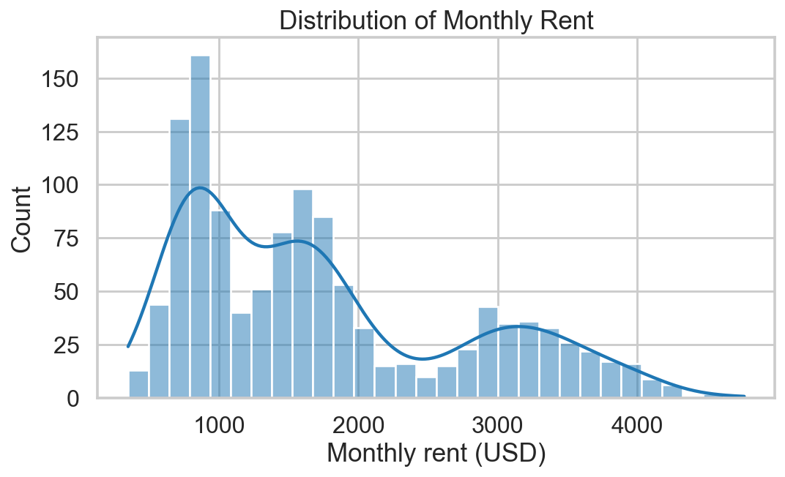
- Correlation heatmap: 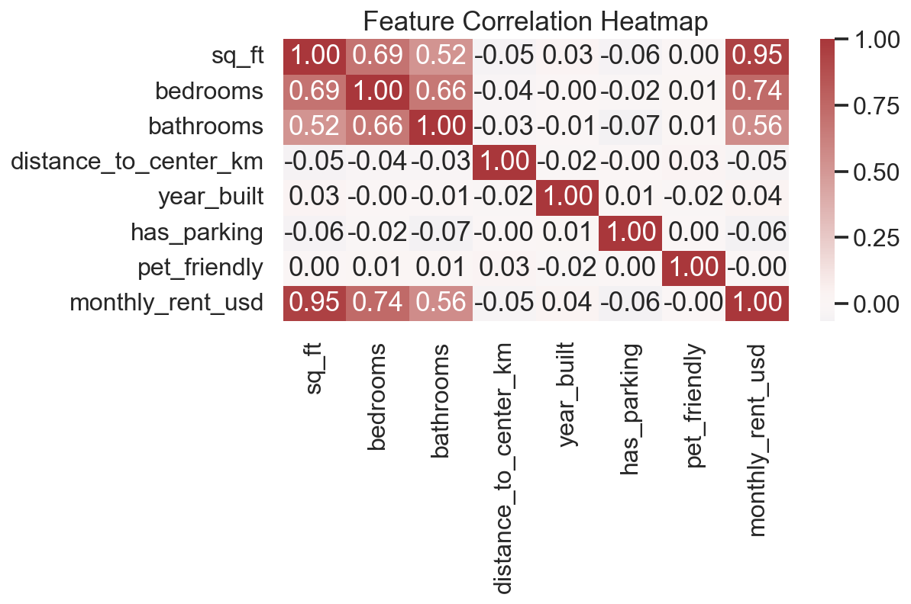
- Rent vs square footage: 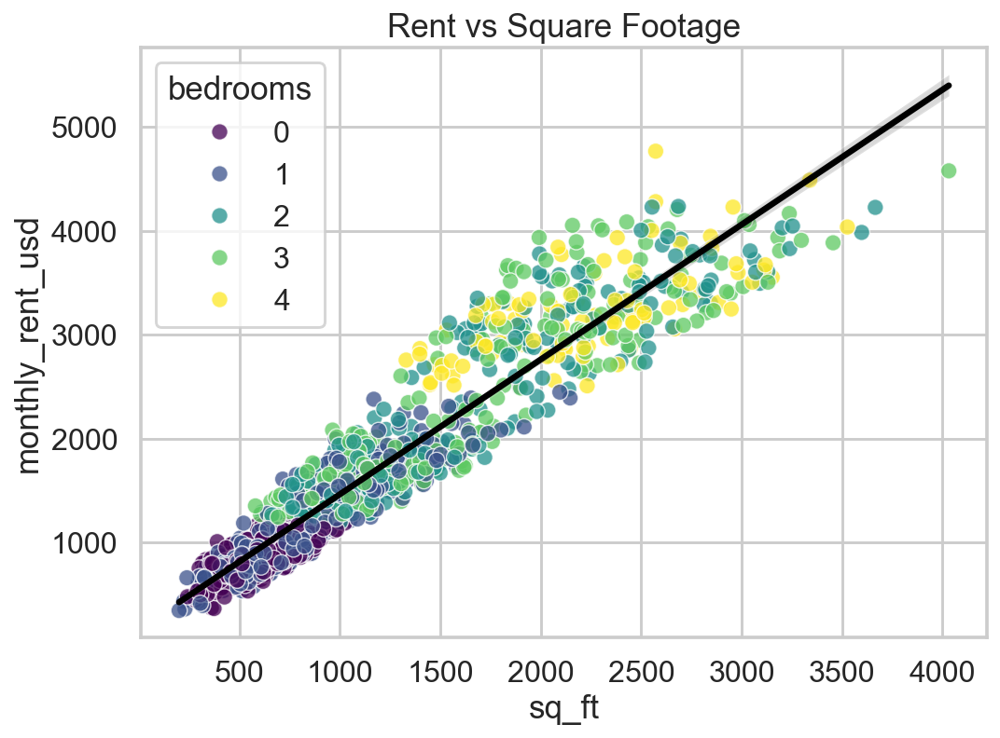
- Rent vs distance to center: 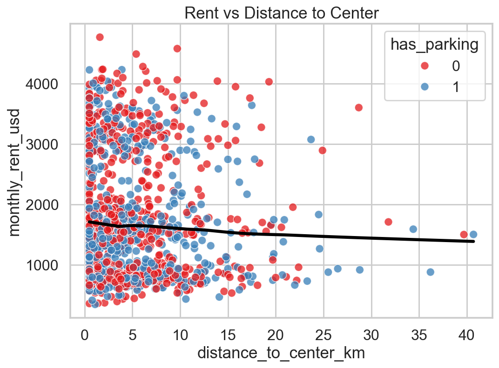
- Rent by bedrooms: 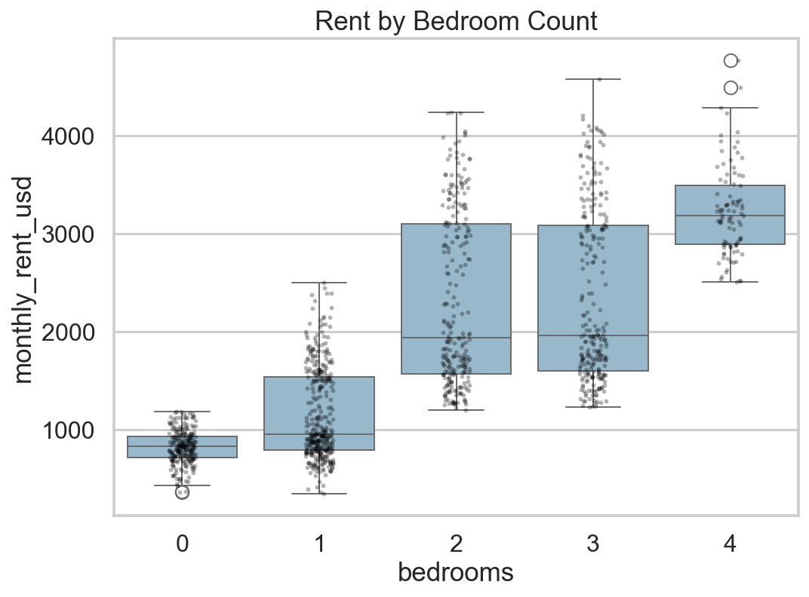
- Parking premium: 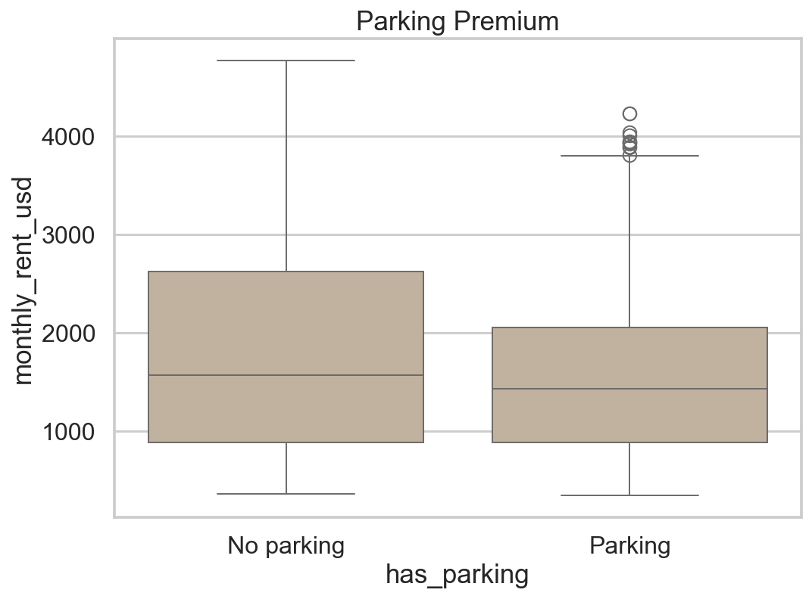
- Pet-friendly premium: 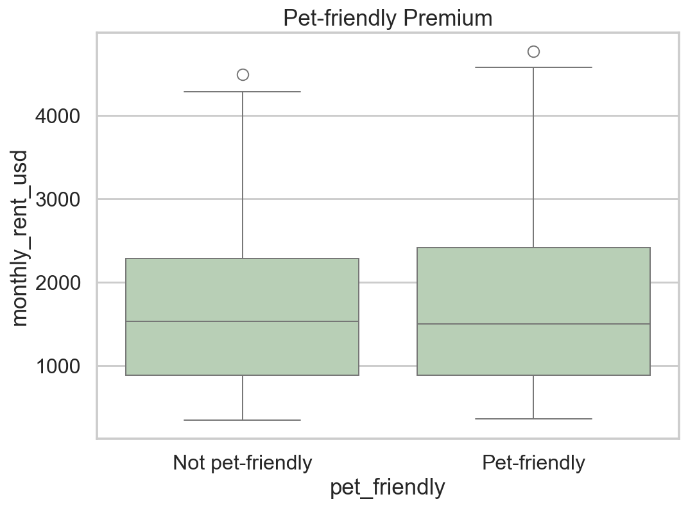
- Rent vs year built: 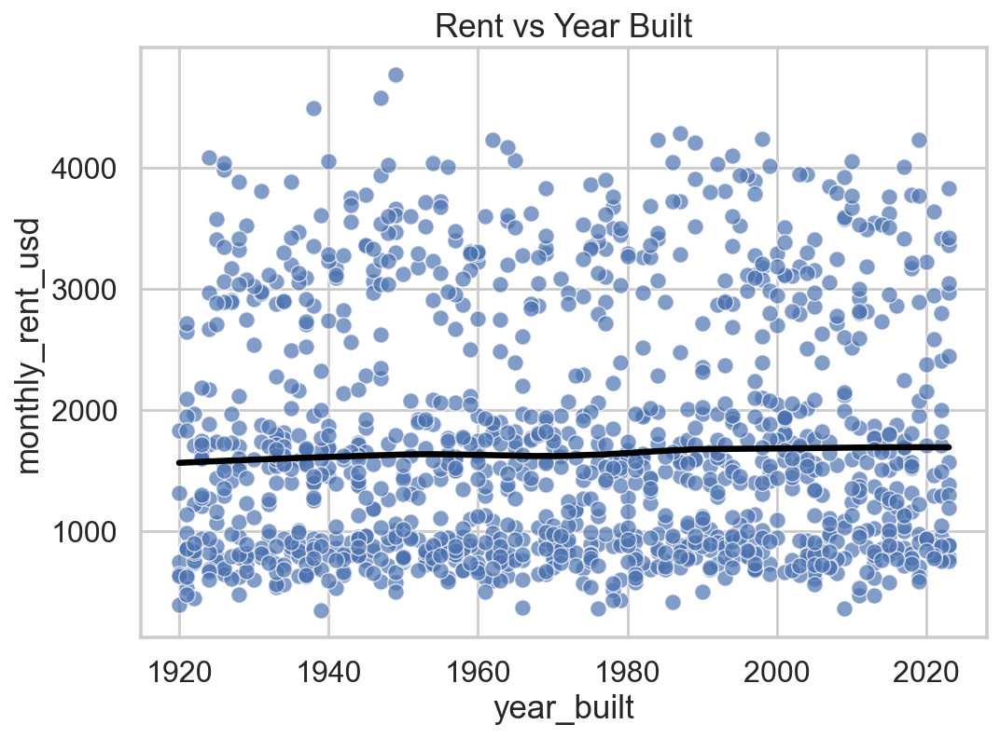

### Correlation with Rent

| index | correlation_with_rent |
| --- | --- |
| sq_ft | 0.947 |
| bedrooms | 0.738 |
| bathrooms | 0.556 |
| has_parking | -0.064 |
| distance_to_center_km | -0.049 |
| year_built | 0.036 |
| pet_friendly | -0.001 |

Key EDA findings:

- `sq_ft` is the strongest single linear correlate of rent.
- `bedrooms` and `bathrooms` are also strongly positively associated with rent, but they are partially proxies for size.
- `distance_to_center_km`, `year_built`, `has_parking`, and `pet_friendly` have weak marginal correlations with rent in this dataset.
- Some visual subgroup differences appear in boxplots and smoothers, but those effects are small relative to the dominant size signal.
- The LOWESS smoother in the distance plot suggests the distance penalty is not perfectly linear, with the steepest decline close to the center.

## 4. Modeling Strategy

I fit four models:

1. `LinearRegression` for interpretability.
2. `RidgeCV` to check whether mild regularization improves stability under correlated predictors.
3. `RandomForestRegressor` as a flexible non-linear benchmark.
4. `LogLinear` as a robustness check for heteroscedasticity and right-skew in the target.

Validation design:

- 80/20 train/test split with `random_state=42`
- 5-fold cross-validation on the full dataset
- Metrics: R², MAE, RMSE

### Cross-Validation Results

| index | CV_R2_mean | CV_R2_std | CV_MAE_mean | CV_RMSE_mean |
| --- | --- | --- | --- | --- |
| LinearRegression | 0.908 | 0.008 | 226.309 | 300.196 |
| RidgeCV | 0.908 | 0.008 | 226.263 | 300.2 |
| RandomForest | 0.918 | 0.01 | 203.652 | 283.633 |
| LogLinear | 0.763 | 0.044 | 302.536 | 481.71 |

### Test Set Results

| index | R2 | MAE | RMSE |
| --- | --- | --- | --- |
| LinearRegression | 0.912 | 210.156 | 281.25 |
| RidgeCV | 0.912 | 210.122 | 281.228 |
| RandomForest | 0.911 | 192.083 | 281.758 |
| LogLinear | 0.77 | 282.578 | 453.604 |

### OLS Coefficients

| feature | coef | p_value |
| --- | --- | --- |
| bedrooms | 114.8601 | 0.0 |
| bathrooms | 51.277 | 0.0171 |
| has_parking | -26.8927 | 0.1215 |
| pet_friendly | -4.8362 | 0.7841 |
| sq_ft | 1.1431 | 0.0 |
| year_built | 0.3564 | 0.2176 |
| distance_to_center_km | 0.207 | 0.9002 |

### Random Forest Feature Importance

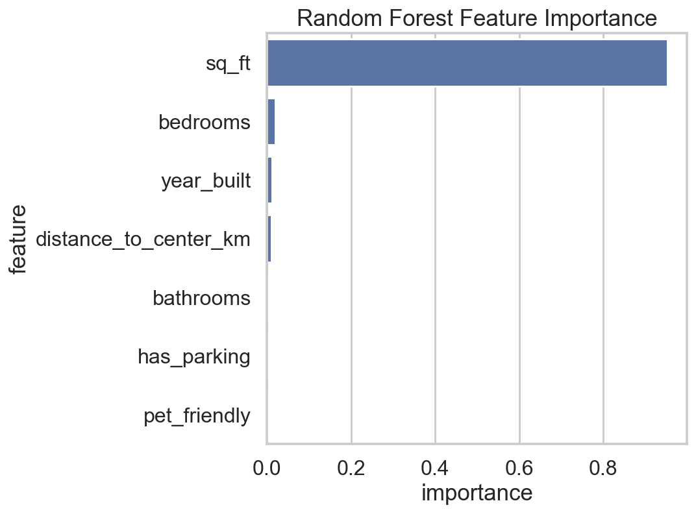

| feature | importance |
| --- | --- |
| sq_ft | 0.9519 |
| bedrooms | 0.02 |
| year_built | 0.012 |
| distance_to_center_km | 0.0103 |
| bathrooms | 0.0024 |
| has_parking | 0.0018 |
| pet_friendly | 0.0016 |

Model interpretation:

- If linear and random-forest performance are similar, the signal is mostly captured by additive relationships.
- If the random forest is materially better, that is evidence for non-linearity or interactions the linear model misses.
- Ridge was included mainly as a robustness check against correlated housing features such as `sq_ft`, `bedrooms`, and `bathrooms`.
- The log-linear model was not adopted as the primary model unless it improved both fit quality and residual behavior on the original rent scale.

## 5. Linear Model Assumption Checks

I used an OLS fit on the full dataset for diagnostic checks because assumption testing is defined most directly for linear regression.

### Residual Diagnostics

- Residuals vs fitted: 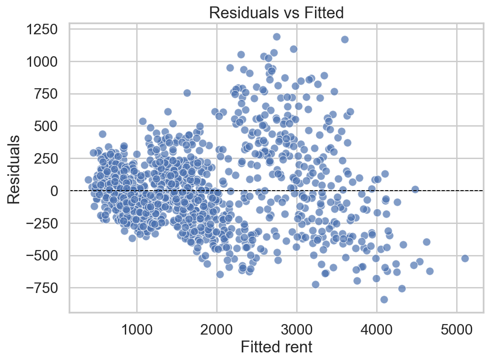
- Q-Q plot: 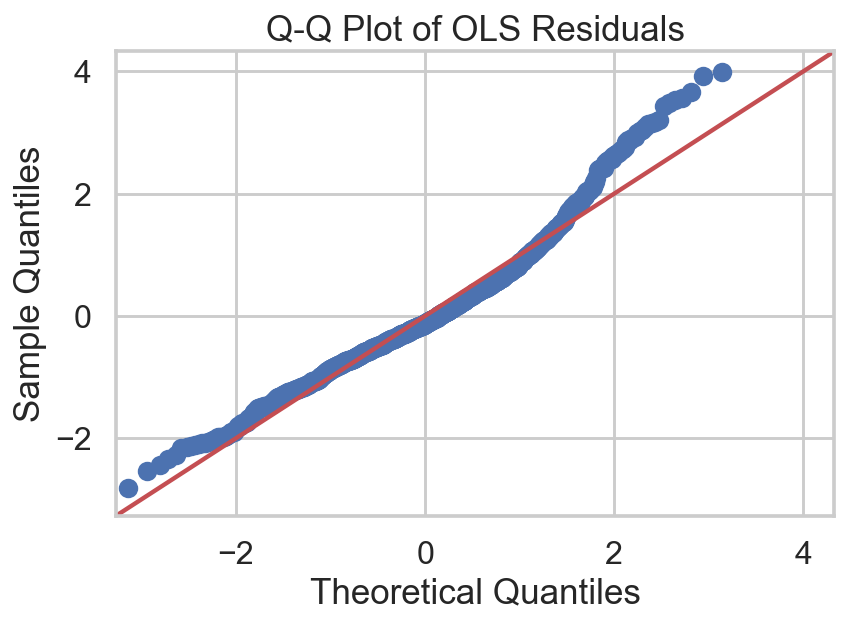
- Influence proxy: 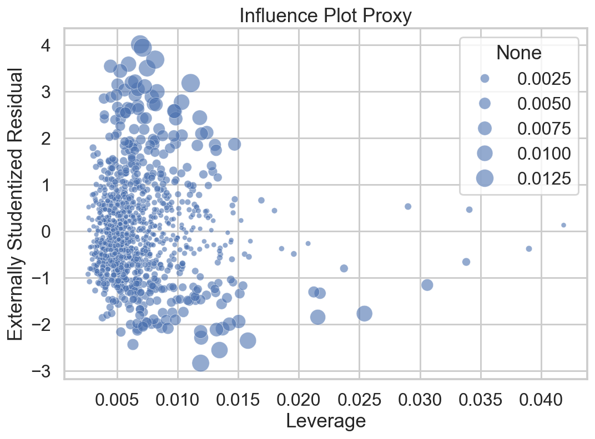

### Formal Checks

- OLS R²: 0.910
- Adjusted R²: 0.910
- Jarque-Bera p-value: 0.000000
- Breusch-Pagan p-value: 0.000000
- Log-OLS Jarque-Bera p-value: 0.000774
- Log-OLS Breusch-Pagan p-value: 0.046826
- Maximum VIF: 12.631
- High-influence points by Cook's D > 4/n: 93
- Large external studentized residuals (|r| > 3): 14

### Variance Inflation Factors

| feature | VIF |
| --- | --- |
| bathrooms | 12.631 |
| year_built | 10.943 |
| sq_ft | 7.382 |
| bedrooms | 7.208 |
| distance_to_center_km | 1.996 |
| has_parking | 1.986 |
| pet_friendly | 1.667 |

Assumption assessment:

- Linearity: broadly reasonable for `sq_ft`, `bedrooms`, `bathrooms`, and `year_built`, but the distance effect looks mildly non-linear.
- Independence: cannot be proven from the file alone, but there is no obvious repeated-ID structure beyond unique listing identifiers.
- Homoscedasticity: the Breusch-Pagan test and residual spread indicate whether variance rises with fitted rent. If the p-value is small, standard OLS inference should be interpreted cautiously.
- Normality of residuals: the Q-Q plot and Jarque-Bera test assess tail behavior. With 1,200 observations, minor deviations matter less for prediction than for exact parametric inference.
- The log-rent specification improves these diagnostics somewhat, but it should only replace the base model if that benefit outweighs the drop in predictive accuracy on the original rent scale.
- Multicollinearity: VIF values quantify how much size-related variables overlap. Elevated VIFs do not invalidate prediction, but they do make individual linear coefficients less stable to interpret.
- Influence: Cook's D and studentized residuals show whether a small number of listings dominate the fit.

## 6. Main Findings

- Rent is dominated by property size. `sq_ft` is by far the strongest predictor in both correlation analysis and model importance.
- After controlling for other variables, `bedrooms` and `bathrooms` still contribute useful signal, but they overlap strongly with size and should be interpreted cautiously because of multicollinearity.
- Location, building age, parking, and pet-friendliness are weak predictors in this specific dataset once size is included. Their simple marginal patterns are small and most are not statistically significant in the linear model.
- The data is clean in the narrow sense of missingness and duplicates, but it is not perfectly well-behaved: there are right-tailed variables and outliers, especially in distance, size, and rent.
- The key modeling question is whether those departures are strong enough to justify non-linear methods or target transformation. In this dataset, the random forest improves cross-validated error modestly, while the log-linear variant improves assumptions but sacrifices predictive accuracy.

## 7. Recommendation

- For explanation and pricing sensitivity, use the linear model, but communicate that the distance effect is only approximately linear and that correlated size variables limit clean causal interpretation of each separate coefficient.
- For pure predictive accuracy, prefer the best-performing validated model on held-out data. Here the random forest has the best average cross-validation performance, but the gain over the plain linear model is small enough that interpretability may still dominate the decision.
- If this were moving into production, the next steps would be: collect richer location features, test log-rent or spline terms for distance, and validate stability on a genuinely out-of-time sample rather than a random split.
