# Dataset Analysis Report

## 1. Scope and approach

This report analyzes `dataset.csv` as an observational employee-style tabular dataset. The workflow covered:

1. structural inspection and data-quality checks,
2. exploratory data analysis with plots,
3. formal association testing,
4. supervised modeling where the data plausibly supports it,
5. assumption checks and validation.

The analysis treats `employee_id` as an identifier, not a predictive feature.

## 2. Data loading and inspection

- Shape: **800 rows x 10 columns**
- Missing values: **0 total**
- Duplicate rows: **0**
- Duplicate `employee_id` values: **0**

### Data types

| column | dtype |
|---|---|
| employee_id | int64 |
| years_experience | float64 |
| training_hours | float64 |
| team_size | int64 |
| projects_completed | int64 |
| satisfaction_score | float64 |
| commute_minutes | int64 |
| performance_rating | float64 |
| salary_band | str |
| remote_pct | int64 |

### Numeric summary

| index | count | mean | std | min | 25% | 50% | 75% | max |
| --- | --- | --- | --- | --- | --- | --- | --- | --- |
| years_experience | 800.0 | 14.909 | 8.81 | 0.2 | 7.275 | 15.2 | 22.6 | 30.0 |
| training_hours | 800.0 | 41.088 | 14.916 | 0.0 | 30.9 | 40.85 | 50.6 | 79.5 |
| team_size | 800.0 | 13.69 | 6.426 | 3.0 | 8.0 | 14.0 | 19.0 | 24.0 |
| projects_completed | 800.0 | 7.962 | 2.92 | 1.0 | 6.0 | 8.0 | 10.0 | 18.0 |
| satisfaction_score | 800.0 | 5.619 | 2.576 | 1.0 | 3.51 | 5.595 | 7.818 | 9.98 |
| commute_minutes | 800.0 | 24.475 | 23.384 | 5.0 | 7.0 | 16.0 | 33.0 | 120.0 |
| performance_rating | 800.0 | 49.997 | 10.017 | 9.5 | 43.3 | 50.7 | 56.925 | 75.3 |
| remote_pct | 800.0 | 48.188 | 35.309 | 0.0 | 25.0 | 50.0 | 75.0 | 100.0 |
| employee_id | 800.0 | 400.5 | 231.084 | 1.0 | 200.75 | 400.5 | 600.25 | 800.0 |

### Categorical summary

| index | count | unique | top | freq |
| --- | --- | --- | --- | --- |
| salary_band | 800 | 5 | L5 | 170 |

### Category balance

`salary_band` counts:

| salary_band | count |
| --- | --- |
| L1 | 163 |
| L2 | 144 |
| L3 | 163 |
| L4 | 160 |
| L5 | 170 |

`remote_pct` counts:

| remote_pct | count |
| --- | --- |
| 0 | 161 |
| 25 | 194 |
| 50 | 138 |
| 75 | 156 |
| 100 | 151 |

## 3. Data quality findings

- The dataset is structurally clean: no nulls, duplicate rows, or duplicate IDs were found.
- `employee_id` behaves like a pure surrogate key and should be excluded from inference and predictive modeling.
- Several variables are discrete or semi-discrete despite numeric storage (`team_size`, `projects_completed`, `remote_pct`, `commute_minutes`).
- `remote_pct` takes only five values: 0, 25, 50, 75, 100.
- Outlier screening via the IQR rule found the following counts of potentially unusual observations:

| index | iqr_outlier_count |
| --- | --- |
| years_experience | 0 |
| training_hours | 5 |
| team_size | 0 |
| projects_completed | 3 |
| satisfaction_score | 0 |
| commute_minutes | 49 |
| performance_rating | 3 |
| remote_pct | 0 |

The largest outlier concentration is in `commute_minutes`, which is right-skewed with a long upper tail.

## 4. Exploratory data analysis

### Visualizations

- Missingness: 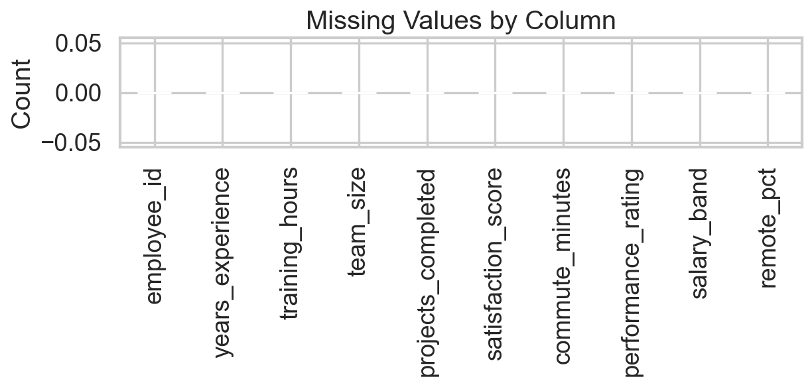
- Numeric distributions: 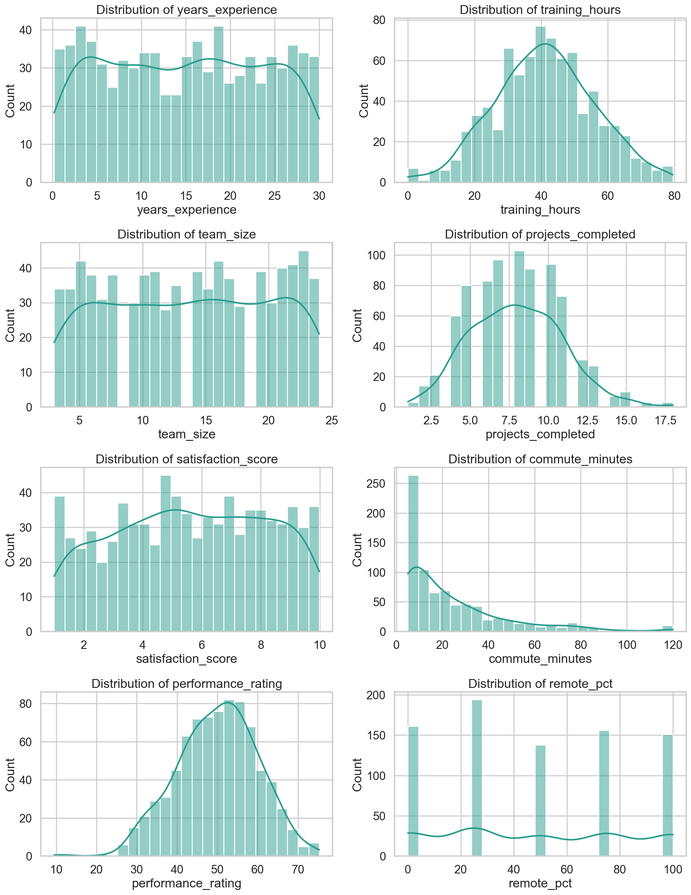
- Correlations: 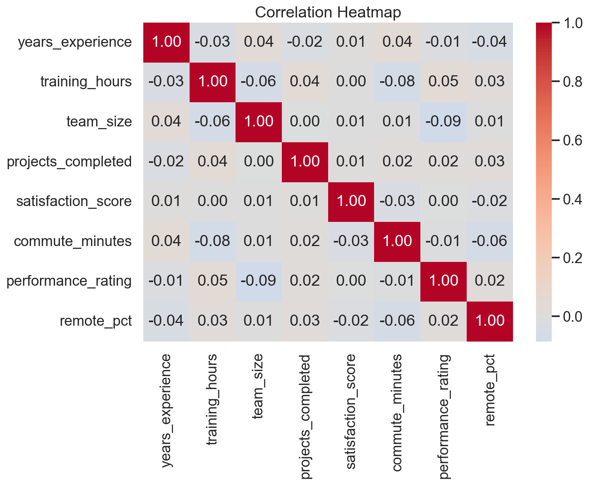
- Salary-band boxplots: 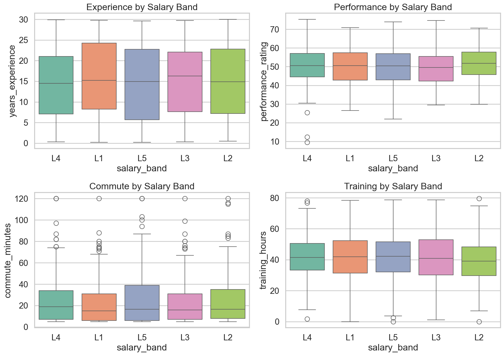
- Category counts: 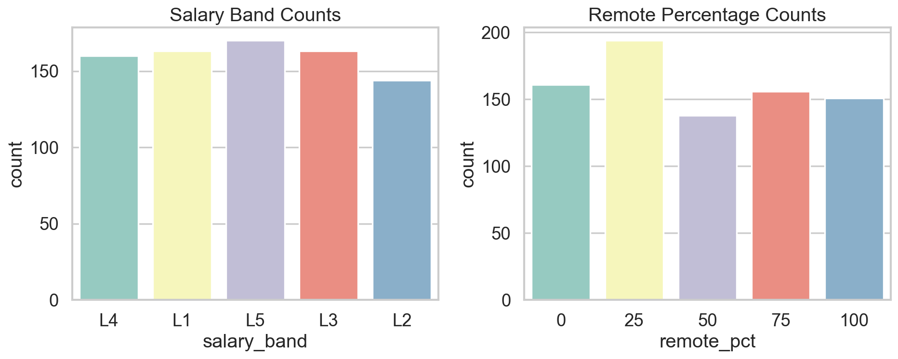
- Selected pairwise relationships: 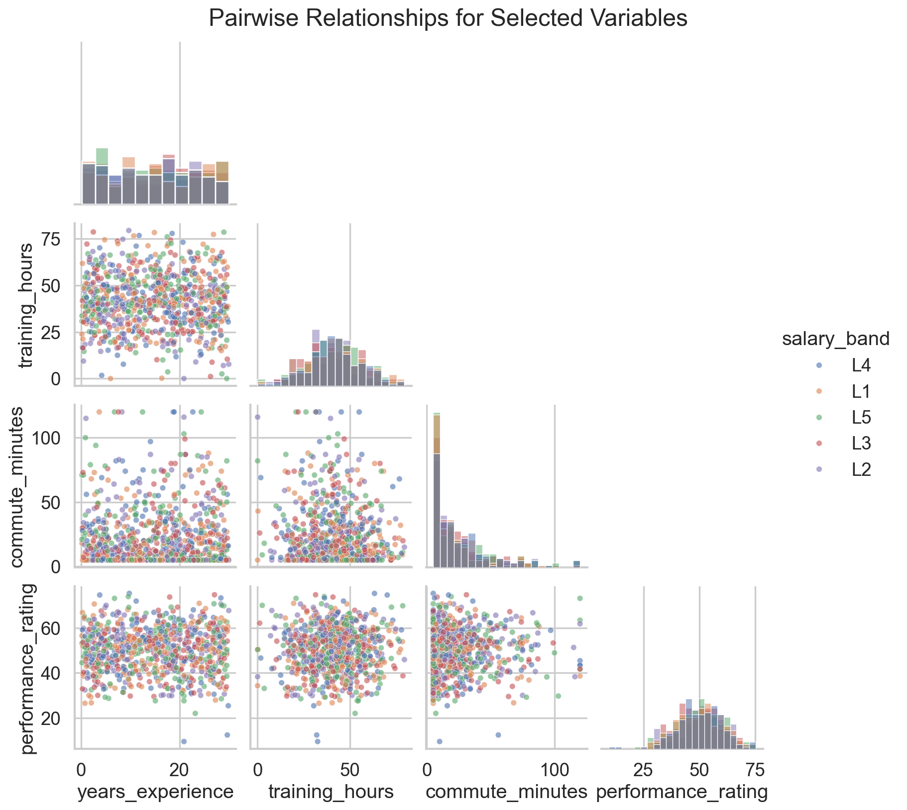

### Distribution checks

Normality tests for selected continuous variables:

| variable | statistic | p_value |
| --- | --- | --- |
| years_experience | 817.6928 | 0.0 |
| training_hours | 0.8259 | 0.6617 |
| commute_minutes | 276.8431 | 0.0 |
| performance_rating | 6.5531 | 0.0378 |
| satisfaction_score | 326.5384 | 0.0 |

Interpretation:

- Formal normality is rejected for at least some variables because the sample is moderately large and several distributions are bounded or discrete.
- `commute_minutes` is visibly skewed.
- `performance_rating` is closer to bell-shaped than most other columns, but still should not be assumed perfectly normal without checking residuals after modeling.

### Correlation structure

The Pearson correlation matrix shows no strong pairwise linear relationships. The largest absolute correlations are still small, indicating weak linear dependence overall.

| index | years_experience | training_hours | team_size | projects_completed | satisfaction_score | commute_minutes | performance_rating | remote_pct |
| --- | --- | --- | --- | --- | --- | --- | --- | --- |
| years_experience | 1.0 | -0.031 | 0.039 | -0.025 | 0.013 | 0.044 | -0.015 | -0.039 |
| training_hours | -0.031 | 1.0 | -0.061 | 0.044 | 0.004 | -0.077 | 0.046 | 0.026 |
| team_size | 0.039 | -0.061 | 1.0 | 0.002 | 0.009 | 0.011 | -0.086 | 0.008 |
| projects_completed | -0.025 | 0.044 | 0.002 | 1.0 | 0.013 | 0.017 | 0.016 | 0.029 |
| satisfaction_score | 0.013 | 0.004 | 0.009 | 0.013 | 1.0 | -0.035 | 0.001 | -0.017 |
| commute_minutes | 0.044 | -0.077 | 0.011 | 0.017 | -0.035 | 1.0 | -0.006 | -0.06 |
| performance_rating | -0.015 | 0.046 | -0.086 | 0.016 | 0.001 | -0.006 | 1.0 | 0.023 |
| remote_pct | -0.039 | 0.026 | 0.008 | 0.029 | -0.017 | -0.06 | 0.023 | 1.0 |

## 5. Group comparisons and relationship testing

To test whether salary bands separate the numeric variables meaningfully, one-way ANOVA was run for each numeric field.

| variable | F | p_value | eta_sq |
| --- | --- | --- | --- |
| training_hours | 1.806 | 0.1257 | 0.009 |
| projects_completed | 1.1923 | 0.3127 | 0.006 |
| commute_minutes | 0.865 | 0.4844 | 0.0043 |
| performance_rating | 0.7185 | 0.5794 | 0.0036 |
| remote_pct | 0.5839 | 0.6744 | 0.0029 |
| years_experience | 0.486 | 0.746 | 0.0024 |
| satisfaction_score | 0.3056 | 0.8743 | 0.0015 |
| team_size | 0.1791 | 0.9492 | 0.0009 |

Key interpretation:

- No ANOVA p-value is below 0.05.
- Effect sizes are negligible (`eta_sq` values near zero).
- `salary_band` does not appear to correspond to systematically different experience, training, commute, satisfaction, performance, or remote-work patterns in this dataset.

For `salary_band` versus `remote_pct`, a chi-square test was also run:

- Chi-square statistic: **9.561**
- Degrees of freedom: **16**
- p-value: **0.889**
- Cramer's V: **0.055**

This indicates no evidence of categorical association and a negligible effect size.

## 6. Predictive modeling

Because there is no explicit target column defined by the problem statement, two reasonable supervised tasks were evaluated:

1. predicting `performance_rating` from workplace attributes,
2. predicting `salary_band` from the other measured variables.

These tasks answer whether the dataset contains usable predictive signal, not whether any relationship is causal.

### 6.1 Regression task: predict `performance_rating`

Features used: `years_experience`, `training_hours`, `team_size`, `projects_completed`, `satisfaction_score`, `commute_minutes`, `remote_pct`, and one-hot encoded `salary_band`.

Five-fold cross-validation results:

| model | rmse_mean | rmse_std | r2_mean | r2_std |
| --- | --- | --- | --- | --- |
| dummy_mean | 9.9869 | 0.8046 | -0.0054 | 0.0036 |
| linear_regression | 10.0553 | 0.8081 | -0.0195 | 0.0194 |
| random_forest | 10.2359 | 0.6888 | -0.0588 | 0.0379 |

Held-out test performance for linear regression:

- RMSE: **9.398**
- R-squared: **-0.056**

Interpretation:

- Linear regression does not outperform the mean-baseline by a useful margin.
- Random forest also fails to produce meaningful lift, suggesting the issue is not simply unmodeled nonlinearity.
- The dataset contains little to no predictive signal for `performance_rating`.

Permutation importance from the random forest confirms that no feature contributes strongly:

| feature | importance_mean |
| --- | --- |
| salary_band | 0.0135 |
| satisfaction_score | 0.0126 |
| training_hours | 0.0082 |
| commute_minutes | -0.0052 |
| remote_pct | -0.0062 |
| projects_completed | -0.0081 |
| team_size | -0.0089 |
| years_experience | -0.0215 |

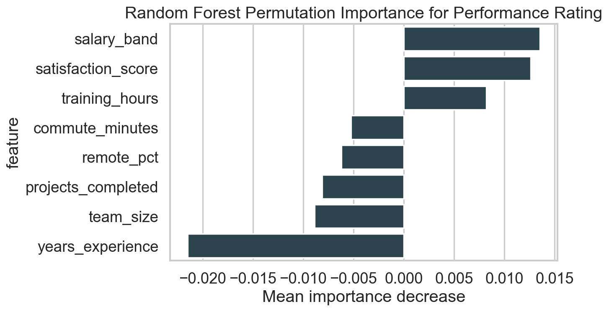

### 6.2 Classification task: predict `salary_band`

Features used: `years_experience`, `training_hours`, `team_size`, `projects_completed`, `satisfaction_score`, `commute_minutes`, `remote_pct`.

Five-fold cross-validation results:

| model | accuracy_mean | accuracy_std | balanced_accuracy_mean | balanced_accuracy_std |
| --- | --- | --- | --- | --- |
| random_forest | 0.2075 | 0.0127 | 0.2063 | 0.0127 |
| dummy_most_frequent | 0.2125 | 0.0 | 0.2 | 0.0 |
| multinomial_logistic | 0.1638 | 0.0222 | 0.1631 | 0.0219 |

Held-out test performance for multinomial logistic regression:

- Accuracy: **0.237**
- Balanced accuracy: **0.236**

Class-level test metrics:

| index | precision | recall | f1-score | support |
| --- | --- | --- | --- | --- |
| L1 | 0.282 | 0.333 | 0.306 | 33.0 |
| L2 | 0.304 | 0.241 | 0.269 | 29.0 |
| L3 | 0.111 | 0.062 | 0.08 | 32.0 |
| L4 | 0.273 | 0.188 | 0.222 | 32.0 |
| L5 | 0.207 | 0.353 | 0.261 | 34.0 |
| accuracy | 0.238 | 0.238 | 0.238 | 0.238 |
| macro avg | 0.235 | 0.236 | 0.228 | 160.0 |
| weighted avg | 0.234 | 0.238 | 0.228 | 160.0 |

Confusion matrix:

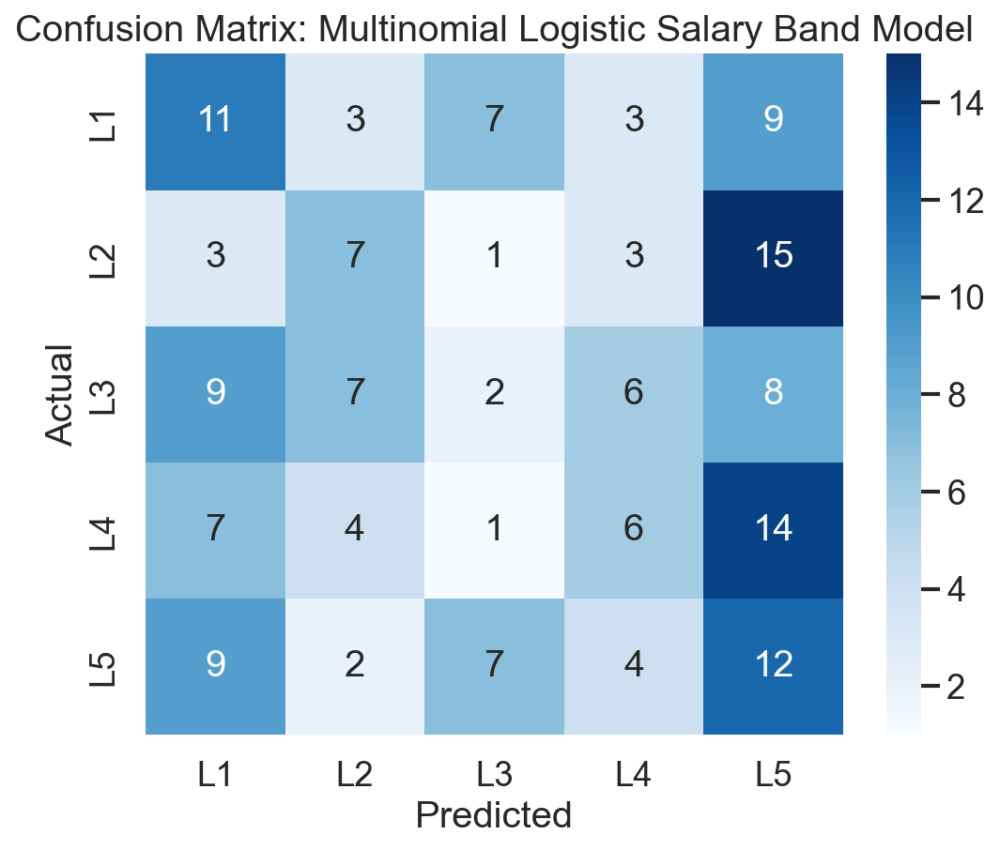

Permutation importance from random forest classification:

| feature | importance_mean |
| --- | --- |
| commute_minutes | 0.0322 |
| projects_completed | 0.0034 |
| years_experience | 0.0031 |
| satisfaction_score | -0.0056 |
| remote_pct | -0.0059 |
| training_hours | -0.0091 |
| team_size | -0.0178 |

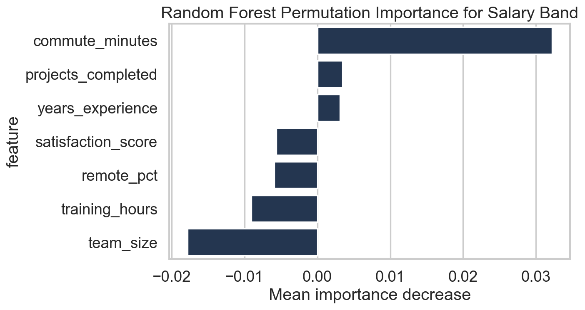

Interpretation:

- Accuracy is close to chance for a 5-class problem.
- Balanced accuracy remains low, so the result is not being masked by class imbalance.
- Feature importance is weak and diffuse, consistent with an essentially uninformative feature set for `salary_band`.

## 7. Regression assumption checks

An OLS model for `performance_rating` was fit on the full sample to inspect assumptions and coefficient stability.

### Diagnostics

- R-squared: **0.0136**
- Adjusted R-squared: **-0.0002**
- Overall F-test p-value: **0.456**
- Breusch-Pagan p-value for heteroskedasticity: **0.294**
- Jarque-Bera p-value for residual normality: **0.033**
- Ramsey RESET p-value for functional form: **0.502**

Residual diagnostics:

- Residuals vs fitted: 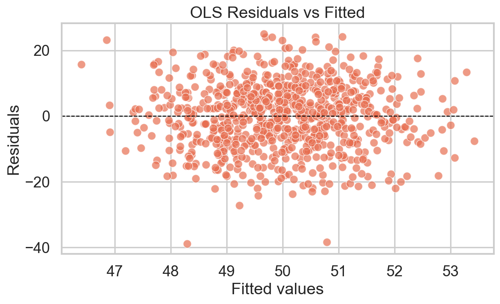
- Q-Q plot: 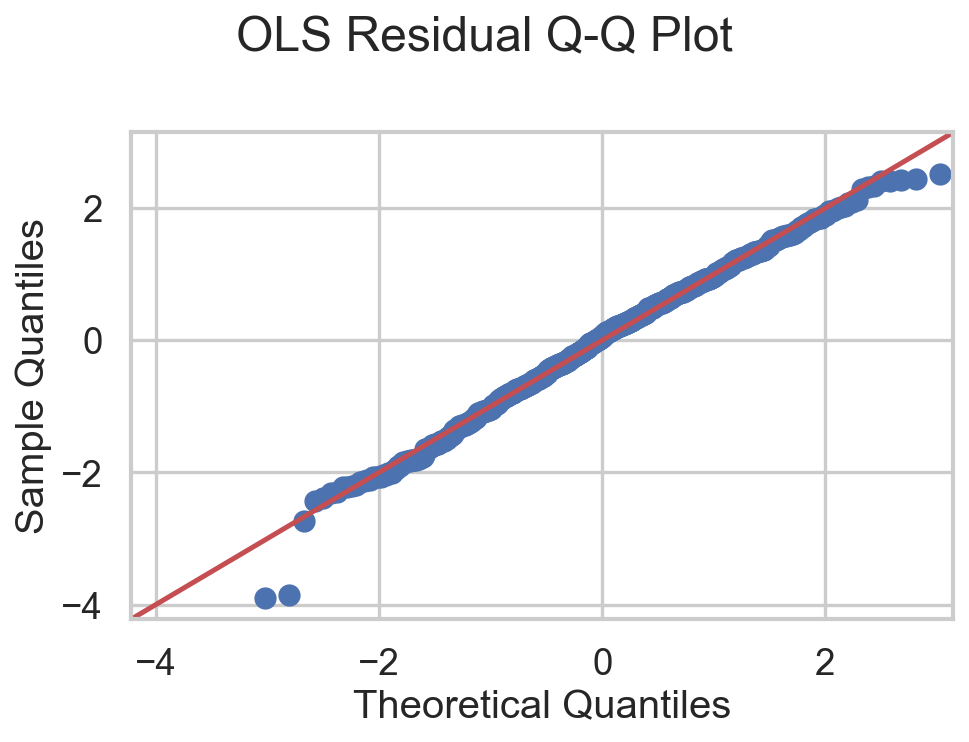

Variance inflation factors:

| feature | VIF |
| --- | --- |
| const | 36.439 |
| years_experience | 1.009 |
| training_hours | 1.022 |
| team_size | 1.006 |
| projects_completed | 1.01 |
| satisfaction_score | 1.004 |
| commute_minutes | 1.018 |
| remote_pct | 1.01 |
| salary_band_L2 | 1.567 |
| salary_band_L3 | 1.603 |
| salary_band_L4 | 1.598 |
| salary_band_L5 | 1.62 |

Interpretation:

- The very low R-squared confirms the model explains almost none of the variance.
- Multicollinearity is not a concern; VIF values are low aside from the intercept, which is not substantively important.
- Residual plots do not reveal a strong recoverable structure.
- Even if linear-model assumptions are not severely violated, the model remains practically uninformative because signal is absent.

## 8. Main findings

1. The dataset is mechanically clean but statistically weak.
2. There are no strong pairwise correlations, no meaningful ANOVA group differences by `salary_band`, and no categorical association between `salary_band` and `remote_pct`.
3. `commute_minutes` shows the clearest distributional anomaly through right-skew and outliers, but it still does not relate strongly to the other fields.
4. Predictive models for both `performance_rating` and `salary_band` perform at or near baseline, including nonlinear tree-based models.
5. The most defensible conclusion is that this dataset contains little actionable structure for inference or prediction.

## 9. Limitations and recommended next steps

- The analysis is rigorous for the observed columns, but no model can recover relationships that are not present in the data.
- If this dataset is synthetic, it appears to have been generated with weak or no dependency structure.
- If a meaningful business question is intended, additional variables are likely required. For example:
  - role or job family,
  - manager/team identifiers,
  - tenure at company distinct from total experience,
  - compensation amount instead of only `salary_band`,
  - performance history over time,
  - location and commute modality.
- Before operational use, clarify the true analytical objective and whether these variables are expected to be causally or predictively related at all.
