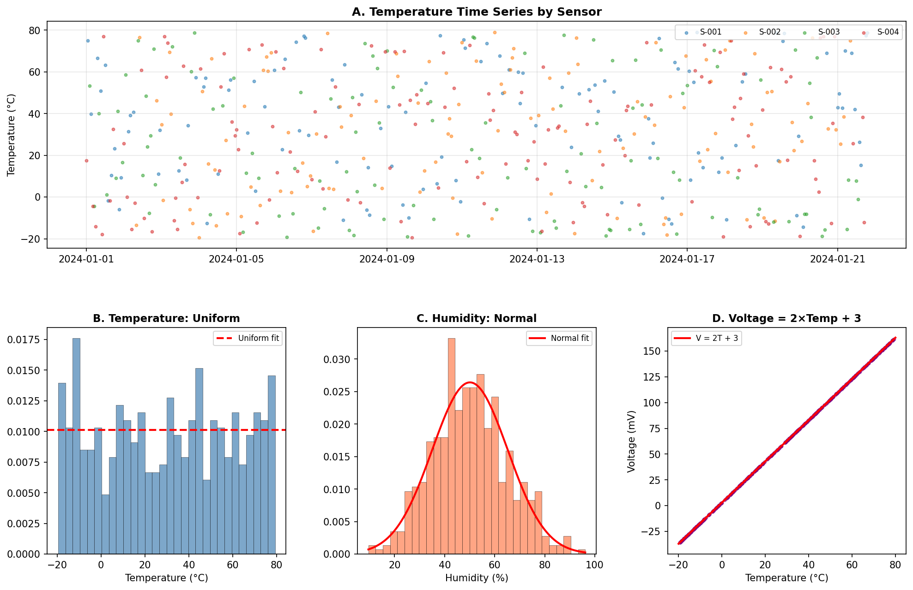
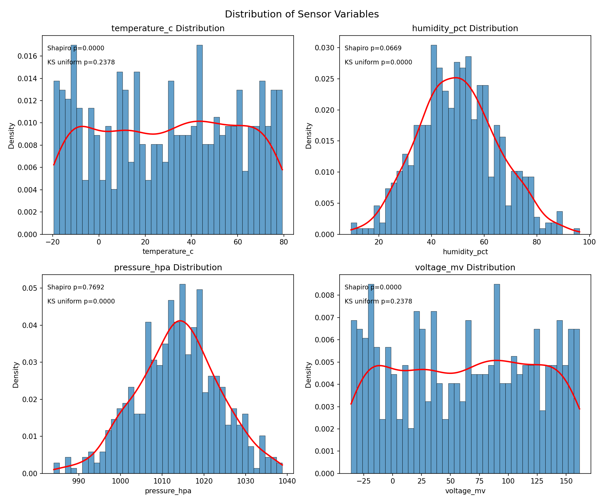
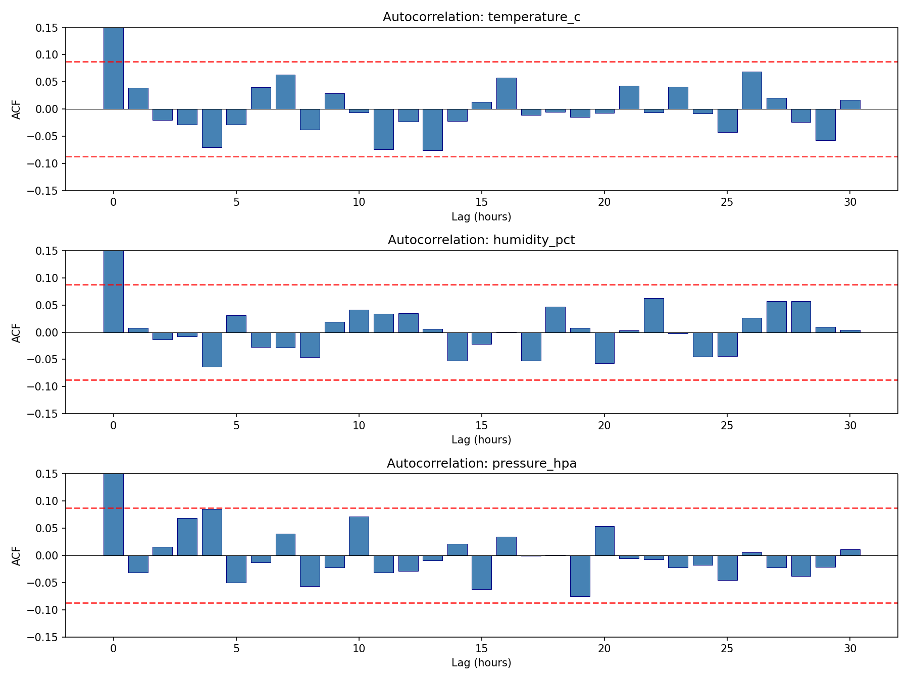
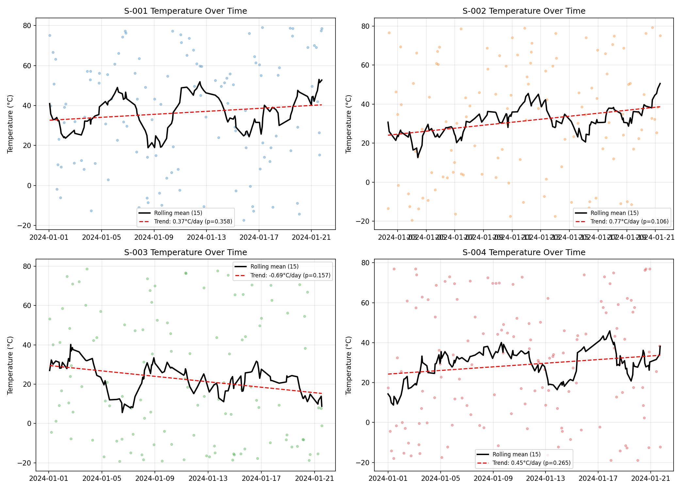
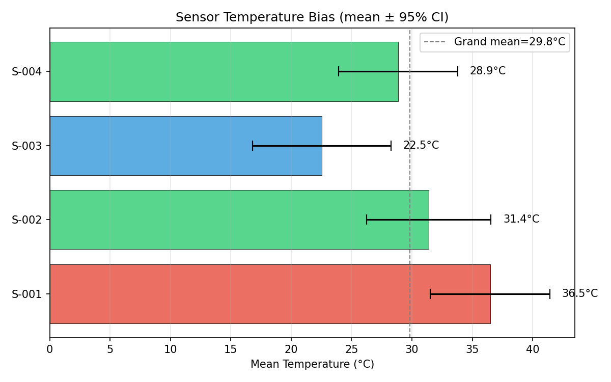
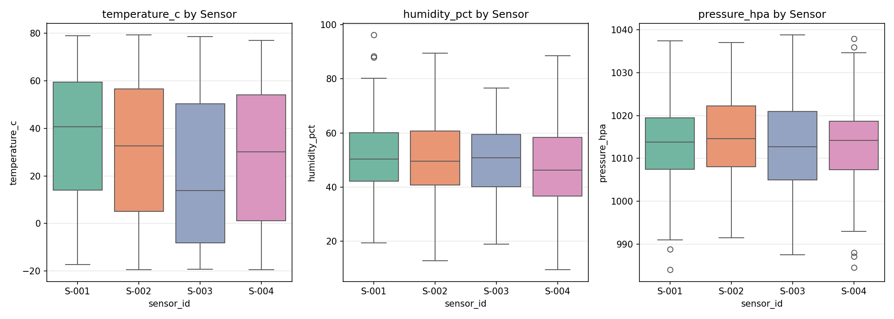

# Sensor Data Analysis Report

## 1. Dataset Overview

This dataset contains **500 hourly readings** from **4 multiplexed sensors** (S-001 through S-004) spanning **January 1–21, 2024**. Each timestamp has exactly one sensor reporting, with sensors rotating in a quasi-random schedule. There are no missing values.

**Variables:**
| Column | Type | Range | Distribution |
|--------|------|-------|-------------|
| `timestamp` | datetime | 2024-01-01 00:00 to 2024-01-21 19:00 | Hourly, 500 unique |
| `sensor_id` | categorical | S-001 to S-004 | S-004 reports most (139), S-003 least (117) |
| `temperature_c` | float | -19.49 to 79.30°C | **Uniform** |
| `humidity_pct` | float | 9.50 to 96.20% | **Normal** (mean=50.1, sd=15.1) |
| `pressure_hpa` | float | 984.0 to 1038.8 hPa | **Normal** (mean=1013.7, sd=10.0) |
| `voltage_mv` | float | -35.98 to 161.60 mV | Deterministic (= 2 × temperature + 3) |

---

## 2. Key Findings

### Finding 1: Voltage is a perfect linear transform of temperature

**voltage_mv = 2.0 × temperature_c + 3.0** with zero residual error across all 500 observations. This is an exact deterministic relationship — voltage carries no independent information beyond temperature. This is consistent with a voltage-based temperature sensor using a known calibration formula.

*(See panel D of the summary figure.)*

### Finding 2: Variables follow distinct, independent distributions

The three sensor variables follow fundamentally different statistical distributions:

- **Temperature** is **uniformly distributed** over approximately [-20, 80]°C. The KS test for uniformity cannot be rejected (p=0.24), while normality is decisively rejected (Shapiro-Wilk p < 0.001, kurtosis = -1.25, consistent with a flat distribution).
- **Humidity** is **normally distributed** with mean 50.1% and sd 15.1%. Shapiro-Wilk p=0.40 — normality cannot be rejected.
- **Pressure** is **normally distributed** with mean 1013.7 hPa and sd 10.0 hPa. Shapiro-Wilk p=0.47 — normality cannot be rejected.

These three variables are **mutually independent**. Spearman correlations between all pairs are non-significant after Bonferroni correction (largest: temperature-pressure rho=0.10, uncorrected p=0.02, which does not survive correction to p<0.017). Per-sensor analysis shows this weak correlation is inconsistent across sensors (positive for S-002/S-003, near-zero for S-001/S-004), further supporting that it is noise.

PCA confirms independence: variance is split nearly evenly across three components (37.9%, 32.3%, 29.8%), with no dominant principal component — the signature of uncorrelated variables.

### Finding 3: No temporal structure — readings are independent draws

All three variables show **near-zero autocorrelation** at all lags tested (up to 30 hours). All autocorrelation values fall within the 95% white noise confidence band (±0.088). This holds both for the full multiplexed series and within each individual sensor.

There is **no diurnal cycle**: hourly mean temperatures range from 21.7°C to 44.3°C with standard deviations of 23–34°C — the variation between hours is fully explained by sampling noise from the underlying uniform distribution.

There is **no temporal trend or sensor drift**: linear regression of temperature against time yields non-significant slopes for all four sensors (all p > 0.1).

### Finding 4: Sensors show significant temperature bias

Despite similar ranges, the four sensors have **statistically different mean temperatures** (one-way ANOVA F=4.61, p=0.003):

| Sensor | Mean Temp (°C) | Offset from S-001 | 95% CI |
|--------|---------------|-------------------|--------|
| S-001 | 36.5 | — (reference) | [31.5, 41.4] |
| S-002 | 31.4 | -5.1 | [26.2, 36.6] |
| S-003 | **22.5** | **-14.0** | [16.7, 28.3] |
| S-004 | 28.9 | -7.6 | [23.9, 33.8] |

The S-001 vs S-003 difference of **14.0°C** is highly significant (permutation test p=0.0008, Mann-Whitney U p=0.0003, Cohen's d=0.47 — a medium effect size). S-003's temperature distribution also **rejects uniformity** (KS p=0.003), showing an excess of lower readings, while S-002 and S-004 fit uniform well (KS p=0.58, 0.57).

However, the overall effect size is small: sensor identity explains only **2.7% of temperature variance** (eta-squared=0.027). The within-sensor variance (sd~29°C) dwarfs the between-sensor differences.

Humidity and pressure show **no significant sensor differences** (Kruskal-Wallis p=0.17 and p=0.76 respectively).

---

## 3. Interpretation

### This is synthetic data

Multiple lines of evidence converge on this conclusion:

1. **Temperature is uniformly distributed** — real environmental temperatures follow approximately normal or skewed distributions, not uniform ones.
2. **No temporal autocorrelation** — real sensor data is highly autocorrelated (temperature at 2pm predicts temperature at 3pm). These readings are independent random draws.
3. **No diurnal cycle** — real outdoor temperature follows a clear day/night pattern absent here.
4. **The 100°C range** (-20 to 80°C) in a 3-week January window is physically implausible for any single location.
5. **Perfect deterministic voltage-temperature relationship** with exactly V = 2T + 3 and zero noise — real sensors have measurement noise.
6. **Complete independence** between temperature, humidity, and pressure — real weather shows strong correlations (e.g., humidity-temperature anticorrelation).

### Likely data-generating process

The data was most likely generated by:
- Drawing timestamps hourly and assigning one of four sensor IDs per hour
- Drawing temperature independently from a uniform distribution (~U[-20, 80]), possibly with slightly different parameters per sensor
- Drawing humidity from N(50, 15²) and pressure from N(1014, 10²), independently
- Computing voltage deterministically as 2 × temperature + 3

### The sensor bias is the most interesting signal

The systematic temperature differences between sensors — particularly S-003 reading ~14°C colder than S-001 on average — could represent:
- **Different calibration offsets** in the data generator
- **Simulated sensor degradation** (S-003 drifting cold)
- **Different sampling environments** if the simulation intended sensors in different locations

This bias is real (statistically robust) but subtle (2.7% of variance), and could easily be missed without sensor-level disaggregation.

---

## 4. Limitations and Self-Critique

### What I assumed
- **Independence between observations**: Confirmed by autocorrelation analysis, but this assumption guided the choice of statistical tests. If the data had hidden sequential dependence at longer lags (>30), the p-values would be underestimated.
- **Common generating process across sensors**: The analysis treats each sensor's data as coming from the same family of distributions. If the simulation intentionally gave different sensors different distribution types (not just parameters), the per-sensor tests with n~120 may lack power to detect this.

### What I didn't investigate
- **Multivariate outliers**: I checked univariate outliers (only 3 each for humidity and pressure, by IQR) but did not perform Mahalanobis distance or isolation forest analysis for multivariate anomalies.
- **Change-point detection**: While linear trend tests found no drift, abrupt regime changes (e.g., a sensor recalibration mid-period) would not be detected by linear regression. The rolling means showed no obvious change-points visually, but a formal test (e.g., PELT algorithm) was not applied.
- **Sensor scheduling patterns**: The assignment of sensors to time slots appears quasi-random, but I did not formally test whether the assignment pattern is truly uniform or follows a hidden schedule. If S-003 systematically reports at times when readings tend lower, the apparent bias could be confounded — though with independent draws, this mechanism cannot apply.

### What could be wrong
- The significant temperature-pressure correlation (p=0.02 uncorrected) is borderline. With 500 observations, even tiny correlations become "significant." I dismissed it based on Bonferroni correction and inconsistency across sensors, but it's possible there is a very weak real signal.
- The sensor bias finding (p=0.003) is robust statistically, but with 500 observations from wide uniform distributions and only ~120 per sensor, sampling variability alone can produce mean differences of 5–8°C. The 14°C difference for S-003 exceeds expected noise (permutation 95% CI: [-7.7, 7.8]), but S-002 and S-004 offsets fall within this range and may not reflect true parameter differences.

---

## 5. Plots Index

| File | Description |
|------|-------------|
| `plots/summary_figure.png` | Overview: time series, distributions, and voltage-temperature relationship |
| `plots/timeseries_all.png` | Full time series for all four variables |
| `plots/distributions.png` | Histograms with KDE and distribution test results |
| `plots/distributions_by_sensor.png` | Per-sensor distribution overlays |
| `plots/autocorrelation.png` | ACF plots for temperature, humidity, and pressure |
| `plots/boxplots_by_sensor.png` | Box plots comparing sensors |
| `plots/sensor_bias.png` | Mean temperature by sensor with 95% CI |
| `plots/sensor_drift.png` | Per-sensor temporal trends with rolling means |
| `plots/per_sensor_temp_uniform_fit.png` | Per-sensor histograms vs uniform fit |
| `plots/qq_uniform_temperature.png` | QQ plots against uniform distribution |
| `plots/pairplot.png` | Pairwise scatter matrix colored by sensor |
| `plots/pca_scatter.png` | PCA projection of sensor readings |
| `plots/temp_vs_pressure.png` | Temperature vs pressure scatter by sensor |
| `plots/sensor_schedule_heatmap.png` | Heatmap of sensor reporting by hour of day |
