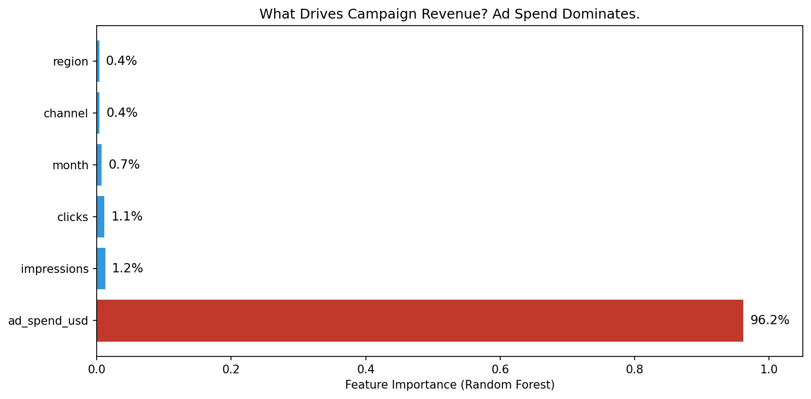
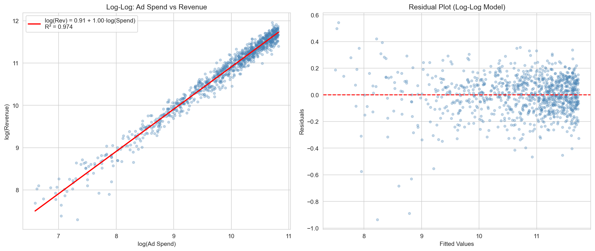
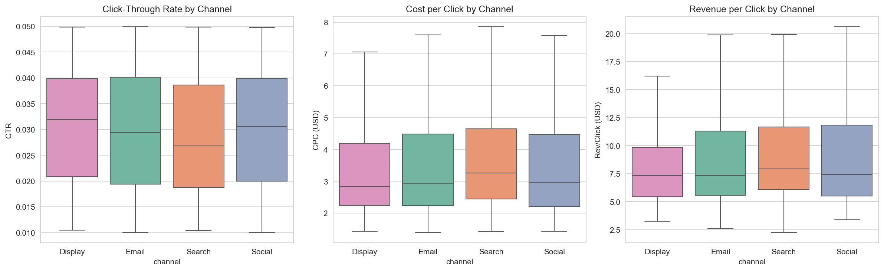
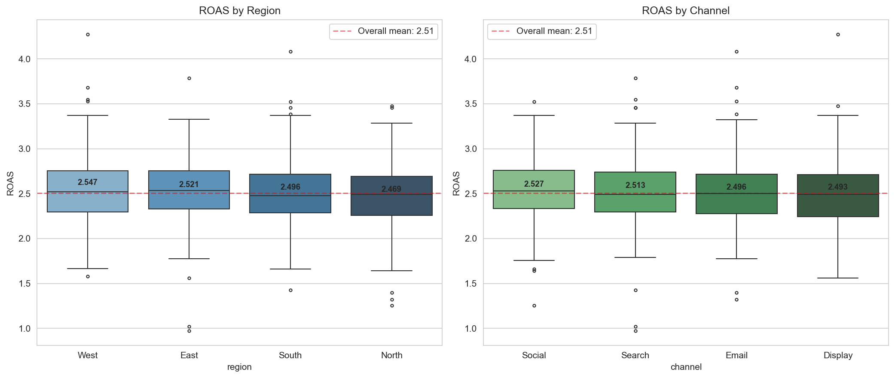
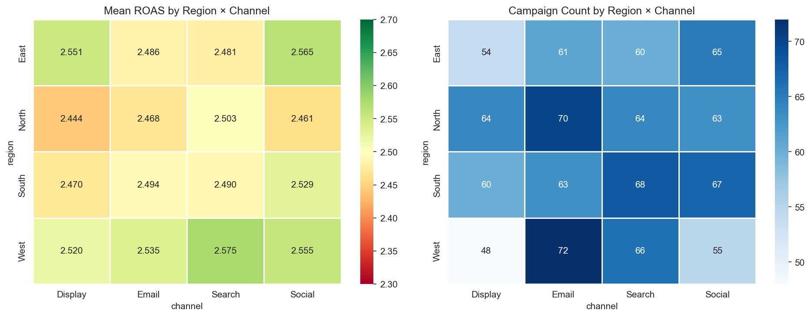
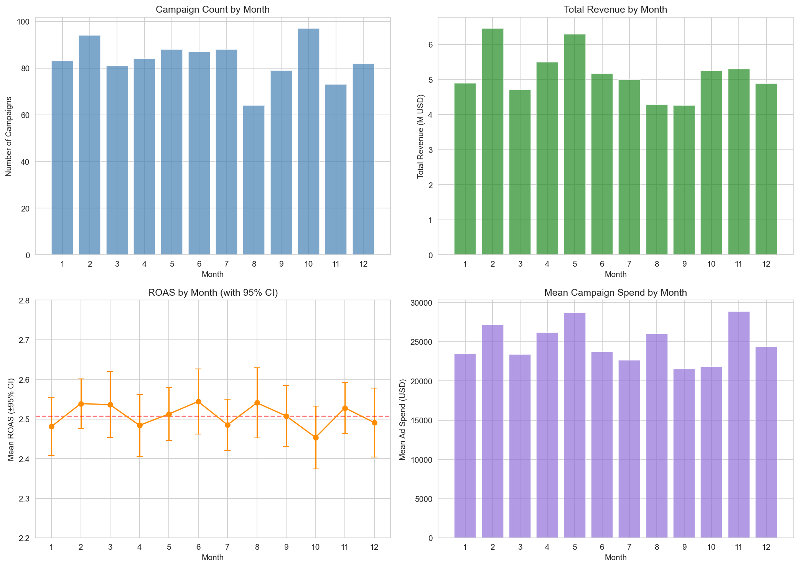
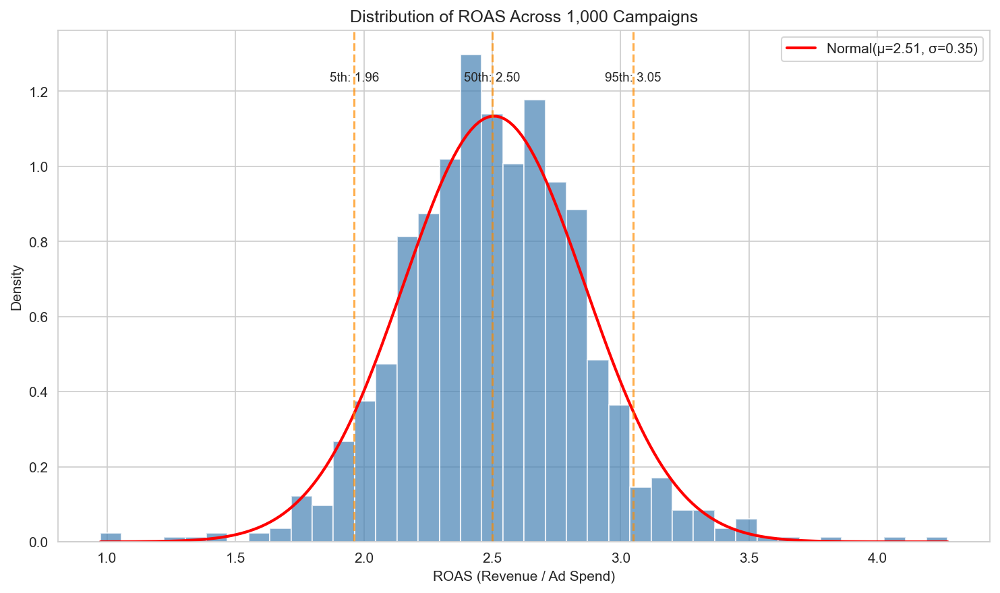
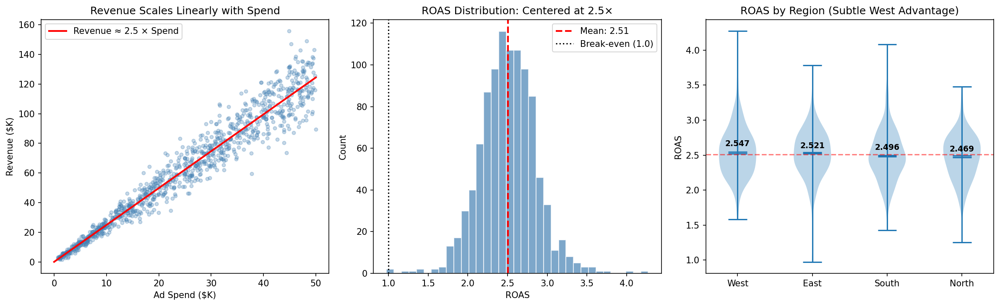

# Marketing Campaign Performance Analysis

## Dataset Overview

This dataset contains **1,000 marketing campaigns** with the following attributes:

| Field | Description | Range |
|-------|-------------|-------|
| `campaign_id` | Unique identifier | 1–1,000 |
| `region` | Geographic region | East, West, South, North |
| `channel` | Advertising channel | Email, Search, Social, Display |
| `ad_spend_usd` | Campaign spend | $729–$49,986 (mean $24,768) |
| `impressions` | Ad impressions served | 7,365–656,366 |
| `clicks` | Clicks generated | 212–28,062 |
| `revenue_usd` | Revenue attributed | $1,481–$155,838 (mean $61,979) |
| `month` | Calendar month (1–12) | Roughly uniform distribution |

No missing values. Campaigns are roughly balanced across regions (~240–261 each) and channels (~226–266 each).

---

## Key Findings

### 1. Revenue Is Almost Entirely Determined by Ad Spend

The dominant finding is that **ad spend alone explains 97.4% of revenue variance** in a log-log regression:

```
log(Revenue) = 0.91 + 1.00 × log(Ad Spend)    R² = 0.974
```

This translates to: **Revenue ≈ 2.49 × Ad Spend**, with a spend elasticity of 1.00 (constant returns to scale). There are no diminishing returns — doubling spend doubles revenue across the full observed range ($729–$49,986).

A Random Forest model confirmed this: ad spend accounts for **96.2% of feature importance** when predicting revenue, with impressions (1.2%), clicks (1.1%), month (0.7%), channel (0.4%), and region (0.4%) contributing negligibly.


*Ad spend dominates all other features in predicting campaign revenue.*

The linear model (Revenue ~ Ad Spend) achieves R² = 0.945 with a coefficient of 2.49, and the residual standard deviation is $8,666 — about **14% of mean revenue**. This residual variation appears random: it does not correlate with any measured feature (all |r| < 0.05, all p > 0.20).


*Left: Near-perfect log-log relationship. Right: Residuals show no systematic pattern.*

### 2. Channel Choice Does Not Affect Returns

All four advertising channels — Email, Search, Social, and Display — produce statistically indistinguishable returns:

| Channel | Mean ROAS | Median ROAS | Std Dev |
|---------|-----------|-------------|---------|
| Social | 2.527 | 2.528 | 0.342 |
| Search | 2.513 | 2.491 | 0.358 |
| Email | 2.496 | 2.500 | 0.344 |
| Display | 2.493 | 2.493 | 0.367 |

**One-way ANOVA**: F = 0.491, p = 0.689. The differences are not statistically significant.

This uniformity extends to all efficiency metrics tested:

- **Click-through rate (CTR)**: No significant difference across channels (Kruskal-Wallis H = 4.38, p = 0.22). All channels average ~3.0% CTR.
- **Cost per click (CPC)**: No significant difference (H = 4.32, p = 0.23). All channels average ~$3.64 CPC.
- **Revenue per click**: No significant difference (H = 4.09, p = 0.25). All channels average ~$9.14/click.
- **CPM (cost per 1,000 impressions)**: Virtually identical at ~$90 across all channels.
- **Variance homogeneity**: Levene's test confirms equal ROAS variance across channels (F = 0.59, p = 0.62).


*CTR, CPC, and revenue per click distributions are nearly identical across channels.*


*ROAS distributions overlap almost completely across both regions and channels.*

### 3. Region Has a Small but Statistically Significant Effect

While channel effects are absent, **region shows a borderline effect** on ROAS (two-way ANOVA: F = 2.27, p = 0.079). Pairwise testing reveals one significant comparison:

| Comparison | ROAS Difference | t-statistic | p-value | Cohen's d |
|------------|----------------|-------------|---------|-----------|
| **West vs North** | **+0.079 (+3.2%)** | **2.518** | **0.012** | **0.225** |
| West vs South | +0.051 (+2.0%) | 1.583 | 0.114 | 0.142 |
| East vs North | +0.052 (+2.1%) | 1.698 | 0.090 | 0.152 |
| East vs South | +0.024 (+1.0%) | 0.769 | 0.442 | 0.069 |
| East vs West | -0.027 (-1.1%) | -0.828 | 0.408 | -0.076 |
| North vs South | -0.028 (-1.1%) | -0.904 | 0.367 | -0.079 |

**Practical impact**: At $100,000 spend, West campaigns would generate ~$254,748 in revenue vs ~$246,874 in North — a difference of **~$7,874**. Cohen's d = 0.225 indicates a small effect size.

The channel × region interaction is not significant (F = 0.448, p = 0.909), meaning the regional pattern does not depend on which channel is used.


*Left: ROAS varies more by region (rows) than by channel (columns). Right: Campaign counts are roughly balanced.*

### 4. No Seasonality in Campaign Performance

ROAS shows **no significant monthly variation** (ANOVA F = 0.609, p = 0.822). All monthly 95% confidence intervals overlap substantially, and all monthly means fall within 2.45–2.54.

Campaign **volume** does vary by month (64 campaigns in August vs 97 in October), as does mean spend per campaign ($21,516 in September vs $28,862 in November). However, these operational variations do not translate into ROAS differences.


*Bottom-left: ROAS confidence intervals overlap completely across months. Other panels show operational variation in volume and spend.*

### 5. ROAS Is Normally Distributed and Unpredictable

ROAS follows an approximately normal distribution centered at **2.51 (σ = 0.35)**:

- 90% of campaigns achieve ROAS between **1.96 and 3.05**
- Only ~1% of campaigns fall below break-even (ROAS < 1.0) — the minimum observed is 0.97
- The highest observed ROAS is 4.27

Critically, **ROAS cannot be predicted from available campaign features**. Cross-validated models all produce negative R² when predicting ROAS:

| Model | Cross-validated R² |
|-------|--------------------|
| Linear Regression | -0.012 |
| Random Forest | -0.120 |
| Gradient Boosting | -0.151 |

Negative R² means these models perform worse than simply predicting the mean for every campaign. The variance in ROAS is effectively random noise given the features in this dataset.


*ROAS is well-approximated by a Normal(2.51, 0.35) distribution.*

---

## Summary Figure


*The three core findings: (1) linear spend-revenue relationship, (2) ROAS centered at 2.5× with moderate spread, (3) a subtle West > North regional advantage.*

---

## Interpretation and Practical Implications

1. **Spend confidently up to $50K per campaign.** The constant unit elasticity (1.0) means there are no diminishing returns within the observed spend range. Every additional dollar spent generates approximately $2.49 in revenue.

2. **Channel allocation does not matter for ROAS.** Email, Search, Social, and Display all deliver the same return per dollar. Channel selection should therefore be driven by other strategic considerations (audience reach, brand building, attribution preferences) rather than efficiency.

3. **Mild regional preference for West.** West campaigns return ~3.2% more than North campaigns, a statistically significant but small effect. This could justify marginal reallocation toward Western markets, but the effect size (Cohen's d = 0.225) is modest — worth monitoring but not worth aggressive rebalancing.

4. **Timing doesn't matter.** There is no evidence of seasonal advantages or disadvantages. Campaigns can be scheduled based on operational convenience without concern for ROAS impact.

5. **Campaign-level ROAS variation is noise.** The ~14% residual variation in ROAS cannot be explained or predicted by any feature in this dataset. This suggests either (a) the relevant drivers are unmeasured (creative quality, audience targeting, competitive dynamics), or (b) the variation is genuinely stochastic.

---

## Limitations and Caveats

### What this analysis assumes

- **Causal direction**: The strong spend-revenue correlation does not prove that spending *causes* revenue. It is possible that spend is allocated in proportion to expected demand (i.e., budgets are set based on anticipated revenue). Without experimental variation in spend, we cannot distinguish cause from correlation.
- **Independence**: Each campaign is treated as independent. If campaigns within the same region or month interact (e.g., via audience overlap or market saturation), the statistical tests may overstate significance.
- **Stationarity**: The analysis assumes that the spend-revenue relationship is stable over time. If the data spans a period of market change, the aggregate relationship may mask shifting dynamics.

### What was not investigated

- **Creative and targeting differences**: The dataset contains no information about ad creative, audience targeting, or bidding strategy — factors that likely explain the unexplained 14% ROAS variance.
- **Attribution model**: Revenue attribution methodology is unknown. Different attribution models (first-touch, last-touch, multi-touch) could fundamentally change channel-level conclusions.
- **Diminishing returns beyond $50K**: The data does not include campaigns above ~$50K spend. Returns may diminish at higher budgets.
- **Interaction with unmeasured variables**: The null channel effect is striking and may indicate that this data has already been optimized or normalized in ways not visible in the dataset.

### Statistical notes

- The West vs. North comparison (p = 0.012) was identified through 6 pairwise tests. Applying a Bonferroni correction (threshold = 0.05/6 = 0.0083), this result would **not** survive multiple comparison correction. The regional effect should be treated as suggestive, not definitive.
- ROAS is not perfectly normally distributed (Shapiro-Wilk p < 0.001), though the departure is minor and does not affect the validity of the ANOVA tests given sample sizes of 240+.
- All models were validated with 5-fold cross-validation. No results are based on training-set-only evaluation.
