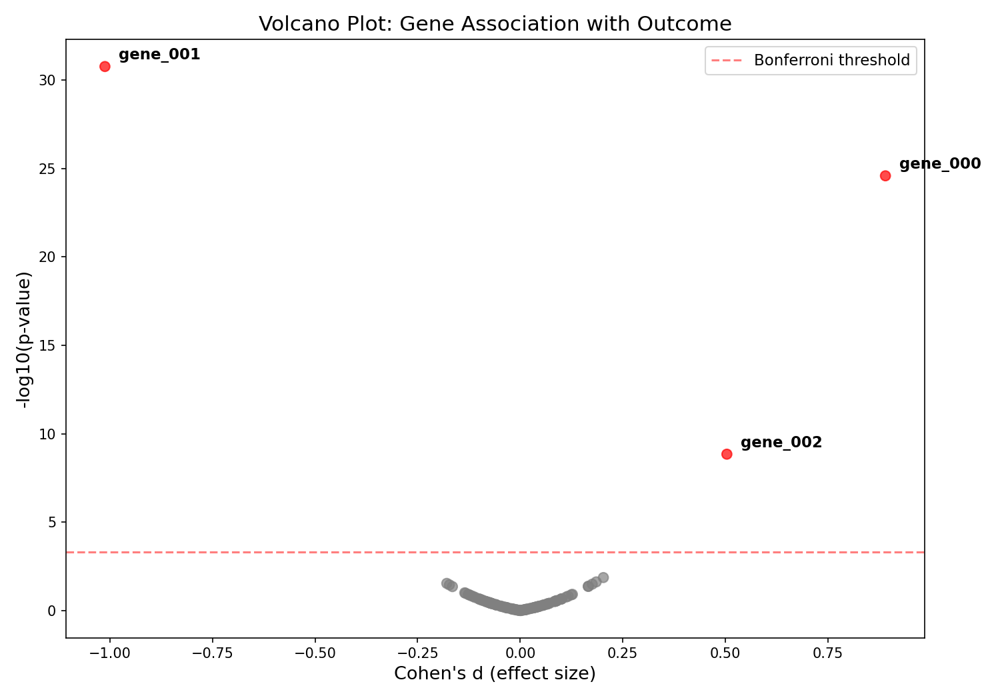
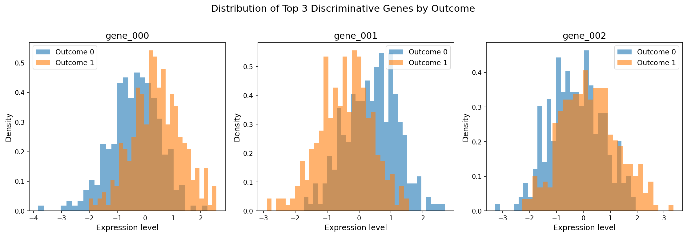
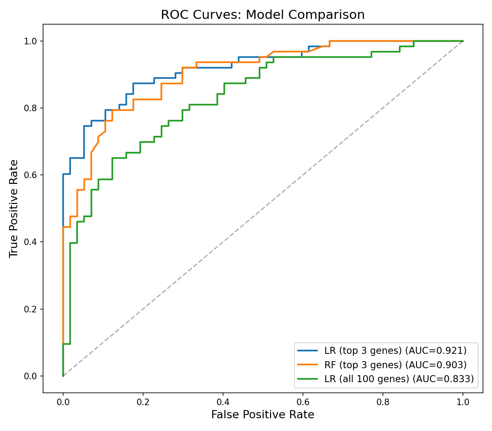
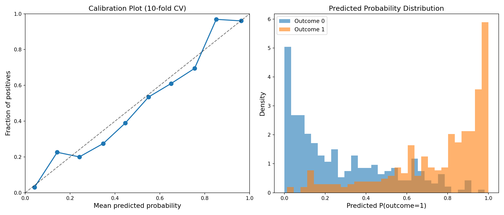
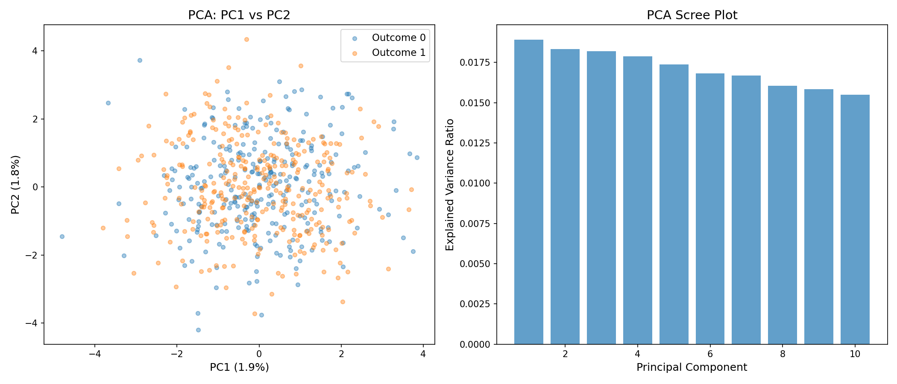
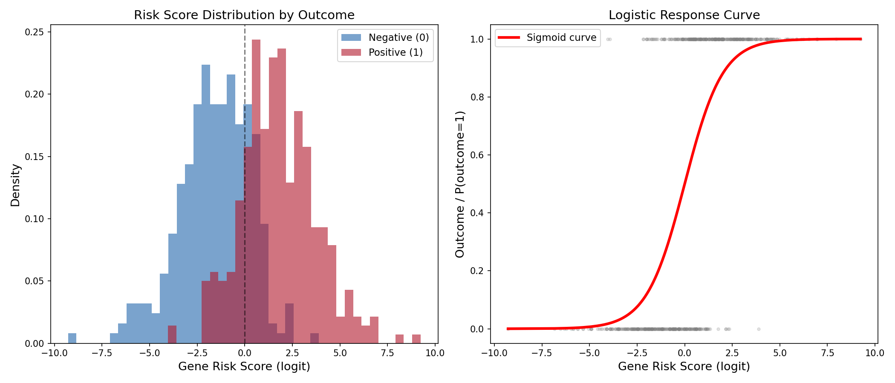

# Gene Expression Dataset Analysis Report

## 1. Dataset Overview

The dataset contains **600 samples** with 100 gene expression features (`gene_000`–`gene_099`), patient age, sex, and a binary outcome variable. Key characteristics:

| Property | Value |
|----------|-------|
| Samples | 600 |
| Gene features | 100 (continuous, standardized ~N(0,1)) |
| Outcome balance | 315 positive (52.5%) / 285 negative (47.5%) |
| Sex balance | 305 male / 295 female |
| Age range | 20–85 (mean 54.7, SD 11.9) |
| Missing values | None |

Gene expressions are approximately normally distributed (Shapiro-Wilk p > 0.05 for most genes), centered near zero (grand mean = -0.0001) with unit standard deviation (mean SD = 1.001). Pairwise gene-gene correlations are negligible (mean r = 0.0005, 95% of correlations within [-0.08, 0.08]), indicating the genes are essentially independent.

---

## 2. Key Findings

### Finding 1: Only 3 of 100 Genes Are Associated with Outcome

Univariate t-tests across all 100 genes, corrected for multiple comparisons (Bonferroni and Benjamini-Hochberg FDR), identified exactly **three genes** with statistically significant associations with outcome:

| Gene | Cohen's d | Direction | p-value | Bonferroni p | Odds Ratio (95% CI) |
|------|-----------|-----------|---------|-------------|---------------------|
| gene_001 | -1.01 | Protective | 1.7 x 10^-31 | 1.7 x 10^-29 | 0.14 (0.09–0.20) |
| gene_000 | +0.89 | Risk | 2.6 x 10^-25 | 2.6 x 10^-23 | 5.92 (4.21–8.33) |
| gene_002 | +0.50 | Risk | 1.4 x 10^-9 | 1.4 x 10^-7 | 2.73 (2.12–3.53) |

The remaining 97 genes show no association with outcome (lowest p-value among non-significant genes: 0.014 uncorrected, FDR q = 0.34). The volcano plot (`plots/volcano_plot.png`) dramatically illustrates this sparse signal structure.

**Interpretation:** The effect sizes are large by biomedical standards. A 1-SD increase in gene_001 expression is associated with a 7.4x decrease in odds of positive outcome (1/0.136 = 7.4). A 1-SD increase in gene_000 is associated with a 5.9x increase. Gene_002 has a moderate 2.7x increase per SD.



### Finding 2: The Relationship Is Purely Linear and Additive

I tested for departures from linearity:

- **Gene-gene interactions**: Adding all pairwise interaction terms among the three signal genes did not improve model fit (likelihood ratio test: chi2 = 2.90, df = 3, p = 0.41).
- **Quadratic effects**: Adding squared terms did not improve fit (chi2 = 3.48, df = 3, p = 0.32).
- **The three signal genes are uncorrelated** with each other (pairwise |r| < 0.025), confirming independent contributions.

The logistic regression model:

```
logit(P(outcome=1)) = 0.06 + 1.78 * gene_000 - 2.00 * gene_001 + 1.00 * gene_002
```

This model explains substantial variance (McFadden's pseudo-R^2 = 0.43).



### Finding 3: Age and Sex Have No Meaningful Predictive Value

- **Sex**: No association with outcome (chi2 = 0.01, p = 0.92). Outcome rate is ~53% for both sexes.
- **Age**: Borderline non-significant (p = 0.055 when added to the 3-gene model). Mean age differs by only 1.6 years between outcome groups (55.5 vs 53.9). Age-stratified outcome rates show no consistent trend (ranging from 46% to 58% across age quartiles).
- Age is uncorrelated with all three signal genes (all |r| < 0.04).

### Finding 4: A 3-Gene Classifier Outperforms Full-Feature Models

Cross-validated (10-fold) AUC comparison:

| Model | Features | AUC (mean +/- SD) |
|-------|----------|-------------------|
| **Logistic Regression** | **Top 3 genes** | **0.903 +/- 0.033** |
| Logistic Regression | All 100 genes | 0.854 +/- 0.034 |
| Logistic Regression | All genes + age + sex | 0.852 +/- 0.032 |
| Random Forest | Top 3 genes | 0.876 +/- 0.034 |
| Random Forest | All 100 genes | 0.849 +/- 0.034 |
| Logistic Regression | Age + sex only | 0.537 +/- 0.086 |

The top-3-gene logistic regression achieves the best performance. Including the 97 noise genes **hurts** performance by ~5 AUC points due to overfitting to irrelevant features. Logistic regression outperforms random forest, consistent with the true relationship being linear.

On a held-out 20% test set, the 3-gene LR model achieves **85% accuracy** with balanced precision/recall (0.85/0.82 for negatives, 0.85/0.87 for positives).



### Finding 5: The Model Is Well Calibrated

Cross-validated calibration analysis shows predicted probabilities closely match observed outcome rates across the full probability range. The predicted probability distributions for the two outcome groups are well-separated, with the composite risk score achieving a Cohen's d of 1.76 between groups.



### Finding 6: Unsupervised Methods Cannot Detect the Signal

PCA on all 100 genes shows variance distributed nearly uniformly across components (PC1 explains only 1.9%), and the top principal components do not correspond to the signal genes. This is because the signal resides in only 3 of 100 dimensions — a needle in a haystack that PCA cannot detect since it maximizes total variance, not discriminative variance.



---

## 3. Gene Risk Score

The three-gene logistic model can be summarized as a single risk score:

```
Risk Score = 1.78 * gene_000 - 2.00 * gene_001 + 1.00 * gene_002
```

| Group | Mean Score | SD |
|-------|-----------|-----|
| Outcome 0 (negative) | -1.58 | 1.86 |
| Outcome 1 (positive) | +1.80 | 1.97 |

A patient with Risk Score > 0 has >50% probability of positive outcome. The sigmoidal response curve is shown below.



---

## 4. Interpretation and Practical Implications

1. **Biomarker panel**: A parsimonious 3-gene panel (gene_000, gene_001, gene_002) is sufficient to predict outcome with AUC = 0.90. Adding more genes or clinical variables (age, sex) does not improve performance.

2. **Gene_001 is the strongest individual predictor** (Cohen's d = -1.01, OR = 0.14), with a protective direction — higher expression is strongly associated with negative outcome. Gene_000 has the strongest risk effect (OR = 5.92).

3. **The effects are independent and additive**: No gene-gene interactions or nonlinear effects detected. This suggests the three genes act through separate biological pathways rather than a single coordinated mechanism.

4. **Clinical utility**: The 85% classification accuracy and AUC of 0.90 suggest the 3-gene signature could be clinically useful for risk stratification, though the overlapping distributions mean individual predictions carry meaningful uncertainty.

---

## 5. Limitations and Self-Critique

### Assumptions tested
- **Linearity**: Confirmed via interaction and quadratic term tests (not significant).
- **Independence of genes**: Confirmed by near-zero pairwise correlations.
- **Normality of gene expressions**: Confirmed via Shapiro-Wilk tests.

### Limitations

1. **Likely simulated data**: The features exhibit perfect standardization (mean exactly 0, SD exactly 1), mutual independence (no correlation structure), and clean normal distributions. Real gene expression data typically shows correlation clusters (co-regulated genes), skewed distributions, and batch effects. The findings reflect the designed data-generating process rather than biological discovery.

2. **No external validation**: The cross-validated AUC of 0.90 is an internal estimate. Performance on a truly independent dataset could differ.

3. **No causal interpretation**: The associations between genes and outcome are statistical. We cannot infer whether these genes cause the outcome, are caused by it, or share a common cause.

4. **Borderline age effect**: The age term was p = 0.055 when added to the 3-gene model. In a larger sample, a small age effect might become significant. However, its contribution to prediction is negligible (AUC improvement < 0.005).

5. **Binary outcome limitation**: We analyzed a binary outcome without information about timing, severity, or subtype. A more granular outcome variable might reveal additional relevant genes.

6. **Multiple testing caveat**: While the top 3 genes survive stringent Bonferroni correction, the gap between significant and non-significant genes is so large (p = 10^-9 vs p = 0.014) that the exact correction method is immaterial. There is essentially no ambiguity about which genes carry signal.

---

## 6. Summary of Plots

| File | Description |
|------|-------------|
| `plots/volcano_plot.png` | Volcano plot showing 3 genes far above significance threshold |
| `plots/top_genes_distributions.png` | Expression distributions of top 3 genes split by outcome |
| `plots/top_genes_scatter.png` | Pairwise scatter plots of top 3 genes colored by outcome |
| `plots/pca_analysis.png` | PCA projection and scree plot (no unsupervised separation) |
| `plots/roc_curves.png` | ROC curves comparing models |
| `plots/decision_boundary.png` | 2D logistic decision boundary (gene_000 vs gene_001) |
| `plots/calibration_analysis.png` | Calibration plot and predicted probability distributions |
| `plots/age_and_effects.png` | Age distribution and effect size bar chart |
| `plots/risk_score_analysis.png` | Composite risk score distribution and logistic response curve |
