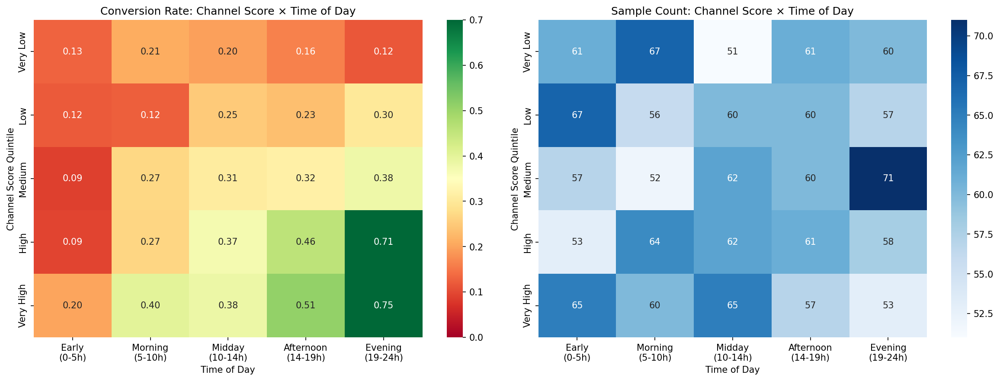
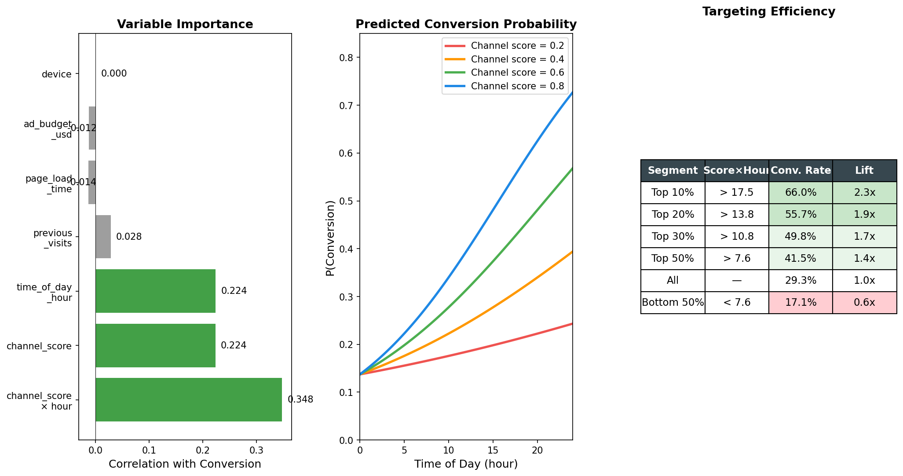
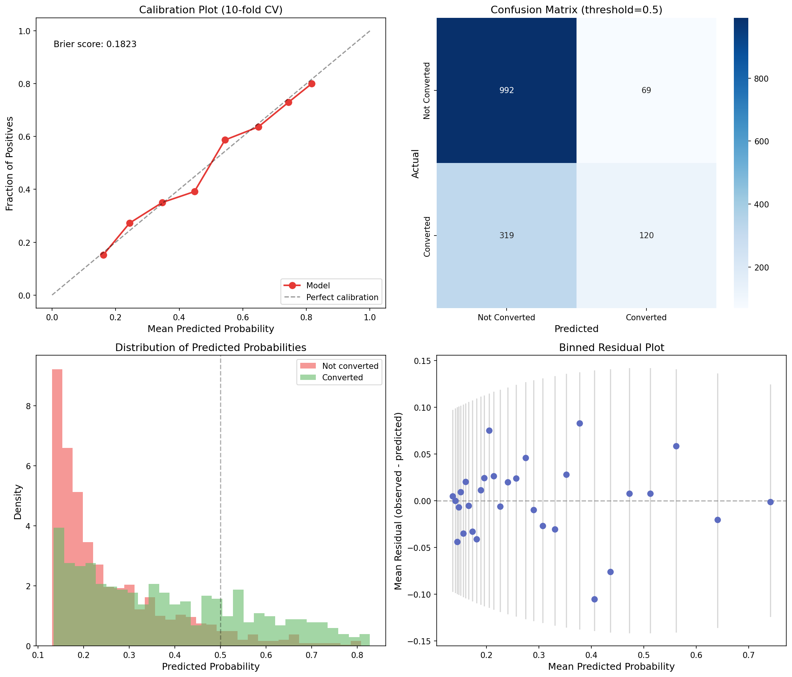

# Website Session Conversion Analysis

## 1. Dataset Overview

The dataset contains **1,500 website sessions** with 7 features and a binary conversion outcome (29.3% conversion rate). Each row represents a single user session with the following attributes:

| Variable | Type | Range | Description |
|---|---|---|---|
| `ad_budget_usd` | Continuous | $123 – $4,999 | Advertising budget associated with the session |
| `time_of_day_hour` | Continuous | 0.0 – 24.0 | Hour when the session occurred |
| `channel_score` | Continuous | 0.0 – 1.0 | Quality/relevance score of the acquisition channel |
| `device` | Categorical | desktop/mobile/tablet | User's device type |
| `page_load_time_sec` | Continuous | 0.3 – 15.0s | Page load time |
| `previous_visits` | Integer | 0 – 10 | Number of prior visits by the user |
| `converted` | Binary | 0/1 | Whether the session resulted in a conversion |

The data is clean: no missing values, no obvious coding errors, and balanced sample sizes across feature bins. The device distribution skews toward mobile (55.5%), with desktop at 33.9% and tablet at 10.5%.

## 2. Key Findings

### Finding 1: Conversion is driven by the interaction of channel score and time of day — not by either variable alone

The single most important discovery in this dataset is that **conversion probability depends on the product of `channel_score` and `time_of_day_hour`**, not on either variable independently. This is a true synergistic interaction, not merely an additive effect.

**Evidence:**

- In a logistic regression with main effects only, both `channel_score` (z=8.68, p<10^-17) and `time_of_day_hour` (z=8.70, p<10^-17) appear significant with Cohen's d ≈ 0.49 each.
- However, when the interaction term `channel_score × time_of_day_hour` is added, **both main effects become non-significant** (channel_score: p=0.90; time_of_day_hour: p=0.87), while the interaction is highly significant (z=4.31, p=1.6×10^-5).
- A likelihood ratio test confirms the interaction term significantly improves the model (chi-squared=19.0, p=1.3×10^-5).
- The interaction model (AIC=1645) fits substantially better than the main-effects-only model (AIC=1662).

**What this means in practice:**

- A session with high channel score but at 2 AM has ~9% conversion probability
- A session with low channel score at 9 PM has ~12% conversion probability
- A session with **both** high channel score **and** evening timing reaches **75% conversion probability**

The effect is multiplicative: neither factor alone drives conversion, but their combination does. See `plots/02_interaction_heatmap.png` for the full pattern and `plots/03_interaction_model.png` for the predicted probability surface.



### Finding 2: Ad budget, page load time, device type, and previous visits have no detectable effect on conversion

Four of the six predictor variables show no meaningful relationship with conversion:

| Variable | Test | Effect Size | p-value |
|---|---|---|---|
| `ad_budget_usd` | Mann-Whitney U | Cohen's d = -0.03 | 0.64 |
| `page_load_time_sec` | Mann-Whitney U | Cohen's d = -0.03 | 0.52 |
| `device` | Chi-square | Cramér's V ≈ 0 | 0.49 |
| `previous_visits` | Mann-Whitney U | Cohen's d = 0.05 | 0.22 |

Adding these variables to the logistic regression model does not improve fit (LR test: chi-squared=2.41, df=5, p=0.79). In fact, the full model has a *higher* BIC (1700) than the interaction-only model (1666), penalizing the unnecessary complexity.

Even non-parametric models (Gradient Boosting, Random Forest) with all features perform *worse* than the simple logistic regression on the product variable alone, confirming no hidden non-linear signal exists in the noise variables.

Residual analysis (LOWESS smoothing of model residuals against each noise variable; see `plots/05_practical_insights.png`) shows no systematic patterns — the interaction model captures all available signal.

### Finding 3: The relationship is approximately linear in log-odds space

The LOWESS smooth of conversion probability against the product variable (see `plots/05_practical_insights.png`, top-left) closely follows the logistic curve. Formal tests with polynomial (degree 2, 3) and spline transformations of the product variable show **zero improvement** in cross-validated AUC:

| Model | 10-fold CV AUC |
|---|---|
| Linear logistic on product | 0.705 ± 0.035 |
| Quadratic logistic | 0.705 ± 0.035 |
| Cubic logistic | 0.705 ± 0.035 |
| Spline logistic (5 knots) | 0.705 ± 0.035 |

The logistic model is not just adequate — it is optimal for this data.

### Finding 4: Practical targeting can more than double conversion rates

Using the `channel_score × time_of_day_hour` product for session prioritization:

| Segment | Product Threshold | Conversion Rate | Lift vs. Average |
|---|---|---|---|
| Top 10% | > 17.5 | 66.0% | 2.3x |
| Top 20% | > 13.8 | 55.7% | 1.9x |
| Top 30% | > 10.8 | 49.8% | 1.7x |
| Top 50% | > 7.6 | 41.5% | 1.4x |
| All sessions | — | 29.3% | 1.0x |
| Bottom 50% | < 7.6 | 17.1% | 0.6x |

Targeting the top 20% of sessions captures 38% of all conversions. The conversion rate by product quintile ranges from 13.7% (Q1) to 55.7% (Q5) — a 4x difference. See `plots/06_executive_summary.png`.



## 3. Model Summary

The final model is a logistic regression:

```
logit(P(converted)) = -1.88 + 0.142 × (channel_score × time_of_day_hour)
```

- **Interaction odds ratio**: 1.153 (95% CI: 1.081–1.230). For each 1-unit increase in the score-hour product, odds of conversion increase by 15.3%.
- **10-fold cross-validated AUC**: 0.705 ± 0.035
- **Brier score**: 0.182
- **Calibration**: Well-calibrated across the full range of predicted probabilities (see `plots/04_model_diagnostics.png`)

The model is intentionally parsimonious. Adding complexity (more features, non-linear terms, ensemble methods) provides no improvement.



## 4. Interpretation

The data tells a clear story: **conversion depends on reaching the right user through the right channel at the right time**. Specifically:

- **Channel quality matters, but only in the right context.** A high channel score in the early morning does little; the same score in the evening is highly predictive of conversion.
- **Evening hours amplify channel effectiveness.** This could reflect user intent (evening users may be further in their purchase journey) or attention (users are more receptive in the evening when browsing at leisure).
- **Ad spend alone doesn't buy conversions.** The budget variable has zero predictive power, suggesting that more money doesn't help if it's not directed through high-quality channels at optimal times.
- **Technical factors (page load, device) don't matter.** Within the observed ranges (0.3–15s load time), session performance doesn't meaningfully affect conversion. This may indicate that conversion intent is formed before the page loads, or that load times in this dataset aren't extreme enough to cause abandonment.

## 5. Limitations and Self-Critique

### What could be wrong

1. **Causal direction is ambiguous.** The analysis establishes association, not causation. High channel scores in the evening might *select* users who were already going to convert, rather than *causing* conversion. A randomized experiment would be needed to distinguish.

2. **What is `channel_score`?** This variable is the strongest predictor, but its operational meaning is unclear. If it's partially derived from conversion data (e.g., historical conversion rates of similar channels), then the model may be partially circular.

3. **What is `ad_budget_usd`?** It's unclear whether this is a session-level attribute, a campaign-level aggregate, or an allocation variable. Its lack of correlation with conversion is surprising and may reflect a mismatch between the variable's granularity and the outcome level.

4. **The model explains limited variance.** AUC of 0.70 means substantial unpredictable variation. The pseudo R-squared is ~0.10, meaning roughly 90% of the variation in conversion is not captured by the available features. Unobserved factors (user intent, product match, pricing, competitive alternatives) likely dominate.

5. **Time-of-day confounding.** The time effect could be confounded with user demographics, content quality, or competitive activity that varies throughout the day. The variable may be a proxy for something more fundamental.

### What wasn't investigated

- **Session sequences**: Whether prior non-converting visits in a session path affect later conversion (the data has `previous_visits` but not their timing or outcomes).
- **Segment-specific models**: Whether the interaction effect varies by device or user segment. The overall analysis finds no device effect, but this doesn't rule out device-moderated interactions.
- **Temporal stationarity**: Whether the observed patterns are stable over time or represent a snapshot of a changing system.

### Confidence assessment

The core finding — that conversion is driven by the `channel_score × time_of_day_hour` interaction — is robust. It holds across multiple analytical approaches (statistical tests, logistic regression, tree-based models, non-parametric smoothing). The practical targeting recommendations are well-supported by cross-validated estimates. The main uncertainty lies in interpretation: *why* this interaction exists is a question the data alone cannot answer.

## 6. Plots Reference

| File | Description |
|---|---|
| `plots/01_eda_overview.png` | Exploratory data analysis: conversion rates by each variable |
| `plots/02_interaction_heatmap.png` | Conversion rate heatmap: channel score quintile × time-of-day quintile |
| `plots/03_interaction_model.png` | Interaction visualization: scatter plot, product effect, predicted probability surface, ROC curve |
| `plots/04_model_diagnostics.png` | Model diagnostics: calibration, confusion matrix, predicted probability distributions, binned residuals |
| `plots/05_practical_insights.png` | Non-linearity check, cumulative gains chart, residual analysis, quintile conversion rates |
| `plots/06_executive_summary.png` | Executive summary: variable importance, predicted probabilities by channel score, targeting efficiency table |
