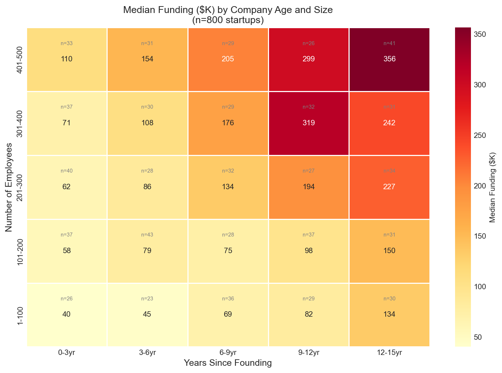
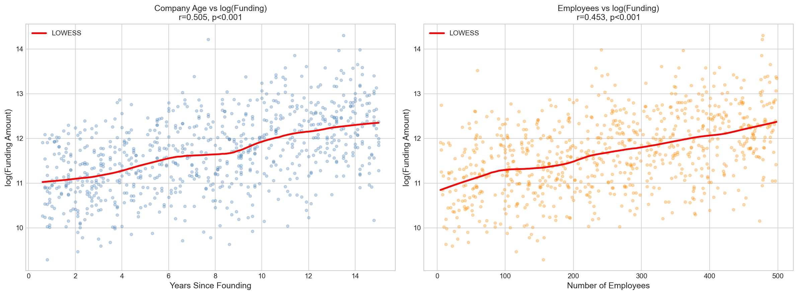
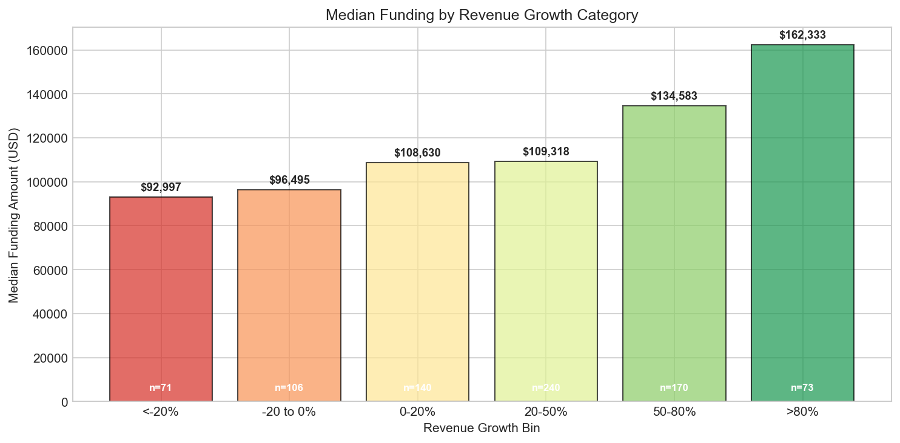
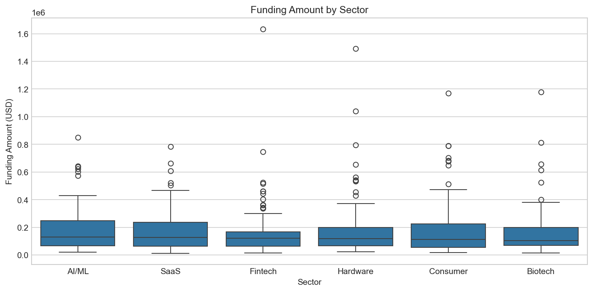
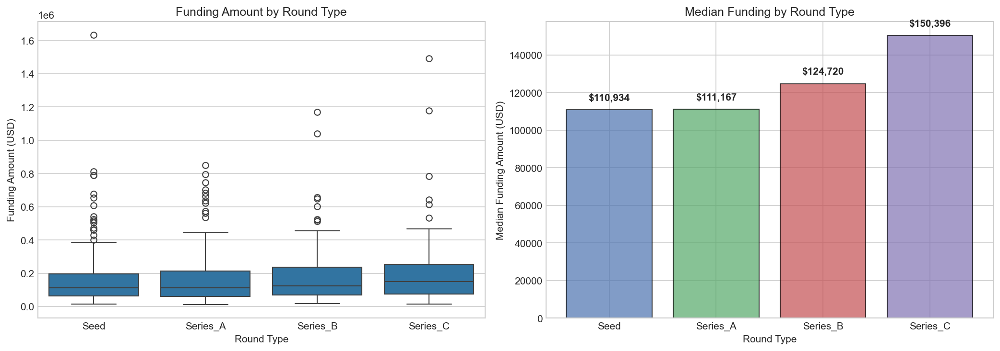
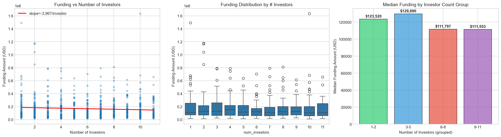
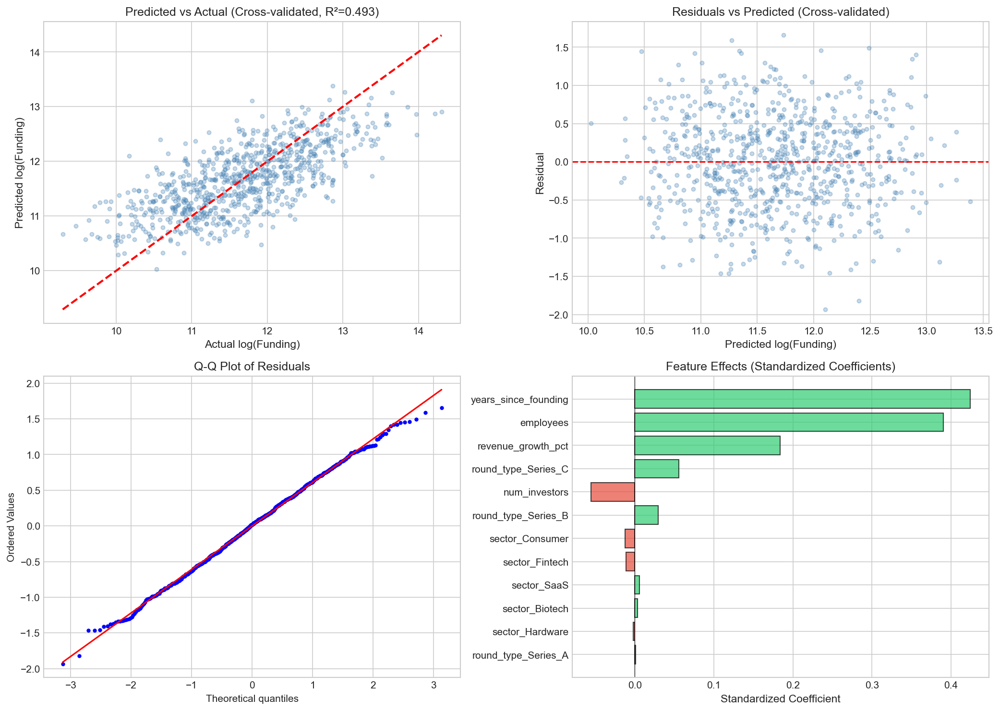

# Startup Funding Analysis Report

## Dataset Overview

This dataset contains 800 startups with 8 variables: company identifier, sector, funding round type, employee count, years since founding, revenue growth percentage, number of investors, and funding amount in USD. There are no missing values.

- **6 sectors**: AI/ML (143), Fintech (140), Consumer (138), Hardware (131), SaaS (124), Biotech (124) — roughly balanced
- **4 round types**: Seed (324), Series A (219), Series B (155), Series C (102) — decreasing as expected
- **Funding range**: $10,846 to $1,633,984 (median $118,934, mean $168,083) — right-skewed distribution

---

## Key Findings

### 1. Company Age and Size Are the Dominant Drivers of Funding

The two strongest predictors of funding amount are **years since founding** (r=0.505 with log-funding) and **number of employees** (r=0.453). Together, these two variables alone explain **45.6% of funding variance** (R²=0.456).

**Effect sizes** (from log-linear regression):
- Each additional **year** of age increases funding by **+10.4%**
- Each additional **100 employees** increases funding by **+32.0%**
- Mature, large companies (12+ years, 400+ employees) receive a median of **$347,164** — **8.6x more** than young, small companies (≤3 years, ≤100 employees) at **$40,295**

These two predictors are uncorrelated with each other (r=0.008), meaning they capture independent dimensions: organizational maturity and organizational scale. Their effects are additive, not synergistic — the interaction term is not significant (p=0.12).


*Figure: Median funding ($K) increases monotonically from bottom-left (young, small) to top-right (mature, large). See `plots/11_funding_heatmap.png`.*


*Figure: LOWESS trends confirm linear relationships between both key predictors and log-funding. See `plots/08_key_predictors.png`.*

### 2. Revenue Growth Provides a Meaningful But Secondary Boost

Revenue growth is the third most important predictor, adding **+4.9% funding per 10 percentage points** of growth. Companies with >80% revenue growth receive a median of **$162,333**, compared to **$92,997** for companies declining by >20% — a 1.7x difference.

The effect is slightly nonlinear: a quadratic term is significant (p=0.003), indicating high-growth companies receive a disproportionate premium. However, this acceleration is modest.

The revenue growth effect is **remarkably consistent** across all sectors and round types. No significant interaction effects were found (all interaction p-values >0.19). Hardware companies show the strongest growth-to-funding sensitivity (controlled coefficient 0.0064), while SaaS shows the weakest (0.0032), but these differences are not statistically significant.


*Figure: Median funding increases monotonically with revenue growth. See `plots/07_funding_by_growth_bins.png`.*

### 3. Sector Does Not Meaningfully Affect Funding

Despite spanning six distinct industries, **sector has no statistically significant effect on funding** (Kruskal-Wallis H=2.00, p=0.849). Median funding ranges narrowly from $104,288 (Biotech) to $128,987 (AI/ML) — a modest 24% spread that is not distinguishable from chance.

In the full regression model, no sector coefficient achieves statistical significance (all p>0.64). This is notable: the market apparently prices company fundamentals (age, size, growth) rather than sector labels.


*Figure: Sector distributions are nearly indistinguishable. See `plots/03_funding_by_sector.png`.*

### 4. Round Type Has Minimal Independent Effect

While median funding increases from Seed ($110,934) to Series C ($150,396), this progression is **surprisingly weak** and mostly explained by other variables. Round type alone explains only **1.2% of variance** (R²=0.012).

Critically, **round type is not a proxy for company maturity or size in this dataset**. Mean years since founding and employee counts are nearly identical across round types (all within ~0.6 years and ~24 employees of each other). This is an unusual pattern — in typical startup ecosystems, later rounds correlate strongly with older, larger companies.

After controlling for age, size, and growth, only Series C retains significance (coefficient +0.167, p=0.015), corresponding to a ~18% funding premium over Seed rounds.


*Figure: Round type differences are modest. See `plots/02_funding_by_round.png`.*

### 5. More Investors Slightly Reduces Total Funding

Counter-intuitively, the number of investors has a **small but significant negative** association with funding (coefficient -0.017, p=0.007). Each additional investor is associated with **-1.7% funding**.

This effect is weak within subgroups — only statistically significant in the Hardware sector (r=-0.194, p=0.027) and not significant within any individual round type. The practical pattern: companies with 1-2 investors receive a median of $123,520, while those with 9-11 receive $111,553.

The per-investor check size drops dramatically from ~$109,000 (1 investor) to ~$9,800 (11 investors). This suggests a "concentrated conviction" pattern: companies backed by fewer, more committed investors tend to receive larger total rounds.


*Figure: More investors does not translate to more total funding. See `plots/05_num_investors_analysis.png`.*

---

## Predictive Model

A **linear regression on log(funding)** was selected as the best model after comparison with Ridge, Random Forest, and Gradient Boosting via 5-fold cross-validation:

| Model | CV R² | CV RMSE |
|---|---|---|
| **Linear Regression** | **0.488** | **0.608** |
| Ridge | 0.488 | 0.607 |
| Random Forest | 0.411 | 0.651 |
| Gradient Boosting | 0.356 | 0.681 |

Tree-based models overfit despite tuning, confirming that the underlying relationships are fundamentally linear. The linear model explains **~49% of funding variance**.

**Model equation** (log-scale):
```
log(funding) = 10.12 + 0.099 * years + 0.00278 * employees + 0.00478 * growth
               - 0.0173 * num_investors + [small round_type/sector adjustments]
```

**Model diagnostics** are clean:
- Residuals are normally distributed (Shapiro-Wilk W=0.998, p=0.93)
- No heteroscedasticity in residual plots
- No systematic bias by sector or round type (all mean residuals < 0.006)
- Dollar-scale median absolute percentage error: **40.7%**


*Figure: Diagnostic plots confirm well-behaved residuals. Standardized coefficient chart shows the dominance of age and employee count. See `plots/10_linear_model_diagnostics.png`.*

---

## Limitations and Caveats

1. **~51% of variance is unexplained.** The available features capture company fundamentals but miss critical factors: product-market fit, team quality, competitive landscape, market timing, investor relationships, and negotiation dynamics. A median absolute error of 41% means individual predictions carry substantial uncertainty.

2. **The dataset may be synthetic or non-representative.** Several patterns are unusual for real startup data: (a) round types are uncorrelated with company age/size, (b) sectors show zero effect on funding, (c) employee counts are uniformly distributed. Real-world startup data typically shows strong round-maturity coupling and sector-specific funding patterns.

3. **Correlation, not causation.** The analysis identifies statistical associations. We cannot conclude that increasing employees or waiting longer *causes* higher funding — these likely reflect underlying company quality and trajectory.

4. **No temporal dimension.** Without date information, we cannot assess whether these patterns hold across market cycles or represent a specific market environment.

5. **Potential selection bias.** The dataset only includes companies that received funding. Companies that sought but failed to secure funding are absent, which may bias the estimated relationships (survivorship bias).

6. **The num_investors finding is fragile.** While statistically significant in the full model, it's weak within subgroups and explains very little variance. It should be treated as suggestive rather than conclusive.

---

## Summary

Startup funding in this dataset is primarily determined by two fundamental company characteristics — **how old the company is** and **how many people it employs** — which together explain nearly half the variance. Revenue growth provides a secondary but meaningful boost. Surprisingly, neither sector nor funding round type substantially affects funding amounts after accounting for these fundamentals. The market appears to price tangible company substance over categorical labels.
