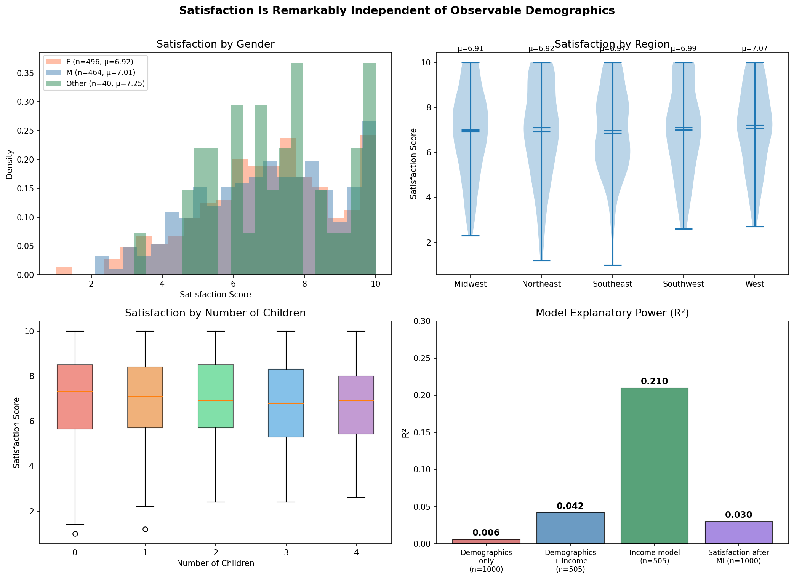
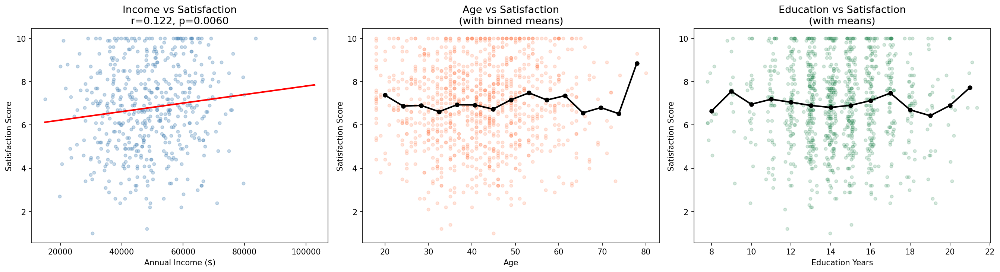
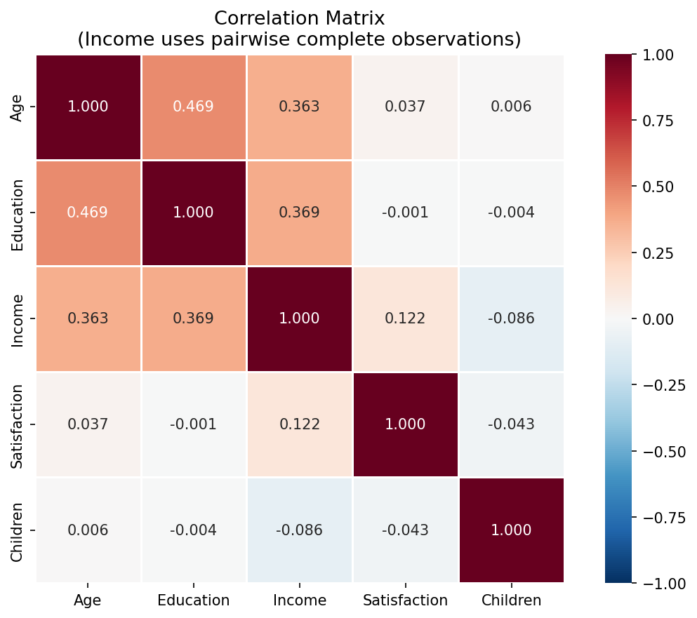
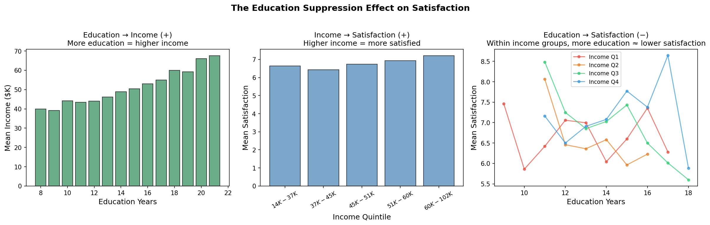
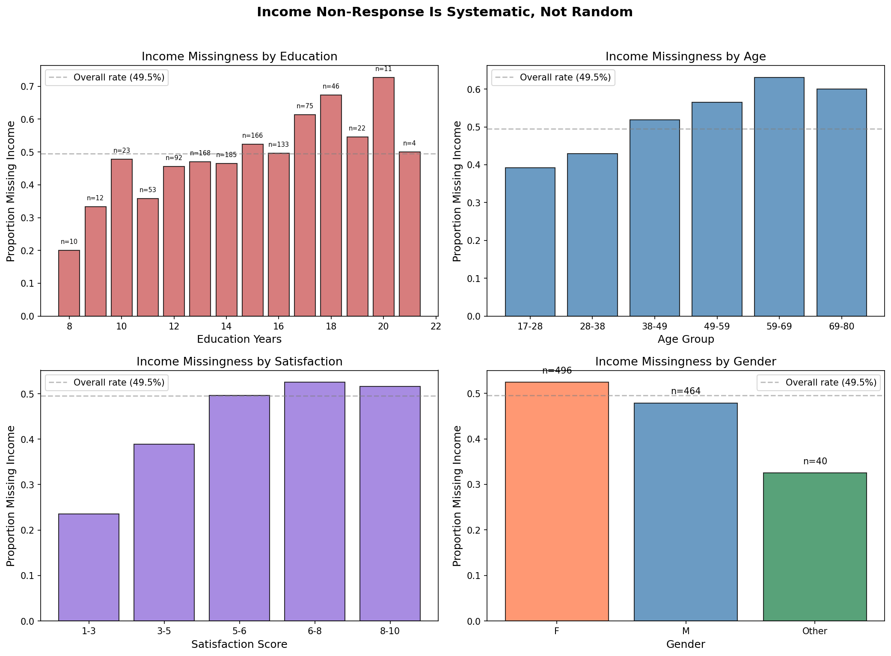
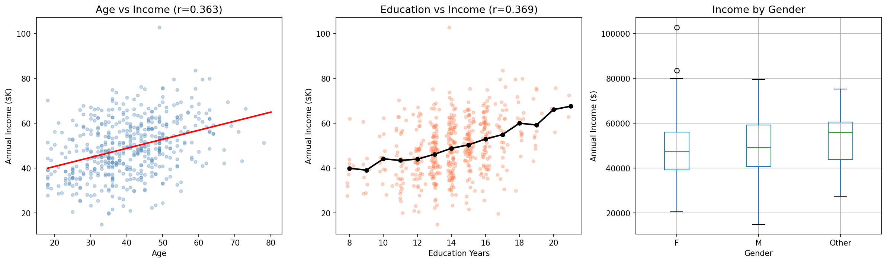

# Survey Analysis Report: Demographics, Income, and Life Satisfaction

## 1. Dataset Overview

This dataset contains 1,000 survey responses with demographic and socioeconomic information:

| Variable | Type | Range / Values | Missing |
|----------|------|----------------|---------|
| age | Integer | 18–80 (mean 41.8) | 0% |
| gender | Categorical | F (496), M (464), Other (40) | 0% |
| region | Categorical | Southeast (230), Southwest (211), West (201), Northeast (182), Midwest (176) | 0% |
| education_years | Integer | 8–21 (mean 14.3) | 0% |
| reported_annual_income | Float | $15,000–$102,800 (mean $48,994) | **49.5%** |
| satisfaction_score | Float | 1.0–10.0 (mean 6.98) | 0% |
| num_children | Integer | 0–4 (mean 1.46) | 0% |

Satisfaction scores are left-skewed (median 7.0), clustering toward the upper end of the 1–10 scale. Income, among those who reported it, is approximately normally distributed.

---

## 2. Key Findings

### Finding 1: Satisfaction is remarkably independent of observable demographics

**The central finding of this analysis is that life satisfaction cannot be meaningfully predicted from the demographic and socioeconomic variables in this dataset.** A regression model using age, education, gender, region, and number of children explains only **0.6% of satisfaction variance** (R² = 0.006). Adding income improves this to just **4.2%** (R² = 0.042, complete cases). None of the following showed statistically significant differences in satisfaction:

- **Gender**: F = 6.92, M = 7.01, Other = 7.25 (ANOVA F = 0.63, p = 0.53)
- **Region**: Range 6.91–7.07 across five regions (ANOVA F = 0.21, p = 0.94)
- **Age**: No linear or non-linear trend (r = 0.037, p = 0.25)
- **Education**: No bivariate relationship (r = −0.001, p = 0.98)
- **Number of children**: No significant effect (r = −0.043, p = 0.17)

This means **over 95% of variation in satisfaction is driven by factors not captured in this survey** — personality, health, relationships, life events, or measurement noise.

### Finding 2: Income is the only significant predictor of satisfaction — but the effect is small

Among the 505 respondents who reported income, higher income is associated with modestly higher satisfaction:

- **Pearson r = 0.122** (p = 0.006)
- **Effect size**: A $10,000 increase in income corresponds to +0.26 points on the 1–10 satisfaction scale
- Moving from the 25th percentile ($39,800) to the 75th percentile ($58,200) in income predicts only a **+0.48 point** increase in satisfaction — a quarter of one standard deviation

This effect is robust to multiple imputation (MI coefficient = 2.2 × 10⁻⁵, p = 0.001, m = 20 imputations using Rubin's rules).

### Finding 3: Education has a suppressed negative effect on satisfaction

Education shows zero bivariate correlation with satisfaction (r = −0.001), but this masks two opposing pathways:

1. **Education → Income → Satisfaction (+)**: More education predicts higher income (r = 0.369, p < 0.001), and income predicts higher satisfaction.
2. **Education → Satisfaction (−)**: Controlling for income, education is negatively associated with satisfaction (β = −0.094, p = 0.039 in the complete-case model).

These two effects approximately cancel. Within the third income quartile ($40,600–$58,200), the education–satisfaction correlation is r = −0.225 (p = 0.012). This pattern is consistent with an **expectation gap**: more educated respondents may have higher expectations that offset the satisfaction benefits of their (education-enabled) higher income.

### Finding 4: Income non-response is systematic, not random

Nearly half (49.5%) of respondents did not report income. This missingness is significantly predicted by:

| Predictor | Effect on missingness | p-value |
|-----------|----------------------|---------|
| Age | +0.37 percentage points per year older | 0.016 |
| Education | +1.9 percentage points per year | 0.012 |
| Satisfaction | +2.4 percentage points per unit increase | 0.002 |
| Gender (Other vs F) | −20.8 percentage points | 0.013 |

Older, more educated, and more satisfied respondents are significantly more likely to omit income. This has two implications:

1. **Complete-case analyses of income are biased** toward younger, less educated respondents.
2. **The observed income–satisfaction correlation may be attenuated**, since higher-satisfaction respondents disproportionately declined to report income.

The logistic regression for missingness (n = 1,000) shows that satisfaction itself predicts non-response (OR ≈ 1.11 per unit, p = 0.003), suggesting potential MNAR (missing not at random) mechanisms.

### Finding 5: Income is substantially determined by age and education

Unlike satisfaction, income is moderately predictable (R² = 0.210) from demographics:

| Predictor | Coefficient | p-value | Interpretation |
|-----------|-------------|---------|----------------|
| Age | +$272/year | < 0.001 | Each additional year of age → $272 more income |
| Education | +$1,473/year | < 0.001 | Each year of education → $1,473 more income |
| Num children | −$948/child | 0.029 | Each child → $948 less income |
| Gender (M vs F) | −$42 | 0.968 | **No gender income gap** |
| Region | All p > 0.06 | — | No significant regional differences |

The absence of a gender income gap (coefficient: −$42, p = 0.97) is notable. VIF values for all predictors are below 1.25, indicating no multicollinearity concerns.

---

## 3. Interpretation and Practical Implications

### What the data tells us

This survey paints a picture of a population where **life satisfaction operates largely independently of socioeconomic status**. While income has a statistically significant positive effect, it is practically small — the entire interquartile range of income buys less than half a point on a 10-point scale.

The education suppression finding suggests a psychological mechanism: education raises income but also raises expectations, and the net effect on subjective well-being approximately cancels. This is consistent with the well-documented **Easterlin paradox** and hedonic adaptation theory.

### What survey administrators should know

The 49.5% income non-response rate is the most pressing data quality concern. The non-response is not random — it is driven by precisely the variables of interest (education, age, satisfaction). Any analysis that treats income as complete-case risks systematic bias. Future survey iterations should consider:

- Making income a required field with appropriate response categories (ranges rather than exact amounts)
- Investigating whether the non-response reflects privacy concerns (higher earners) or survey fatigue (older respondents)

---

## 4. Limitations and Self-Critique

### Assumptions that may be wrong

1. **Linearity**: All models assume linear relationships. While I checked for non-linear age effects and found none, satisfaction may have threshold effects with income (e.g., the effect may be concentrated below a subsistence threshold) that the relatively narrow income range ($15K–$103K) cannot detect.

2. **Cross-sectional data**: All findings are correlational. The education → expectations → lower satisfaction pathway is one interpretation; reverse causation (dissatisfied people pursue more education) cannot be ruled out.

3. **Missing not at random (MNAR)**: While multiple imputation addresses MAR missingness, the fact that satisfaction itself predicts non-response raises MNAR concerns. If the *reason* for non-response is related to income itself (e.g., high earners don't want to disclose), then even MI-corrected estimates may be biased.

### What I did not investigate

- **Interaction effects beyond gender × children**: Higher-order interactions (e.g., region × education × income) were not systematically explored due to sample size constraints per cell.
- **Non-linear income effects**: A piecewise or log-income model might reveal that income matters more at the low end — the current linear specification cannot distinguish this.
- **Satisfaction response style**: The left-skewed distribution could reflect acquiescence bias or cultural norms rather than true satisfaction levels. This cannot be assessed without additional survey design information.

### Strength of evidence

- The null finding (satisfaction independent of demographics) is strong: it holds across multiple model specifications, subgroup analyses, and after multiple imputation.
- The income–satisfaction effect (r = 0.122) is statistically significant but practically small. It should not be over-interpreted.
- The education suppression effect is the most speculative finding — it is significant in only one income quartile, and the mechanistic interpretation (expectation gap) is not directly testable with this data.

---

## 5. Summary of Plots

| File | Description |
|------|-------------|
| `plots/01_distributions.png` | Distributions of all variables |
| `plots/02_satisfaction_vs_predictors.png` | Satisfaction vs income, age, and education |
| `plots/03_income_missingness_patterns.png` | Income non-response patterns by demographics |
| `plots/04_income_determinants.png` | Age and education as income predictors |
| `plots/05_education_suppression.png` | The education suppression effect on satisfaction |
| `plots/06_correlation_heatmap.png` | Full correlation matrix |
| `plots/07_model_diagnostics.png` | Residual diagnostics for satisfaction model |
| `plots/08_satisfaction_summary.png` | Summary: satisfaction across subgroups and model R² |
