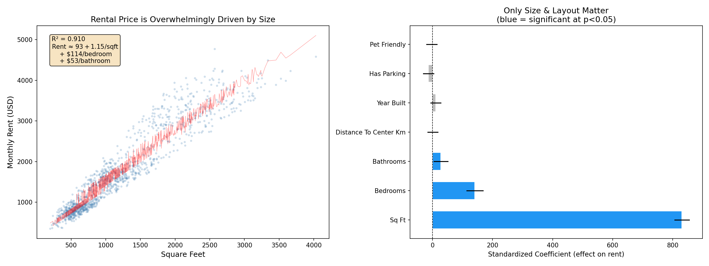
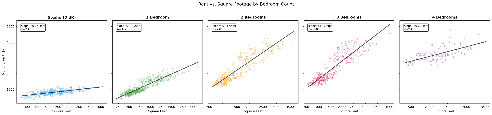
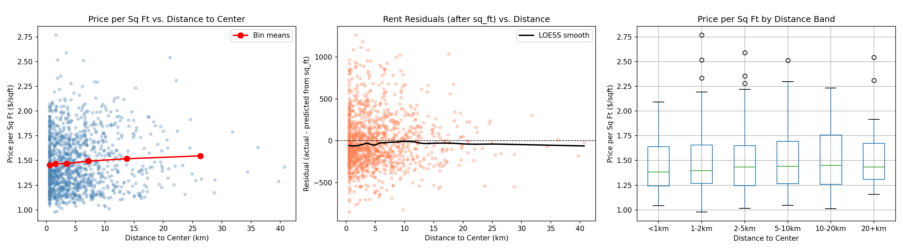
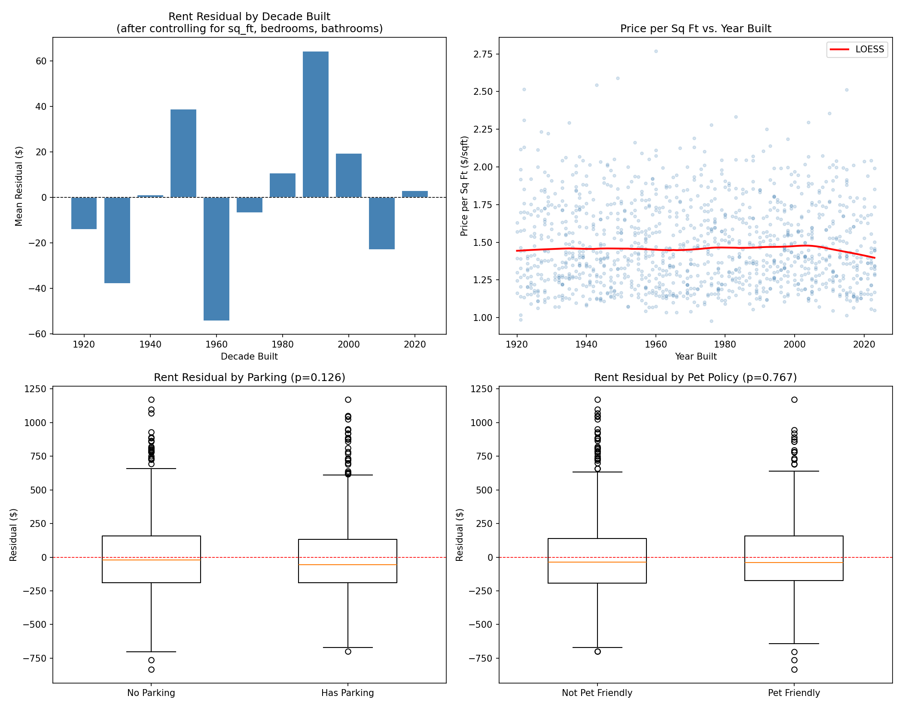
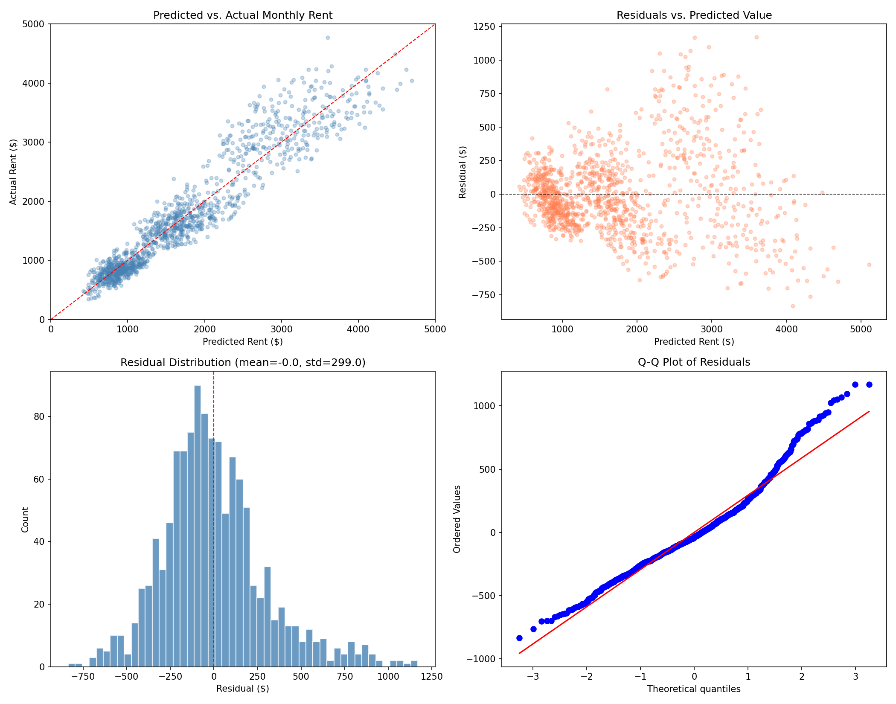
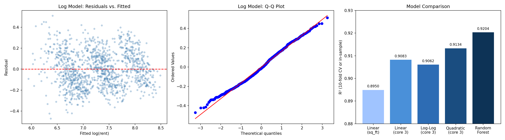

# Rental Price Analysis Report

## 1. Dataset Overview

The dataset contains **1,200 rental listings** with 9 variables: square footage, bedrooms (0-4), bathrooms (1-3), distance to city center (0.5-40.7 km), year built (1920-2023), parking availability, pet policy, and monthly rent ($347-$4,769). There are no missing values. The median rent is $1,516/month for a median unit of 998 sq ft.

## 2. Key Findings

### Finding 1: Square Footage Overwhelmingly Determines Rent

Square footage alone explains **89.5% of rent variance** (R^2 = 0.897 via 10-fold cross-validation). The relationship is strongly linear at approximately **$1.15 per square foot**, with a Pearson correlation of r = 0.947. No other feature comes close to this predictive power.

Adding bedrooms and bathrooms improves the model to R^2 = 0.910, a statistically significant but practically modest gain. Adding all remaining features (distance, year built, parking, pet policy) provides **zero additional improvement** (F-test: F = 0.99, p = 0.41).

The standardized coefficient for sq_ft ($831) dwarfs bedrooms ($141), bathrooms ($28), and all other features (< $14 each). See `plots/09_key_findings_summary.png` for a visual comparison.

### Finding 2: Bedrooms Command a $114/Month Premium Beyond Size

After controlling for square footage, each additional bedroom adds approximately **$114/month** to rent (p < 0.001). This represents a "layout premium" -- tenants pay more for a 2BR/1000sqft unit than a 1BR/1000sqft unit, presumably because divided space is more functional than open space.

This premium is consistent across size bands:
- 800-1200 sqft: 1BR = $1,421, 2BR = $1,563, 3BR = $1,621
- 1200-1800 sqft: 1BR = $1,824, 2BR = $2,124, 3BR = $2,017

The per-sqft slopes are remarkably similar across bedroom counts ($0.71-$1.12/sqft), confirming that bedrooms shift the intercept rather than changing the fundamental price-per-area relationship. See `plots/08_rent_by_bedrooms.png`.

### Finding 3: Distance to City Center Has No Effect on Rent

This is the most surprising finding. Distance to center shows:
- Raw correlation with rent: r = -0.049
- Correlation with rent residuals (after controlling for size): r = 0.002
- OLS coefficient: $0.21/km, p = 0.90
- Log-transformed model: p = 0.52
- LOESS smooth of residuals vs. distance: flat

Price per square foot is essentially constant across distance bands: $1.45/sqft at <1 km vs. $1.55/sqft at 20+ km. The boxplot distributions overlap almost entirely across all distance categories. See `plots/04_distance_analysis.png`.

### Finding 4: Year Built, Parking, and Pet Policy Have No Detectable Effect

None of these features achieve statistical significance in any model specification:

| Feature | Coefficient | p-value |
|---------|------------|---------|
| Year built | $0.36/year | 0.218 |
| Has parking | -$26.89 | 0.122 |
| Pet friendly | -$4.84 | 0.784 |

The decade-level analysis of rent residuals shows random fluctuations with no trend (range: -$54 to +$64). The LOESS curve for price-per-sqft vs. year built is flat. See `plots/05_year_and_amenities.png`.

### Finding 5: Diminishing Returns at Larger Sizes (Heteroscedasticity)

The linear model exhibits significant heteroscedasticity (Breusch-Pagan test: p < 0.001). Residual variance increases with predicted rent -- larger, more expensive units have more price variability.

A quadratic model confirms diminishing marginal returns: the sqft^2 coefficient is negative and significant (p < 0.001), meaning each additional square foot is worth slightly less in larger units. However, the practical improvement is small (R^2 increases from 0.910 to 0.913).

Residual standard deviation is approximately $299 overall, but ranges from ~$200 for sub-$1000 units to ~$400 for $3000+ units. See `plots/06_model_diagnostics.png`.

## 3. Predictive Modeling

Six models were compared via 10-fold cross-validation:

| Model | Features | CV R^2 | CV MAE | CV RMSE |
|-------|----------|--------|--------|---------|
| Linear Regression | sq_ft only | 0.895 | $244 | $320 |
| Linear Regression | sq_ft, bedrooms, bathrooms | **0.908** | **$226** | **$299** |
| Linear Regression | All 7 features | 0.908 | $226 | $300 |
| Ridge Regression | All 7 features | 0.908 | $226 | $300 |
| Gradient Boosting | All 7 features | 0.914 | $207 | $288 |
| **Random Forest** | All 7 features | **0.920** | **$202** | **$278** |

The Random Forest achieves the best performance (R^2 = 0.920, MAE = $202), likely by capturing non-linearities (diminishing returns at large sizes). However, the simple 3-feature linear model (R^2 = 0.908, MAE = $226) is nearly as accurate and far more interpretable.

Random Forest feature importances confirm the dominance of sq_ft (94.4%), with all other features below 2.2%.

**Recommended model for practical use**: `Rent = $93 + $1.15 x sqft + $114 x bedrooms + $53 x bathrooms`. This predicts rent within $226 on average, using only three easily observable features.

See `plots/07_log_model_and_comparison.png` for model comparison.

## 4. Interpretation and Practical Implications

1. **For renters**: Size is what you're paying for. A 1,000 sqft apartment costs roughly the same whether it's downtown or 20 km out, whether it was built in 1925 or 2023, and whether it includes parking or not. The only secondary consideration is layout: more bedrooms at the same size costs ~$114/month more.

2. **For landlords/investors**: Pricing should be anchored almost entirely on square footage. The market does not appear to reward location proximity, building age, parking, or pet-friendliness in this dataset. Renovations or amenity upgrades are unlikely to justify rent increases unless they add usable space or bedrooms.

3. **For appraisers**: The simple formula `$93 + $1.15/sqft + $114/BR + $53/BA` provides a reliable baseline with $226 average error. Deviations from this formula should prompt investigation of unmeasured factors rather than adjustment of the model.

## 5. Limitations and Self-Critique

### What assumptions could be wrong?

- **Linear relationship**: The sq_ft-rent relationship is approximately linear but has diminishing returns at the high end. The linear model is a simplification -- the true relationship may curve slightly.
- **Independence**: Listings are treated as independent. If they come from the same buildings or landlords, this violates OLS assumptions and confidence intervals may be too narrow.
- **Causal interpretation**: The bedroom premium ($114) could reflect unmeasured quality differences (e.g., 2BR units in better condition) rather than a pure layout effect.

### What alternative explanations exist?

- **The absence of location effects is striking** and warrants skepticism. In virtually all real-world rental markets, location is a major price driver. Possible explanations:
  - The dataset may be synthetic or simulated with location generated independently of price.
  - "Distance to center" may not capture the relevant spatial dimension (e.g., proximity to transit, employment centers, or school districts might matter instead).
  - The market may be small enough that location differentials are minimal.
- **The absence of an age premium** could mean that building quality is uniform regardless of age (extensive renovations of older stock), or that year_built is a poor proxy for condition.

### What wasn't investigated?

- **Spatial clustering**: Whether nearby listings have similar residuals (spatial autocorrelation) was not tested. Moran's I or similar tests could reveal hidden location effects.
- **Interaction effects beyond parking x sqft**: Other interactions (e.g., year_built x distance, bedrooms x bathrooms) were not exhaustively tested.
- **Outlier influence**: A few high-rent listings (>$4,000) may exert disproportionate influence on the linear model. Robust regression was not attempted.
- **Market segmentation**: There may be distinct sub-markets (e.g., studios vs. family units) with different pricing dynamics that a single model averages over.

### Bottom line

The central finding is robust: **physical size determines rent in this dataset, and almost nothing else matters measurably.** The model is simple, interpretable, and accurate (91% of variance explained). But the near-total absence of location, age, and amenity effects is unusual enough to suggest either a unique market or limitations in the data rather than a general truth about rental pricing.

## Appendix: Plots Reference

| Plot | Description |
|------|-------------|
| `plots/01_correlation_heatmap.png` | Pairwise correlation matrix of all features |
| `plots/02_rent_vs_sqft_by_distance.png` | Scatter plot of rent vs. sq_ft, colored by distance |
| `plots/03_feature_distributions.png` | Histograms of all 8 features |
| `plots/04_distance_analysis.png` | Three-panel distance-to-center analysis |
| `plots/05_year_and_amenities.png` | Year built and amenity effects on rent residuals |
| `plots/06_model_diagnostics.png` | Residual diagnostics (predicted vs. actual, residual distribution, QQ) |
| `plots/07_log_model_and_comparison.png` | Log model diagnostics and model comparison |
| `plots/08_rent_by_bedrooms.png` | Rent vs. sq_ft faceted by bedroom count |
| `plots/09_key_findings_summary.png` | Summary: coefficient significance and rent vs. size |
