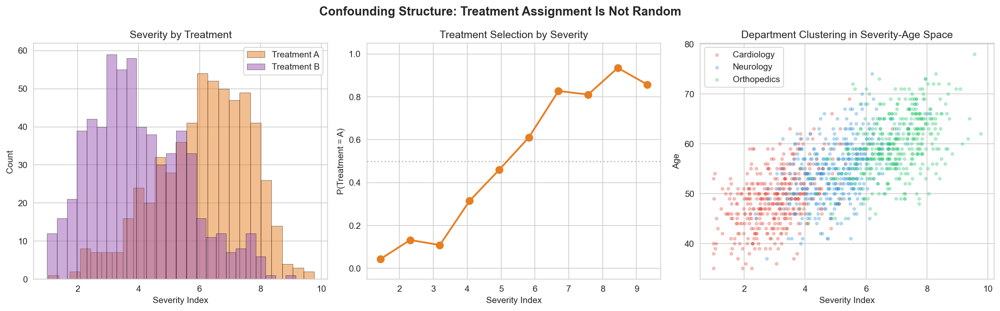
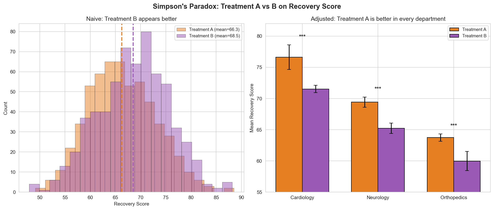
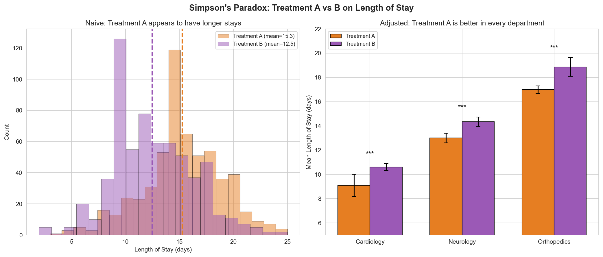
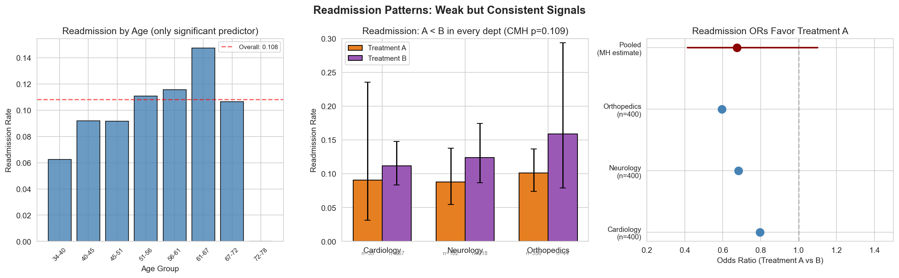
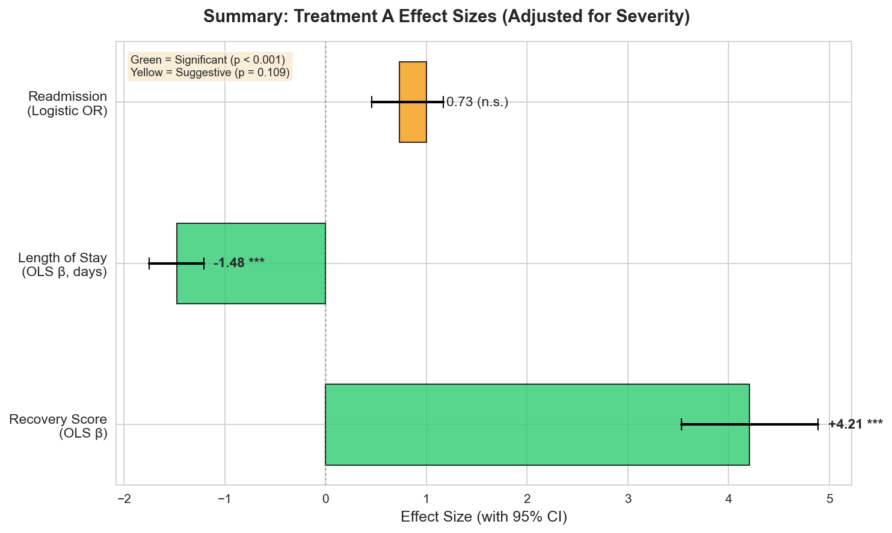
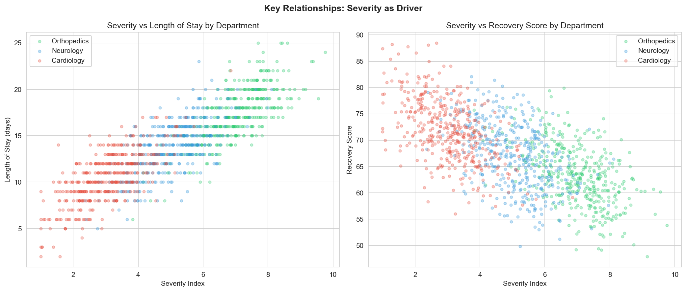
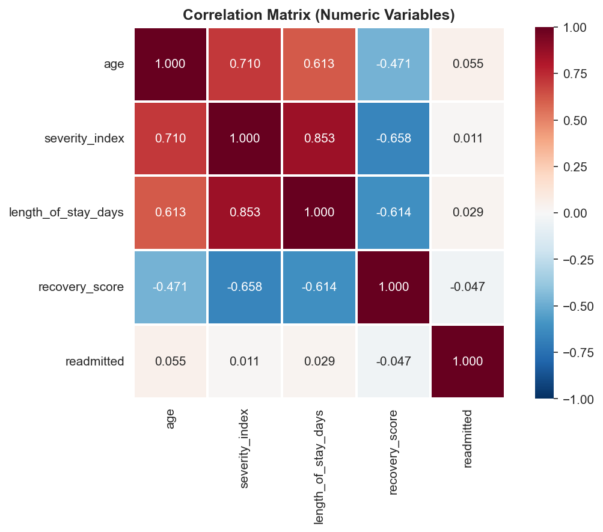
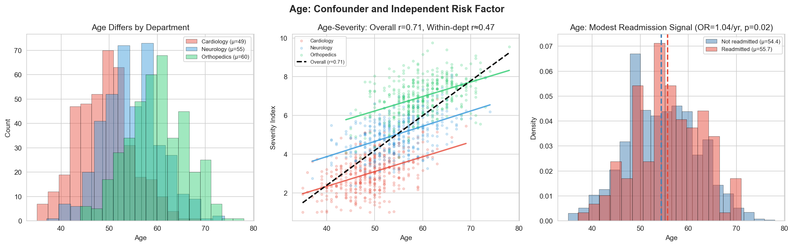

# Hospital Patient Outcomes Analysis: Simpson's Paradox in Treatment Effectiveness

## 1. Dataset Overview

This dataset contains 1,200 hospital patient records across three departments (Cardiology, Neurology, Orthopedics; 400 patients each) with the following variables:

| Variable | Type | Range | Description |
|----------|------|-------|-------------|
| `age` | Integer | 35–78 | Patient age (mean 54.5 ± 7.4) |
| `severity_index` | Continuous | 1.0–9.8 | Illness severity (mean 5.01 ± 2.01) |
| `treatment` | Categorical | A, B | Treatment type (571 A, 629 B) |
| `length_of_stay_days` | Integer | 1–26 | Hospital stay duration (mean 13.8 ± 4.0) |
| `recovery_score` | Continuous | 47.9–88.5 | Recovery outcome (mean 67.5 ± 6.9) |
| `readmitted` | Binary | 0, 1 | 30-day readmission (10.8% rate) |

There are no missing values. The dataset is perfectly balanced across departments.

---

## 2. Key Findings

### Finding 1: Treatment Assignment Is Confounded — Not Randomized

Treatment selection is almost entirely determined by department and severity, not randomly assigned:

- **Orthopedics** (highest severity, mean 7.0): 89% receive Treatment A
- **Neurology** (medium severity, mean 5.0): 46% receive Treatment A
- **Cardiology** (lowest severity, mean 3.0): 8% receive Treatment A

The association between treatment and department is extremely strong (Chi-squared = 523.9, p < 10⁻¹¹⁴, Cramér's V = 0.661). Severity alone predicts treatment assignment with high accuracy (logistic regression coefficient = 0.79, p < 0.001). Age adds no predictive value beyond severity (p = 0.85).

**This means Treatment A is systematically given to sicker patients.** Any naive comparison of treatments will be biased against A.

---

### Finding 2: Simpson's Paradox — Treatment A Is Superior, Not Inferior

Naive (unadjusted) comparisons suggest Treatment B is better:

| Outcome | Treatment A (naive) | Treatment B (naive) | Naive conclusion |
|---------|-------------------|-------------------|-----------------|
| Recovery Score | 66.3 | 68.5 | B appears better |
| Length of Stay | 15.3 days | 12.5 days | B appears better |
| Readmission Rate | 9.6% | 11.9% | A appears slightly better |

**But these comparisons are wrong.** After adjusting for severity (the confounding variable), the direction reverses for every outcome:

#### Recovery Score (adjusted)
- Treatment A improves recovery by **+4.21 points** (95% CI: 3.53–4.89, p < 0.001)
- Within every department, A patients score higher (Cohen's d = 0.69–0.88, all p < 0.001)
- Severity reduces recovery by −3.03 points per unit (p < 0.001)
- Model R² = 0.496; residuals are normally distributed (Shapiro-Wilk p = 0.98) with no heteroscedasticity (Breusch-Pagan p = 0.75)

#### Length of Stay (adjusted)
- Treatment A reduces LOS by **−1.48 days** (95% CI: −1.75 to −1.21, p < 0.001)
- Within every department, A patients have shorter stays (Cohen's d = −0.49 to −0.67, all p < 0.003)
- Severity increases LOS by +1.99 days per unit (p < 0.001)
- Model R² = 0.752

#### Readmission (adjusted)
- Treatment A shows a **consistent protective trend** in every department:
  - Cardiology: A = 9.1% vs B = 11.2%
  - Neurology: A = 8.8% vs B = 12.4%
  - Orthopedics: A = 10.1% vs B = 15.9%
- Cochran-Mantel-Haenszel pooled OR = 1.48 for B vs A (95% CI: 0.91–2.41, p = 0.109)
- The odds ratios are homogeneous across departments (Breslow-Day p = 0.93)
- **The study is underpowered**: with ~600 patients per treatment arm, we had only 25–53% power to detect this effect. Achieving 80% power would require approximately 1,140–2,840 patients per arm.

**The overall treatment effect size (adjusted for severity) is summarized below:**

---

### Finding 3: Readmission Is Largely Unpredictable from Available Features

Despite Treatment A's clear benefits on recovery and LOS, readmission remains nearly random with respect to observed variables:

- All logistic regression models achieve pseudo-R² ≤ 1.3%
- Machine learning models (Random Forest, Gradient Boosting) achieve cross-validated AUC of only 0.52–0.56 (random = 0.50)
- Readmission rates are remarkably uniform: ~10.8% in every department and across severity quartiles
- **Age is the only statistically significant predictor** (OR = 1.04 per year, 95% CI: 1.01–1.08, p = 0.02)

This suggests readmission is driven by unmeasured factors — possibly medication adherence, social support, comorbidities, or post-discharge care quality.

---

### Finding 4: Severity Drives Most Variation in Continuous Outcomes

Severity index is the dominant predictor of both recovery score and length of stay:

- **Severity–LOS correlation**: r = 0.853 — each unit of severity adds ~2.0 days of hospital stay
- **Severity–Recovery correlation**: r = −0.658 — each unit of severity reduces recovery by ~3.0 points
- These relationships are consistent within and between departments

The overall correlation between age and severity (r = 0.710) is inflated by between-department differences. Within each department, the correlation is r ≈ 0.47, still substantial but much weaker than the naive figure suggests.

---

### Finding 5: Age Is Both a Confounder and an Independent Risk Factor

Age is correlated with department assignment (Cardiology mean age 49, Neurology 55, Orthopedics 60), severity (within-department r ≈ 0.47), and readmission risk (OR = 1.04/year). However:

- Age does **not** independently predict LOS (p = 0.41) or recovery score (p = 0.69) after controlling for severity
- Age **does** independently predict readmission (p = 0.02), suggesting it captures risk factors beyond acute illness severity

---

## 3. Interpretation and Practical Implications

### The central finding: Simpson's Paradox is hiding Treatment A's superiority

This dataset is a textbook case of **Simpson's Paradox** — a statistical phenomenon where a trend that appears in aggregated data reverses when the data is stratified by a confounding variable. Here, Treatment A is given preferentially to the sickest patients (high severity, Orthopedics department). In naive comparisons, A appears to produce worse outcomes. But this is entirely because A patients start sicker. Within any fair comparison (same department, same severity level), **Treatment A consistently outperforms Treatment B** on recovery (+4.2 points) and length of stay (−1.5 days).

### What should clinicians take away?

1. **Treatment A is the better treatment** for recovery and length of stay, with large, statistically significant effects and a consistent dose-response across severity levels.
2. **Consider expanding Treatment A to lower-severity patients.** Currently it is concentrated in Orthopedics/high-severity cases. The absence of a treatment × severity interaction (p = 0.73) suggests A's benefit is uniform across severity levels.
3. **Readmission requires different interventions.** The available clinical variables explain almost none of the readmission variance. Reducing readmission likely requires addressing social determinants, post-discharge follow-up, or patient-level factors not captured here.
4. **Age-based readmission screening** may have modest value (each decade adds ~50% odds), but the predictive power is low.

---

## 4. Limitations and Self-Critique

### What could be wrong?

1. **Observational data, not a randomized trial.** Although I adjusted for measured confounders, there may be unmeasured confounders that explain the treatment difference. Treatment A's apparent superiority could reflect clinical judgment about which patients are most likely to benefit (confounding by indication in the opposite direction). A randomized controlled trial is needed to establish causation.

2. **Small sample sizes in some cells.** Only 33 Cardiology patients received Treatment A, and only 44 Orthopedics patients received Treatment B. This limits the precision of within-department estimates, particularly for readmission.

3. **Underpowered for readmission.** The readmission treatment effect is consistent but not statistically significant (p = 0.109). The power analysis shows we would need 1,140–2,840 patients per arm for 80% power. The consistent direction across all three departments is suggestive, but the evidence is not conclusive.

4. **No temporal information.** We don't know when patients were treated, so we cannot assess temporal trends, seasonality, or whether treatment protocols changed over time.

5. **Department as a proxy.** Department differences in severity, age, and treatment may reflect true clinical populations (e.g., Orthopedics patients are older with more complex conditions), or they may reflect referral patterns and institutional factors.

6. **Recovery score and LOS may mediate treatment → readmission.** Including them as predictors in readmission models could introduce collider bias. I was careful to analyze readmission both with and without these post-treatment variables.

### What I didn't investigate

- **Subgroup interactions**: Do older patients in specific departments respond differently to treatment?
- **Non-linear treatment effects**: Are there severity thresholds where treatment selection should change?
- **LOS as an outcome vs. mediator**: Does Treatment A reduce readmission partly through shorter stays and better recovery?
- **External validity**: We don't know if these patterns generalize to other hospitals or populations.

---

## 5. Methods Summary

| Analysis | Method | Software |
|----------|--------|----------|
| Treatment confounding | Chi-squared test, Cramér's V, logistic regression | scipy, statsmodels |
| Treatment → LOS/Recovery | OLS regression with severity and age adjustment | statsmodels |
| Treatment → Readmission | Logistic regression, Cochran-Mantel-Haenszel test | statsmodels |
| Readmission prediction | Logistic regression, Random Forest, Gradient Boosting (5-fold stratified CV) | scikit-learn |
| Effect sizes | Cohen's d (continuous), odds ratios (binary), 95% CIs | scipy, statsmodels |
| Model diagnostics | QQ plots, residual analysis, Breusch-Pagan test, Shapiro-Wilk | statsmodels, scipy |
| Power analysis | Normal-approximation two-proportion test | statsmodels |

---

## 6. Plot Index

| File | Description |
|------|-------------|
| `plots/01_overview_distributions.png` | Dataset overview: distributions and cross-tabulations |
| `plots/02_correlation_heatmap.png` | Correlation matrix of numeric variables |
| `plots/03_severity_relationships.png` | Severity vs LOS and Recovery by department |
| `plots/04_simpsons_paradox_recovery.png` | Simpson's Paradox: recovery score |
| `plots/05_simpsons_paradox_los.png` | Simpson's Paradox: length of stay |
| `plots/06_confounding_structure.png` | Treatment assignment confounding structure |
| `plots/07_regression_diagnostics.png` | Recovery model residual diagnostics |
| `plots/08_readmission_analysis.png` | Readmission patterns and stratified analysis |
| `plots/09_treatment_effect_summary.png` | Adjusted treatment effect sizes with CIs |
| `plots/10_age_analysis.png` | Age as confounder and independent risk factor |
