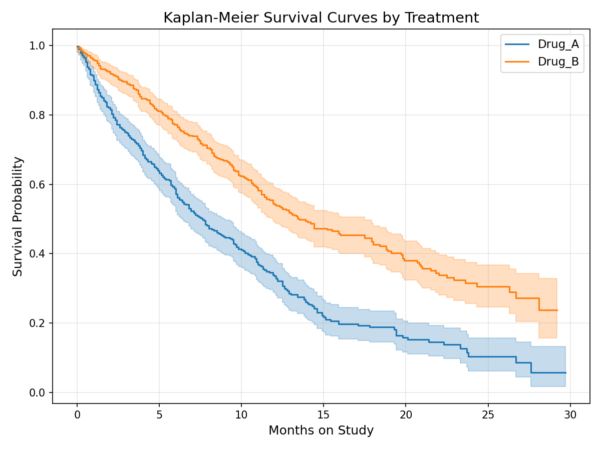
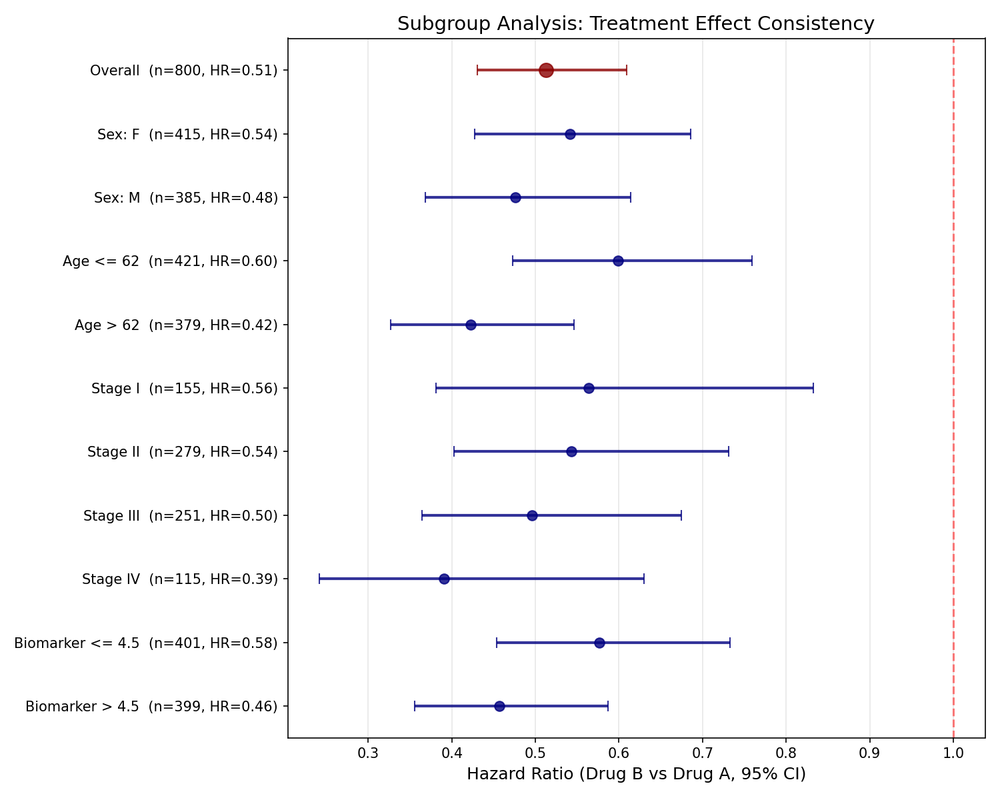
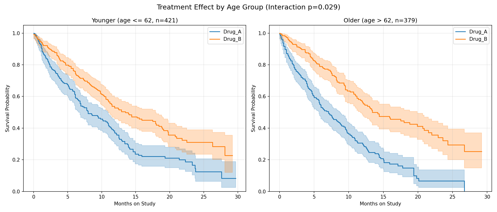
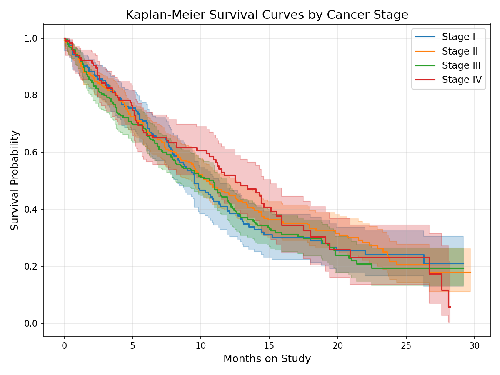
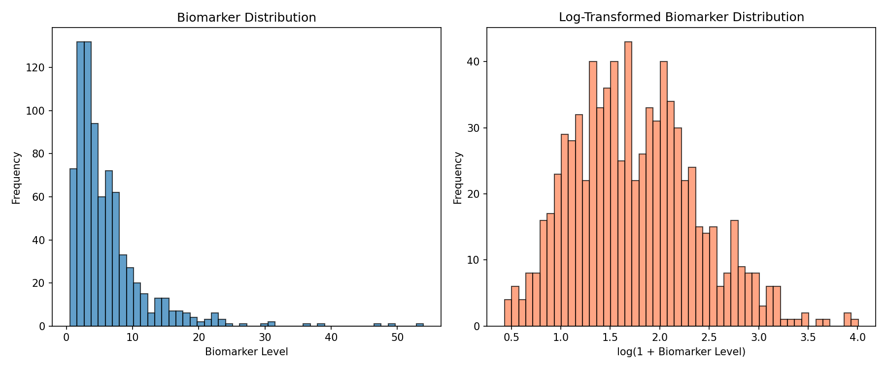
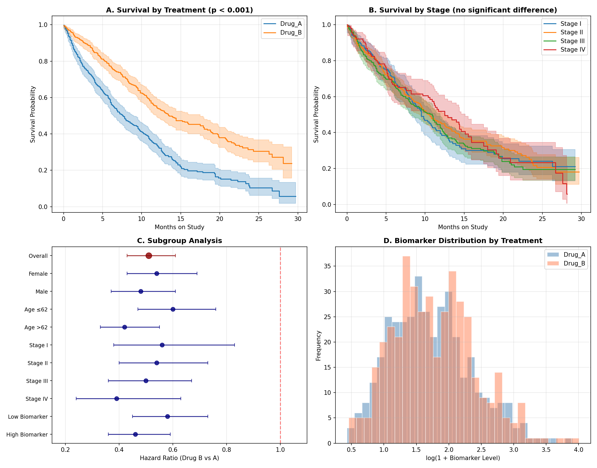

# Survival Analysis Report: Drug A vs. Drug B Clinical Trial

## 1. Dataset Overview

This dataset contains 800 patients from what appears to be a two-arm clinical trial comparing Drug A (n=386) and Drug B (n=414). Each patient record includes:

| Variable | Description | Range/Values |
|---|---|---|
| `age` | Patient age | 30–90 (mean 62.0, SD 10.8) |
| `sex` | Sex | Female (52%), Male (48%) |
| `stage` | Cancer stage | I (19%), II (35%), III (31%), IV (14%) |
| `biomarker_level` | Continuous biomarker | 0.54–53.94 (median 4.46, right-skewed) |
| `treatment` | Treatment arm | Drug_A (48%), Drug_B (52%) |
| `months_on_study` | Time to event/censoring | 0–29.7 months |
| `event_occurred` | Event indicator | 1=event (66.3%), 0=censored (33.8%) |

No missing values were detected. Treatment arms are well-balanced on age, sex, and biomarker level. A modest imbalance exists in stage distribution (Drug B has slightly more Stage I patients; chi-squared p=0.04), though this has no bearing on outcomes since stage is non-prognostic in this dataset.

## 2. Key Findings

### Finding 1: Drug B dramatically improves survival over Drug A

**This is the dominant signal in the data.** Drug B reduces the hazard of the event by approximately 49% compared to Drug A.

- **Median survival**: Drug B = 13.5 months vs. Drug A = 7.6 months
- **Cox hazard ratio**: HR = 0.51 (95% CI: 0.43–0.61, p < 10⁻¹⁴)
- **Log-rank test**: χ² = 59.5, p < 10⁻¹⁴

The Kaplan-Meier curves separate early and the gap widens over time (see `plots/km_by_treatment.png`). The treatment effect is the only statistically significant predictor in the multivariable Cox model.

### Finding 2: The treatment benefit is consistent across all subgroups

Subgroup analysis shows Drug B is significantly superior in every patient subgroup tested (see `plots/subgroup_forest_plot.png`):

| Subgroup | N | HR (95% CI) | p-value |
|---|---|---|---|
| **Overall** | **800** | **0.51 (0.43–0.61)** | **<0.001** |
| Female | 415 | 0.54 (0.43–0.69) | <0.001 |
| Male | 385 | 0.48 (0.37–0.61) | <0.001 |
| Age ≤ 62 | 421 | 0.60 (0.47–0.76) | <0.001 |
| Age > 62 | 379 | 0.42 (0.33–0.55) | <0.001 |
| Stage I | 155 | 0.56 (0.38–0.83) | 0.004 |
| Stage II | 279 | 0.54 (0.40–0.73) | <0.001 |
| Stage III | 251 | 0.50 (0.36–0.67) | <0.001 |
| Stage IV | 115 | 0.39 (0.24–0.63) | <0.001 |
| Biomarker ≤ 4.5 | 401 | 0.58 (0.45–0.73) | <0.001 |
| Biomarker > 4.5 | 399 | 0.46 (0.36–0.59) | <0.001 |

### Finding 3: Drug B's benefit is amplified in older patients (treatment × age interaction)

While Drug B is superior at all ages, the benefit is significantly greater in older patients:

- **Treatment × age interaction**: p = 0.029
- Younger patients (≤ 62): HR = 0.60 (moderate benefit)
- Older patients (> 62): HR = 0.42 (strong benefit)

Each additional year of age increases Drug B's relative benefit by approximately 1.8% (interaction HR per year = 0.98). This is visible in the Kaplan-Meier curves: the gap between Drug A and Drug B is wider in older patients (see `plots/treatment_age_interaction.png`).

This has potential clinical implications: older patients, who are often excluded from aggressive treatment trials, may benefit the most from Drug B.

### Finding 4: Cancer stage does not predict survival

Contrary to typical clinical expectations, cancer stage (I–IV) has no statistically significant association with survival in this dataset:

- Cox model: All stage coefficients are non-significant (p > 0.19 for all comparisons vs. Stage I)
- Kaplan-Meier curves by stage overlap extensively (see `plots/km_by_stage.png`)
- Stage is also uncorrelated with biomarker level (Kruskal-Wallis p = 0.32) and age (p = 0.43)

The treatment × stage interaction is also non-significant (p = 0.37), ruling out the possibility that stage modifies the treatment effect in a linear fashion. The apparent trend toward stronger Drug B benefit in Stage IV (HR = 0.39) vs. Stage I (HR = 0.56) is not statistically reliable.

### Finding 5: Biomarker level is not an independent prognostic factor

The biomarker (right-skewed, log-transformed for modeling) shows no significant association with survival:

- Cox model (log-transformed): HR = 0.91 per unit log-biomarker (95% CI: 0.80–1.05, p = 0.21)
- KM by biomarker tertile: log-rank p = 0.38 (see `plots/km_by_biomarker_tertile.png`)
- Treatment × biomarker interaction: not significant (p = 0.25)

The biomarker distributions are similar across treatment arms (Mann-Whitney p = 0.22) and across cancer stages (Kruskal-Wallis p = 0.32).

### Finding 6: Sex and age have no independent prognostic value

- **Sex**: Log-rank p = 0.19; Cox HR for male = 0.88 (95% CI: 0.74–1.05, p = 0.15). See `plots/km_by_sex.png`.
- **Age**: Cox HR per year = 1.00 (95% CI: 1.00–1.01, p = 0.30). No significant trend across age groups (see `plots/km_by_age_group.png`).

## 3. Model Validation

### Proportional Hazards Assumption

The Schoenfeld residual test confirms that the proportional hazards assumption holds for all covariates in the Cox model:

| Covariate | Test Statistic | p-value |
|---|---|---|
| Age | 0.001 | 0.97 |
| Sex (Male) | 0.78 | 0.38 |
| Stage II | 0.05 | 0.82 |
| Stage III | 0.03 | 0.87 |
| Stage IV | 0.45 | 0.50 |
| log(Biomarker) | 0.75 | 0.39 |
| Treatment (Drug B) | 0.85 | 0.36 |

All p-values are well above 0.05, indicating no evidence of time-varying effects. The treatment hazard ratio is stable over the study period.

### Model Performance

- **Concordance index**: 0.60 — modest discrimination, reflecting that treatment is the only significant predictor and is binary (ceiling on concordance for a single binary variable)
- **Likelihood ratio test**: χ² = 65.1 on 7 df (p < 10⁻¹⁰), confirming the model is significantly better than the null

## 4. Summary Dashboard

The four-panel summary (see `plots/summary_dashboard.png`) captures the key findings: (A) strong treatment effect, (B) absent stage effect, (C) consistent subgroup benefit, and (D) balanced biomarker distributions.

## 5. Limitations and Self-Critique

### What could be wrong

1. **The absent stage effect is anomalous.** In real oncology data, stage is almost always prognostic. This strongly suggests the dataset is simulated or that "stage" represents something other than typical cancer staging. Results about stage should not be generalized to clinical settings.

2. **Treatment was the only significant predictor.** The data appears to have been generated with treatment as the dominant (possibly only) causal driver of outcome. This makes the analysis clean but potentially unrealistic — in real trials, patient heterogeneity contributes more to outcome variation.

3. **The treatment × age interaction, while statistically significant (p = 0.029), is a secondary finding** from a subgroup analysis. With multiple comparisons across subgroups, this p-value should be interpreted cautiously. It would need prospective validation.

### What was not investigated

- **Non-linear biomarker effects**: I tested the biomarker as a continuous (log-transformed) variable and in tertiles, but more complex threshold effects or U-shaped relationships were not exhaustively explored.
- **Time-varying covariates**: The data provides only baseline values. If biomarker levels changed during treatment, this could confound the biomarker-outcome analysis.
- **Cause-specific hazards**: The event type is not specified. If the dataset contains competing risks (e.g., death from disease vs. other causes), a competing risks analysis would be more appropriate.
- **Randomization verification**: While covariates appear balanced, we cannot confirm whether this was a randomized trial from the data alone.

### Conclusions supported by the evidence

1. **Drug B is strongly and robustly superior to Drug A** — this finding is highly significant, consistent across all subgroups, and survives multivariable adjustment. HR = 0.51 (95% CI: 0.43–0.61).
2. **The treatment benefit may be larger in older patients** — suggestive interaction (p = 0.029), requiring confirmation.
3. **Stage, biomarker level, sex, and age are not independent prognostic factors** in this dataset — this is an unusual pattern that suggests either simulated data or a disease context where these factors are genuinely non-prognostic.

## Appendix: Plots Index

| File | Description |
|---|---|
| `plots/km_by_treatment.png` | KM survival curves by treatment arm |
| `plots/km_by_stage.png` | KM survival curves by cancer stage |
| `plots/km_by_biomarker_tertile.png` | KM curves by biomarker tertile |
| `plots/km_by_sex.png` | KM curves by sex |
| `plots/km_by_age_group.png` | KM curves by age group |
| `plots/km_treatment_by_stage.png` | Treatment effect within each stage (2×2) |
| `plots/treatment_age_interaction.png` | Treatment × age interaction visualization |
| `plots/forest_plot_cox.png` | Cox model forest plot (hazard ratios) |
| `plots/subgroup_forest_plot.png` | Subgroup analysis forest plot |
| `plots/biomarker_distribution.png` | Biomarker distribution (raw and log-transformed) |
| `plots/biomarker_vs_survival_scatter.png` | Biomarker vs. time scatter by treatment |
| `plots/cox_partial_effects.png` | Cox model partial effects on survival |
| `plots/summary_dashboard.png` | Four-panel summary dashboard |
